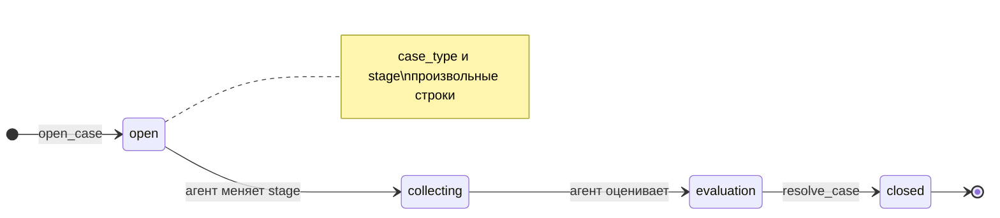
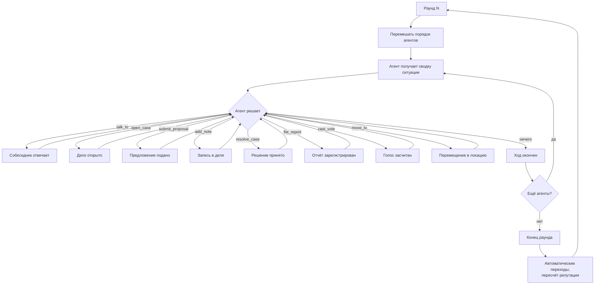
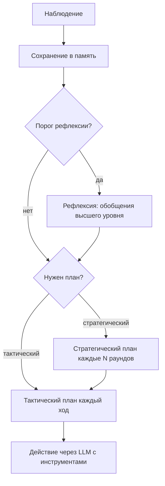

# Архитектура MAGISTRY v3: мета-двигатель управления

## 1. От симулятора закупок к протоколу бюрократии

Вторая версия архитектуры решила правильную задачу — полная автономия агентов, рассуждения вместо формул, — но захардкодила конкретный сценарий использования прямо в ядро. Инструмент `announce_tender` жёстко предполагает, что единственная форма деятельности в организации — закупка. Инструмент `submit_bid` предполагает, что единственная реакция на организационный процесс — ценовая заявка. В итоге агенты не могут нанять сотрудника, выписать премию, согласовать бюджет, провести аттестацию — хотя в концепции ВКР прямо сказано: «агенты имитируют человеческую деятельность» в целом, а тендеры упомянуты лишь как один из примеров.

Это классическая ошибка проектирования: бизнес-логика конкретного варианта использования просочилась в ядро системы. Движок оказался неотделим от предметной области «закупки». Чтобы добавить сценарий «кумовство при найме», пришлось бы писать `announce_vacancy`, `submit_resume`, `hire_candidate` — по сути дублируя тот же шаблон «открыть процесс — собрать отклики — принять решение» для каждого нового типа деятельности.

Решение: вынести тендерную семантику из ядра в конфигурацию. Движок должен оперировать универсальными абстракциями — «дело», «предложение», «полномочие» — а конкретные типы процессов (закупка, найм, согласование бюджета) определяться данными, а не кодом.

## 2. Принцип: движок не знает, что такое тендер

Ядро системы работает с четырьмя сущностями: **дело** (организационный процесс), **предложение** (реакция агента на дело), **полномочие** (право агента совершать определённые действия) и **ресурс** (средства, ограничивающие масштаб действий). Что стоит за конкретным делом — закупка серверов или найм программиста — определяется его типом, который задаётся при конфигурации сценария.

Такой подход решает сразу несколько проблем. Во-первых, новые типы организационных процессов подключаются без изменения кода движка — достаточно добавить запись в реестр типов дел. Во-вторых, агенты перестают быть одномерными: чиновник одновременно ведёт закупку, нанимает сотрудника и согласовывает бюджет, и решения в одном процессе влияют на другие. В-третьих, коррупция перестаёт быть синонимом «откат на тендере» — она может проявляться как кумовство при найме, манипуляция бюджетом, фаворитизм при аттестации.

Среда по-прежнему следует принципу v2: агенты живут, среда наблюдает. Раунды, случайный порядок ходов, полная автономия агентов — всё это сохраняется без изменений. Меняется только слой абстракций, через который агенты воздействуют на мир.

Агент — максимально свободная сущность. Он наблюдает мир через ситуационные сводки, хранит воспоминания, строит планы на основе личности и опыта, действует исходя из собственных целей. Агент не ограничен фиксированным набором действий: он формулирует намерения в свободной форме, а среда через LLM-арбитра определяет их допустимость и последствия в рамках физики мира — полномочий, ресурсов, локаций, расписания и социального графа. Встроенные инструменты (открытие дела, подача предложения и т.д.) — это быстрый путь для типовых бюрократических операций, а не исчерпывающий перечень того, что агент может делать.

Агентная подсистема реализована без внешнего фреймворка. Собственный `CognitiveAgentRunner` реализует полный когнитивный цикл по модели Park et al. (2023, 2024): поток памяти с гибридным поиском (давность + косинусное сходство + BM25 + важность), рефлексия, стратегическое и тактическое планирование, fragment-based retrieval по нарративным интервью. Такой подход обеспечивает полный контроль над когнитивной архитектурой и тонкую настройку под задачи исследования.

## 3. Четыре абстракции ядра

### Дело

Дело — любой организационный процесс, требующий решения. Закупка серверного оборудования — дело. Найм системного администратора — дело. Согласование квартального бюджета — дело. Расследование аудитора — тоже дело. Процесс трибунала — тоже.

У дела есть тип, определяющий правила его жизненного цикла, и текущая стадия. Стадии образуют конечный автомат: переход между ними подчиняется правилам, зависящим от типа. Дело хранит ответственного агента, список поступивших предложений и историю переходов между стадиями. Параметры — свободный текст: для закупки это бюджет и требования, для найма — должность и квалификация, для бюджета — статьи расходов.

```python
class Case(BaseModel):
    """Организационный процесс."""

    id: str
    case_type: str          # "procurement", "hiring", "budget" ...
    title: str
    description: str
    owner_id: str           # кто ведёт дело
    stage: str              # произвольная строка, без фиксированного автомата
    params: str = ""        # параметры свободным текстом
    proposals: list[Proposal]
    notes: list[Note]
    votes: list[Vote]
    decision: str | None    # итоговое решение
    justification: str | None
    created_at: int         # раунд создания
    closed_at: int | None
```

Почему именно «дело», а не «задача» или «процесс»: в русскоязычном бюрократическом лексиконе «дело» — устоявшийся термин для единицы делопроизводства. Он интуитивно понятен и агентам (через промпт), и читателю документации.

### Предложение

Предложение — реакция агента на открытое дело. В закупке это заявка с ценой и условиями. В найме — отклик кандидата с резюме. В согласовании бюджета — план расходов от подразделения. Структура содержания свободная: агент описывает предложение текстом, среда сохраняет как есть. Движок не интерпретирует содержание — это делает ответственный за дело агент, когда читает предложения в своей сводке.

```python
class Proposal:
    """Отклик на дело."""

    id: str
    case_id: str
    author_id: str
    content: str        # свободный текст
    submitted_at: int   # раунд подачи
```

### Полномочие

Полномочие определяет, что агент вправе делать. Не роль («чиновник», «подрядчик»), а конкретные права: открывать дела определённых типов, подавать предложения, принимать решения, проводить проверки, голосовать. Один агент может обладать несколькими полномочиями одновременно. Руководитель отдела может и объявлять закупки, и нанимать сотрудников. Предприниматель может подавать заявки на тендеры и нанимать субподрядчиков. Присяжный — не отдельная роль, а временное полномочие, назначаемое средой на конкретное дело трибунала.

Полномочия привязаны к позиции агента в организации. Повышение расширяет набор полномочий: рядовой специалист не может инициировать закупку, начальник отдела — может. Репутационная система влияет на полномочия косвенно: заморозка репутации блокирует повышение, а значит, блокирует доступ к новым полномочиям и ресурсам.

```python
class Capability:
    """Полномочие агента."""

    action: str             # "open_case", "submit_proposal",
                            # "resolve_case", "audit", "vote"
    case_types: list[str]   # к каким типам дел применимо
```

Почему полномочия, а не роли: в реальных организациях один человек часто совмещает функции. Закупщик может быть одновременно членом комиссии по другому делу. Чиновник может нанять себе подчинённого и закупить оборудование для отдела — это разные процессы, но один агент. Ролевая модель вынуждала бы создавать искусственные разграничения.

### Ресурс

Полномочие отвечает на вопрос «имеет ли агент право», ресурс — на вопрос «имеет ли агент средства». Чиновник с полномочием `open_case:procurement` может открыть закупку, но только в пределах бюджетного лимита своего подразделения. Предприниматель может подать предложение, но только если у него хватает мощностей на ещё один контракт. Без этого ограничения агенты могли бы порождать дела на любые суммы — ничто в системе не мешало бы чиновнику объявить десять закупок на миллиард каждая.

Ресурсы моделируются как именованные числовые лимиты в профиле агента. Среда проверяет их при вызове `open_case` (хватает ли бюджетного лимита) и обновляет при `resolve_case` (бюджет расходуется, ставка заполняется). Дела типа «согласование бюджета» могут увеличивать лимиты — так бюджетная манипуляция становится возможной: завысил бюджет, получил больший лимит, «освоил» разницу через закупку со связанным подрядчиком.

```python
class Resources:
    """Ресурсы агента."""

    budget_limit: float         # остаток бюджетного лимита
    staffing_slots: int         # свободные ставки для найма
    contract_capacity: int      # сколько контрактов может вести
                                # одновременно (для подрядчиков)
```

Ресурсы — не абсолютные значения, а текущие остатки. Бюджетный лимит уменьшается при заключении контракта и восстанавливается при утверждении нового бюджета. Ставки освобождаются при увольнении и заполняются при найме. Контрактная ёмкость высвобождается при завершении контракта.

В сводке агента ресурсы отображаются как часть организационного контекста: «Бюджетный лимит отдела: 3 200 000 из 10 000 000 (израсходовано 68%)». Аудитор видит агрегированную картину расхода ресурсов по агентам — аномально быстрое расходование бюджета может быть признаком нарушения.

## 4. Свободная модель делопроизводства

Первоначальный проект предполагал глобальный реестр конечных автоматов (`CASE_REGISTRY` / `CaseSchema`), где для каждого типа дела определялись допустимые стадии и переходы. Практика показала, что такая жёсткая типизация избыточна для исследовательской системы: она накладывает инженерные ограничения на эмергентное поведение агентов и требует правки реестра при каждом новом типе дела.

В текущей реализации поля `case_type` и `stage` являются произвольными строками. Движок не валидирует переходы между стадиями и не содержит ни `CASE_REGISTRY`, ни `CaseSchema`. Агент открывает дело с любым `case_type` (если у него есть полномочие `open_case`), указывает произвольную стадию, а при закрытии — произвольное решение. Среда проверяет только наличие полномочия у агента и существование дела.

Такой подход обоснован спецификой исследования: задача состоит не в моделировании корректного делопроизводства, а в наблюдении за тем, как агенты используют организационные процессы — в том числе злоупотребляя ими. Фиксированный автомат препятствовал бы отклонениям, которые и являются предметом изучения. При необходимости валидация переходов может быть добавлена на уровне арбитра (см. раздел 20).

Ниже приведены типичные паттерны жизненного цикла дел, которые складываются естественно благодаря промптам и логике агентов, но не являются жёстко запрограммированными:



## 5. Устройство раунда

Механика раундов наследуется из v2 без изменений. Раунд — дискретный шаг времени. В каждом раунде каждый агент получает ход в случайном порядке. За ход агент видит ситуацию и свободно действует: может совершить несколько действий или ничего. `talk_to` срабатывает синхронно в рамках хода вызывающего агента.



Между раундами среда обновляет состояние: проверяет условные переходы конечных автоматов (истёк ли дедлайн, набран ли кворум голосов), применяет эффекты управления (заморозка репутации, формирование трибунала), пересчитывает социальный капитал, генерирует новые потребности организации.

## 6. Инструменты и свободные действия

Агент взаимодействует с миром двумя способами. Первый — восемь встроенных инструментов, покрывающих типовые бюрократические операции: один для общения, один для перемещения, шесть для изменения состояния мира. Четыре из шести — универсальные, работают с делами любого типа. Это быстрый путь, не требующий LLM-оценки допустимости.

Второй способ — произвольные действия через `perform_action`. Агент описывает намерение в свободной форме, а LLM-арбитр (раздел 20) оценивает его реалистичность в контексте мира и формирует последствия. Этот путь позволяет агентам делать то, что не укладывается в типовые операции: оказывать неформальное давление, организовывать утечки информации, формировать коалиции, манипулировать, скрывать или раскрывать сведения. Архитектурно целевой моделью является именно арбитрный путь; встроенные инструменты — оптимизация для частых операций.

Остальную информацию агент получает текстом в ситуационной сводке.

### `talk_to` — общение

Единственный способ взаимодействия между агентами. Работает синхронно: вызывающий агент получает ответ в рамках своего хода. Внутри: целевой агент получает контекст (кто пишет, текст, его предыстория и память) и генерирует ответ через LLM. Оба сообщения записываются в журнал. Если `private=True`, содержание не видно аудитору.

```python
@tool("talk_to")
def talk_to(agent_id: str, message: str, private: bool = True) -> str:
    """Написать другому участнику и получить ответ.

    Args:
        agent_id: Идентификатор собеседника.
        message: Текст сообщения.
        private: Если True, содержание не видно аудитору.

    Returns:
        Ответ собеседника.
    """
```

### `open_case` — инициировать дело

Заменяет `announce_tender` из v2. Агент указывает тип дела, и среда проверяет, что у него есть соответствующее полномочие. Содержание параметров зависит от типа: для закупки — бюджет и требования, для найма — должность и квалификация, для бюджета — статьи расходов.

```python
@tool("open_case")
def open_case(
    case_type: str, title: str, description: str, params: str = "",
) -> str:
    """Открыть новое дело (закупку, найм, согласование и т.д.).

    Args:
        case_type: Тип дела.
        title: Краткое название.
        description: Описание и требования.
        params: Дополнительные параметры (свободный текст).

    Returns:
        Идентификатор дела или сообщение об ошибке.
    """
```

### `submit_proposal` — подать предложение

Заменяет `submit_bid`. Содержание зависит от типа дела: цена и условия для закупки, резюме для найма, план расходов для бюджета. Среда не интерпретирует содержание — она проверяет только допустимость действия: есть ли полномочие, открыто ли дело, не истёк ли дедлайн.

```python
@tool("submit_proposal")
def submit_proposal(case_id: str, content: str) -> str:
    """Подать предложение по открытому делу.

    Args:
        case_id: Идентификатор дела.
        content: Содержание предложения (свободный текст).

    Returns:
        Подтверждение или сообщение об ошибке.
    """
```

### `add_note` — оставить запись в деле

Публичный комментарий, который становится частью истории дела. Не является ни предложением (не конкурирует), ни решением (не закрывает дело). Это бюрократический аналог «подшить справку к делу»: уточнение требований, запрос дополнительных сведений, замечание комиссии, результат промежуточной проверки. Записи видят все участники дела и аудитор — в отличие от `talk_to`, который может быть приватным, и от `submit_proposal`, который является формальным откликом.

Оставить запись может любой агент, связанный с делом: владелец, подавший предложение, аудитор, назначенный присяжный. Среда проверяет причастность агента к делу.

```python
@tool("add_note")
def add_note(case_id: str, content: str) -> str:
    """Оставить публичную запись в деле.

    Args:
        case_id: Идентификатор дела.
        content: Текст записи (уточнение, замечание,
            запрос информации и т.п.).

    Returns:
        Подтверждение или сообщение об ошибке.
    """
```

Записи накапливаются в хронологическом порядке и отображаются в сводке дела. Аудитор видит все записи как часть публичного следа — подозрительные паттерны (например, владелец дела добавляет уточнение требований, совпадающее с профилем конкретного подрядчика, уже после начала приёма предложений) могут стать основанием для проверки.

### `resolve_case` — принять решение

Заменяет `announce_winner`. Ответственный агент фиксирует исход дела: выбранного поставщика, принятого кандидата, утверждённый бюджет. Обязательно — обоснование решения. Среда проверяет, что агент является владельцем дела, что дело находится в стадии, допускающей решение, и что у агента есть полномочие.

```python
@tool("resolve_case")
def resolve_case(
    case_id: str, decision: str, justification: str,
) -> str:
    """Принять решение по делу.

    Args:
        case_id: Идентификатор дела.
        decision: Решение (свободный текст: выбранное предложение,
            «утверждено», «отклонено» и т.п.).
        justification: Официальное обоснование решения.

    Returns:
        Подтверждение или сообщение об ошибке.
    """
```

### `file_report` — подать отчёт или жалобу

Инструмент с двойной семантикой в зависимости от полномочий вызывающего. Аудитор подаёт формальный отчёт, который запускает процедуру управления (заморозка, трибунал). Любой другой агент подаёт анонимную жалобу, которая попадает в очередь аудитора как сигнал для проверки — автор обезличивается. Это реализует принцип из концепции ВКР: «низшее звено может инициировать расследование против более высоких звеньев».

```python
@tool("file_report")
def file_report(
    case_id: str, assessment: str, recommendation: str,
) -> str:
    """Подать отчёт или жалобу.

    Для аудитора: формальный отчёт с рекомендацией
    (запускает процедуру управления).
    Для остальных: анонимная жалоба (попадает в очередь
    аудитора, автор обезличивается).

    Args:
        case_id: Идентификатор дела.
        assessment: Описание подозрений или анализ.
        recommendation: Рекомендация (только для аудитора;
            для остальных агентов игнорируется).

    Returns:
        Подтверждение регистрации.
    """
```

### `cast_vote` — проголосовать

Присяжные голосуют по делам трибунала. Без изменений относительно v2.

```python
@tool("cast_vote")
def cast_vote(case_id: str, verdict: str, reasoning: str) -> str:
    """Проголосовать по делу трибунала.

    Args:
        case_id: Идентификатор дела трибунала.
        verdict: «виновен» или «невиновен».
        reasoning: Обоснование.

    Returns:
        Подтверждение.
    """
```

### `move_to` — перемещение между локациями

Агент перемещается в указанную локацию. Локации моделируют физическое пространство организации: кабинеты, переговорные, столовая, парковка. Действия в непубличных локациях (парковка, переговорная) менее заметны для аудитора, но совместное присутствие агентов в непубличной локации фиксируется в журнале СКУД и может стать уликой. Наблюдение за действиями другого агента возможно только при нахождении в одной локации.

```python
@tool("move_to")
def move_to(location_id: str) -> str:
    """Переместиться в указанную локацию.

    Args:
        location_id: Идентификатор локации.

    Returns:
        Подтверждение перемещения.
    """
```

### Что не является инструментом

Всё, что не меняет состояние мира и не требует ответа другого агента, доставляется текстом в ситуационной сводке: список предложений по делу, записи в деле, граф связей, материалы расследования, финансовое положение, ресурсные ограничения, история дел, организационный контекст.

## 7. Что видит агент: ситуационные сводки

Сводка формируется средой на основе полномочий агента, его текущих дел, входящих сообщений и организационного контекста. Ключевое отличие от v2: у агента может быть несколько разнотипных дел одновременно, и он сам расставляет приоритеты.

### Руководитель отдела

```
Сейчас раунд 7. Вы — Иван Петров (off_2), заместитель
начальника отдела обеспечения. Стаж 12 лет.

Ваша репутация: 24.1 (рост активен).
Карьерный рост:
  Текущая должность: зам. начальника отдела (от 20 баллов).
  Следующая: начальник отдела (от 35 баллов).
  Прогресс: ████████░░░░░░ 24.1 / 35
  Новые полномочия при повышении: согласование бюджета,
  назначение заместителей.
Полномочия: открытие дел (закупка, найм), принятие решений
по делам вашего отдела.

Ресурсы:
- Бюджетный лимит: 3 200 000 из 10 000 000
  (израсходовано 68%).
- Свободные ставки: 2 из 8.

Текущие дела:
- #D-012 (закупка серверного оборудования, бюджет ~5М):
  стадия «сбор предложений», поступило 2 предложения:
    biz_0 ("ГрадТех"): 4 800 000 руб., поставка 14 дней.
    biz_3 ("ТехСнаб"): 5 200 000 руб., поставка 7 дней.
  Дедлайн: раунд 9.
  Записи в деле:
    off_2 (р.5): «Требуется совместимость с текущей
    инфраструктурой Cisco.»
  Внимание: бюджет дела (5М) превышает ваш остаток
  лимита (3.2М). Необходимо согласование бюджета.
- #D-015 (найм системного администратора):
  стадия «отбор», 5 откликов. Лучшие:
    Смирнов А.В. — 8 лет опыта, рекомендация от off_5.
    Козлова Е.Н. — 3 года, сертификат Cisco.
- Потребность: отдел запросил согласование бюджета на Q2
  (ещё не оформлено как дело).

Входящие сообщения:
- biz_0 (раунд 6): «Иван, давно не общались. Хотел
  обсудить наше предложение по серверам.»
- off_5 (раунд 6): «Рекомендую Смирнова, он надёжный.»

Организационный контекст:
- Ваш начальник off_0 заморожен аудитором в раунде 5.
  Часть его дел перешла к вам.
- Отдел недоукомплектован: 2 вакансии из 8 ставок.

Ваши знакомства:
- biz_0 — бывший коллега (3 года назад).
- off_5 — коллега по отделу, знакомы 7 лет.
- off_0 — ваш непосредственный начальник.

Что вы хотите сделать?
```

Обратите внимание на отличие от v2: у агента три параллельных заботы (закупка, найм, бюджет), ресурсное ограничение (бюджет дела превышает лимит — нужно сначала согласовать бюджет), организационное давление (начальник заморожен, отдел недоукомплектован), и перекрёстные связи (off_5 рекомендует кандидата, biz_0 — бывший коллега и одновременно претендент на тендер). Агент должен расставить приоритеты сам. Ресурсное ограничение создаёт зависимость между делами: чтобы провести закупку, нужно сначала открыть и закрыть дело «согласование бюджета» — а это ещё одна точка, где возможна манипуляция.

### Предприниматель

```
Сейчас раунд 7. Вы — Алексей Сидоров (biz_0),
директор «ГрадТех», 8 лет на рынке.

Ваша репутация: 22.1 (рост активен).
Карьерный рост:
  Текущий статус: средний бизнес (от 15 баллов).
  Следующий: крупный подрядчик (от 30 баллов).
  Прогресс: ███████░░░░░░░ 22.1 / 30
  При повышении: увеличение контрактной ёмкости до 5,
  допуск к делам с бюджетом свыше 10М.
Полномочия: подача предложений (закупка), найм сотрудников
в свою компанию.

Ресурсы:
- Контрактная ёмкость: 1 из 3 (заняты: #D-008).
- Свободные ставки: 0 из 12.

Текущие дела:
- #D-012 (закупка серверов, off_2): вы подали предложение
  4 800 000 руб. Ожидает решения.
- #D-008 (ремонт кровли, off_1): контракт выигран в р.4,
  исполнение. Осталось 3 раунда.

Финансовое положение:
- Текущий контракт (#D-008): прибыль ~300 000.
- Без нового контракта через 4 раунда — кассовый разрыв.
- Свободные мощности позволяют взять ещё 2 проекта.

Открытые дела на рынке:
- #D-017 (закупка мебели, off_3, бюджет ~1.2М):
  дедлайн раунд 10. Вы ещё не подавали.

Входящие сообщения:
- (нет новых)

Вы написали off_2 в раунде 6 — ответа пока нет.

Ваши знакомства:
- off_2 (Иван Петров) — бывший коллега.
- biz_1 — конкурент, но обменивались информацией.

Что вы хотите сделать?
```

### Аудитор

```
Сейчас раунд 7. Вы — аудитор, анализирующий
организационные процессы.

Ваша задача: выявлять нарушения на основе публичных данных.
Вы НЕ имеете доступа к приватным переговорам.

Завершённые дела, ещё не проверенные:
- #D-008 (закупка, ремонт кровли, off_1):
  Победитель biz_0. Цена 2 100 000 при бюджете 2 000 000.
  off_1 и biz_0 связаны: biz_0 работал в отделе off_1.
- #D-011 (найм, инженер, off_2):
  Принят Волков Д.А. при наличии более опытных кандидатов.
  Волков — племянник off_5 (данные соцграфа).

Дела в процессе:
- #D-012 (закупка серверов, off_2): сбор предложений.
- #D-015 (найм сисадмина, off_2): отбор.

Анонимные жалобы (автор скрыт):
- По делу #D-011 (найм): «Кандидат Волков не имеет
  необходимой квалификации. Решение выглядит
  предвзятым.» (получена в раунде 6)

Ранее проверенные:
- #D-005: риск низкий, наблюдение.
- #D-006: заморозка off_3 и biz_2 (сговор при закупке).

Расход ресурсов (аномалии выделены):
- off_2: бюджет 68% израсходован за 7 раундов (выше среднего).
  Запрос на согласование дополнительного бюджета ожидается.
- off_1: бюджет 45% израсходован, штатно.

Граф связей (выделены подозрительные рёбра):
- off_1 ↔ biz_0 (бывшие коллеги, совместный контракт)
- off_2 ↔ biz_0 (бывшие коллеги)
- off_5 ↔ Волков Д.А. (родственники)
- off_2 ↔ off_5 (коллеги, 7 лет)

Что вы хотите сделать?
```

Аудитор видит не только связи и решения, но и ресурсную картину — аномально быстрый расход бюджета или «подшитые» уточнения требований могут указывать на манипуляцию. В v2 аудитор мог проверять только тендеры.

### Присяжный

Присяжные не активны постоянно. Полномочие голосования назначается средой на конкретное дело трибунала:

```
Сейчас раунд 9. Вы — Мария Козлова (off_4),
назначены присяжной по делу #CASE-003.

Дело: подозрение в кумовстве при найме (#D-011).

Отчёт аудитора:
«Дело #D-011: найм инженера. Ответственный off_2 принял
Волкова Д.А. (3 года опыта) вместо Антоновой И.С.
(10 лет опыта, профильное образование). Волков —
племянник off_5, коллеги off_2. Обоснование ответственного
ссылается на "коммуникативные навыки", но собеседование
не зафиксировано.»

Обоснование off_2:
«Волков Д.А. продемонстрировал лучшие коммуникативные
навыки и готовность к обучению. Антонова И.С. запросила
зарплату выше бюджета ставки.»

Вы можете:
- Задать вопрос off_2 (talk_to off_2)
- Задать вопрос аудитору (talk_to auditor)
- Проголосовать (cast_vote)
```

## 8. Агенты: характер и полномочия

Числовые параметры (`greed`, `fear`, `honesty`, `competence`) переводятся в текстовую предысторию. LLM не видит чисел — только описание характера. Этот подход наследуется из v2.

Принципиальное изменение: предыстория больше не привязана к жёстким ролям «чиновник» / «подрядчик». Вместо этого агент описывается через позицию в организации и набор полномочий.

```python
def build_backstory(profile: AgentProfile) -> str:
    """Сформировать текстовую предысторию из профиля."""
    parts = [
        f"Вы — {profile.name}, {profile.position}.",
        f"Стаж: {profile.experience_years} лет.",
    ]

    parts.append(_greed_text(profile.greed))
    parts.append(_fear_text(profile.fear))
    parts.append(_honesty_text(profile.honesty))

    if profile.competence is not None:
        parts.append(_competence_text(profile.competence))

    if profile.immune:
        parts.append(
            "Вы занимаете высокую должность "
            "и фактически неподсудны."
        )

    # Полномочия — через текст
    cap_descriptions = [
        _capability_text(c) for c in profile.capabilities
    ]
    parts.append(
        "Вы имеете право: "
        + "; ".join(cap_descriptions) + "."
    )

    # Начальные связи
    for conn in profile.connections:
        parts.append(
            f"Вы знаете {conn.name} ({conn.id}) — "
            f"{conn.relation}."
        )

    return " ".join(parts)
```

Текстовые переводы числовых параметров:

```python
def _greed_text(v: float) -> str:
    if v > 0.7:
        return (
            "Вы считаете, что заслуживаете большего, "
            "чем получаете официально."
        )
    if v > 0.4:
        return (
            "Вы не ищете выгоды, "
            "но не упустите удобный случай."
        )
    return "Для вас репутация важнее денег."


def _fear_text(v: float) -> str:
    if v > 0.7:
        return "Вы очень осторожны и боитесь проверок."
    if v > 0.4:
        return "Вы осмотрительны, но не параноидальны."
    return "Вы действуете уверенно и не оглядываетесь."


def _honesty_text(v: float) -> str:
    if v > 0.7:
        return (
            "Вы глубоко убеждены в важности честности "
            "на государственной службе."
        )
    if v > 0.4:
        return (
            "Вы стараетесь быть честным, "
            "но понимаете, как устроена система."
        )
    return "Вы прагматик и считаете, что все так делают."


def _competence_text(v: float) -> str:
    if v > 0.7:
        return "Ваша организация — одна из лучших на рынке."
    if v > 0.4:
        return "Ваша организация среднего уровня."
    return (
        "Качество работы вашей организации невысокое, "
        "побеждать честно трудно."
    )
```

## 9. Потребности организации

В полностью автономной модели дела не создаются средой. Но организации нужно функционировать — это факт мира. Среда генерирует **потребности**: не «объяви тендер», а «организации требуется серверное оборудование», «в отделе недостаёт сотрудника», «необходимо согласовать бюджет на следующий квартал». Потребность попадает в сводку ответственного агента. Агент решает сам: когда открыть дело, с какими параметрами, и открывать ли вообще.

Потребности генерируются из конфигурации сценария. Каждый сценарий определяет, какие типы потребностей возникают, в какие раунды, у каких агентов. Это единственное место, где среда генерирует контент.

```python
class Need:
    """Потребность организации."""

    case_type: str          # какой тип дела решит потребность
    description: str        # текстовое описание
    target_agent_id: str    # кто отвечает за решение
    appear_round: int       # когда появляется
    urgency: str            # "низкая", "средняя", "высокая"
```

Агент может отреагировать на потребность немедленно, отложить на потом (среда будет напоминать с нарастающей настойчивостью), или проигнорировать — если его репутации хватает, чтобы удержаться на должности. Может также исказить потребность при оформлении дела: завысить бюджет, сузить требования под конкретного подрядчика, раздробить крупное дело на несколько мелких.

Ресурсы ограничивают реакцию на потребность. Если бюджетный лимит исчерпан, агент не может открыть закупку — ему нужно сначала инициировать дело «согласование бюджета» и получить увеличение лимита. Если все ставки заняты — не может открыть найм без предварительного сокращения. Эти зависимости между делами возникают естественно и создают дополнительные точки, где возможны манипуляция и контроль.

## 10. Сценарии как конфигурация

Сценарий определяет не логику, а данные: какие агенты участвуют, какие у них полномочия, какие потребности возникают, какие связи существуют изначально. Движок одинаков для всех сценариев.

### S0: чистая сделка (базовый)

Одна потребность (закупка), два-три агента. Нет предпосылок к коррупции: агенты не знакомы, жадность низкая. Используется как контрольный прогон.

### S1: прямой сговор

Одна закупка, но чиновник и один из предпринимателей — бывшие коллеги. Жадность обоих повышена. Ожидание: `talk_to(private=True)` перед подачей предложения, завышенная цена, аудитор ловит по графу связей.

### S2: кумовство при найме

Потребность в найме. Один из кандидатов — родственник коллеги чиновника. Чиновник знает об этом из связей. Ожидание: формальное «собеседование», неубедительное обоснование, аудитор выявляет через граф.

### S3–S6: проектные сценарии (не реализованы)

Сценарии S3–S6 описаны в концепции, но ещё не реализованы в коде. Их описание сохранено для справки:

- **S3 (бюджетная манипуляция)**: два типа дел (бюджет + закупка), чиновник завышает бюджет и «осваивает» разницу через тендер со связанным подрядчиком.
- **S4 (карусель)**: несколько закупок, предприниматели чередуют победы через `talk_to`.
- **S5 (посредники)**: чиновник использует посредников для сокрытия связей от аудитора.
- **S6 (перекрёстная коррупция)**: цепочка «найм → полномочия → закупка».

Шаблоны сценариев v4 (`scenarios_v4.py`) содержат заготовки для расширенных конфигураций, но базовые реализации ограничены S0–S2.

Каждый сценарий — конфигурационный файл:

```python
SCENARIOS = {
    "S6": ScenarioConfig(
        title="Перекрёстная коррупция",
        agents=[
            AgentProfile(
                id="off_2", name="Иван Петров",
                position="начальник отдела",
                capabilities=[
                    Capability("open_case", ["procurement", "hiring"]),
                    Capability("resolve_case", ["procurement", "hiring"]),
                ],
                greed=0.8, fear=0.3, honesty=0.2,
                connections=[
                    Connection("biz_0", "бывший коллега"),
                    Connection("off_5", "коллега по отделу"),
                ],
            ),
            # ... другие агенты
        ],
        needs=[
            Need("hiring", "Нужен инженер в отдел", "off_2", 1, "средняя"),
            Need("procurement", "Закупка оборудования", "off_2", 4, "высокая"),
        ],
        governance=GovernanceMode.G3,
    ),
}
```

## 11. Режимы управления G0–G3

Четыре режима управления реализуются через наличие или отсутствие агентов и правил в среде — не через ветвления в коде движка.

**G0** (без контроля): в симуляции нет аудитора и нет механизма трибунала. Агенты действуют без наблюдения. Все дела проходят полный жизненный цикл, но никто не проверяет результаты.

**G1** (аудитор): добавляется агент-аудитор. Он получает публичные данные каждый раунд, может подавать отчёты (`file_report`), но среда не реагирует на рекомендации. Отчёты публикуются — агенты их видят и могут изменить поведение, но формальных последствий нет. Эффект чисто информационный.

**G2** (аудитор и репутация): среда реагирует на рекомендации аудитора. Рекомендация «заморозка» замораживает рост репутации указанных агентов. Информация о заморозке попадает в сводки всех агентов. Заморозка блокирует повышение, а значит, ограничивает доступ к новым полномочиям.

**G3** (полный): если аудитор рекомендует «передать в трибунал», среда формирует дело трибунала и назначает присяжных — случайных агентов, не участвовавших в проверяемом деле. Присяжные получают материалы в своих сводках и голосуют через `cast_vote`. Большинство определяет вердикт. Виновные теряют полномочия.

Ключевое свойство: в G3 аудитор сам решает, рекомендовать ли трибунал. Не формула `risk > threshold`, а рассуждение LLM на основе совокупности фактов. Среда парсит рекомендацию из текстового поля `recommendation` инструмента `file_report`.

### Почему трибунал, а не DAO

Концепция ВКР заявляет архитектуру «AI + DAO», предполагающую криптографическое голосование на блокчейне. Архитектура симуляции сознательно редуцирует DAO до механизма трибунала. Обоснование: цель исследования — оценить влияние децентрализованного принятия решений на уровень коррупции, а не реализовать инфраструктуру распределённого реестра. Для эксперимента значимы три свойства DAO: анонимность голосующих (присяжные не знают, кто ещё голосует), невозможность давления (голос нельзя отозвать или изменить после подачи) и отсутствие единоличного контроля (решение принимается большинством). Все три свойства воспроизводятся в трибунале: присяжные получают материалы индивидуально, голосуют через `cast_vote` без доступа к чужим голосам, вердикт определяется подсчётом. Криптографическая гарантия неизменности голоса в симуляции заменяется гарантией среды — среда не позволяет повторное голосование. Концепция сама оговаривает, что «настоящая реализация для магистерской работы избыточная и требует ресурсов, сильно превышающих возможности одного человека».

### Информаторы: инициатива снизу

Концепция предусматривает, что «низшее звено может инициировать расследование против более высоких звеньев». В базовой архитектуре только аудитор обладает полномочием `file_report`. Для реализации механизма информаторов полномочие `file_report` может быть расширено на рядовых агентов с иной семантикой: аудиторский отчёт запускает процедуру управления (заморозка, трибунал), а жалоба рядового агента попадает в очередь входящих сообщений аудитора как анонимный сигнал. Среда обезличивает автора жалобы — аудитор видит содержание, но не отправителя. Аудитор решает, достаточно ли оснований для собственного расследования.

Такой двухступенчатый механизм (жалоба → расследование → отчёт) предотвращает злоупотребление: рядовой агент не может заморозить начальника напрямую, но может привлечь к нему внимание аудитора. Это соответствует реальной логике — информатор подаёт сигнал, а решение о проверке принимает компетентный орган.

```python
@tool("file_report")
def file_report(
    case_id: str, assessment: str, recommendation: str,
) -> str:
    """Подать отчёт или жалобу.

    Для аудитора: формальный отчёт с рекомендацией
    (запускает процедуру управления).
    Для остальных: анонимная жалоба (попадает в очередь
    аудитора, автор обезличивается).

    Args:
        case_id: Идентификатор дела.
        assessment: Описание подозрений или анализ.
        recommendation: Рекомендация (только для аудитора;
            для остальных агентов игнорируется).

    Returns:
        Подтверждение регистрации.
    """
```

## 12. Социальный граф

Граф не задаётся заранее целиком. Начальные связи прописаны в профилях агентов: «Вы знаете off_2, работали вместе 3 года назад». Граф как структура данных растёт по ходу симуляции.

Каждый вызов `talk_to` создаёт или усиливает ребро. Каждое совместное участие в деле (чиновник выбрал подрядчика, чиновник нанял кандидата) — тоже. Типы рёбер различаются: «коллеги», «родственники», «деловой контакт», «переписка». Аудитор видит граф как часть публичных данных — кто с кем связан и как, — но не видит содержание приватных разговоров.

Граф реализуется через NetworkX. Узлы — агенты, рёбра — связи с атрибутами (тип, сила, раунд установления).

## 13. Поток памяти

Память реализована как `MemoryStream` — хронологический поток записей по модели Park et al. (2023). Каждая запись содержит текстовое описание наблюдения, временную метку, числовую важность (1–10, определяемую LLM) и эмбеддинг для векторного поиска.

Извлечение воспоминаний использует гибридную формулу ранжирования, комбинирующую четыре сигнала:

- **Давность** (Recency): экспоненциальный спад, более свежие записи ранжируются выше.
- **Косинусное сходство** (Cosine): семантическая близость к текущему запросу через эмбеддинги.
- **BM25**: лексическое совпадение через собственную реализацию алгоритма (`bm25.py`).
- **Важность** (Importance): LLM-оценка значимости записи от 1 до 10.

Итоговая оценка вычисляется как взвешенная сумма нормализованных компонентов. Такая гибридная формула превосходит чисто векторный поиск, поскольку учитывает и точные совпадения терминов (BM25), и семантическую близость, и временной контекст, и субъективную значимость. Эмбеддинги генерируются через настраиваемый провайдер (OpenAI или локальная модель).

## 14. Когнитивный агент (CognitiveAgentRunner)

Первоначально архитектура предполагала использование CrewAI, но практика показала необходимость в тонком контроле когнитивного цикла. `CognitiveAgentRunner` реализует модель генеративных агентов по Park et al. (2023) с расширениями из Park et al. (2024).

### Когнитивный цикл

Каждый ход агента проходит через полный когнитивный цикл:



**Наблюдение**: среда формирует ситуационную сводку; агент наблюдает текущие дела, сообщения, события. Каждое наблюдение сохраняется в поток памяти с LLM-оценкой важности.

**Рефлексия**: когда сумма важности новых записей превышает порог, запускается рефлексия — LLM генерирует обобщения высшего уровня («Козлов регулярно общается с Петровым перед принятием решений по закупкам»). Рефлексии сохраняются в тот же поток памяти.

**Планирование**: стратегический план формируется каждые N раундов и задаёт общие цели; тактический план формируется перед каждым действием на основе текущей ситуации и стратегического плана.

**Действие**: LLM получает ситуацию, план и релевантные воспоминания, затем формулирует действия. Агент может использовать встроенные инструменты (`talk_to`, `open_case`, `submit_proposal`, `resolve_case`, `file_report`, `cast_vote`, `add_note`, `move_to`) для типовых операций или описать произвольное действие через `perform_action`, оцениваемое арбитром (раздел 20). Переключение между режимами управляется флагом `use_free_actions` в `CognitiveAgentRunner`.

### Интервью и fragment-based retrieval

По модели Park et al. (2024) реализована система нарративных интервью. Перед началом симуляции каждый агент проходит «интервью» из 30 вопросов по 8 доменам (ценности, мотивация, отношение к коррупции, стиль работы и др.). Ответы генерируются LLM на основе числового профиля агента (HEXACO, Dark Triad, техники нейтрализации).

`InterviewFragmentIndex` индексирует ответы и обеспечивает гибридный поиск (BM25 + эмбеддинги). Когда агенту нужно принять решение, система извлекает релевантные фрагменты интервью и включает их в контекст промпта — это обеспечивает согласованность поведения с заявленной личностью.

### Среда исполнения

Реализованы две среды:

**`Environment`** (синхронная, раундовая): агенты ходят по очереди в случайном порядке. Один раунд — один ход каждого агента. Подходит для простых сценариев и отладки.

**`AsyncEnvironment`** (асинхронная, непрерывное время): время моделируется через `SimClock`. Каждое действие имеет длительность; агенты пробуждаются через `Scheduler` (приоритетная очередь). `WorkSchedule` переносит пробуждения на рабочие часы. Поддерживается параллельная обработка нескольких агентов одновременно. Подробнее — в разделе 20.

## 15. Метрики

Истинное положение дел определяется постфактум из полного журнала событий. Аналитик (или отдельный LLM-проход) читает лог, включая приватные переговоры, и классифицирует каждое завершённое дело: было ли нарушение (сговор, откат, кумовство, фаворитизм) или нет. Классификация не ограничена тендерами — найм, бюджет, любой тип дела оценивается по тем же критериям.

Матрица ошибок:
- Истинное обнаружение: аудитор пометил, и нарушение действительно было
- Ложная тревога: аудитор пометил, но нарушения не было
- Истинный пропуск: аудитор не пометил, и нарушения не было
- Пропущенное нарушение: аудитор не пометил, но нарушение было

Дополнительные метрики:
- Доля дел с нарушениями по режимам G0–G3 и типам дел
- Среднее время от нарушения до обнаружения (в раундах)
- Доля агентов, адаптировавших поведение после заморозки
- Частота приватных переговоров (`private=True`) по раундам
- Связность социального графа по раундам
- Распределение нарушений по типам дел (закупки vs найм vs бюджет)
- Эффективность перекрёстного обнаружения (аудитор замечает связь между нарушениями в разных типах дел)

## 16. Управление затратами

Один раунд с 12 агентами: 12 основных LLM-вызовов (по одному на ход) плюс вызовы `talk_to` (каждый — дополнительный вызов для ответчика). В среднем 20–30 вызовов на раунд. При 8 раундах: 160–240 вызовов. При GPT-4o-mini (входящие $0.15/М, исходящие $0.60/М): $0.05–0.20 за прогон. Батч из 30 прогонов: $1.50–6.00.

Оптимизация: разные модели для разных задач. Ходы агентов, где важна «человечность» рассуждений, — GPT-4o-mini. Ответы на `talk_to` — GPT-4o-mini. Аудитор — GPT-4o (точность анализа критична). Присяжные — GPT-4o-mini. Разработка и отладка — Groq (бесплатно) или Ollama (Llama 3 70B+).

## 17. Структура проекта

```
src/magistry_sim/
    __init__.py

    # Конфигурация
    config.py               # ScenarioConfig, AgentProfile,
                            # Need, Capability, ResourcePool
    enums.py                # GovernanceMode, ScenarioId
    scenarios.py            # Сценарии S0–S2
    scenarios_v4.py         # Шаблоны расширенных сценариев

    # Ядро: две среды
    environment.py          # Environment — синхронная, раундовая
    async_environment.py    # AsyncEnvironment — непрерывное время
    state.py                # WorldState — дела, предложения, отчёты
    state_ops.py            # StateOp — операции над состоянием
    cases.py                # Case, Proposal, Note, Vote (свободная модель)
    agents.py               # AgentRunner, MockAgentRunner, LLMAgentRunner

    # Когнитивный агент
    cognitive_runner.py     # CognitiveAgentRunner — полный когнитивный цикл
    memory.py               # MemoryStream — поток памяти с гибридным поиском
    reflection.py           # Рефлексия — обобщения высшего уровня
    planning.py             # Стратегическое и тактическое планирование
    bm25.py                 # BM25 — лексический поиск

    # Личность и персона
    personality.py          # HEXACO, DarkTriad, NeutralizationTechnique
    interviews.py           # 30 вопросов, 8 доменов, InterviewFragmentIndex
    persona_generator.py    # Параллельная генерация персон
    biography.py            # Биографии агентов

    # Контекст и сводки
    context.py              # build_situation — текстовые сводки

    # Инструменты
    tools/
        __init__.py
        communication.py    # talk_to, talk_to_threaded
        actions.py          # open_case, submit_proposal, add_note,
                            # resolve_case, file_report, cast_vote, move_to

    # Управление и арбитраж
    arbiter.py              # LLM-арбитр свободных действий
    document_forge.py       # Генерация документов ГОСТ-формата
    conversation.py         # ConversationManager, Thread, ChannelType
    world_rules.py          # Правила мира для арбитра

    # Инфраструктура времени и пространства
    sim_clock.py            # SimClock, WorkSchedule
    scheduler.py            # Scheduler — приоритетная очередь пробуждений
    locations.py            # Location, LocationManager

    # Нарратив и генерация
    narrator.py             # WorldNarrator — нарративные описания событий
    world_generator.py      # WorldGenerator — генерация начального мира
    event_generator.py      # Генерация внешних событий

    # Инфраструктура LLM
    llm.py                  # LLMProvider, create_provider, кеш
    tracing.py              # LLMTracer — журнал промптов и ответов
    embedding.py            # Эмбеддинги (OpenAI / локальная модель)

    # Метрики и анализ
    graph.py                # Социальный граф (NetworkX)
    resources.py            # Ресурсы агентов, проверка лимитов
    events.py               # Журнал событий (JSONL)
    metrics.py              # Матрица ошибок, сводные метрики
    statistics.py           # Статистический анализ батчей
    oracle.py               # Оракул — определение истинных нарушений
    reputation.py           # Социальный капитал

    # Пакетный запуск и исследование
    batch.py                # BatchRunner — пакетные прогоны
    cli.py                  # Интерфейс командной строки

web/
    backend/
        main.py             # FastAPI-сервер (REST + WebSocket)
        auth.py             # JWT-аутентификация
        database.py         # SQLite через aiosqlite
        runner.py            # Запуск симуляций в фоне
        graph_state.py      # Построение графа для визуализации
        manage_users.py     # Управление пользователями
    frontend/
        src/
            App.tsx         # Главный компонент
            components/     # SimGraph, EventFeed, AgentPanel и др.
            hooks/          # useAuth, useSimulation
            utils/          # apiClient, payload, time
```

## 18. Воспроизводимость

LLM недетерминистичны. Подход на трёх уровнях.

**Конфигурация**: `temperature=0`, фиксированный `seed`, фиксированный начальный порядок агентов. Минимизирует разброс между прогонами.

**Статистика**: каждый сценарий запускается N раз (10–30), результаты агрегируются с доверительными интервалами. Различия между режимами G0–G3 оцениваются статистическими тестами.

**Журналирование**: полный лог всех промптов, ответов, вызовов инструментов, решений в JSONL. Любой прогон воспроизводим на уровне анализа, даже если повторный запуск даст иной результат.

## 19. Ограничения и риски

**Стоимость**: полная автономия дороже управляемой модели. Каждый агент получает LLM-вызов каждый раунд, даже если ему нечего делать. Смягчение: агенты без активных дел и входящих сообщений получают укороченные сводки; можно пропускать ходы таких агентов.

**Уход с темы**: агент может попытаться действовать за пределами своих полномочий или заняться нерелевантной деятельностью. Смягчение: чёткая предыстория, валидация полномочий при каждом вызове инструмента, арбитр оценивает допустимость свободных действий. Подрядчик не может открыть дело типа «закупка», чиновник не может подать предложение на тендер.

**Контекстное переполнение**: при длинных симуляциях сводки растут. Смягчение: сводка включает последние N раундов, а не всю историю; поток памяти с гибридным поиском извлекает только релевантные воспоминания.

**Неоднозначность нарушений**: в автономной модели нет флага `corruption=True`. Агент может вести переговоры, но в итоге выбрать лучшее предложение. Или нанять знакомого, но по объективным причинам. Классификация требует интерпретации. Смягчение: истинное положение дел определяется постфактум по полному логу, с возможностью ручной верификации спорных случаев.

**Малые модели**: когнитивный агент требует моделей с развитыми способностями к рассуждению и использованию инструментов. Для локального запуска рекомендуются модели класса Llama 3 70B и выше.

**Завершимость**: без жёстких ограничений агенты могут откладывать действия бесконечно. Смягчение: среда вводит мягкие ограничения через нарастающую настойчивость в сводках («организация требует решения, задержка критична») и жёсткие через правила автомата (дело без решения через M раундов закрывается автоматически с пометкой «просрочено»).

## 20. Арбитр свободных действий

Помимо восьми фиксированных инструментов, агенты могут описывать произвольные действия в текстовой форме. `Arbiter` — LLM-компонент, который оценивает допустимость таких действий и формирует их последствия.

Арбитр получает на вход снимок состояния мира (агенты с репутацией, дела с предложениями, социальный граф, активные потребности), описание действия агента, цель и обоснование. На выходе — структурированный вердикт `ArbiterVerdict`:

- **Допустимость** (`feasible`): может ли данный агент в данном контексте выполнить описанное действие.
- **Операции над состоянием** (`state_changes`): список `StateOp` — изменений, которые среда применяет к `WorldState`.
- **Побочные эффекты** (`side_effects`): улики, репутационные последствия и иные нежелательные результаты действия.
- **Нарратив** (`narrative`): текстовое описание происходящего для журнала событий.

Правила мира, на основе которых арбитр принимает решения, вынесены в отдельный модуль `world_rules.py`. Ответ арбитра получается через `generate_structured` (JSON Schema), что обеспечивает предсказуемый формат.

Обоснование такого подхода: фиксированные инструменты покрывают стандартные бюрократические действия, но реальные организации предполагают и нестандартные ходы (неформальное давление, утечка информации, формирование коалиций). Арбитр позволяет агентам действовать творчески, при этом сохраняя контроль среды над реалистичностью и последствиями.

## 21. Асинхронная среда (AsyncEnvironment)

`AsyncEnvironment` — альтернативная среда исполнения с моделью непрерывного времени, разработанная для большей реалистичности симуляции. В отличие от раундовой `Environment`, где агенты ходят по очереди, здесь каждое действие имеет длительность, а агенты пробуждаются в произвольные моменты.

### Компоненты

**`SimClock`** — монотонные часы симуляции. Хранят текущее время (`datetime`), поддерживают продвижение только вперёд. Обеспечивают ISO 8601-форматирование для журналирования.

**`Scheduler`** — приоритетная очередь пробуждений на основе `heapq`. Каждому агенту планируется время следующего пробуждения; планировщик извлекает ближайшего.

**`WorkSchedule`** — рабочее расписание (по умолчанию Пн–Пт, 9:00–18:00). Переносит пробуждения агентов на рабочее время; учитывает праздники. Это предотвращает нереалистичные ситуации, когда чиновник принимает решение по закупке в два часа ночи в воскресенье.

**Длительности действий**: каждое действие имеет предопределённую длительность в секундах. Открытие дела занимает больше времени, чем добавление заметки; личная встреча (`face_to_face`) длится дольше отправки сообщения в мессенджере. Длительности определены в `ACTION_DURATIONS_SEC`.

### Параллельная обработка

`AsyncEnvironment` поддерживает параллельную генерацию решений нескольких агентов. Когда несколько агентов пробуждаются в пределах одного рабочего периода, их LLM-вызовы выполняются параллельно через `ThreadPoolExecutor` (настраивается через `--parallel-workers`). Результаты применяются атомарно к состоянию мира.

### Локации

`LocationManager` отслеживает физическое расположение агентов. Локации бывают публичные (кабинет, приёмная) и непубличные (парковка, переговорная). Наблюдение за действиями другого агента возможно только при нахождении в одной локации. Совместное присутствие в непубличной локации фиксируется как данные СКУД — потенциальная улика для аудитора.

## 22. Система тредов

`ConversationManager` расширяет базовый `talk_to` многорепликовыми диалогами. Тред (`Thread`) создаётся между двумя агентами в указанном канале связи (`ChannelType`): Telegram, телефон, личная встреча, электронная почта, официальный документ.

Канал связи влияет на несколько аспектов симуляции: длительность действия (личная встреча дольше сообщения), наблюдаемость (личный разговор виден соседям по локации), формальность (официальный документ оставляет больший след). Тред имеет ограничение по количеству реплик (по умолчанию 15) и может быть закрыт принудительно.

Инструмент `talk_to_threaded` обеспечивает продолжение диалога в рамках существующего треда. Контекст треда (все предыдущие реплики) включается в промпт собеседника, обеспечивая когерентность многоходовых переговоров — критично для моделирования сговора, где решение вырабатывается итеративно.

## 23. DocumentForge — генерация документов

`DocumentForge` генерирует полнотекстовые документы ГОСТ-формата через LLM. Поддерживаемые типы:

- служебная записка (ГОСТ Р 7.0.97-2016)
- техническое задание (ГОСТ 34.602-2020)
- протокол (ГОСТ Р 7.0.97-2016)
- коммерческое предложение
- аудиторский отчёт
- газетная статья
- пост в мессенджере
- жалоба (ГОСТ Р 7.0.97-2016)
- исковое заявление

Каждый тип документа сопровождается инструкцией по ГОСТ-оформлению, которая включается в системный промпт. Документы привязываются к делам через `case_id` и сохраняются в журнал событий.

Обоснование: в реальном делопроизводстве каждое действие оставляет бумажный след. Возможность генерировать реалистичные документы позволяет агентам создавать как легитимную документацию, так и фиктивную (подложные протоколы, фальсифицированные техзадания), что расширяет пространство моделируемых коррупционных схем.

## 24. Расширенная модель личности

Числовые параметры (`greed`, `fear`, `honesty`) из ранней архитектуры расширены комплексной моделью личности.

### HEXACO

Шесть факторов, каждый от 0 до 100: Honesty-Humility (H), Emotionality (E), eXtraversion (X), Agreeableness (A), Conscientiousness (C), Openness (O). Шкала HEXACO выбрана вместо Big Five, потому что фактор Honesty-Humility напрямую связан с предрасположенностью к нечестному поведению — центральной темой исследования.

### Dark Triad

Три фактора (0–100): маккиавеллизм, нарциссизм, психопатия. Высокие значения коррелируют с манипулятивным поведением, готовностью к обману и отсутствием эмпатии.

### Техники нейтрализации

По теории Sykes & Matza (1957): отрицание ответственности, отрицание ущерба, отрицание жертвы, осуждение осуждающих, апелляция к высшим ценностям. Каждая техника имеет вес (0–100), определяющий склонность агента к данному типу самооправдания. Эти техники включаются в промпт и влияют на рационализацию коррупционных решений.

### Архетипы

Пять архетипов, определяющих общий стиль поведения: идеалист (принципиальный, неподкупный), прагматик (результат важнее процедуры), оппортунист (ищет выгоду, но осторожен), инициатор (активен, рискует), макиавеллист (манипулирует системно). Архетип задаёт профиль по HEXACO и Dark Triad с определённым разбросом; `PersonaGenerator` генерирует полные персоны параллельно через LLM.

## 25. Веб-интерфейс

Веб-интерфейс состоит из серверной части на FastAPI и клиентской на React 19 с D3.js-визуализацией.

### Серверная часть

`main.py` реализует REST API и WebSocket-протокол. Основные группы эндпоинтов:

- **Аутентификация**: JWT-токены с ролями `admin` и `viewer`. Токены выдаются через OAuth2 password flow.
- **Прогоны** (`/api/runs/`): создание, получение списка, удаление прогонов; получение событий, графа связей, состояний по раундам.
- **Сценарии** (`/api/scenarios/`): CRUD-операции над сценариями в формате JSON.
- **Типы агентов** (`/api/agent-types/`): управление шаблонами агентов.
- **Личности** (`/api/personalities/`): управление архетипами личности.
- **Живая симуляция** (`/api/live/`): запуск симуляции с потоковой передачей событий через WebSocket.

WebSocket-протокол передаёт события симуляции в реальном времени: `sim_event` (действия агентов), `graph_update` (обновление графа связей), `sim_status` (статус прогона), `sim_ended` (завершение). Реализованы пакетирование событий (`MAGISTRY_WS_EVENT_BATCH_SIZE`) и троттлинг обновлений графа (`MAGISTRY_LIVE_GRAPH_THROTTLE_S`) для снижения нагрузки на клиент.

### Клиентская часть

React 19 с хуками `useAuth` (авторизация) и `useSimulation` (WebSocket-подключение и управление симуляцией). Ключевые компоненты:

- `SimGraph` — интерактивная визуализация социального графа через D3.js force-directed layout.
- `EventFeed` / `EventTimeline` — лента событий в реальном времени.
- `AgentPanel` — детальная карточка агента с историей действий.
- `ScenarioPanel` / `ScenariosView` — конструктор и обзор сценариев.
- `RunsView` / `RunSelector` — управление прогонами.
- `RoundScrubber` — покадровое воспроизведение (скруббер по раундам).
- `PersonalitiesView` / `AgentTypesView` — управление архетипами и типами.

## 26. Техническое состояние и направления рефакторинга

Этот раздел фиксирует известные архитектурные долги, устаревшие компоненты и направления рефакторинга. Предназначен для разработчиков и AI-агентов, работающих с кодовой базой.

### Устаревшие компоненты

**CrewAI runner** (`agents.py`, класс `CrewAIAgentRunner`). Заменён собственным `CognitiveAgentRunner` с полным когнитивным циклом. Код остаётся в репозитории и доступен через `--runner crewai`, но не входит в основные зависимости `pyproject.toml` и не развивается. Мёртвый код в том же файле: функции `_honesty_text`, `_competence_text`, `_capability_text`, `_strip_model_artifacts` не вызываются из основного кода.

**Система фиксированных инструментов** (`TOOL_DISPATCH` в `environment.py`). Восемь инструментов (раздел 6) — наследие раундовой архитектуры v2. Целевая модель — произвольные действия через `perform_action` + арбитр (раздел 20), где агент описывает намерение в свободной форме, а LLM-арбитр оценивает допустимость и формирует последствия. В `AsyncEnvironment` переход уже начался: `talk_to` заменён многорепликовым `talk_to_threaded` (работает через `ConversationManager`), добавлен `create_document` — оба обрабатываются вне `TOOL_DISPATCH`. Синхронная однорепликовая `talk_to` (`tools/communication.py`) частично устарела.

**Шаблоны сценариев v4** (`scenarios_v4.py`). Экспериментальный модуль с классами `TraitRange`, `AgentTemplate`, `ScenarioTemplate` и библиотекой `SCENARIO_LIBRARY`. Не интегрирован в основной `scenarios.py`, используется только в тестах.

### Требует рефакторинга

**`web/backend/main.py`** (~2575 строк). Монолитный файл, совмещающий конфигурацию, Pydantic-модели запросов, валидаторы, утилиты обработки данных, WebSocket-логику и 65 REST-эндпоинтов в семи категориях. Рекомендуемое разбиение: `routes/` (по категориям), `models.py`, `websocket.py`, `validators.py`, `config.py`.

**Дублирование между средами** (`environment.py` ~1048 строк + `async_environment.py` ~897 строк). Около половины логики дублируется: инициализация состояния, генерация потребностей, доставка наблюдений. Рекомендуется выделить базовый класс `BaseEnvironment`.

**Дублирование JSON-парсинга** (`agents.py` и `cognitive_runner.py`). Функции `_parse_json_actions`, `_extract_json_array`, `_extract_json_object` реализованы дважды с незначительными различиями в сигнатурах. Рекомендуется вынести в общий модуль.

**`agents.py`** (~1225 строк). Четыре runner'а в одном файле (`MockAgentRunner`, `RuleBasedRunner`, `LLMAgentRunner`, `CrewAIAgentRunner`), включая устаревший CrewAI. Рекомендуется разделить по файлам.

**`llm.py`** (~1212 строк). 13 классов провайдеров, кеширование, логирование — всё в одном файле. Рекомендуется разделить на `llm_providers.py`, `embedding_providers.py`, `llm_cache.py`.

**Унификация системы инструментов**. Сейчас существуют два параллельных пути обработки действий (TOOL_DISPATCH и Arbiter) плюс специальные обработчики в `AsyncEnvironment` (`talk_to_threaded`, `create_document`). Целевое состояние — арбитр как единый путь, встроенные инструменты — оптимизация для частых операций.
