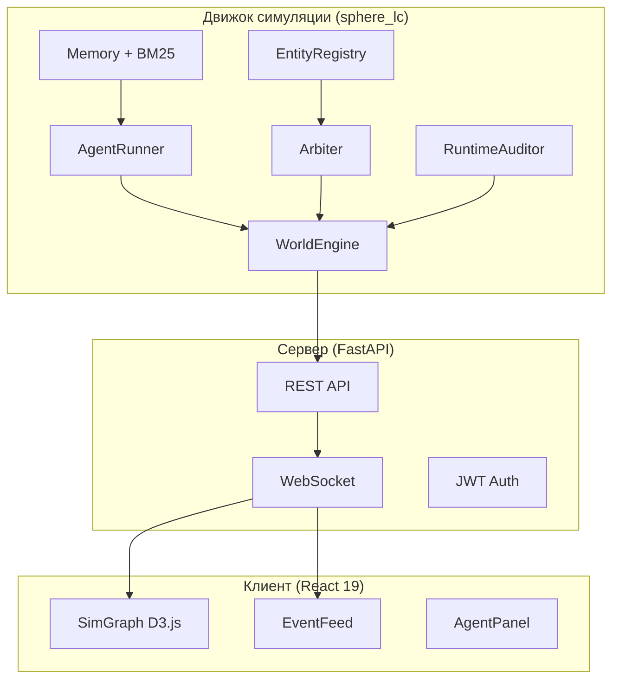

# SPHERE — мета-двигатель управления

SPHERE — исследовательская платформа для агентной симуляции организационных процессов. Система моделирует деятельность муниципальных и государственных организаций с помощью когнитивных LLM-агентов, действующих автономно в рамках заданных полномочий и ресурсов. Каждый агент обладает уникальной личностью, заданной текстовой биографией и нарративным интервью, потоком памяти с гибридным поиском и способностью к адаптивному поведению.

Платформа создана для магистерской диссертации, посвящённой оценке гибридных управленческих систем (AI + DAO) в контексте противодействия коррупции. Ключевая гипотеза: сочетание AI-аудита, репутационного механизма и децентрализованного голосования снижает уровень нарушений по сравнению с традиционным контролем или его отсутствием. Теоретические основания и обзор литературы — в [chapter_1.md](chapter_1.md).

## Возможности

Движок симуляции не привязан к конкретной предметной области — он оперирует универсальными абстракциями: свободное действие, полномочие (`work`, `dao`, `audit`, `spawn` как legacy/runtime-слой), сущность (агент, канал, организация, рабочий элемент). Конкретные сценарии — закупки, найм, согласование бюджета — задаются конфигурацией в YAML, а не кодом.

Когнитивные агенты больше не выбирают typed action menu: они формулируют один свободный `proposal` на тик, а гибридный арбитр переводит этот proposal во внутренние детерминированные операции: сообщения, рабочие изменения, DAO-голосования, создание сущностей и другие последствия мира. Отдельный `RuntimeAuditor` в governance-слое анализирует уже совершённые события, эмитит audit-сигналы и может запускать заморозку роста репутации и коллегиальное review. Перед первым тиком движок может обогащать персоны в режиме `full` (биография + интервью + expert reflection), извлекать вторичных агентов из социального графа и в ходе симуляции добавлять новых участников через worldgen и системные runtime-контуры, но только с человеко-читаемыми именами и без role-alias дублей. Веб-интерфейс (FastAPI + React 19 + D3.js) обеспечивает визуализацию социального графа, ленту событий и управление симуляциями.

## Быстрый старт

### Установка

```bash
git clone <repository-url> && cd SPHERE
python -m venv .venv
# Linux/macOS: source .venv/bin/activate
# Windows (PowerShell): .\.venv\Scripts\Activate.ps1
pip install -e ".[lc,dev]"
```

Группа `dev` включает не только `pytest`, но и зависимости веб-слоя, необходимые для коллекции и запуска тестов (`fastapi`, `aiofiles`, `python-multipart`, `PyJWT`, `bcrypt`).

### Настройка

```bash
cp .env.example .env
# Отредактировать .env: указать OPENAI_API_KEY.
# Для OpenRouter задайте OPENAI_BASE_URL=https://openrouter.ai/api/v1
# и при необходимости OPENROUTER_PROVIDER_ORDER=Groq
```

### Запуск симуляции

```bash
# Минимальный сценарий
sphere-lc run --scenario scenarios/lc_minimal.yaml --out results/lc_minimal_run

# Богатый demo-сценарий
sphere-lc run --scenario scenarios/procurement_tender.yaml --out results/procurement_tender_run

# Исследовательский core-governance run: без worldgen, без secondary-spawn
sphere-lc run --scenario scenarios/procurement_tender_core_governance.yaml --out results/procurement_tender_core_run

# Исследовательский full-ecology run: full-persona + secondary-spawn + worldgen
sphere-lc run --scenario scenarios/procurement_tender_full_ecology.yaml --out results/procurement_tender_full_run

# Baseline-серия для главы 2: один procurement-сценарий в режимах G0-G3
python scripts/run_chapter2_baseline.py --scenario scenarios/procurement_tender_core_governance.yaml --out results/chapter2_procurement_baseline --seeds 42 43 44

# Генерация сценария из текстового описания (LLM)
sphere-lc compose --description "Тендер на ремонт дорог, 4 агента, конфликт интересов" --out scenarios/composed.yaml

# Пост-фактум анализ нарушений (LLM-оракул, чанкинг по events.jsonl)
sphere-lc oracle --events results/lc_minimal_run/events.jsonl --out results/lc_minimal_run/violations.json
```

При запуске `sphere-lc run` движок пишет `events.jsonl`, `trace.jsonl`, `truth.jsonl`, `evaluation.json`, `fidelity.json` и `summary.json` в директорию прогона. Если `--out` не указан, используется `results/<timestamp>`, поэтому прогон сразу доступен web-интерфейсу.

### Запуск веб-интерфейса

Предпочтительный путь для этой среды:

```bash
docker compose up --build -d web
```

После старта UI доступен по адресу `http://localhost:8765`. По умолчанию контейнер создаёт dev-пользователя:

- логин: `sphere_admin`
- пароль: `SphereDocker123!`

При необходимости переопределите `SPHERE_ADMIN_USERNAME` и `SPHERE_ADMIN_PASSWORD` через окружение или `.env` до запуска `docker compose`.

Локальный fallback без Docker:

```bash
cd web && bash start.sh
```

Скрипт `web/start.sh` сам находит Python как в `.venv/bin`, так и в `.venv/Scripts`, поэтому одинаково подходит для Unix- и Windows-окружений с Git Bash.

Подробные инструкции — в [docs/getting_started.md](docs/getting_started.md).

## Архитектура



Полное описание — в [docs/architecture_guide.md](docs/architecture_guide.md).

## Документация

| Документ | Описание |
|---|---|
| [docs/architecture_guide.md](docs/architecture_guide.md) | Навигатор по архитектуре: карта модулей, путь данных |
| [chapter_1.md](chapter_1.md) | Глава 1 ВКР: теоретические основания, обзор литературы, гибридная система |
| [AGENTS.md](AGENTS.md) | Инструкции для AI-агентов: правила, соглашения, задачи |
| [docs/overview.md](docs/overview.md) | Обзор системы для технического читателя |
| [docs/getting_started.md](docs/getting_started.md) | Пошаговое руководство по установке и запуску |
| [docs/testing.md](docs/testing.md) | Тестирование: структура, паттерны, покрытие |
| [docs/cli_reference.md](docs/cli_reference.md) | Справочник CLI: аргументы, переменные окружения |
| [docs/web_interface.md](docs/web_interface.md) | Веб-интерфейс: API, WebSocket, компоненты |
| [docs/simulation_engine.md](docs/simulation_engine.md) | Движок: агент, арбитр, память, оракул |
| [docs/data_formats.md](docs/data_formats.md) | Форматы данных: сценарии, события, персоны |
| [docs/evaluation_separation_plan.md](docs/evaluation_separation_plan.md) | План разделения runtime-механизмов, truth-layer и post-hoc оценки |
| [docs/runtime_auditor_design.md](docs/runtime_auditor_design.md) | Технический дизайн отдельного runtime-auditor и его встраивания в тик симуляции |
| [docs/persona_interview_design.md](docs/persona_interview_design.md) | Подсистема персон: генерация, интервью, фрагментный поиск |
| [docs/project_assessment.md](docs/project_assessment.md) | Развёрнутая исследовательская и инженерная оценка проекта |

## Режимы управления

Сценарии конфигурируются через YAML. Раздел `governance` определяет набор механизмов контроля:

| Компонент | Описание |
|---|---|
| Runtime-аудитор | Отдельный rules-first governance-модуль, выявляющий signals/findings по событиям тика |
| Репутация | Репутация и временная заморозка продвижения/начислений как санкционный слой |
| DAO-голосование | Коллегиальное анонимное рассмотрение спорных случаев |

Теоретическое обоснование каждого компонента — в [chapter_1.md](chapter_1.md), раздел 1.6.

## Стек технологий

| Компонент | Технология | Версия |
|---|---|---|
| Язык | Python | 3.12+ |
| Модели данных | Pydantic | 2.0+ |
| Оркестрация | LangGraph | 0.2+ |
| LLM-провайдер | OpenAI API (совместимый) | 1.0+ |
| Веб-сервер | FastAPI | 0.115+ |
| Клиент | React | 19 |
| Визуализация | D3.js | 7 |
| Тестирование | pytest + pytest-asyncio | 9.0+ |
| Лексический поиск | rank-bm25 | 0.2.2+ |
| CLI | Rich | 13.7+ |
