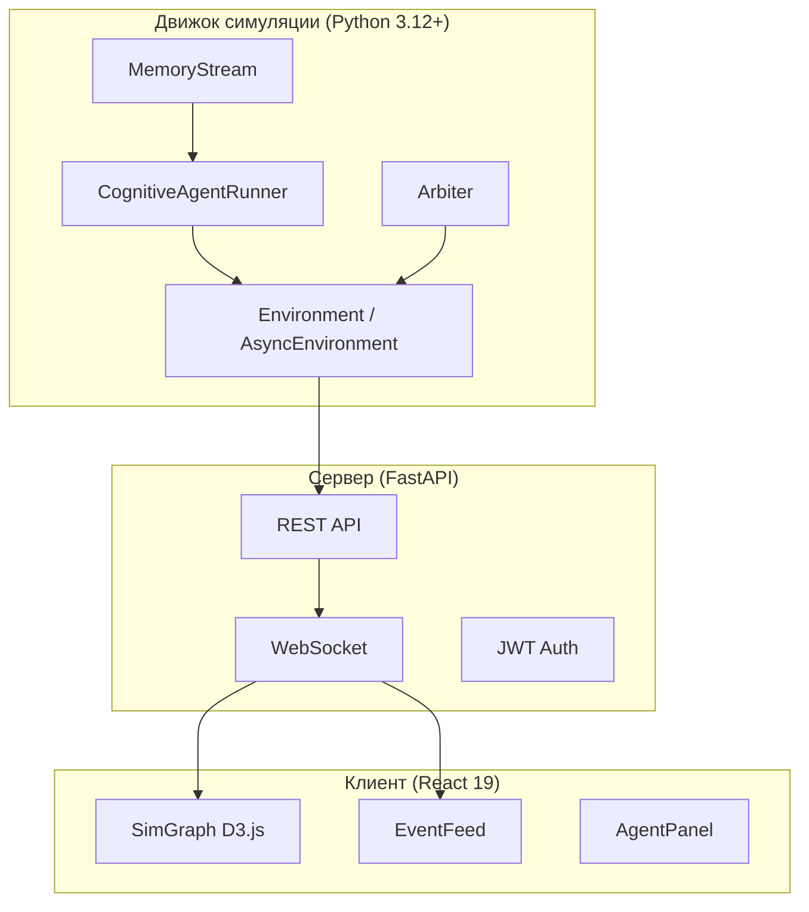

# MAGISTRY — мета-двигатель управления

MAGISTRY (Multi-Agent Governance and Institutional Simulation for Testing and Research Yield) — исследовательская платформа для агентной симуляции организационных процессов. Система моделирует деятельность муниципальных и государственных организаций с помощью когнитивных LLM-агентов, действующих автономно в рамках заданных полномочий и ресурсов. Каждый агент обладает уникальной личностью (HEXACO, Dark Triad), потоком памяти, способностью к рефлексии и стратегическому планированию.

Платформа создана для магистерской диссертации, посвящённой оценке гибридных управленческих систем (AI + DAO) в контексте противодействия коррупции. Ключевая гипотеза: сочетание AI-аудита и децентрализованного голосования (трибунал) снижает уровень нарушений по сравнению с традиционным контролем или его отсутствием. Подробная концепция изложена в [CONCEPT.README.md](CONCEPT.README.md).

## Возможности

Движок симуляции не привязан к конкретной предметной области — он оперирует универсальными абстракциями: дело (организационный процесс), предложение (отклик агента), полномочие (право на действие) и ресурс (бюджет, штат, контракты). Конкретные сценарии — закупки, найм, согласование бюджета — задаются конфигурацией, а не кодом.

Когнитивные агенты реализуют полный цикл по модели Park et al. (2023, 2024): наблюдение, сохранение в поток памяти с LLM-оценкой важности, рефлексия при накоплении порога, стратегическое и тактическое планирование, действие через восемь инструментов. Fragment-based retrieval по нарративным интервью обеспечивает согласованность поведения с заданной личностью.

Четыре режима управления (G0–G3) позволяют исследовать влияние различных контрольных механизмов: от полного отсутствия контроля до трибунала с присяжными. Веб-интерфейс (FastAPI + React 19 + D3.js) обеспечивает визуализацию социального графа, ленту событий в реальном времени и покадровое воспроизведение симуляции.

## Быстрый старт

### Установка

```bash
git clone <repository-url> && cd MAGISTRY
python -m venv .venv && source .venv/bin/activate
pip install -e ".[dev,search]"
```

### Настройка

```bash
cp .env.example .env
# Отредактировать .env: указать OPENAI_API_KEY
```

### Запуск CLI-симуляции

```bash
# Синхронный режим (раундовый)
magistry-sim --scenario S0 --runner cognitive

# Асинхронный режим (непрерывное время)
magistry-sim --scenario S1 --mode async --runner cognitive --governance G2
```

### MAGISTRY-LC (greenfield на LangChain/LangGraph)

MAGISTRY-LC — новая ветка движка “с нуля” с упором на:
- антифантомы (EntityRegistry + строгие ID),
- управление контекстом,
- YAML-journal арбитра,
- политика должностей через DAO (vote + consent),
- чанкинг оракула.

Установка extra-зависимостей:

```bash
pip install -e ".[lc]"
```

Минимальный запуск:

```bash
magistry-lc run --scenario scenarios/lc_minimal.yaml --out results/lc_minimal_run
```

Генерация сценария из описания (LLM):

```bash
magistry-lc compose --description-file docs/chapter_1.md --out scenarios/lc_composed.yaml
```

Примечание: `compose` дополнительно обогащает персон (биография + интервью), поэтому делает несколько LLM-вызовов (примерно 1 на агента).

Чанкинг-оракул по `events.jsonl` (LLM):

```bash
magistry-lc oracle --events results/lc_minimal_run/events.jsonl --out results/lc_minimal_run/violations.json
```

### Запуск веб-интерфейса

```bash
cd web && bash start.sh
```

Подробные инструкции — в [docs/getting_started.md](docs/getting_started.md).

## Архитектура



Полное описание — в [ARCHITECTURE.md](ARCHITECTURE.md). Навигатор по разделам — в [docs/architecture_guide.md](docs/architecture_guide.md).

## Документация

| Документ | Описание |
|---|---|
| [ARCHITECTURE.md](ARCHITECTURE.md) | Полная архитектура: абстракции, среда, инструменты, управление |
| [CONCEPT.README.md](CONCEPT.README.md) | Концепция ВКР: гипотеза, методология, обзор литературы |
| [AGENTS.md](AGENTS.md) | Инструкции для AI-агентов (Claude): правила, соглашения, задачи |
| [docs/overview.md](docs/overview.md) | Обзор системы для технического читателя |
| [docs/getting_started.md](docs/getting_started.md) | Пошаговое руководство по установке и запуску |
| [docs/architecture_guide.md](docs/architecture_guide.md) | Навигатор по архитектуре: карта модулей, указатель |
| [docs/simulation_engine.md](docs/simulation_engine.md) | Движок: жизненный цикл, когнитивный агент, личность |
| [docs/cli_reference.md](docs/cli_reference.md) | Справочник CLI: аргументы, переменные окружения |
| [docs/web_interface.md](docs/web_interface.md) | Веб-интерфейс: API, WebSocket, компоненты |
| [docs/data_formats.md](docs/data_formats.md) | Форматы данных: сценарии, агенты, личности, результаты |
| [docs/testing.md](docs/testing.md) | Тестирование: структура, паттерны, покрытие |
| [docs/chapter_1.md](docs/chapter_1.md) | Глава 1 ВКР: теоретические основания |

## Сценарии

| ID | Название | Агентов | Тип нарушения | Статус |
|---|---|---|---|---|
| S0 | Чистая сделка | 3 | Нет (контрольный) | Реализован |
| S1 | Прямой сговор | 3 | Откат при закупке | Реализован |
| S2 | Кумовство при найме | 4 | Фаворитизм | Реализован |
| S3 | Бюджетная манипуляция | — | Завышение бюджета | Проектный |
| S4 | Карусель | — | Картельный сговор | Проектный |
| S5 | Посредники | — | Сокрытие связей | Проектный |
| S6 | Перекрёстная коррупция | — | Цепочка нарушений | Проектный |

## Режимы управления

| Режим | Аудитор | Репутация | Трибунал | Описание |
|---|---|---|---|---|
| G0 | Нет | Нет | Нет | Без контроля |
| G1 | Да | Нет | Нет | Рекомендательный аудит |
| G2 | Да | Да | Нет | Аудит с заморозкой репутации |
| G3 | Да | Да | Да | Полный контроль с трибуналом |

## Стек технологий

| Компонент | Технология | Версия |
|---|---|---|
| Язык | Python | 3.12+ |
| Модели данных | Pydantic | 2.0+ |
| Социальный граф | NetworkX | 3.0+ |
| LLM-провайдер | OpenAI API | 1.0+ |
| Веб-сервер | FastAPI | 0.115+ |
| Клиент | React | 19 |
| Визуализация | D3.js | 7 |
| Тестирование | pytest + pytest-asyncio | 9.0+ |
| Лексический поиск | rank-bm25 | 0.2.2+ |
| CLI | Rich | 13.7+ |
