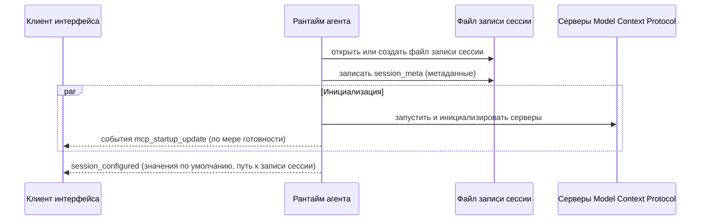
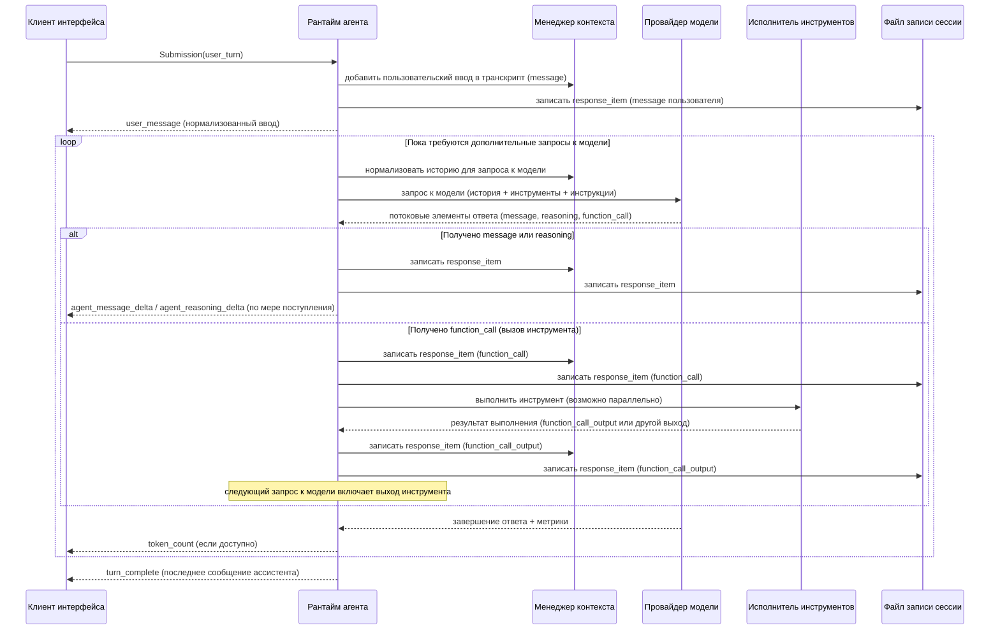
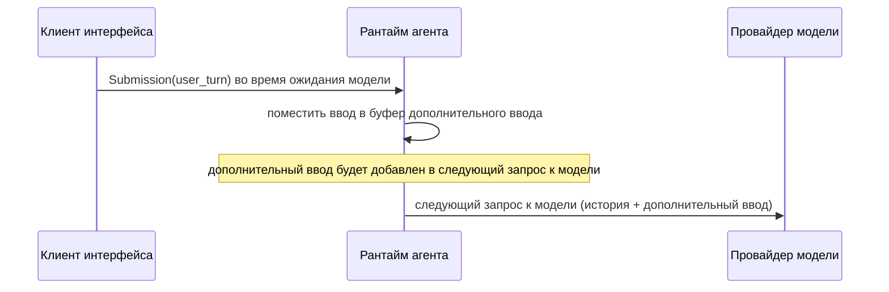
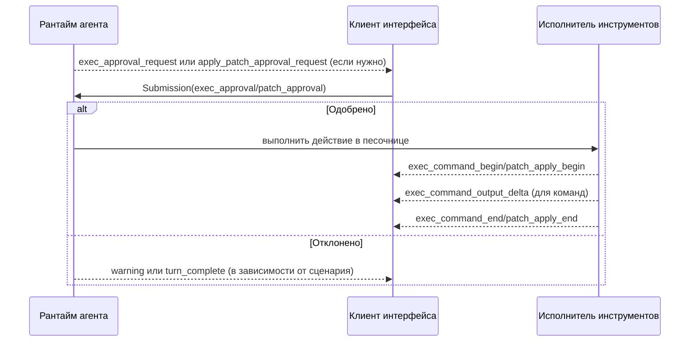
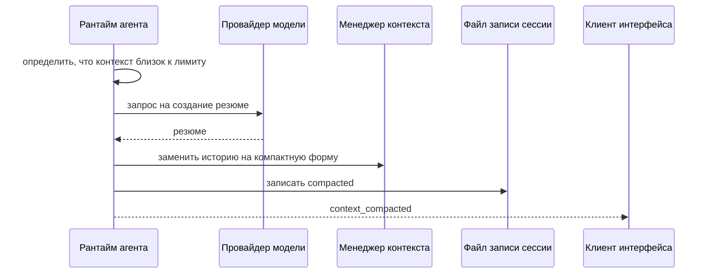
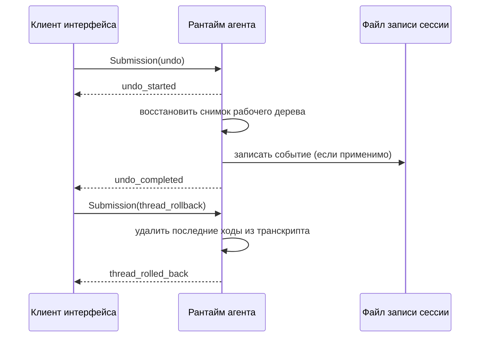
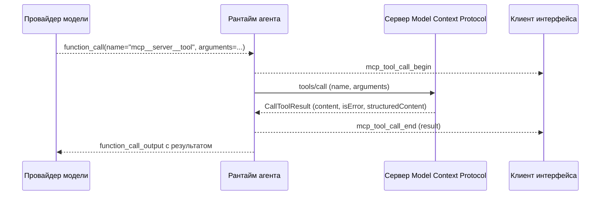
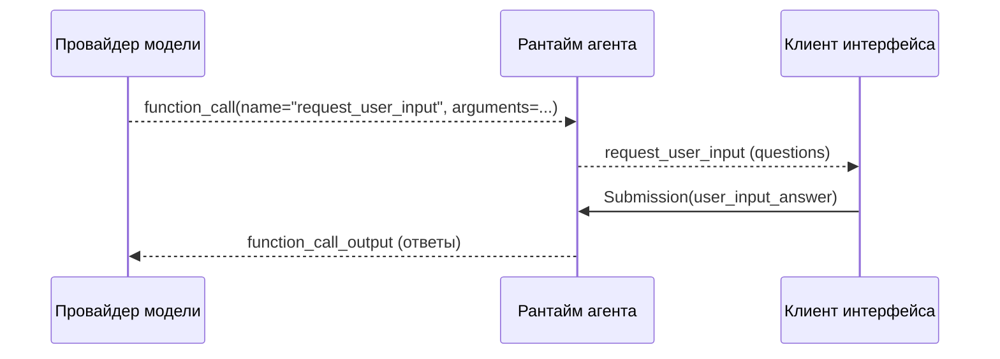

# Архитектура рантайма агента Codex: потоки данных и объекты передачи данных

Этот документ описывает рантайм агента Codex: как пользовательский ввод превращается в запросы к провайдеру модели, как выполняются инструменты, как ведётся «память» (контекст разговора), какие структурированные объекты передаются между компонентами, и как состояние сессии сохраняется для возобновления работы.

Документ намеренно самодостаточный: все термины, потоки данных и используемые объекты передачи данных определены здесь, без ссылок на исходный код.

## Область охвата

Входит:

- протокол обмена между клиентом интерфейса и агентом (запросы и события);
- представление контекста разговора (транскрипт) и правила нормализации;
- выполнение инструментов (команды оболочки, применение патча, инструменты Model Context Protocol и другие);
- песочница и одобрение потенциально опасных действий;
- формат сохранения и возобновления сессии (файл записи сессии);
- отмена изменений рабочей директории и откат контекста разговора.

Не входит:

- внешний вид и логика конкретного пользовательского интерфейса;
- конкретные сетевые реализации провайдеров модели;
- детали сборки и упаковки приложения.

## Термины и сущности

- **Поток разговора**: один независимый диалог с агентом, имеющий собственный идентификатор и контекст. Поток разговора можно сохранять, возобновлять и «ветвить» (создавать новый поток на основе истории другого).
- **Сессия**: процесс и состояние рантайма, обслуживающие один поток разговора. Сессия включает контекст по умолчанию для ходов (модель, политики безопасности, рабочая директория).
- **Ход**: одно пользовательское взаимодействие, которое начинается при получении пользовательского ввода и заканчивается событием завершения (или прерывания). Один ход может включать несколько запросов к модели и несколько вызовов инструментов.
- **Задача хода**: асинхронная работа, выполняющая ход (включая ожидание модели и выполнение инструментов). В каждый момент времени может выполняться либо одна задача, либо несколько задач служебного назначения (например, создание снимка рабочего дерева).
- **Транскрипт**: упорядоченный список элементов контекста разговора. Это каноническая «память» агента, из которой формируется следующий запрос к модели.
- **Инструмент**: операция, которую агент может выполнить по просьбе модели, например чтение файлов, выполнение команды оболочки, применение патча, обращение к внешнему серверу инструментов.
- **Вызов инструмента**: элемент транскрипта, описывающий запрос на выполнение инструмента (имя инструмента, идентификатор вызова, аргументы).
- **Ответ инструмента**: элемент транскрипта, описывающий результат выполнения инструмента и предназначенный для возврата в модель (идентификатор вызова, выходные данные, признак успеха).
- **Песочница**: режим запуска процессов с ограничениями (доступ к файловой системе, сетевой доступ). Песочница предназначена для снижения риска при выполнении команд.
- **Политика одобрения**: правило, определяющее, требуется ли подтверждение пользователя перед выполнением потенциально опасных действий (например, команда оболочки или запись в файлы).
- **Снимок рабочего дерева**: фиксация текущего состояния репозитория Git в виде специального «призрачного» коммита, используемая для быстрой отмены изменений файлов, сделанных инструментами.
- **Файл записи сессии**: файл, в который дописываются события и элементы транскрипта в формате «одна запись на строку». Позволяет возобновить поток разговора и восстановить его контекст.

## Контекст системы

```mermaid
flowchart LR
  user[Пользователь]
  client[Клиент интерфейса\n(командная строка, текстовый интерфейс,\nрасширение Visual Studio Code)]
  agent[Рантайм агента]
  model[Провайдер модели\n(OpenAI или совместимый)]
  mcp[Серверы Model Context Protocol]
  fs[Файловая система и репозиторий Git]
  proc[Локальные процессы\n(командная оболочка)]
  store[Хранилище в домашнем каталоге\n(записи сессий и история)]

  user --> client
  client <--> agent
  agent <--> model
  agent <--> mcp
  agent <--> fs
  agent <--> proc
  agent <--> store
```

## Контейнеры внутри локального приложения

```mermaid
flowchart TB
  client[Клиент интерфейса] --> agent[Рантайм агента]
  agent --> model_client[Клиент провайдера модели\n(запросы и потоковая выдача)]
  model_client --> model[Провайдер модели]

  agent --> mcp_manager[Менеджер соединений\nModel Context Protocol]
  mcp_manager --> mcp[Серверы Model Context Protocol]

  agent --> tool_runtime[Исполнение инструментов\n(оболочка, патчи, веб-поиск,\nинструменты Model Context Protocol)]
  tool_runtime --> os[Операционная система\nи файловая система]

  agent --> session_log[Файл записи сессии\n(одна запись на строку)]
  agent --> cross_session_history[Межсессионная история сообщений]
```

## Компоненты рантайма агента (логическая декомпозиция)

```mermaid
flowchart TB
  subgraph runtime[Рантайм агента]
    thread_manager[Менеджер потоков разговора\n(создание, возобновление, ветвление)]
    session[Сессия\n(состояние и оркестрация ходов)]
    context_manager[Менеджер контекста\n(транскрипт, нормализация, усечение, компакция)]
    model_loop[Цикл работы с моделью\n(запрос, потоковая выдача,\nповторные запросы после инструментов)]
    tool_router[Маршрутизация вызовов инструментов\n(разбор, диспетчеризация)]
    tool_runtime[Исполнитель инструментов\n(параллелизм, отмена, ограничения)]
    safety[Подсистема безопасности\n(песочница и одобрение)]
    snapshot[Снимки рабочего дерева и отмена]
    persistence[Сохранение\n(файл записи сессии, межсессионная история)]
    events[Поток событий для клиента интерфейса]
  end

  thread_manager --> session
  session --> context_manager
  session --> model_loop
  model_loop --> tool_router
  tool_router --> tool_runtime
  tool_runtime --> safety
  session --> snapshot
  session --> persistence
  session --> events
```

## Объекты передачи данных: общие правила

В этом документе «объект передачи данных» означает структурированное значение, сериализуемое в формате JavaScript Object Notation (JSON) и передаваемое между компонентами или сохраняемое на диск.

Общие соглашения:

- перечисления (варианты) обычно кодируются как объект с полем `type` и набором полей конкретного варианта;
- имена вариантов в JSON, как правило, записываются в стиле `snake_case`, если не указано иначе;
- пути файловой системы передаются строками. В зависимости от платформы строка может выглядеть как путь Unix или Windows;
- все идентификаторы вызовов и сессий — строки; отдельные подсистемы могут генерировать их как «универсальный уникальный идентификатор» или как произвольную строку, если это допускается.

Стили именования, используемые в этом документе:

- `snake_case`: слова в нижнем регистре, разделённые подчёркиваниями;
- `kebab-case`: слова в нижнем регистре, разделённые дефисами;
- `camelCase`: слова без разделителей, где начиная со второго слова первая буква заглавная.

Технические обозначения:

- `UTF-8`: популярная кодировка Unicode, где строка представлена последовательностью байтов;
- `Base64`: текстовое кодирование произвольных байтов, подходящее для передачи в JSON.

Ниже приводится справочник ключевых объектов передачи данных, используемых в основных потоках.

## Протокол «клиент интерфейса ↔ агент»

Протокол построен на обмене:

- **входящими запросами** от клиента к агенту (каждый запрос имеет идентификатор для корреляции);
- **исходящими событиями** от агента к клиенту (каждое событие содержит идентификатор запроса, к которому относится).

### Запрос клиента: `Submission`

`Submission` — объект запроса от клиента к агенту.

| Поле | Тип | Описание |
|---|---|---|
| `id` | строка | Уникальный идентификатор запроса. Все события, относящиеся к этому запросу, будут содержать такой же `id`. |
| `op` | объект | Операция, которую нужно выполнить. Структура определяется полем `op.type`. |

Пример:

```json
{
  "id": "sub_123",
  "op": { "type": "user_turn", "items": [ { "type": "text", "text": "Привет", "text_elements": [] } ], "cwd": "/repo", "approval_policy": "on-request", "sandbox_policy": { "type": "workspace-write", "writable_roots": [], "network_access": false, "exclude_tmpdir_env_var": false, "exclude_slash_tmp": false }, "model": "gpt-5", "effort": "medium", "summary": "auto", "final_output_json_schema": null }
}
```

### Операции клиента: `Op`

`Op` — перечисление операций, которые клиент может запросить у агента. Ниже приведены операции, используемые в базовых потоках.

#### `interrupt`: прервать текущий ход

```json
{ "type": "interrupt" }
```

Семантика: если в данный момент выполняется задача хода, агент пытается её остановить и отправляет событие `turn_aborted`.

#### `user_turn`: основной способ передать пользовательский ввод

`user_turn` содержит и сам ввод, и полный контекст хода (рабочая директория, политики безопасности, модель).

| Поле | Тип | Описание |
|---|---|---|
| `items` | массив `UserInput` | Ввод пользователя (текст, изображения, выбранные навыки). |
| `cwd` | строка-путь | Рабочая директория хода. |
| `approval_policy` | строка | Политика одобрения действий. См. раздел «Политика одобрения». |
| `sandbox_policy` | объект | Политика песочницы. См. раздел «Политика песочницы». |
| `model` | строка | Идентификатор выбранной модели. |
| `effort` | строка или `null` | Интенсивность рассуждений модели (если поддерживается). |
| `summary` | строка | Предпочтение по краткому резюме рассуждений (если поддерживается). |
| `final_output_json_schema` | объект или `null` | JSON Schema, которым можно ограничить формат итогового сообщения ассистента для хода. |
| `collaboration_mode` | объект или `null` | Предустановленный режим совместной работы (опционально). |
| `personality` | строка или `null` | Профиль стиля общения (опционально). |

#### `user_input`: устаревший способ передать ввод (без полного контекста)

```json
{ "type": "user_input", "items": [ ... ], "final_output_json_schema": null }
```

Семантика: используется только когда контекст хода уже задан ранее как значение по умолчанию, либо когда клиент по историческим причинам не передаёт параметры хода в каждом запросе.

#### `override_turn_context`: изменить значения по умолчанию для следующих ходов

Этот запрос не добавляет ввод и не запускает ход, а только обновляет «контекст по умолчанию», который будет применён для будущих операций `user_input` или для клиентов, не передающих полный контекст каждый раз.

Пример:

```json
{ "type": "override_turn_context", "cwd": "/repo", "approval_policy": "on-request", "sandbox_policy": { "type": "workspace-write", "writable_roots": [], "network_access": false, "exclude_tmpdir_env_var": false, "exclude_slash_tmp": false }, "model": "gpt-5", "effort": "high", "summary": "concise", "collaboration_mode": null, "personality": "pragmatic" }
```

#### `exec_approval`: ответ на запрос одобрения выполнения команды

```json
{ "type": "exec_approval", "id": "sub_123", "decision": "approved" }
```

Поле `decision` имеет тип `ReviewDecision`.

#### `patch_approval`: ответ на запрос одобрения применения патча

```json
{ "type": "patch_approval", "id": "sub_123", "decision": "approved_for_session" }
```

#### `user_input_answer`: ответ на интерактивный запрос `request_user_input`

```json
{ "type": "user_input_answer", "id": "sub_123", "response": { "answers": { "q1": { "answers": ["Да"] } } } }
```

#### `resolve_elicitation`: ответ на интерактивный запрос сервера Model Context Protocol

```json
{ "type": "resolve_elicitation", "server_name": "example", "request_id": "req_1", "decision": "accept" }
```

#### `dynamic_tool_response`: ответ на динамический вызов инструмента

```json
{ "type": "dynamic_tool_response", "id": "call_1", "response": { "callId": "call_1", "output": "ok", "success": true } }
```

#### `compact`: попросить агента выполнить компакцию контекста

```json
{ "type": "compact" }
```

#### `undo`: попросить агента отменить изменения в рабочей директории (если доступно)

```json
{ "type": "undo" }
```

#### `thread_rollback`: удалить последние `num_turns` ходов пользователя из контекста

```json
{ "type": "thread_rollback", "num_turns": 2 }
```

Семантика: влияет только на контекст разговора и не пытается вернуть изменения файловой системы.

#### `refresh_mcp_servers`: переинициализировать серверы Model Context Protocol

```json
{ "type": "refresh_mcp_servers", "config": { "mcp_servers": { }, "mcp_oauth_credentials_store_mode": { } } }
```

#### `list_mcp_tools`: запросить список доступных инструментов Model Context Protocol

```json
{ "type": "list_mcp_tools" }
```

#### `list_skills`: запросить список доступных навыков

```json
{ "type": "list_skills", "cwds": ["/repo"], "force_reload": false }
```

#### `add_to_history` и `get_history_entry_request`: межсессионная история

Записать строку в межсессионную историю:

```json
{ "type": "add_to_history", "text": "краткая заметка" }
```

Запросить запись из межсессионной истории:

```json
{ "type": "get_history_entry_request", "offset": 0, "log_id": 123 }
```

#### `shutdown`: завершить работу агента

```json
{ "type": "shutdown" }
```

### Политика одобрения: `AskForApproval`

Политика одобрения кодируется строкой в стиле `kebab-case`:

- `untrusted`: автоматически одобряются только известные безопасные команды, которые читают файлы; всё остальное требует явного подтверждения;
- `on-failure`: команды автоматически одобряются в песочнице; при отказе песочницы возможна эскалация и повтор только после отдельного подтверждения;
- `on-request`: решение о необходимости подтверждения оставляется модели/рантайму;
- `never`: подтверждения не запрашиваются; потенциально опасные действия либо выполняются без подтверждения (если политика это допускает), либо немедленно возвращают ошибку в модель.

### Политика песочницы: `SandboxPolicy`

Политика песочницы кодируется объектом с полем `type` и параметрами:

#### `danger-full-access`: без ограничений

```json
{ "type": "danger-full-access" }
```

#### `read-only`: чтение всего диска без записи и без сетевого доступа

```json
{ "type": "read-only" }
```

#### `external-sandbox`: процесс уже запущен во внешней песочнице

```json
{ "type": "external-sandbox", "network_access": "restricted" }
```

`network_access` принимает значения `restricted` или `enabled`.

#### `workspace-write`: запись в рабочую директорию и, при необходимости, в дополнительные корни

```json
{
  "type": "workspace-write",
  "writable_roots": ["/repo"],
  "network_access": false,
  "exclude_tmpdir_env_var": false,
  "exclude_slash_tmp": false
}
```

Семантика:

- `writable_roots`: дополнительные корни, куда разрешена запись (помимо `cwd`); задаются как абсолютные пути;
- `network_access`: разрешён ли исходящий сетевой доступ;
- `exclude_tmpdir_env_var`: исключить ли каталог, заданный переменной окружения `TMPDIR`, из списка путей, куда разрешена запись;
- `exclude_slash_tmp`: исключить ли `/tmp` из списка путей, куда разрешена запись (на системах Unix).

### Решение пользователя: `ReviewDecision`

`ReviewDecision` используется в ответах `exec_approval` и `patch_approval`.

В JSON `ReviewDecision` может быть строкой:

- `"approved"`
- `"approved_for_session"`
- `"denied"`
- `"abort"`

Либо объектом для одобрения с правкой политики исполнения:

```json
{
  "approved_execpolicy_amendment": {
    "proposed_execpolicy_amendment": ["git", "status"]
  }
}
```

### Вспомогательные объекты протокола

#### Поправка политики исполнения: `ExecPolicyAmendment`

`ExecPolicyAmendment` — предложение добавить правило в политику исполнения, чтобы в будущем автоматически одобрять команды, начинающиеся с указанного префикса токенов.

В JSON это массив строк (токенов команды):

```json
["git", "status"]
```

#### Изменение файла: `FileChange`

`FileChange` описывает изменение одного файла при применении патча и в запросах одобрения патча.

Варианты:

- добавление файла:

  ```json
  { "type": "add", "content": "полное содержимое файла" }
  ```

- удаление файла:

  ```json
  { "type": "delete", "content": "содержимое файла до удаления" }
  ```

- обновление файла:

  ```json
  { "type": "update", "unified_diff": "diff --git ...", "move_path": null }
  ```

`move_path` используется, если файл был перемещён или переименован. `unified_diff` — строка с диффом в едином формате, принятом в Git.

Поле `changes` в событиях применения патча и в запросах одобрения патча — это словарь, где ключи — строки путей, а значения — `FileChange`. Пример:

```json
{
  "README.md": { "type": "add", "content": "# Project\n" },
  "src/main.rs": { "type": "update", "unified_diff": "@@ -1 +1 @@\n-...\n+...\n", "move_path": null }
}
```

#### Разбор команды для интерфейса: `ParsedCommand`

`ParsedCommand` — «лёгкая» классификация команды оболочки, которая помогает интерфейсу понять, что именно делает команда (чтение файла, список файлов, поиск).

Варианты:

- чтение файла:

  ```json
  { "type": "read", "cmd": "cat", "name": "cat", "path": "README.md" }
  ```

- список файлов:

  ```json
  { "type": "list_files", "cmd": "ls", "path": "." }
  ```

- поиск:

  ```json
  { "type": "search", "cmd": "rg", "query": "TODO", "path": "." }
  ```

- неизвестно:

  ```json
  { "type": "unknown", "cmd": "bash" }
  ```

#### Динамические инструменты: `DynamicToolCallRequest` и `DynamicToolResponse`

Динамические инструменты — это вызовы, которые требуют участия клиента интерфейса или внешней подсистемы. В отличие от большинства типов протокола, эти структуры используют имена полей в стиле `camelCase`.

Запрос на выполнение (событие `dynamic_tool_call_request`) содержит:

```json
{ "callId": "call_1", "turnId": "sub_123", "tool": "tool_name", "arguments": { } }
```

Ответ клиента (`dynamic_tool_response`) содержит:

```json
{ "callId": "call_1", "output": "ok", "success": true }
```

#### Результат вызова инструмента Model Context Protocol: `CallToolResult`

`CallToolResult` — ответ сервера Model Context Protocol на вызов инструмента:

- `content`: массив блоков контента (например, текстовые и графические блоки);
- `isError`: опциональный признак ошибки;
- `structuredContent`: опциональный структурированный объект.

Семантика: рантайм агента преобразует `CallToolResult` в ответ инструмента для модели (`function_call_output`). Текстовые блоки превращаются в текст, графические блоки — в изображения, а `structuredContent` может быть включён в итоговую строку или в структурированный вывод, если это поддерживается выбранным протоколом провайдера модели.

### Событие агента: `Event`

`Event` — объект, который агент отправляет клиенту интерфейса.

| Поле | Тип | Описание |
|---|---|---|
| `id` | строка | Идентификатор запроса `Submission.id`, к которому относится событие. |
| `msg` | объект | Сообщение события. Структура определяется полем `msg.type`. |

### Сообщения событий: ключевые варианты `EventMsg`

`EventMsg` кодируется объектом с полем `type`. Ниже приведены сообщения, которые участвуют в основных потоках.

#### `session_configured`: агент готов к работе

Полезно для интерфейса: получить идентификатор потока разговора, значения контекста по умолчанию, путь к файлу записи сессии (если есть), а также «начальные сообщения» при возобновлении.

Основные поля:

- `session_id`: идентификатор потока разговора (строка);
- `forked_from_id`: идентификатор исходного потока при ветвлении (или `null`);
- `model`, `model_provider_id`: выбранная модель и провайдер;
- `approval_policy`, `sandbox_policy`, `cwd`: значения по умолчанию;
- `reasoning_effort`: интенсивность рассуждений (или `null`);
- `history_log_id`, `history_entry_count`: метаданные межсессионной истории;
- `initial_messages`: массив событий для инициализации интерфейса при возобновлении (или `null`);
- `rollout_path`: путь к файлу записи сессии (или `null`).

#### `turn_started`, `turn_complete`, `turn_aborted`: жизненный цикл хода

- `turn_started` содержит `model_context_window` (размер контекстного окна модели, если известен);
- `turn_complete` содержит `last_agent_message` (последнее полное сообщение ассистента, если оно было);
- `turn_aborted` сигнализирует, что ход прерван.

#### `agent_message`, `agent_message_delta`: текстовый вывод ассистента

- `agent_message_delta.delta`: очередная порция текста, полученная потоково;
- `agent_message.message`: итоговое сообщение (удобно для интерфейсов, которые не собирают дельты).

#### `user_message`: нормализованный пользовательский ввод (как он был отправлен модели)

Поля:

- `message`: склеенный текстовый ввод пользователя;
- `images`: массив ссылок на изображения, уже пригодных для отправки модели (если есть);
- `local_images`: массив локальных путей к изображениям (для отображения и переиспользования в интерфейсе);
- `text_elements`: массив объектов вида `{ byte_range: { start, end }, placeholder: строка или null }`, где диапазон задан в байтах и относится к строке `message` в кодировке UTF-8.

#### `agent_reasoning*`: события о рассуждениях

Эти события предназначены для интерфейсов, которые показывают «краткое резюме рассуждений» и, опционально, сырой ход рассуждений.

- `agent_reasoning.text`: строка резюме;
- `agent_reasoning_delta.delta`: потоковая порция резюме;
- `agent_reasoning_raw_content.text`: строка сырого рассуждения (если включено);
- `agent_reasoning_raw_content_delta.delta`: потоковая порция сырого рассуждения;
- `agent_reasoning_section_break`: граница секции резюме.

#### `exec_command_begin`, `exec_command_output_delta`, `terminal_interaction`, `exec_command_end`: выполнение команды

Эти события позволяют интерфейсу показывать прогресс команды и вывод в реальном времени.

Ключевые поля:

- `call_id`: идентификатор вызова (для корреляции begin/delta/end);
- `turn_id`: идентификатор хода внутри сессии (строка, стабильная внутри потока событий);
- `command`: массив токенов команды;
- `cwd`: рабочая директория команды;
- `stdout`, `stderr`, `exit_code`, `duration`, `formatted_output` присутствуют в `exec_command_end`;
- `exec_command_output_delta` содержит `stream` (`stdout` или `stderr`) и `chunk` (байты, кодированные как Base64).

`terminal_interaction` используется, когда команда выполняется в интерактивной псевдотерминальной сессии и интерфейс отправляет ввод на стандартный ввод процесса.

#### `patch_apply_begin`, `patch_apply_end`: применение патча

Полезно для отображения прогресса и для показа списка затронутых файлов.

- `patch_apply_begin.changes`: словарь «путь → FileChange»;
- `patch_apply_end.success`: признак успеха;
- `patch_apply_end.stdout`, `patch_apply_end.stderr`: итоговые сообщения применения.

#### `exec_approval_request` и `apply_patch_approval_request`: запрос подтверждения

`exec_approval_request` содержит:

- `call_id`, `turn_id`, `command`, `cwd`;
- `reason` (например, просьба повторить команду без песочницы);
- `proposed_execpolicy_amendment` (предложение добавить правило в политику исполнения).

`apply_patch_approval_request` содержит:

- `call_id`, `turn_id`, `changes` (словарь «путь → FileChange»);
- `reason` и, при необходимости, `grant_root` (корень, куда агент просит разрешить запись).

#### `mcp_startup_update`, `mcp_startup_complete`: запуск серверов Model Context Protocol

`mcp_startup_update` сообщает о состоянии каждого сервера (`starting`, `ready`, `failed`, `cancelled`).

#### `mcp_tool_call_begin`, `mcp_tool_call_end`: вызов инструмента Model Context Protocol

Содержит:

- `call_id`;
- `invocation`: `{ server, tool, arguments }`;
- в `mcp_tool_call_end`: `duration` и `result` (успех или ошибка).

#### `elicitation_request`: интерактивный запрос от сервера Model Context Protocol

Содержит:

- `server_name`;
- `id` (идентификатор запроса сервера);
- `message` (текст, который должен увидеть пользователь).

#### `request_user_input` и `plan_update`: события, предназначенные прежде всего для интерфейса

`request_user_input` содержит:

- `call_id`, `turn_id`;
- массив вопросов (идентификатор вопроса, заголовок, текст, опциональные варианты).

`plan_update` содержит:

- `explanation` (опционально);
- массив шагов (текст шага и статус: pending, in_progress, completed).

#### `context_compacted`, `thread_rolled_back`, `undo_started`, `undo_completed`: обслуживание контекста и отмены

- `context_compacted` сигнализирует, что контекст был заменён на компактную форму;
- `thread_rolled_back.num_turns` сообщает, сколько ходов пользователя было удалено из контекста;
- `undo_started` и `undo_completed` описывают прогресс отмены изменений рабочей директории.

#### `token_count` и `stream_error`: метрики и ошибки потоковой выдачи

- `token_count.info` содержит общую и последнюю статистику токенов, если она известна;
- `stream_error.message` и `stream_error.additional_details` объясняют, что произошло, когда поток выдачи модели был прерван и система выполняет повторные попытки.

## Ввод пользователя: `UserInput` и связанные типы

`UserInput` — перечисление элементов ввода пользователя. Элементы используются:

- для отображения и редактирования истории в интерфейсе;
- для подготовки «входа в модель» (текст и изображения);
- для выбора навыков, которые агент затем подгружает и добавляет в контекст.

### `UserInput`

Варианты:

#### Текст

```json
{
  "type": "text",
  "text": "Проверь тесты",
  "text_elements": [
    { "byte_range": { "start": 0, "end": 12 }, "placeholder": "..." }
  ]
}
```

`text_elements` — разметка внутри строки `text`, задаваемая интерфейсом. Диапазоны указаны как смещения в байтах в строке UTF-8.

#### Изображение (уже кодированная ссылка)

```json
{ "type": "image", "image_url": "data:image/png;base64,..." }
```

#### Локальное изображение (путь на диске)

```json
{ "type": "local_image", "path": "/tmp/screenshot.png" }
```

Семантика: перед отправкой модели агент читает локальный файл, преобразует его в подходящий для модели вид и отправляет как `image_url`. Путь при этом сохраняется в событиях для интерфейса, чтобы пользователь мог повторно прикрепить изображение.

#### Навык (skill)

```json
{ "type": "skill", "name": "frontend-design", "path": "/root/.codex/skills/frontend-design/SKILL.md" }
```

Семантика: навык не отправляется модели как отдельный тип ввода. Вместо этого агент читает файл навыка и добавляет его содержимое в контекст отдельным текстовым сообщением от имени пользователя в специализированном блоке:

```text
<skill>
<name>...</name>
<path>...</path>
...содержимое файла навыка...
</skill>
```

### `TextElement` и `ByteRange`

`TextElement`:

- `byte_range`: `{ start, end }`, байтовый диапазон в строке `text` (конец не включается);
- `placeholder`: опциональная строка для отображения элемента в интерфейсе.

## Транскрипт и «вход в модель»

Контекст разговора хранится как последовательность элементов `ResponseItem`. Это каноническая память агента.

При подготовке очередного запроса к модели транскрипт нормализуется и превращается во «вход в модель»: список элементов, которые модель получит как историю плюс дополнительные инструкции.

### Базовые блоки контента: `ContentItem`

`ContentItem` описывает фрагменты текста или изображения, которые составляют сообщения.

Варианты:

- `input_text`: текст, который передаётся модели как часть входа;
- `input_image`: ссылка на изображение, которое передаётся модели как часть входа;
- `output_text`: текст, который получен от модели как часть ответа.

### Элемент транскрипта: `ResponseItem`

`ResponseItem` — перечисление объектов, которые составляют транскрипт. Ниже перечислены варианты, важные для потоков данных.

#### `message`: сообщение роли developer/user/assistant

Поля:

- `role`: строка (`developer`, `user`, `assistant`);
- `content`: массив `ContentItem`.

Пример:

```json
{
  "type": "message",
  "role": "user",
  "content": [ { "type": "input_text", "text": "Сделай рефакторинг" } ]
}
```

#### `function_call`: запрос модели выполнить инструмент

Поля:

- `name`: имя инструмента;
- `arguments`: строка, содержащая JSON с аргументами инструмента;
- `call_id`: идентификатор вызова, по которому будет сопоставлен ответ.

Пример:

```json
{
  "type": "function_call",
  "name": "shell",
  "arguments": "{\"command\":[\"rg\",\"-n\",\"TODO\"],\"workdir\":\"/repo\"}",
  "call_id": "call_1"
}
```

#### `function_call_output`: ответ инструмента (для возврата в модель)

Поля:

- `call_id`: идентификатор вызова, к которому относится ответ;
- `output`: полезная нагрузка.

Семантика поля `output`:

- для успешных ответов чаще всего используется строка;
- для структурированных ответов (например, когда инструмент возвращает изображения) может использоваться массив элементов `input_text` и `input_image`;
- для явного обозначения неуспеха может использоваться объект с полями `content` и `success`.

Примеры:

```json
{ "type": "function_call_output", "call_id": "call_1", "output": "ok" }
```

```json
{
  "type": "function_call_output",
  "call_id": "call_1",
  "output": { "content": "permission denied", "success": false }
}
```

#### `custom_tool_call` и `custom_tool_call_output`: вызов пользовательского инструмента

Эти варианты используются для инструментов, которые представлены модели как «кастомные» и обрабатываются специальным образом.

`custom_tool_call` поля: `call_id`, `name`, `input`, опционально `status`.

`custom_tool_call_output` поля: `call_id`, `output` (строка).

#### `reasoning`: рассуждения модели

Содержит:

- `summary`: массив объектов вида `{ "type": "summary_text", "text": "..." }`;
- опционально `content`: массив элементов рассуждений (в зависимости от провайдера и настроек);
- опционально `encrypted_content`: строка (если провайдер возвращает зашифрованное содержимое).

#### `web_search_call`: запрос модели выполнить веб-поиск

Содержит `action`:

- `search` с полем `query` (строка или `null`);
- `open_page` с полем `url` (строка или `null`);
- `find_in_page` с полями `url` и `pattern`.

#### `ghost_snapshot`: маркер наличия снимка рабочего дерева

Содержит `ghost_commit`:

- `id`: идентификатор коммита;
- `parent`: идентификатор родительского коммита или `null`;
- `preexisting_untracked_files`: массив путей к файлам, которые уже были неотслеживаемыми при создании снимка;
- `preexisting_untracked_dirs`: массив путей к каталогам, которые уже были неотслеживаемыми при создании снимка.

Семантика: элемент нужен для отмены файловых изменений и для готовности барьера перед мутациями; в запросы к модели этот элемент не включается.

#### `compaction`: служебный элемент компакции

Содержит `encrypted_content` (строка). Используется, когда провайдер возвращает компакцию как отдельный элемент.

### Элемент «входа в модель»: `ResponseInputItem`

`ResponseInputItem` описывает элементы, которые добавляются во вход модели как продолжение хода, обычно после выполнения инструментов.

Варианты:

- `message`: `{ role, content }`;
- `function_call_output`: `{ call_id, output }`;
- `mcp_tool_call_output`: `{ call_id, result }`, где `result` — успех или строка ошибки;
- `custom_tool_call_output`: `{ call_id, output }`.

Ключевой принцип: каждый `call_id` в выходе инструмента должен соответствовать ранее записанному вызову инструмента с таким же `call_id`.

## Сохранение сессии и возобновление: файл записи сессии

Файл записи сессии — это файл, в котором каждая строка представляет собой отдельный объект JSON. Такой формат удобен тем, что запись ведётся простым дописыванием в конец файла, а восстановление выполняется последовательным чтением.

### `RolloutLine`

Каждая строка имеет вид:

- `timestamp`: строка с отметкой времени;
- `type` и `payload`: объект `RolloutItem`.

Схематично:

```json
{ "timestamp": "2026-02-04T12:00:00Z", "type": "response_item", "payload": { ... } }
```

### `RolloutItem`

`RolloutItem` — перечисление типов записей:

- `session_meta`: метаданные сессии;
- `turn_context`: контекст конкретного хода (модель, политики, инструкции);
- `response_item`: элемент транскрипта (`ResponseItem`);
- `event_msg`: событие (`EventMsg`), которое имеет смысл воспроизводить при возобновлении;
- `compacted`: запись о компакции.

#### `session_meta`

Содержит метаданные:

- `id`: идентификатор потока разговора;
- `forked_from_id`: идентификатор исходного потока или `null`;
- `timestamp`: строка времени создания;
- `cwd`: корневая рабочая директория сессии;
- `originator`: строка, указывающая источник запуска;
- `cli_version`: версия клиента;
- `source`: источник сессии (например, `vscode`, `cli`, `exec`, `mcp`, `subagent_*`);
- `model_provider`: строка или `null`;
- `base_instructions`: текст базовых инструкций или `null`;
- опционально `git`: `{ commit_hash, branch, repository_url }`.

#### `turn_context`

Содержит:

- `cwd`, `approval_policy`, `sandbox_policy`, `model`;
- `personality`, `collaboration_mode`, `effort`, `summary` (опционально, в зависимости от модели и настроек);
- `user_instructions`, `developer_instructions` (опционально);
- `final_output_json_schema` (опционально);
- `truncation_policy` (опционально): `{ "mode": "bytes"|"tokens", "limit": число }`.

#### `compacted`

Содержит:

- `message`: текстовое резюме;
- `replacement_history`: массив `ResponseItem` или `null`. Если присутствует, этот массив заменяет историю.

### Межсессионная история сообщений

Дополнительно к файлу записи сессии ведётся межсессионная история, которая хранит короткие текстовые записи.

`HistoryEntry`:

- `conversation_id`: строковый идентификатор потока разговора;
- `ts`: целое число, отметка времени;
- `text`: строка.

## Управление контекстом: нормализация, усечение, компакция

### Канонический контекст: транскрипт

Транскрипт является единственным источником правды для формирования следующего запроса к модели. Любые сообщения пользователя, ответы ассистента, вызовы инструментов и ответы инструментов записываются в транскрипт в том порядке, в котором они «логически произошли» в рамках хода.

### Нормализация перед запросом к модели

Перед каждым запросом к модели транскрипт приводится к форме, пригодной для передачи провайдеру:

- для каждого вызова инструмента должен существовать ответ инструмента; если инструмент был отменён, добавляется синтетический ответ с информацией об отмене;
- ответы инструментов, не имеющие соответствующего вызова (например, из-за прерывания), удаляются;
- маркеры снимка рабочего дерева (`ghost_snapshot`) не включаются во вход модели.

### Усечение больших данных

Чтобы не переполнить контекстное окно модели и не отправлять избыточные данные, система может усекать:

- длинные выводы команд оболочки;
- большие результаты инструментов;
- другие поля, которые обозначены как потенциально большие.

Усечение может выполняться по числу байт или по числу токенов, в зависимости от доступной метрики.

### Компакция

Если общий объём контекста приближается к ограничению модели, выполняется компакция:

1. формируется краткое резюме предыдущего диалога;
2. история заменяется на: начальные инструкции + резюме + последние сообщения пользователя (для сохранения актуального контекста);
3. при наличии снимков рабочего дерева маркеры снимков могут быть сохранены для возможности отмены.

Компакция фиксируется в файле записи сессии и сопровождается событием `context_compacted`.

## Основные потоки данных (последовательности)

Ниже приведены основные сценарии в виде последовательностей. Во всех диаграммах обмена сообщений «клиент интерфейса ↔ агент» используются объекты `Submission` (вход) и `Event` (выход), а взаимодействие «агент ↔ провайдер модели» представлено на уровне логики запросов и ответов.

### 1) Запуск, создание или возобновление потока разговора



Семантика возобновления:

- агент читает файл записи сессии, восстанавливает транскрипт и контекст по умолчанию;
- при необходимости отправляет `session_configured.initial_messages`, чтобы интерфейс мог восстановить историю отображения.

### 2) Обычный ход: цикл «ввод → модель → инструменты → модель → завершение»



Ключевые свойства:

- каждый вызов инструмента сначала фиксируется в транскрипте, затем выполняется, затем фиксируется ответ;
- если инструменты выполняются параллельно, то перед следующим запросом к модели агент собирает результаты всех завершившихся инструментов, чтобы вход модели был согласованным.

### 3) Пользовательский ввод во время выполнения хода (буферизация)

Если пользователь отправляет ещё одно сообщение, пока ход уже выполняется, агент может не прерывать текущий ход, а «вставить» ввод в следующую итерацию запроса к модели.



Семантика: буферизация делает поведение интерактивным и уменьшает число прерываний и перезапусков хода.

### 4) Выполнение инструментов: параллелизм, отмена, барьер для мутаций

Инструменты делятся на:

- инструменты, которые можно выполнять параллельно;
- инструменты, которые должны выполняться строго последовательно;
- инструменты, которые изменяют рабочую директорию и должны ждать готовности снимка рабочего дерева.

Отмена:

- при прерывании хода все запущенные инструменты получают сигнал отмены;
- для каждого отменённого инструмента в транскрипт добавляется синтетический ответ, чтобы сохранить инвариант «каждому вызову соответствует ответ».

### 5) Одобрение и песочница: выполнение команд и применение патчей

Команды оболочки и изменение файлов относятся к потенциально опасным действиям. Перед их выполнением агент:

1. определяет, требуется ли подтверждение пользователя;
2. выбирает режим песочницы для первой попытки;
3. при необходимости инициирует диалог подтверждения;
4. выполняет действие, транслируя прогресс в события.



Эскалация:

- если действие запрещено песочницей, а политика допускает эскалацию, агент запрашивает дополнительное подтверждение на повтор без песочницы;
- повтор запускается только при явном согласии пользователя.

### 6) Компакция контекста



### 7) Отмена файловых изменений и откат контекста разговора

Отмена файловых изменений (операция протокола `undo`):

- использует снимок рабочего дерева (призрачный коммит Git) для восстановления состояния файлов;
- после восстановления обновляет контекст и события.

Откат контекста разговора (операция протокола `thread_rollback`):

- удаляет последние `num_turns` ходов пользователя из транскрипта;
- не изменяет файлы на диске.



### 8) Model Context Protocol: запуск серверов, список инструментов, вызовы и интерактивные запросы

Серверы Model Context Protocol предоставляют инструменты, которые агент экспортирует в модель. Чтобы избежать коллизий имён, инструментам даются квалифицированные имена вида:

```text
mcp__<имя_сервера>__<имя_инструмента>
```

Где недопустимые символы заменяются подчёркиванием, а слишком длинные имена укорачиваются с добавлением детерминированного хеша.

Вызов инструмента:



Интерактивные запросы (elicitation):

- сервер может запросить у пользователя подтверждение или ввод данных;
- агент отправляет событие `elicitation_request`;
- клиент отвечает операцией `resolve_elicitation`.

### 9) Инструменты, ориентированные на интерфейс: план и запрос структурированного ввода

Некоторые инструменты служат главным образом для управления интерфейсом:

- `update_plan` обновляет отображаемый план работ;
- `request_user_input` просит интерфейс задать пользователю вопросы и вернуть ответы.

Поток `request_user_input`:



## Инварианты и гарантии корректности

- **Согласованность инструментов**: в нормализованной истории для каждого вызова инструмента существует ответ инструмента с тем же `call_id`.
- **Линеаризация истории**: транскрипт отражает логический порядок событий; он используется как единственная основа для следующего запроса к модели.
- **Самодостаточность восстановления**: файл записи сессии содержит достаточно данных, чтобы восстановить контекст и продолжить разговор без потери причинно-следственных связей.
- **Безопасность по умолчанию**: потенциально опасные действия проходят через политику одобрения и, при наличии, выполняются сначала в песочнице.
