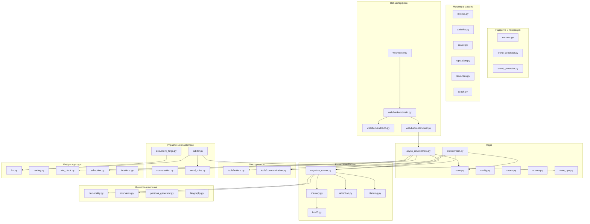
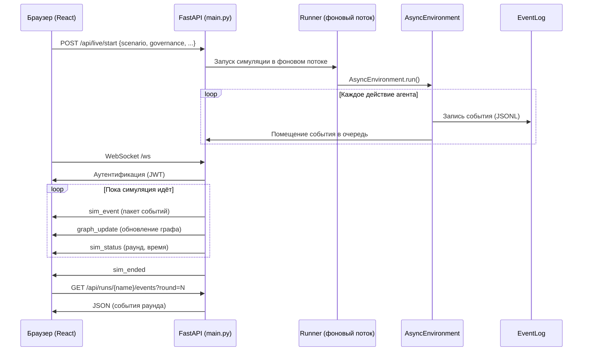

# Навигатор по архитектуре

Этот документ помогает ориентироваться в архитектуре MAGISTRY: карта модулей, указатель разделов [ARCHITECTURE.md](../ARCHITECTURE.md), объяснение двух сред исполнения и путь данных в веб-интерфейсе. Документ не дублирует содержание ARCHITECTURE.md, а указывает, куда читать.

## Карта модулей

## Указатель разделов ARCHITECTURE.md

| Хочу понять... | Раздел ARCHITECTURE.md |
|---|---|
| Зачем v3, что не так с v2 | 1. От симулятора закупок к протоколу бюрократии |
| Принцип предметной независимости | 2. Принцип: движок не знает, что такое тендер |
| Дело, предложение, полномочие, ресурс | 3. Четыре абстракции ядра |
| Почему нет конечных автоматов в коде | 4. Свободная модель делопроизводства |
| Как устроен раунд | 5. Устройство раунда |
| Какие инструменты у агентов | 6. Восемь инструментов |
| Что видит агент на каждом ходу | 7. Что видит агент: ситуационные сводки |
| Как формируется характер агента | 8. Агенты: характер и полномочия |
| Откуда берутся дела | 9. Потребности организации |
| Какие сценарии есть | 10. Сценарии как конфигурация |
| Чем G0 отличается от G3 | 11. Режимы управления G0–G3 |
| Как работает граф связей | 12. Социальный граф |
| Как устроена память агента | 13. Поток памяти |
| Когнитивный цикл, интервью | 14. Когнитивный агент (CognitiveAgentRunner) |
| Как оцениваются результаты | 15. Метрики |
| Сколько стоит прогон | 16. Управление затратами |
| Где что лежит в коде | 17. Структура проекта |
| Как обеспечить повторяемость | 18. Воспроизводимость |
| Какие проблемы известны | 19. Ограничения и риски |
| Как работает арбитр | 20. Арбитр свободных действий |
| Непрерывное время | 21. Асинхронная среда (AsyncEnvironment) |
| Многорепликовые диалоги | 22. Система тредов |
| Генерация документов ГОСТ | 23. DocumentForge |
| HEXACO, Dark Triad, архетипы | 24. Расширенная модель личности |
| Веб-интерфейс, API, WebSocket | 25. Веб-интерфейс |

## Две среды исполнения

Система поддерживает две среды, выбираемые через `--mode sync|async`. Обе используют один и тот же `CognitiveAgentRunner` для принятия решений агентами и один и тот же набор инструментов.

### Environment (синхронная, раундовая)

Раунд — дискретный шаг времени. В каждом раунде все агенты получают ход в случайном порядке. Подходит для детерминированных экспериментов, отладки, пакетных прогонов с фиксированным зерном. Реализация проще; все взаимодействия синхронны.

### AsyncEnvironment (асинхронная, непрерывное время)

Время моделируется через `SimClock` с точностью до секунды. Каждое действие имеет длительность (открытие дела — дольше, чем отправка сообщения). `Scheduler` (приоритетная очередь на `heapq`) планирует пробуждения агентов. `WorkSchedule` переносит пробуждения на рабочие часы (Пн–Пт, 9:00–18:00; праздники учитываются). Поддерживается параллельная обработка нескольких агентов через `ThreadPoolExecutor`.

Асинхронная среда обеспечивает большую реалистичность: действия занимают время, агенты могут пробуждаться одновременно, а рабочий график исключает нереалистичные ситуации вроде ночных переговоров. Эта среда используется для «живых» симуляций через веб-интерфейс.

## Путь данных в веб-интерфейсе

Браузер подключается по WebSocket после аутентификации. Сервер пакетирует события (по `MAGISTRY_WS_EVENT_BATCH_SIZE` штук каждые `MAGISTRY_WS_EVENT_BATCH_INTERVAL_S` секунд) и троттлит обновления графа (не чаще `MAGISTRY_LIVE_GRAPH_THROTTLE_S`). Это предотвращает перегрузку клиента при интенсивных симуляциях.

При подключении к уже идущей симуляции клиент получает буфер последних `MAGISTRY_LIVE_HISTORY_EVENTS` событий, что позволяет увидеть контекст без полной перезагрузки.
