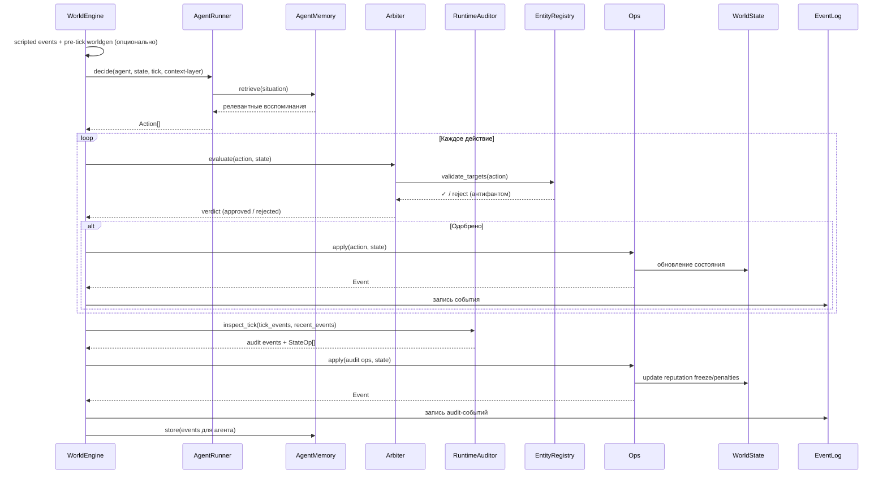
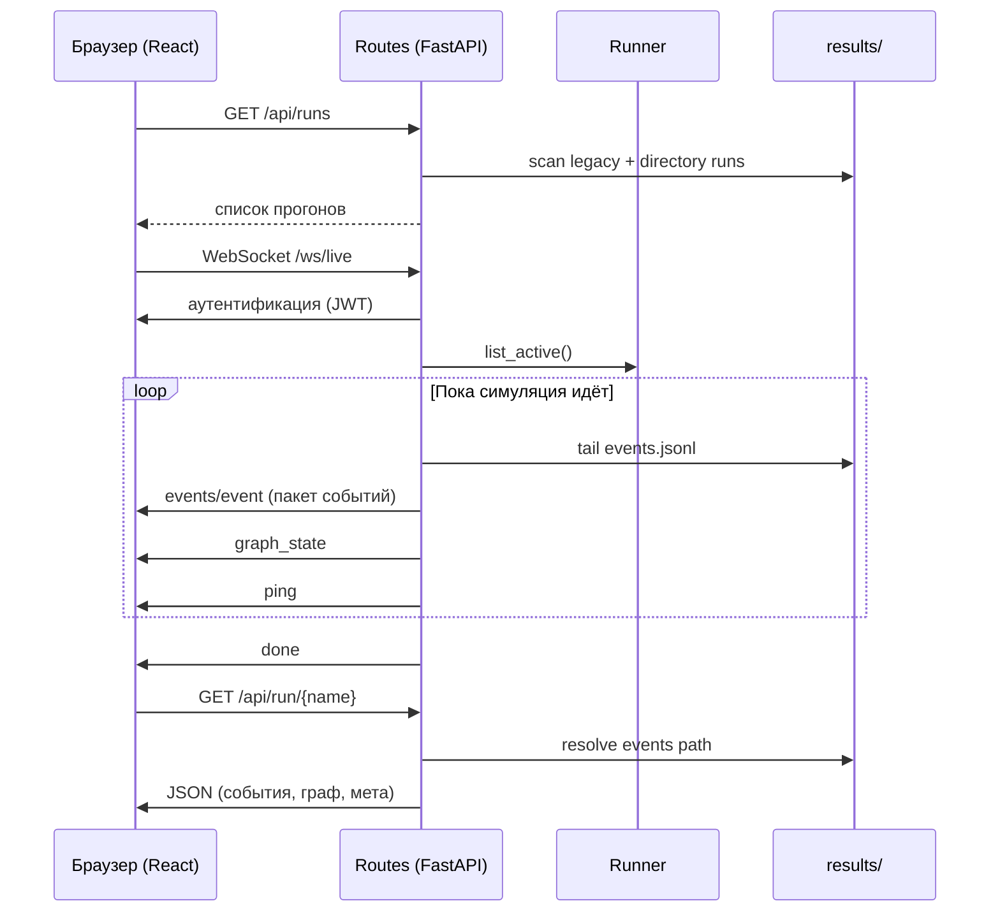

# Навигатор по архитектуре

Этот документ помогает ориентироваться в архитектуре MAGISTRY: карта модулей, зависимости между ними и путь данных в веб-интерфейсе. Документ не дублирует содержание кода, а указывает, куда читать.

## Карта модулей

```mermaid
graph TB
    subgraph Ядро["Ядро движка"]
        ENGINE[engine.py<br/>WorldEngine]
        STATE[state.py<br/>WorldState]
        CONFIG[config.py<br/>ScenarioConfig]
        IDS[ids.py<br/>TypedId, EntityKind]
        ENTITIES[entities.py<br/>EntityRegistry]
        IDALLOC[id_alloc.py<br/>IdAllocator]
        OPS[ops.py<br/>StateOp → Event]
    end

    subgraph Агент["Агент"]
        AGENT[agent.py<br/>AgentRunner]
        MEMORY[memory.py<br/>AgentMemory]
        ACTIONS[actions.py<br/>Action + spawn_agent + perform]
        PERSONA[persona.py<br/>PersonaArtifact + SocialGraphExtractor]
        BM25[bm25.py<br/>BM25]
    end

    subgraph Управление["Управление и арбитраж"]
        ARBITER[arbiter.py<br/>HybridArbiter]
        AUDITOR[auditor.py<br/>RuntimeAuditor]
        JOURNAL[journal.py<br/>YAMLJournal]
        DAO[dao.py<br/>DAO vote + policy]
    end

    subgraph Генерация["Генерация мира"]
        WORLDGEN[worldgen.py<br/>WorldGenerator]
        COMPOSER[composer.py<br/>WorldComposer]
        ORACLE[oracle.py<br/>ViolationOracle + FreeformTruthRecorder]
        TRUTH[truth.py<br/>TruthDetector + TruthLog]
        EVAL[evaluation.py<br/>EvaluationSummary]
        FID[fidelity.py<br/>FidelitySummary]
    end

    subgraph LLM["LLM-подсистема (llm/)"]
        PROTOCOLS[protocols.py<br/>LLMProvider]
        PROVIDERS[providers.py<br/>OpenAI + Mock]
        EMBEDDINGS[embeddings.py<br/>EmbeddingProvider]
        CACHE[llm/cache.py<br/>LLMCache]
        CALLER[caller.py<br/>LLMCaller]
    end

    subgraph Инфраструктура["Инфраструктура"]
        EVENTS[events.py<br/>EventLog JSONL]
        TRACING[tracing.py<br/>TraceLog JSONL]
        SCENARIO[scenario.py<br/>load/save YAML]
        GRAPHS[graphs.py<br/>LangGraph]
        CLI[cli.py<br/>magistry-lc]
    end

    subgraph Веб["Веб-интерфейс"]
        MAIN[web/backend/main.py]
        ROUTES[web/backend/routes/]
        AUTH[web/backend/auth.py]
        RUNNER[web/backend/runner.py]
        FRONT[web/frontend/]
    end

    ENGINE --> STATE
    ENGINE --> AGENT
    ENGINE --> ARBITER
    ENGINE --> AUDITOR
    ENGINE --> OPS
    ENGINE --> EVENTS
    ENGINE --> WORLDGEN

    AGENT --> MEMORY
    AGENT --> ACTIONS
    AGENT --> PERSONA
    MEMORY --> BM25
    MEMORY --> EMBEDDINGS

    ARBITER --> JOURNAL
    ARBITER --> ENTITIES
    ARBITER --> CALLER
    AUDITOR --> OPS
    AUDITOR --> EVENTS
    AUDITOR --> CALLER

    DAO --> OPS
    DAO --> STATE

    COMPOSER --> CALLER
    ORACLE --> CALLER
    ENGINE --> TRUTH
    ENGINE --> EVAL
    ENGINE --> FID

    CALLER --> PROVIDERS
    CALLER --> TRACING
    PROVIDERS --> PROTOCOLS

    CLI --> ENGINE
    CLI --> COMPOSER
    CLI --> ORACLE

    RUNNER --> ENGINE
    MAIN --> AUTH
    MAIN --> ROUTES
    MAIN --> RUNNER
    FRONT --> MAIN
```

## Указатель модулей

| Хочу понять... | Где читать |
|---|---|
| Как устроен тик симуляции | `engine.py` → `WorldEngine.run()`; обрати внимание на environment init/snapshot + scripted events + pre/post worldgen |
| Как агент принимает решение | `agent.py` → `AgentRunner`, `memory.py` → гибридный retrieval |
| Какие действия доступны агенту | `actions.py` → structured actions, `spawn_agent`, `perform` |
| Как арбитр проверяет действия | `arbiter.py` → полномочия + антифантомы + LLM-perform |
| Как runtime-аудитор выявляет сигналы риска | `auditor.py` → LLM-first detection + deterministic actuator + collegial review |
| Как работает YAML-журнал | `journal.py` → инкрементальная сводка мира для арбитра, включая environment-layer |
| Как устроено DAO-голосование | `dao.py` → кворум, порог, закрытие голосования |
| Типизированные ID и антифантомы | `ids.py` + `entities.py` → `EntityRegistry` |
| Детерминированный apply | `ops.py` → `StateOp` преобразуется в `Event` |
| Как генерируется сценарий через LLM | `composer.py` → `WorldComposer.compose()` |
| Как работает генератор мира | `worldgen.py` → pre/post tick worldgen, external events, `agent_daily_context`, `scene_hooks`, spawn suggestions, `environment_updates` и safe environment snapshot без приватных утечек |
| Как пишется truth-layer | `truth.py` → deterministic truth records в `truth.jsonl` |
| Как считается post-hoc evaluation | `evaluation.py` → precision/recall runtime-аудита vs truth |
| Как считаются fidelity-метрики | `fidelity.py` → temporal/identity/phantom/bureaucratic sidecar |
| Как оракул и freeform truth анализируют нарушения | `oracle.py` → `ViolationOracle` + `FreeformTruthRecorder` |
| Как устроена память агента | `memory.py` → working buffer + long-term hybrid index |
| Как работает гибридный поиск | `memory.py` (retrieval) + `bm25.py` (лексический) + `embeddings.py` (векторный) |
| Как устроены LLM-провайдеры | `llm/providers.py` → `OpenAICompatibleProvider`, `MockLLMProvider` |
| Как устроен конфиг сценария | `config.py` → `ScenarioConfig` (Pydantic), включая `world.environment` |
| Как загружается/сохраняется сценарий | `scenario.py` → YAML/JSON |
| Как устроена личность агента и социальный граф | `persona.py` → `PersonaArtifact`, `PersonaGenerator`, `SocialGraphExtractor` (родня/друзья/зависимости в приоритете), expert reflection |
| Как работает LangGraph-интеграция | `graphs.py` → tick graph + SqliteSaver checkpoints |
| Как работает CLI | `cli.py` → `run`, `compose`, `oracle` |

## Путь данных: тик симуляции

## Путь данных: веб-интерфейс

Браузер подключается по WebSocket после аутентификации. Сервер пакетирует события (по `MAGISTRY_WS_EVENT_BATCH_SIZE` штук каждые `MAGISTRY_WS_EVENT_BATCH_INTERVAL_S` секунд) и троттлит обновления графа (не чаще `MAGISTRY_LIVE_GRAPH_THROTTLE_S`). При подключении к уже идущей симуляции клиент получает буфер последних `MAGISTRY_LIVE_HISTORY_EVENTS` событий.
