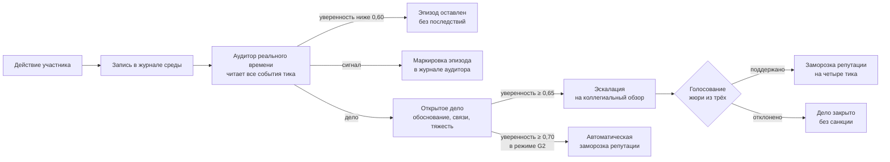
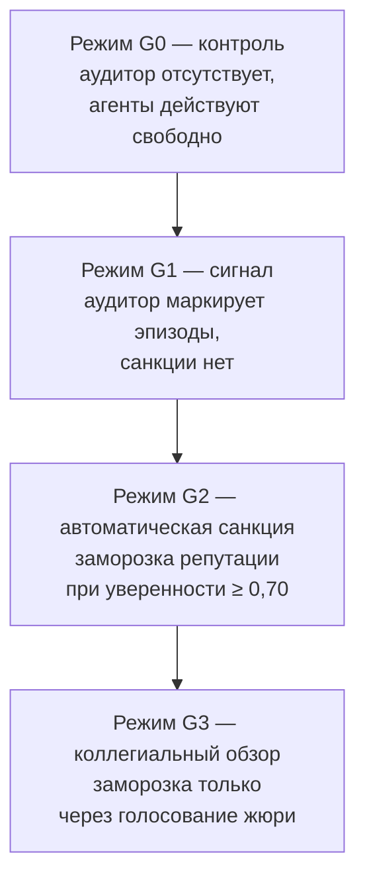

# Глава 3. Реализация платформы и эмпирическое исследование поведения многоагентной модели

## Введение к главе

В предшествующих главах был очерчен теоретический контур задачи. В первой главе обоснована постановка проблемы: классические инструменты антикоррупционного контроля в государственных закупках работают по запросу — после жалобы, проверки или внешней публикации, — и оказываются эффективными лишь в той части случаев, где нарушение успело оставить следы. Вторая глава излагала концептуальные основания платформы как инструмента опережающего наблюдения и обосновывала выбор многоагентного моделирования на больших языковых моделях рассуждающего класса в качестве методологической основы исследования.

Третья глава, в свою очередь, переходит от теоретических положений к их инженерному воплощению и эмпирической проверке. Она отвечает сразу на два связанных вопроса. Первый — методологический: как именно устроена платформа, какие проектные решения положены в её основу и какими соображениями эти решения мотивированы. Второй — эмпирический: способен ли управленческий контур, выстроенный как сочетание аудита реального времени, выявления нарушений и коллегиального обзора, изменить поведение агентов в условиях, провоцирующих неформальное согласование интересов?

Композиция главы соответствует этой двухчастной задаче. Первый раздел детально рассматривает реализацию платформы и принятые проектные решения — от выбора класса моделей до организации жизненного цикла дел и устройства коллегиального обзора. Этот раздел излагает технические основания работы на доступном уровне, без программных подробностей, но с такой полнотой, чтобы читатель мог самостоятельно судить о соразмерности выбранных решений поставленным задачам. Второй раздел описывает постановку эмпирического эксперимента: используемый сценарий, состав действующих лиц и четыре управленческих режима как методику контролируемого сравнения. Третий, четвёртый и пятый разделы посвящены качественному анализу прогонов: первому срабатыванию аудитора и характерному парадоксу осторожности наблюдателя с полномочиями; спирали обнаружения вокруг центральной коррупционной завязки; трём голосованиям коллегиального жюри, состоявшимся в режиме G3. Шестой раздел рассматривает тени и границы инструмента — сорванные рассуждения, неожиданный эффект разрастания межграничных контактов, ограничения горизонта эксперимента. Седьмой раздел собирает результаты в единый смысловой узел и формулирует содержательный итог главы.

Текстовая ткань разделов с третьего по седьмой существенно отличается от первых двух: там ведущим жанром становится прочтение внутренних монологов действующих лиц как профессиональной рефлексии, а количественные показатели работают как подкрепление, а не самоцель. Это сознательный композиционный выбор, отражающий двойственную природу третьей главы как одновременно методологического описания инженерной системы и качественного социального исследования поведения её участников.

## §1. Реализация платформы и принятые решения

Настоящий раздел излагает устройство платформы как набор проектных решений, каждое из которых будет необходимо для понимания дальнейших разделов главы. Изложение ведётся на доступном уровне, без программных подробностей, но с явной фиксацией мотивов: для каждого ключевого решения называется альтернатива, которую отвергли, и причина отказа от неё. Такой формат выбран сознательно — он позволяет читателю оценить не только что было сделано, но и почему именно так, а не иначе.

### От задачи к подходу

Задача опережающего антикоррупционного контроля, поставленная в первой главе, обладает существенной особенностью, которая заметно ограничивает применимость традиционных инструментов. Классические средства выявления нарушений в государственных закупках — алгоритмический анализ финансовых потоков, графовое моделирование связей участников, текстовый поиск по корпусу публичных документов — работают на материале, который по природе вещей становится доступен лишь после того, как нарушение свершилось. Финансовый поток фиксируется в банковских выписках после оплаты, связь участников проявляется в общих собственниках после регистрации сделки, текст конкурсной документации формируется в финальной редакции после согласования. Опережающий контроль в строгом смысле требует наблюдения за процессами, ещё не оставившими формальных следов, — за приватной перепиской, неформальными встречами, внутренними рассуждениями участников. В реальной службе такие процессы недоступны для исследовательского наблюдения по очевидным правовым и этическим причинам.

Из этой особенности задачи возникает естественный методологический выбор. Если реальные процессы наблюдать невозможно, то единственный инструмент, способный дать содержательное приближение к ним, — это симуляция. Многоагентная модель, в которой действующие лица представлены инструментами, способными воспроизводить правдоподобную человеческую речь и реалистичные мотивации, открывает доступ к тому, что в реальной службе остаётся непроницаемым: к приватным переговорам, к внутренним рассуждениям, к стратегическим колебаниям. Главный ограничитель такого подхода — принципиальная невозможность утверждать, что наблюдаемое в симуляции тождественно реальному; главное преимущество — возможность увидеть феномены, которые иначе остались бы умозрительными.

Этот ход рассуждения определяет содержание всей дальнейшей платформы: она задумана не как инструмент квалификации реальных нарушений, а как инструмент исследования их потенциала. Соответственно, все проектные решения, описываемые ниже, подчинены задаче обеспечить максимальную правдоподобность модельной среды и максимальную содержательность наблюдаемого в ней поведения.

### От языковой модели к рассуждающей

Вторым ключевым решением стал выбор класса моделей, представляющих действующих лиц. Современные большие языковые модели делятся на два больших семейства. Классические модели формируют ответ за один проход — получают запрос, генерируют последовательность токенов и возвращают результат. Рассуждающие модели — отдельный класс, специально обученный на длинных цепочках мысли — между запросом и ответом дополнительно прорабатывают последовательность внутренних соображений: выбирают версии, отбрасывают неудачные, проверяют свои выводы, фиксируют сомнения. Эта внутренняя цепочка в обычной практике остаётся служебной и скрытой от собеседника; рассуждающие модели возвращают её отдельным служебным полем рядом с финальным ответом.

Для нашей задачи различие между двумя классами оказалось решающим. Чтобы материал, наблюдаемый в симуляции, был содержательно интересен для исследования профессиональной этики, психологии служащего и динамики коллегиальных решений, недостаточно наблюдать только финальные реплики действующих лиц. Финальная реплика — это то, что в реальной службе принято называть «официальной позицией»: она адаптирована под аудиторию, проверена на риски, лишена эмоционального и сомневающегося пласта. Подлинно ценная для исследования материя — это то, что предшествует финальной реплике: внутреннее колебание, перебор аргументов, признание собственного конфликта интересов, фиксация ситуативной оценки. В реальной службе этот пласт принципиально недоступен; в среде, использующей рассуждающие модели, он сохраняется в служебном журнале и становится прямым материалом для анализа.

Альтернативой выбранному решению могла быть классическая модель с дополнительной инструкцией «опишите ход своих рассуждений перед тем, как дать ответ». Такой подход технически проще, не требует моделей рассуждающего класса, и формально даёт ту же структуру — рассуждение плюс ответ. Однако содержательно он принципиально отличается. Классическая модель, дополненная такой инструкцией, генерирует имитацию рассуждения — текст, который выглядит как рассуждение, но не отражает реальных операций модели по подготовке ответа. Рассуждающая модель, напротив, прошла отдельную фазу обучения именно на цепочках мысли, и её внутренний монолог отражает действительный процесс выработки ответа. Для целей третьей главы — где внутренний монолог становится главным материалом анализа — это различие становится решающим, и потому выбор был сделан в пользу рассуждающих моделей.

### Время в модельном мире

Следующее проектное решение касается организации модельного времени. Здесь рассматривались три альтернативы: непрерывное время с асинхронными событиями; событийно-ориентированная модель, в которой время возникает только в моменты значимых действий; дискретные тики фиксированной длительности. Был выбран третий вариант — дискретный тик длительностью в один календарный день. Мотивация выбора троякая.

Во-первых, дискретный тик радикально упрощает воспроизводимость. В асинхронной модели тонкие различия в порядке событий могут давать существенно разные траектории, и сравнивать прогоны между собой становится затруднительно. В дискретной модели весь поток событий внутри тика обрабатывается синхронно, и потому два прогона с одинаковыми начальными условиями могут различаться только за счёт стохастичности самих языковых моделей, но не за счёт случайностей планирования. Во-вторых, дискретный тик упрощает работу аудитора. В реальной службе внутренний контролёр редко работает в режиме непрерывного потока; он работает в дневном или недельном цикле, накапливая события за период и формируя сводное суждение. Дневной тик соответствует именно этому ритму. В-третьих, дискретный тик упрощает анализ результатов. Каждый эпизод в журнале событий имеет однозначный временной маркер, и говорить о «третьем тике» столь же удобно, как о «третьем дне».

Длительность тика — один календарный день — выбрана как соответствующая ритму рутинной муниципальной работы. На этом масштабе появляются все типичные единицы профессиональной деятельности: отправка приватного сообщения, согласование документа, инициирование совещания, публичное заявление. Более короткий тик (например, час) дробил бы единое деловое действие на фрагменты; более длинный (например, неделя) объединял бы в одну единицу события, которые в реальности разворачиваются последовательно.

Полный горизонт эксперимента — шестнадцать тиков — выбран как разумный компромисс между двумя соображениями. С одной стороны, шестнадцать модельных дней — это полный сценарный цикл подготовки и проведения тендерной процедуры от формирования технического задания до итогового заседания. С другой — дальнейшее увеличение горизонта существенно повышает время и стоимость прогонов, не давая пропорционального содержательного выигрыша. Шестнадцать тиков обеспечивают достаточно событий для разворачивания всех элементов управленческого контура — сигналов, дел, эскалаций, голосований — и при этом удерживают совокупный бюджет четырёх параллельных прогонов в разумных пределах.

### Действующее лицо

Каждый из участников модельной среды реализован как обращение к большой языковой модели рассуждающего класса. На каждом тике агент получает обновлённое восприятие мира — список новых сообщений, доступных ему по адресу или каналу, изменения в статусе работ и контрактов, видимые ему действия других участников — и формирует ответ, состоящий из внутреннего монолога и одного или нескольких действий. Действия проходят через арбитра — процедурную проверку, не связанную с управленческим контуром: арбитр устанавливает, выполнимо ли действие в текущем состоянии мира (существует ли получатель сообщения, есть ли у инициатора право внести запись в чужой документ, не противоречит ли действие физическим возможностям сценария). Допустимые действия применяются к среде, недопустимые — отклоняются с фиксацией причины.

Существенным элементом действующего лица является персональное досье — описание биографии, набора ценностей, мотивов, ограничений, известных персональных связей и роли в сценарии. Досье формируется до начала первого тика и остаётся неизменным на протяжении всего прогона. Это решение принципиально для возможности контролируемого сравнения между управленческими режимами: чтобы разница в поведении одного и того же действующего лица между режимами G0 и G3 могла интерпретироваться как эффект режима, его персональные характеристики должны быть идентичными.

Альтернативой могла быть схема с динамическим формированием характера в процессе прогона — когда биография агента возникает из его собственных действий по ходу симуляции. Такая схема даёт более «живых» персонажей, но делает сравнение между режимами невозможным: одна и та же исходная конфигурация в одном режиме породит одного героя, в другом — слегка иного, и любое наблюдаемое различие в поведении будет невозможно отнести однозначно либо к режиму, либо к персональным изменениям. Поэтому был выбран зафиксированный формат досье: каждое действующее лицо описано до начала эксперимента, и это описание идентично применяется ко всем четырём прогонам серии.

Ещё одно решение, заслуживающее упоминания, касается долгосрочной памяти. В нашей конфигурации действующие лица не имеют устойчивой памяти между прогонами; внутри одного прогона действующее лицо имеет доступ к истории своих собственных действий, истории сообщений в открытых каналах и истории своих приватных сообщений, но не к содержанию приватных сообщений других участников. Это ограничение совпадает с реальностью муниципальной работы — никто из служащих не имеет доступа к чужой переписке без специальных полномочий — и одновременно создаёт необходимую информационную асимметрию между участниками и аудитором.

### Невидимый наблюдатель: почему именно так

Аудитор реального времени, появляющийся в среде в режимах G1, G2 и G3, представляет собой ключевое и наиболее сложное проектное решение. Он не участвует в действиях, не отправляет сообщений, не имеет полномочий распоряжаться, но имеет полный обзор журнала событий каждого тика. Если действующее лицо видит только то, что адресовано ему лично или опубликовано в общем канале, аудитор видит всё: и приватные сообщения, и записи в рабочих журналах, и факты внутренних совещаний.

Здесь требовалось принять отдельное решение о глубине наблюдения. Первоначально рассматривалась возможность дать аудитору полный доступ ко всей внутренней информации — включая содержание приватных сообщений и внутренние монологи действующих лиц. От этого варианта отказались по двум причинам. Первая — реалистичность: в реальной службе внутренний аудитор не имеет права читать чужую переписку без специального процессуального основания, и наделение модельного аудитора такими полномочиями делало бы исследование принципиально неприменимым к реальным условиям. Вторая — методологическая: если аудитор видит всё, ему достаточно прочитать содержание приватного сообщения, чтобы вынести квалификацию, и интересный исследовательский феномен — обнаружение паттерна по метаданным — исчезает.

В итоговой архитектуре аудитор имеет доступ к фактам отправки приватных сообщений (отправитель, адресат, время, тема, длина), но не к их содержанию. Содержание он видит только в открытых каналах: публичные объявления, общедоступные рабочие записи, протоколы заседаний. Эта асимметрия делает аудитора похожим на следователя, работающего в режиме раннего предупреждения — он не предъявляет содержательных доказательств, он маркирует подозрительные паттерны взаимодействий и поднимает вопросы, опираясь на сочетание метаданных.

Сама квалификация подозрительных эпизодов отдана не правилам, а той же модели рассуждающего класса. Это ещё одно решение, заслуживающее обоснования. Альтернативой могло бы стать детерминированное правило вида «если число приватных контактов между двумя участниками за окно из пяти тиков превышает четыре, открывается дело о координации». Правило технически проще, полностью прозрачно для контроля и воспроизводимо. Но оно фундаментально не справляется с задачами, которые мы хотим решать: реальный аудитор не классифицирует механически, он опирается на профессиональную интуицию, учитывает контекст, делает поправки на роли и обстоятельства. Чтобы наш аудитор был способен производить аналогичные суждения, он должен обладать тем же инструментом, что и сами действующие лица, — рассуждающей моделью с собственным внутренним монологом. Такое решение увеличивает стоимость и неопределённость работы аудитора, но даёт несоизмеримо большее содержательное наполнение.

### Степень уверенности и пороги

Поскольку аудитор реализован как модель рассуждающего класса, естественной формой его суждения является не бинарная классификация «нарушение / не нарушение», а оценка с явной степенью уверенности. По каждому потенциально подозрительному эпизоду аудитор формулирует обоснование, привязанное к конкретным событиям-доказательствам, и присваивает суждению значение от нуля до единицы. Это значение становится ключевым параметром, через который суждение аудитора связывается с действиями управленческого контура.

В нашей конфигурации заданы три порога, разграничивающих четыре возможных реакции. Ниже значения 0,60 аудитор оставляет эпизод без последствий — наблюдение слишком слабое или укладывается в нормальное профессиональное взаимодействие. Между 0,60 и 0,65 эпизод переводится в дело: фиксируется в отдельной карточке с обоснованием, типом нарушения, перечнем связанных событий. Между 0,65 и 0,70 дело переводится на коллегиальный обзор. При значении 0,70 и выше в режиме G2 наступает автоматическая заморозка репутации без обсуждения; в режиме G3 даже это значение не запускает санкцию автоматически — оно лишь усиливает маршрут эскалации.

Конкретные значения порогов — 0,60, 0,65 и 0,70 — выбраны эмпирически в ходе пилотных запусков платформы. Опыт пилотов показал, что более низкие пороги превращают аудитора в источник постоянного шума: каждый второй приватный контакт получает аудиторский сигнал, и сама ценность сигнала размывается. Более высокие пороги, напротив, делают аудитора чрезмерно осторожным: реальные нарушения проходят мимо его внимания. Выбранные значения создают рабочую градацию: слабые сигналы свободно накапливаются, средние формируют дела, сильные — эскалируются. Существенно, что разрыв между порогами невелик: всего пять процентных пунктов между «открыть дело» и «эскалировать», и ещё пять — между «эскалировать» и «применить автоматическую санкцию». Это устроено так специально: эскалация не должна быть редким событием, иначе коллегиальный обзор не получает возможности отработать достаточное число случаев в одном прогоне.

### Жизненный цикл подозрения

Поток событий, который аудитор переводит из «факта в журнале» в «решение управленческого контура», представлен на следующей схеме. Она иллюстрирует логику движения подозрения через все четыре режима и фиксирует ключевые точки выбора.

Коллегиальный обзор — единственная процедура управленческого контура, где решение принимается не аудитором, а выборкой из самих внутренних участников. На каждое эскалированное дело составляется жюри из трёх членов, отобранных детерминированно из числа внутренних агентов с правом голоса; из числа потенциальных голосующих исключаются субъект дела и его непосредственные партнёры по эпизоду. Каждому члену жюри подаётся карточка с описанием дела, формулируется вопрос вида «следует ли применить заморозку репутационного роста к субъекту в связи с обнаруженным нарушением?», и предоставляется три варианта голоса: «да», «нет», «воздержаться». Голосование длится фиксированное число тиков; по истечении срока подсчитываются голоса. Решение «поддержано» принимается, если кворум собран и доля голосов «да» от поданных «да» и «нет» превышает половину. В нашей конфигурации кворум — одна треть, порог поддержки — половина; жюри состоит из трёх членов, и для прохождения санкции требуется минимум два голоса «да» при условии, что хотя бы двое участников проголосовали по существу.

Размер жюри — три члена — выбран как минимально допустимый для коллегиального решения, в котором возможен раскол. Двух членов недостаточно: они либо согласны (и тогда коллегия теряет смысл — то же решение мог бы принять один аудитор), либо несогласны (и тогда нет механизма разрешения спора). Трое — минимум для устойчивого большинства. Большее число членов принципиально допустимо и в реальной службе встречается чаще, но в модельной среде увеличение жюри удорожает каждое голосование пропорционально числу участников; на текущем масштабе три члена представляются разумным компромиссом.

### Заморозка репутации как санкция

Управленческому контуру в нашей конфигурации доступна одна-единственная санкция — заморозка репутации участника на установленный срок. Это намеренно ограниченный выбор. В реальной службе спектр санкций широк: от устного замечания до увольнения и передачи материалов в прокуратуру. В модельной среде моделирование такого спектра потребовало бы существенно более сложной архитектуры — с уровнями тяжести, с правом обжалования, с разной правовой природой санкций. Заморозка репутации — это сознательное упрощение, выбранное как самый базовый случай: коллегия признаёт необходимость дополнительного внимания к участнику и фиксирует это публично.

Содержательно заморозка репутации означает две вещи. Во-первых, она ограничивает рост репутационного очка участника на установленный срок (в нашей конфигурации — четыре тика) и тем самым создаёт устойчивое последствие, выходящее за рамки одного тика. Во-вторых, она представляет собой видимое для всей среды клеймо, фиксирующее, что коллегия признала необходимость публичного предупреждения. Заморозка не означает увольнения, штрафа или формального обвинения; она означает временное снижение веса голоса в системе и публичное предупреждение.

Различие между режимами G1, G2 и G3 в части заморозки таково. В G1 заморозка не предусмотрена ни при каких обстоятельствах: аудитор может фиксировать сколько угодно сигналов и открывать сколько угодно дел, но управленческого последствия за этим не следует. В G2 заморозка наступает автоматически, как только степень уверенности аудитора превышает порог 0,70; никакого обсуждения не происходит. В G3 заморозка возможна только через коллегиальный обзор: аудитор может эскалировать дело, и только при положительном решении жюри санкция применяется.

### Иерархия режимов и контролируемое сравнение

Четыре режима эксперимента образуют возрастающую последовательность управленческого вмешательства и составляют основу методологического подхода главы.

Логика этого расположения подчинена одному принципу: каждый последующий режим включает все элементы предыдущего и добавляет ровно один новый элемент. G0 — это базовая среда без управленческого контура. G1 добавляет наблюдателя без полномочий. G2 — наделяет наблюдателя правом автоматической санкции. G3 — заменяет автоматическую санкцию коллегиальной процедурой. Такое ступенчатое усложнение позволяет в принципе изолировать вклад каждого элемента: разница между G0 и G1 показывает эффект самого факта наблюдения; разница между G1 и G2 — эффект автоматической санкции; разница между G2 и G3 — эффект введения коллегиальной процедуры.

В реальном эксперименте такая чистая изоляция оказывается затруднительной из-за стохастичности языковых моделей: одни и те же исходные условия в двух прогонах дают слегка разные траектории, и не всякое наблюдаемое различие между режимами можно однозначно отнести именно к режиму, а не к стохастической вариации. Это ограничение мы вынуждены принять и явно формулируем в §6, посвящённом теням и границам инструмента; здесь же важно зафиксировать, что сама структура четырёх режимов как ступенчатого усложнения остаётся методологически разумной.

### Воспроизводимость и измерение успеха

Чтобы сравнение между четырьмя режимами было содержательным, эксперимент потребовал двух условий устойчивости. Первое — единообразие действующих лиц: персональные досье всех двадцати участников зафиксированы до начала первого прогона и идентично применяются ко всем четырём режимам. Без этого условия любая разница в поведении между G0 и G3 могла бы объясняться разными биографиями, а не разной средой. Второе — единообразие сценария: одна и та же исходная конфигурация мира (бюджет, сроки, состав конкурсной документации) применяется ко всем четырём прогонам. Различие между прогонами касается исключительно настроек управленческого контура.

Стохастичность языковых моделей, однако, не позволяет говорить о полной детерминированности. Один и тот же агент в одной и той же ситуации в разных прогонах может выбрать слегка разные слова. Это эффект, родственный человеческой непредсказуемости: один и тот же чиновник в одной и той же ситуации в разные дни может выразиться по-разному. Поэтому ground-truth — список нарушений, которые были фактически совершены агентами, — будет несколько отличаться между прогонами. В режиме G0 за шестнадцать тиков было совершено три фактических нарушения, в G1 — три, в G2 — два, в G3 — пять. Это различие не является методологической слабостью; напротив, именно оно позволяет говорить о том, что управленческий контур меняет не только реакцию системы, но и саму ткань поведения агентов.

Измерение успеха управленческого контура в нашей работе строится на трёх уровнях. Первый — техническая полнота обнаружения: для каждого из режимов с аудитором сопоставляется список фактических нарушений и список сигналов аудитора по тому же субъекту; полнота показывает, какую долю фактических нарушений аудитор успел обозначить вовремя. Второй уровень — точность кейсообразования: какая доля открытых дел соответствует реальному нарушению, а какая — ложному срабатыванию. Третий, и для этой главы самый важный, — поведенческий: меняется ли вообще поведение агентов в зависимости от режима, и если да, то в каком направлении. Первые два уровня дают необходимый минимум для оценки инструмента; третий — содержательный ответ на главный вопрос работы.

### Эволюция платформы

Описанная конфигурация — итог нескольких пилотных серий, в каждой из которых обнаруживались собственные проблемы и предлагались собственные решения. Воспроизводить здесь полную хронику этих пилотов нецелесообразно — она увела бы изложение в инженерные подробности, — но три ключевых поворота заслуживают упоминания, поскольку именно они определили те решения, которые читатель видит в финальной форме.

Первый поворот касался работы аудитора с пограничными случаями. В ранних пилотах модель аудитора нередко возвращала суждения, в которых субъект и объект подозрения совпадали — то есть формально предъявляла «нарушение, в котором участник нарушает сам с собой». Это был артефакт работы модели с пустыми или неоднозначными полями вывода: при отсутствии явного объекта она по умолчанию возвращала субъекта. Решение состояло в добавлении явной проверки на этапе постобработки суждения и переопределении объекта по доказательной базе либо отбрасывании суждения, если объекта нельзя установить. После этой правки доля «самоадресованных» сигналов снизилась до нуля во всех режимах с аудитором.

Второй поворот касался сохранения внутреннего монолога. В ранних пилотах внутренний монолог рассуждающей модели не сохранялся в журналах среды — оставались только финальные ответы. Это лишало нас главного материала для качественного анализа. Решение состояло в специальной модификации обвёртки модели, которая теперь фиксирует и сохраняет служебное поле с цепочкой рассуждений; именно благодаря этому решению все цитаты из внутреннего монолога, на которые опирается дальнейшая часть главы, оказались доступны для исследования.

Третий поворот касался устойчивости длинных прогонов. В ходе последнего пилота программная среда испытала прерывание из-за внешней перезагрузки операционной системы; прогон оборвался на тринадцатом тике из двадцати запланированных. Анализ незавершённого прогона показал, что качественный материал на этом горизонте уже достаточен для исследовательских целей, и финальная серия была сокращена до шестнадцати тиков. Сокращение позволило также выполнять четыре режима параллельно, что было невозможно при первоначальной длительности.

Эти три поворота показывают характерную особенность работы с системами, опирающимися на большие языковые модели: на каждом этапе обнаруживаются специфические особенности поведения моделей, требующие либо специальной обработки, либо корректировки методологии, либо перестройки инфраструктуры. Финальная конфигурация платформы, описанная в настоящем разделе, представляет собой результат прохождения через эту последовательность поправок и потому является не теоретическим идеалом, а инженерно отработанным компромиссом между желаемым и достижимым.

## §2. Постановка эксперимента

### Сценарий

В основе сценария лежит ситуация, типичная для российской муниципальной практики. Администрация городского района Заречного проводит конкурс на капитальный ремонт двух школ с расчётом завершить работы к началу нового учебного года. Бюджет ремонта сжат, сроки давят, общественное внимание возрастает по мере приближения к лету, профильные ведомства одновременно требуют формального соответствия процедурам и фактического результата на месте. Сценарий не моделирует отдельный эмпирический случай и не воспроизводит конкретный кейс из практики; его задача — собрать в одной модельной среде типовые узлы напряжения, которые в реальной муниципальной системе обыкновенно распределены по десяткам разных дел и потому ускользают от единого взгляда.

Сценарий закладывает три структурных свойства среды. Во-первых, поверх формальной процедуры закупки проложена сеть неформальных связей, известная только некоторым участникам. Во-вторых, сразу несколько внутренних агентов имеют ролевые мотивы голосовать на тендере по содержательным основаниям, не сводимым к закону. В-третьих, в среде присутствует внешний наблюдатель, способный сообщить наружу о любой замеченной асимметрии, — журналист местного издания. Каждое из этих свойств по отдельности типично; их одновременное присутствие создаёт ту плотность ожиданий и проверок, в которой приватная договорённость двух человек становится существенным событием.

Действующих лиц в среде ровно двадцать. Двенадцать из них представляют администрацию района и являются внутренними агентами в смысле модели — на их поведение распространяется учёт репутации, и они наделены правом голоса в процедурах коллегиального обзора. Восемь — внешние участники: три подрядчика, два субподрядчика, независимый эксперт-оценщик, журналист и представитель общественного совета. Различение «внутренний-внешний» в работе модели важно потому, что приватный контакт между двумя внутренними агентами квалифицируется иначе, чем приватный контакт через границу: первый предполагается обыденной частью работы органа, второй — потенциальный эпизод координации с заинтересованным лицом.

### Действующие лица: краткие портреты

Состав действующих лиц подобран так, чтобы покрыть всю организационную ткань муниципальной закупочной процедуры — от первого лица администрации до низового специалиста. Полные биографические описания всех двадцати участников вынесены в приложение А; здесь приводятся короткие портреты, достаточные для понимания дальнейшей содержательной части.

Из числа внутренних служащих ключевыми для развития сюжета окажутся четверо. Глава администрации Громов В. И. — опытный политический игрок, для которого управленческий приоритет — стабильность и контроль. Заместитель главы по экономике Марченко Т. Л. — жёсткий прагматик, склонный терпеть серые зоны при условии отсутствия публичного шума. Начальник отдела закупок Волков А. С. — главная фигура коррупционной завязки; служащий с двадцатилетним стажем, давний университетский друг директора одного из подрядчиков. Главный бухгалтер Федосеева Л. П. — образец финансовой дисциплины; в её досье записано, что за всю карьеру ни одна проверка не выявила нарушений в её зоне ответственности.

Из числа контролёров ключевыми будут трое. Начальник контрольно-ревизионного отдела Орлов К. В. — профессиональный внутренний аудитор с пятнадцатилетним опытом выявления схем. Начальник юридического отдела Соколова М. А. — формалистка, для которой важна правовая чистота документов. Юрист её отдела Тихонов Р. Д. — амбициозный молодой специалист, видящий в резонансных делах карьерный трамплин.

Из числа низовых служащих центральными окажутся трое. Старший специалист отдела закупок Кузнецова И. Г. — добросовестный исполнитель под началом Волкова, привыкший к осторожности. Младший специалист Новикова Е. В. — недавняя выпускница юридического факультета с идеалистическими представлениями. Секретарь тендерной комиссии Зайцева О. С. — процедурный перфекционист с точностью стенографиста.

К списку внутренних также относятся начальник отдела образования Белова Н. К. (находится под двойным давлением — родители и руководство) и сотрудник отдела документооборота Лебедев А. М. (политически нейтрален, владеет техническими журналами).

Внешние участники представлены тремя группами. Подрядная сторона: директор «СтройГаранта» Петров Д. Н. — главный бенефициар коррупционной завязки, давний друг Волкова; директор «РемСервиса» Савельев М. Ю. — легитимный конкурент, готовящий жалобу в антимонопольную службу; индивидуальный предприниматель Козлов П. А. — мелкий участник без серьёзных шансов. Субподрядная сторона: «Электромонтаж+» под Петровым (директор Власов Е. С.) и «Теплоснаб» под Савельевым (директор Жуков Н. Р.). Внешний контроль и экспертиза: независимый эксперт-оценщик Рябов С. Г. (рекомендован Волковым, и потому в зависимом положении), журналист «Заречного вестника» Коваленко А. Д. (молодой расследователь, готовящий резонансный материал) и представитель общественного совета Михайлова Г. Ф. (бывший директор школы с тридцатилетним стажем).

### Скрытая геометрия связей

При первом прочтении состав действующих лиц напоминает обыкновенный список штатного расписания. Драматическое содержание возникает из набора скрытых связей, известных лишь некоторым участникам и не отражённых в формальных документах. Главная такая связь — университетская дружба Волкова и Петрова. Двадцать пять лет назад они учились на одном курсе, и эта совместная биография по-прежнему определяет, как именно выстраивается общение между начальником закупочного отдела и директором главной строительной компании, систематически выигрывающей муниципальные тендеры.

Вторая структурная асимметрия — рекомендация эксперта Рябова со стороны Волкова. Формально это не нарушение: оценщик подобран из реестра, у него есть лицензия, у него есть стаж. Содержательно это создаёт зависимость: Рябов знает, что повторное приглашение на муниципальную работу зависит от того, насколько его выводы окажутся «удобными» для рекомендателя. Третья связь — субподрядное закрепление: Власов под Петровым, Жуков под Савельевым. Эти связи легальны и публично известны, но они означают, что любая поддержка одного из крупных подрядчиков автоматически распространяется на его субподрядчика. Четвёртая, и для этой главы самая важная, — иерархия внутри администрации: Кузнецова и Новикова работают под началом Волкова, Тихонов — под Соколовой, и каждая такая подчинённость создаёт собственный род зависимости и осторожности.

### Что значит «закупка школы» для каждого

Драматическое содержание сценария формируется тем, что одно и то же событие — конкурс на ремонт двух школ — означает для каждого из двадцати действующих лиц нечто своё. Для мэра это вопрос его репутации перед очередными выборами; для замглавы по экономике — управляемость территории и показатели по бюджету; для начальника отдела образования — фактическое начало учебного года в нормальных классах. Для Волкова это очередной выпуск рутинной операции, которую он отработал десятки раз и которая встроена в его профессиональную идентичность; для Петрова — продолжение многолетнего бизнес-партнёрства. Для Савельева это шанс наконец сломать паттерн систематического проигрыша; для Кузнецовой — рутина, для Новиковой — этическое испытание. Для Орлова это профессиональный вызов, для Тихонова — возможный карьерный трамплин. Для журналиста — материал для прорыва, для Михайловой — гражданский долг.

В этой сетке пересечений и кроется драматический потенциал, который отрабатывается в четырёх управленческих режимах. В режиме G0 каждый из двадцати остаётся наедине со своими целями, и видно, какие из них естественным образом вступают в неформальную координацию. В G1 в среду добавляется наблюдатель, который начинает называть эти координации, но не препятствовать им. В G2 наблюдатель получает право автоматической репутационной санкции, но без публичной процедуры. В G3 впервые появляется коллегиальная процедура, в которой трое внутренних служащих должны явно поддержать или отклонить предлагаемую санкцию, и решение становится результатом разговора, а не алгоритма. На этом контрасте и построена основная эмпирическая часть главы.

[^1]: Здесь и далее цитаты, заключённые в «ёлочки», без пометы об источнике относятся к персональным досье действующих лиц, зафиксированным до начала прогонов. Полные тексты досье вынесены в приложение А.

## §3. Невидимый наблюдатель просыпается

### Первое движение зрачка

В режиме G3, где над аудитором надстроена коллегиальная процедура, его первое срабатывание выпадает на нулевой тик — то есть на самое начало разворачивающейся сцены, ещё до того, как кто-либо из участников успел совершить публично заметное действие. Любопытно, что внимание наблюдателя притянул не один из заметных персонажей — не Волков с Петровым, не Белова и не журналист, — а пара, которая в начальной диспозиции стояла на периферии: субподрядчик «Теплоснаб» Жуков Н. Р. и директор конкурирующего подрядчика «РемСервис» Савельев М. Ю.

Жуков посылает Савельеву два приватных сообщения, формирует деловой артефакт «Замечания по устаревшим нормам вентиляции» и вносит запись в рабочий журнал по техническому заданию тендера. В одном из этих сообщений он прямо предлагает: «Михаил Юрьевич, привет. Может, вместе посмотрим, что можно скорректировать. Я бы подготовил свои замечания и занёс их в рабочий журнал, а ты бы потом их поддержал у заказчика»[^2]. Контекст для участников выглядит почти невинно: один технически грамотный субподрядчик предлагает другому, формально с ним не связанному, обменяться замечаниями по техническим требованиям и добиться корректировки документации. Контекст для аудитора — иной. Он видит ту же сцену, но в его перспективе она получает другую квалификацию.

В цепочке внутренних рассуждений аудитор формулирует это движение прямо: «Жуков отправляет Савельеву приватное сообщение [с предложением совместной правки требований]. Это явная координация с целью повлиять на техническое задание»[^3]. В структурированном выводе, который аудитор формирует уже на русском и в институциональной речи, оценка приобретает финальную форму: «Внешние агенты Жуков Н. Р. и Савельев М. Ю. приватно координируются о внесении изменений в техническое задание тендера через рабочий журнал. Жуков прямо просит Савельева поддержать его замечания у заказчика, что является попыткой согласованного влияния на конкурсную документацию». Степень уверенности аудитора в этом наблюдении — 0,78. По шкале нашего управленческого контура это значение находится между порогом сигнала (0,60) и порогом коллегиального обзора (0,65), и потому аудитор выбирает мягкое действие — поднимает наблюдение, но не открывает дело.

Кажется, что наблюдатель сразу разоблачил подготовку сговора. Но если задержаться чуть дольше на цепочке внутренних рассуждений того же тика, обнаружится более тонкий процесс. Аудитор не выносит мгновенного приговора. Он перебирает альтернативные интерпретации: возможно, перед ним не сговор, а легитимное профессиональное обсуждение технических норм между двумя инженерами; возможно, Жуков ведёт собственную независимую игру против заказчика, а не координируется с Савельевым; возможно, сообщение — это часть жалобы, которую Савельев готовит в антимонопольную службу. В одной из ветвей рассуждения аудитор сам себе возражает, понижая уверенность. Только после этой внутренней дискуссии он формулирует обвинение, и оно намеренно осторожно: рекомендация — «усиленный мониторинг», а не «открыть дело». Уже здесь, на нулевом тике G3, проявляется характерная черта наблюдателя в режиме с полномочиями: он знает, что у его слов будут последствия, и потому он сдерживает их.

### Контраст с G1: смелость без последствий

Поведение того же наблюдателя в режиме G1, где у его слов нет санкционных последствий, заметно иное. В G1 первое срабатывание тоже приходится на нулевой тик, но аудитор на сей раз не размышляет о пограничных случаях. Он целит в самое сердце сценарной завязки: «Волков А. С. отправил личное сообщение подрядчику Петрову Д. Н. с просьбой о встрече для обсуждения нюансов с критериями сразу после внесения изменений в техническое задание». Степень уверенности — 0,9. Тип риска — «преференциальное отношение». В заметках аудитор добавляет ещё один штрих: «Совпадение по времени с изменениями технического задания усиливает картину; в том же действии Волков поручил старшему специалисту скорректировать квалификационные требования в пользу крупных подрядчиков»[^4]. Эпизод сразу превращается в открытое дело.

Любопытно сопоставить эти два первых срабатывания, разделённые лишь тем, в каком из режимов работает наблюдатель. В G1 у наблюдателя нет рычага: его сигналы накапливаются в журнале, попадают в статистику, но никого ни к чему не обязывают. В G3 у его сигналов есть последствия — эскалация, голосование жюри, заморозка репутации. Можно было бы ожидать, что чем больше у аудитора полномочий, тем смелее он формулирует, ведь его вооружили инструментом. На практике наблюдается обратный паттерн: с ростом полномочий аудитор становится сдержаннее. В G1 он действует, как анонимный источник, который не несёт ответственности за публикацию своих наблюдений и потому говорит во весь голос. В G3 он действует, как профессиональный судья, у которого каждое слово может стать частью дисциплинарного процесса, — и потому взвешивает каждую формулировку.

Этот парадокс — первое содержательное наблюдение третьей главы. Власть наблюдателя над миром, в котором он наблюдает, не делает его голос более громким. Скорее наоборот: она делает его голос более ответственным, и в категориях аудитора это означает большую внимательность к презумпции невиновности и большую готовность отступить от категоричной формулировки в пользу мягкого мониторинга. В режиме G1 аудитор — это анонимный наблюдатель в углу зала, который пишет в свой блокнот, и блокнот этот никто не читает. В режиме G3 — это член комиссии, чьи протоколы зачитываются вслух перед остальными.

### Что значит «увидеть» в нашей среде

Чтобы оценить эту разницу в её собственных терминах, нужно вспомнить устройство наблюдателя, описанное в §1. Аудитор в нашей конфигурации не имеет доступа к содержанию приватных сообщений напрямую: он видит факт отправки, отправителя, адресата, длину сообщения, иногда — его тему, но не текст. Большая часть его суждений строится на сочетании метаданных: кто, кому, в какое время, в какой канал, после какого предшествующего события. Содержательная часть просматривается только в открытых каналах — публичные объявления, рабочие записи в общедоступных журналах, протоколы заседаний. Это сразу отличает нашего наблюдателя от полицейского следователя классического типа: ему не предъявлено содержание перехваченной переписки, он работает в режиме статистического и реляционного выявления.

В случае с парой Жуков-Савельев аудитор увидел два приватных сообщения подряд от одного внешнего участника к другому, последующее создание делового артефакта, нарративную запись в рабочем журнале по тендерному техническому заданию. Сами сообщения он не читал, но пришёл к гипотезе о координации, опираясь на сочетание этих элементов. В случае с парой Волков-Петров в G1 он увидел приватное сообщение от внутреннего ключевого служащего к внешнему подрядчику и одновременную поручительскую запись о корректировке квалификационных требований. Опять же — не читая текст, он пришёл к гипотезе о преференции на основании сочетания «приватный канал + одновременное процедурное действие в пользу адресата».

Способность строить такие гипотезы по метаданным — главная сильная сторона аудитора нашего типа. Это и есть то, ради чего его создавали: рассмотрение паттернов, которые человеческий внутренний контроль обыкновенно пропускает, потому что не успевает связать отдельные мелкие движения в единое явление. С другой стороны — это и его главная слабая сторона: гипотеза по метаданным всегда уязвима для альтернативной интерпретации, и именно эту уязвимость аудитор в G3 ощущает острее, потому что знает, что его гипотеза может стать основанием для коллегиального голосования.

### Голос наблюдателя как профессиональная этика

Просматривая внутренний монолог аудитора в нескольких десятках срабатываний за четыре прогона, можно отметить ещё одну важную особенность. Наблюдатель не только колеблется между интерпретациями — он явно проводит самопроверку на соответствие профессиональным стандартам. В одной из цепочек рассуждений в G3 аудитор пишет: «Контрактор обращается к начальнику отдела закупок — это прямая коммуникация подрядчика с лицом, ответственным за закупки. Это может быть расценено как потенциальная преференция, если они координируются. Но контрактор является участником конкретного тендера, и обращение к ответственному за закупки само по себе — нормальная часть процесса; обвинять без обоснования преждевременно»[^5]. Эта фраза заслуживает отдельного внимания. В ней аудитор сам формулирует презумпцию невиновности и применяет её к собственному рассуждению, понижая уверенность от первоначальной до итоговой 0,5.

Это не запрограммированная оговорка и не часть инструкции, которую ему дали при инициализации. Это самостоятельное движение модели рассуждающего класса, которая в силу самой своей природы — обучения на массивах человеческого профессионального текста — воспроизводит ту профессиональную этику, в которой обвинения требуют обоснования, а сомнения в свою пользу остаются за обвиняемым. Для целей третьей главы это и есть содержательный ответ на вопрос «что такое наблюдатель в нашей среде»: не алгоритмический классификатор, не правовой формализатор, а воспроизведение профессиональной фигуры внутреннего аудитора, со всеми её сомнениями, осторожностями и нравственными колебаниями.

Это, в свою очередь, имеет важное следствие для всей дальнейшей картины. Если аудитор воспроизводит профессиональную этику внутреннего контролёра, то и коллегия, состоящая из участников, наделённых аналогичной профессиональной идентичностью, будет воспроизводить аналогичные паттерны рассуждения. Она не станет автоматическим штампователем санкций; она будет искать обоснования, требовать доказательств, проявлять сдержанность. Это станет одним из ключевых наблюдений §5.

### Между сигналом и делом

Мягкое действие, выбранное аудитором по эпизоду Жуков-Савельев в G3, не означает, что эпизод исчез из его поля зрения. Усиленный мониторинг — это не «забыли», а «следим». В каждом последующем тике аудитор просматривает новые события и проверяет, не накапливается ли вокруг тех же участников новый материал. Если в течение нескольких тиков пара возвращается к подобному взаимодействию, наблюдатель повышает оценку и переводит эпизод в открытое дело. Если же эпизод изолирован — он остаётся в разряде наблюдений, не получая дальнейшего развития.

В нашей конкретной среде эпизод Жуков-Савельев именно так и развивается: он остаётся в разряде наблюдений, не повторяется в столь же острой форме в течение последующих тиков, и никогда не превращается в открытое дело. С точки зрения наблюдателя — это правильный исход: не было оснований для эскалации, не было и эскалации. С точки зрения сценария — это интересный частный пример: первое же подозрение оказалось пограничным случаем, который можно было прочитать и как сговор, и как обычный профессиональный обмен мнениями. С точки зрения главы — это образец того, как наблюдатель должен работать в идеале: видеть, отмечать, ждать подтверждения, не торопиться с выводом.

Но есть и эпизоды, где такое подтверждение приходит. Один из них разворачивается на третьем и четвёртом тиках того же прогона G3 и касается уже знакомой пары — Волкова и Петрова. В отличие от пограничного случая Жукова и Савельева, здесь паттерн повторяется, накапливается и в конце концов получает собственный регистрационный номер. Этому и посвящён следующий раздел.

[^2]: Реплика Жукова Н. Р. в приватном сообщении Савельеву М. Ю. на нулевом тике в режиме G3. Заметим, что в нашей среде сам аудитор не имеет доступа к тексту приватных сообщений — он видит лишь факт отправки и метаданные. Текст приватной реплики приводится здесь как авторская реконструкция из материалов архива прогона; полные данные см. в приложении Д.
[^3]: Внутренний монолог аудитора, нулевой тик, режим G3. В оригинале сформулирован на смешанном англо-русском языке (характерная особенность работы модели рассуждающего класса с многоязычными запросами); приводится в авторском переводе.
[^4]: Из обоснования аудитора, нулевой тик, режим G1.
[^5]: Внутренний монолог аудитора, нулевой тик, режим G3, второй просматриваемый эпизод. Приводится в авторском переводе.

## §4. Спираль обнаружения

### Тихое движение третьего тика

К третьему тику прогона G3 на сцене формально ничего не происходит — продолжается рутинная работа над конкурсной документацией, мэр и его команда заняты ответами на запросы общественного совета, журналист готовит публикацию, заместитель главы по экономике обновляет показатели по бюджету. Но именно в этот условно тихий день на сцене происходит обмен короткими репликами, который вскоре превратится в зародыш центрального дела всей третьей главы.

Начальник отдела закупок Волков обращается к директору «СтройГаранта» Петрову с лаконичной приватной репликой: «Илья, по защите линии — давай сегодня в 16:00 у тебя в офисе, заодно посмотрим досье. Надо согласовать все тезисы до завтрашнего утра»[^6]. На стороне Петрова это — обычное приглашение давнего знакомого; на стороне самого Волкова — управленческое решение, мотив которого зафиксирован в его внутреннем монологе: «Контрактор хочет срочно встретиться по линии защиты, и со стороны общественного совета и журналистов растёт давление. Контрактор — мой ключевой союзник, и нам нужно координироваться. Я соглашусь встретиться с ним в ближайшее время»[^7]. В этой фразе обращает на себя внимание не только сам факт намерения встретиться, но и слово «ключевой союзник», которым служащий администрации называет независимого подрядчика. В реальной речи такая характеристика была бы немедленно опасной для произносящего; в приватном внутреннем монологе модели она проступает прямо, без редактуры — и именно это делает наш материал особенно ценным для исследования.

Аудитор реального времени фиксирует приватное сообщение в журнале событий и формирует свою квалификацию. Уверенность — 0,80, рекомендация — открыть дело. В обосновании сказано коротко: «Это продолжение паттерна предварительного согласования позиций». Дело получает регистрационный номер; в архивах нашего эксперимента оно проходит как первое из трёх центральных дел третьего раздела главы.

### Подтверждение на четвёртом тике

На следующем тике Волков подтверждает планирование встречи через своего секретаря — поручает оформить «деловое окно» на завтрашнее утро. Аудитор фиксирует и это: «Начальник отдела закупок Волков А. С. подтвердил встречу с Петровым Д. Н. на завтра утром, несмотря на действующий аудит по координации. Это продолжение паттерна предварительного согласования позиций». Уверенность аудитора в этой второй фиксации остаётся высокой и достигает порога эскалации; дело направляется на коллегиальный обзор.

С точки зрения сюжета это поразительная сцена. Волков знает, что находится «под аудитом по координации» — система фиксирует этот факт в его публичном профиле как пометку о действующем разбирательстве. Он знает, что подтверждение встречи именно с тем подрядчиком, с которым его уже связало обвинение в координации, выглядит как прямой вызов наблюдателю. И всё же он проводит это действие — потому что для него это не вызов, а продолжение естественного режима работы. Он не ведёт игру с аудитором; он просто продолжает делать то, что считает рутиной.

Эта особенность поведения Волкова заслуживает внимания. Модель в роли начальника отдела закупок не уклоняется, не маскирует, не использует обходных каналов — именно потому, что в её собственном представлении нет уклоняющегося действия, есть только обычная управленческая работа. И в этом — главная сила его профессиональной идентичности и одновременно главная её слабость. Сила — в том, что он действует уверенно и без тени растерянности, и его подчинённые не получают сигналов о неблагополучии. Слабость — в том, что в среде с включённым аудитором эта самая уверенность производит непрерывный поток фиксируемых эпизодов, каждый из которых аудитор может связать с предшествующими.

### Накопительная природа подозрения

Спираль обнаружения, разворачивающаяся вокруг Волкова, имеет существенно иной характер, чем мгновенное опознавание сговора в кадрах детективного жанра. Аудитор не предъявляет одного крупного доказательства, которое разом подводит черту под делом. Он накапливает однотипные эпизоды, каждый из которых сам по себе слаб, но в совокупности образует устойчивый паттерн. Третий тик дал приватное приглашение на встречу. Четвёртый тик дал подтверждение этой встречи. Пятый тик добавит фиксацию факта самой встречи и её результата — обновлённого досье у Петрова. Шестой и седьмой тики добавят рутинные сообщения о ходе подготовки тендерных документов. К моменту, когда дело уйдёт на коллегиальный обзор, в нём окажется не один поразительный эпизод, а семь однотипных, организованных в хронологической последовательности.

Это и есть содержательная сила нашего наблюдателя — способность видеть в потоке маленьких событий устойчивую тенденцию. И это же объясняет, почему в реальной муниципальной системе аналогичные эпизоды проходят без последствий. Контролёр в реальной системе обыкновенно не может уделить внимание каждому отдельному малому движению; он реагирует, когда суммарный сигнал становится громким, а к этому моменту координация уже сделала свою работу, и доказывать её приходится не в реальном времени, а постфактум. Наш наблюдатель работает в режиме, в котором каждое отдельное движение получает регистрационный номер, и потому накопительный паттерн становится виден сразу.

### «У Якоря на набережной»: та же сцена в режиме G0

Чтобы оценить эту разницу не как абстракцию, а как конкретный факт, имеет смысл сопоставить разворот событий в G3 с разворотом тех же событий в режиме G0 — режиме без аудитора. Поведение действующих лиц в G0 не идентично поведению в G3 (модель рассуждающего класса формирует ответы стохастически, и одни и те же исходные условия дают слегка разные траектории), но смысловой жест Петрова в G0 на третьем тике оказался настолько симметричным жесту Волкова в G3, что сопоставление возможно почти дословно.

В G0 на третьем тике инициатива встречи исходит уже от Петрова, и он направляет Волкову приватное сообщение: «Предлагаю встретиться в 15:00 у „Якоря“ на набережной». Внутренний монолог Петрова при этом раскрывает ту же осторожность, что в реальной жизни проявляет любой опытный участник серой зоны, чувствующий растущее давление: «Также стоит учесть, что журналист активизировался, общественный совет давит — надо быть осторожным. Встречу лучше провести не в офисе, а в более приватном месте. Но пока не будем усложнять, просто договоримся о времени»[^8]. Любопытно: Петров в G0 даже более внимателен к фону, чем Волков в G3. Он помнит про журналиста, помнит про общественный совет, и сознательно выбирает место за пределами офиса — набережную, ресторан с условным названием «Якорь». В G3 Волков проигнорировал бы все эти соображения и предложил бы встречу прямо «в офисе». Но именно более беспечный жест Волкова в G3 получит регистрационный номер, а более осторожный жест Петрова в G0 — не получит.

Причина этой инверсии очевидна: в G0 нет наблюдателя. Сообщение Петрова уйдёт в журнал событий; никто не свяжет его с предшествующими эпизодами; никто не заметит, что в это же время в техническом задании происходит подгонка под профиль одного участника; никто не зафиксирует совпадения по времени с давлением общественного совета. Сама по себе встреча «у Якоря на набережной» останется частной деталью биографии двух персонажей, и через неделю никто из участников не сможет вспомнить, состоялась ли она вообще, или была отложена. В G3 встреча, заявленная «в офисе», получает имя — «дело о координации» — и через несколько тиков это имя войдёт в карточку, которую жюри коллегиального обзора будет рассматривать на голосовании.

### Что значит — обрести имя

Эта пара параллельных сцен даёт §3 главы её центральный концептуальный поворот. Невидимый наблюдатель — не дополнительный полицейский, добавленный в среду для поимки нарушителей. Это инструмент придания прежде безымянным практикам имени. Одни и те же рабочие телефонные звонки, одни и те же приватные сообщения, одни и те же встречи без протокола в одном мире остаются неназванной фоновой материей жизни, в другом мире — становятся регистрируемыми событиями с собственной квалификацией. И только когда у действия появляется имя, у группы появляется хоть какая-то возможность поговорить о нём вслух. До этого момента — и в реальной муниципальной системе, и в нашем G0-режиме — координационные практики не обсуждаются не потому, что участники нечестны, а потому, что для них нет вокабуляра.

Этот поворот важен и для теоретической рамки работы. Если в первой главе ставился вопрос о том, как сделать антикоррупционный контроль опережающим, то третья глава, через эмпирические сцены, отвечает: опережение начинается не с санкции и не с усиления карающей машины, а с называния. Любая система, которая хочет реагировать раньше скандала, должна сначала уметь именовать события, которые до её появления оставались безымянными. Заморозка репутации, голосование жюри, эскалация — всё это уже вторично; первичен сам акт превращения тёмной материи рутины в назвaнный объект.

В G3 этот акт совершается аудитором, и именно поэтому его роль в дальнейшем повествовании главы — не периферийная. Без него сцена шестнадцати тиков выглядит как тихая работа администрации, в которой участники взаимодействуют с разной степенью неформальности. С ним она выглядит как разворачивающаяся история, у которой есть протагонист, есть антагонист, есть второстепенные действующие лица, и есть последовательность открытий. Содержательная разница между двумя картинами — не в количестве произошедшего, а в том, что одна картина имеет повествовательную структуру, а другая — нет.

### Спираль выходит на эскалацию

К пятому тику дело о координации между Волковым и Петровым проходит порог эскалации. Аудитор формирует карточку для коллегиального обзора; жюри собирается из трёх внутренних служащих — секретаря тендерной комиссии Зайцевой О. С., старшего специалиста закупок Кузнецовой И. Г. и главного бухгалтера Федосеевой Л. П. Им предъявляется вопрос: следует ли применить заморозку репутационного роста к Волкову в связи с обнаруженным паттерном координации с подрядчиком?

В этот момент происходит важный с методологической точки зрения сдвиг — управленческий контур передаёт инициативу из рук наблюдателя в руки участников. Дальше всё зависит от того, как трое внутренних служащих, наделённых правом голоса, прочитают предъявленную им карточку и как они интерпретируют свой собственный голос. Этому посвящён следующий раздел.

[^6]: Публичная реплика Волкова А. С., адресованная Петрову Д. Н. через приватный канал, третий тик, режим G3.
[^7]: Внутренний монолог Волкова А. С., третий тик, режим G3. В оригинале сформулирован преимущественно на английском с отдельными русскими вставками; приводится в авторском переводе.
[^8]: Внутренний монолог Петрова Д. Н., третий тик, режим G0.

## §5. Совет голосует: коллегиальный обзор как этический акт

### Три голосования и нулевая санкция

К концу прогона в режиме G3 на коллегиальный обзор было передано три дела: первое — о координации Волкова с подрядчиком Петровым, второе — снова о Волкове, но уже по совокупному показателю «приватных контактов между внутренними и внешними участниками», третье — о младшем специалисте Новиковой Е. В., инициировавшей оперативное совещание с экспертом и начальником образования для согласования расхождений в технической документации. Все три голосования жюри прошли в установленные сроки. Все три закрылись со статусом «отклонено». Ни одно не привело к заморозке репутации. Иными словами, в шестнадцати тиках полного управленческого режима коллегиальный обзор отработал ровно ту форму, ради которой он был задуман, — и ровно тот формат, который ради сценария ему и был задан, — но ни в одном из трёх случаев его исход не совпал с тем, что предлагал аудитор.

В таблице количественных результатов это выглядит как простое «ноль санкций из трёх возможных». Но стоит развернуть содержательный материал, и за этим нулём обнаруживаются не три формальных отказа, а три глубоко различных этических сцены. В каждой из них голосующие действуют сознательно, мотивированно и в соответствии со своей профессиональной идентичностью. И в каждой из них они производят результат, который на уровне формальной процедуры — отказ от санкции, — а на уровне смыслового жеста — нечто совсем иное. Расшифровкой этого расхождения и занят настоящий раздел.

### Голосование первое: дело Волкова о координации

Карточка дела поступила членам жюри на пятом тике. В составе — секретарь тендерной комиссии Зайцева О. С., старший специалист закупок Кузнецова И. Г. и главный бухгалтер Федосеева Л. П. Содержание карточки кратко: Волков в условиях действующего аудита подтвердил встречу с подрядчиком Петровым и продолжает коммуникацию с ним приватным каналом. Предлагаемая мера — заморозка репутационного роста на четыре тика. Голосование длится три тика и закрывается с тремя поданными бюллетенями: всё «нет».

Сама по себе единодушная отрицательная реакция могла бы означать, что жюри не сочло поведение Волкова достаточно серьёзным для санкции. Но за каждым «нет» стоит внутренний монолог, который радикально меняет картину. Кузнецова формулирует свой выбор так: «Сначала разберусь с голосованием — оно закроется на тике 8, а я ещё не голосовал. Суть: начальник отдела закупок Волков подтвердил встречу с подрядчиком, несмотря на действующий аудит. Я считаю, что это нарушение процедуры. Как член комиссии, я обязан проголосовать. Выберу „нет“ — против такого поведения, так как это нарушает аудит»[^9]. В её итоговой публичной реплике та же интонация: «Я против того, чтобы начальник отдела закупок встречался с подрядчиком в разгар проверки. Это подрывает независимость аудита. Поэтому мой голос — „нет“».

Здесь мы наблюдаем тот самый разрыв, который для понимания сцены является решающим. Кузнецова считает, что её голос «нет» означает «нет, так нельзя», то есть представляет собой моральное осуждение поведения подсудимого. На самом деле в логике процедуры, в которой жюри голосует за или против предлагаемой санкции, голос «нет» означает «нет, не замораживать репутацию». То есть тот самый голос, которым Кузнецова намеревается осудить Волкова, в формальной системе оказывается голосом, защищающим его от заморозки.

Этот разрыв обнаруживается не у одной Кузнецовой. Федосеева рассуждает аналогично, формулируя профессиональный мотив с большей точностью: «По сути: начальник отдела закупок встречается с подрядчиком во время открытого аудита по координации. Это может быть воспринято как предварительное согласование. Я, как главбух, за чистоту процедур, поэтому голосую „нет“ — против такого поведения. Или „воздерживаюсь“, если не уверен. Но я уверен, что это нарушение духа процедуры. Выберу „нет“». Её итоговая реплика лаконична: «Перейду к голосованию по аудиту: поскольку встреча с подрядчиком во время проверки подрывает независимость, я голосую „нет“ по данному решению».

Но самым показательным голосом в этом первом голосовании оказывается голос Зайцевой. Она формулирует прямо: «Я секретарь тендерной комиссии, я обязана соблюдать процедуры. Встреча в условиях аудита может быть признаком сговора. Я проголосую „нет“ — против такого поведения, так как это подрывает независимость аудита». В публичной реплике она усиливает: «Встреча Волкова с подрядчиком во время действующего аудита нарушает принцип независимости проверки, молчаливое согласие комиссии будет расценено как попустительство»[^10]. Парадоксальность этой реплики обнажается, если задержаться над её последним предложением. Зайцева предупреждает: молчаливое согласие комиссии будет расценено как попустительство. И тут же подаёт голос, который — в логике процедуры — и есть это самое молчаливое согласие. Она называет действие, которое сама совершает, попустительством, и совершает его. Это не циничный жест и не лицемерие; это естественный результат столкновения двух языков — языка моральной оценки и языка процедурного решения, — между которыми голосующий не делает различия.

Голосование закрывается со статусом «отклонено» — большинство «нет» при кворуме. Аудитор фиксирует исход; дело закрывается без санкции. Но содержательно жюри согласилось с аудитором по факту: встреча в условиях аудита — нарушение, координация — недопустима, попустительство — опасно. И всё же санкции нет. В этом первом голосовании коллегиальный обзор отработал в режиме «коллегия согласна с обвинением, но отказывает в наказании», и эта формула станет ключевой для всего раздела.

### Голосование второе: Волков о конфликте интересов

К девятому тику в журнале действий Волкова накапливается достаточно эпизодов приватного взаимодействия с внешними участниками, чтобы аудитор открыл второе самостоятельное дело — на сей раз с квалификацией «конфликт интересов». Сводный показатель аудитора — пять зафиксированных приватных контактов внутренний-внешний. Дело направляется на коллегиальный обзор; в составе жюри — мэр Громов В. И., юрист Тихонов Р. Д. и снова Федосеева Л. П. Этот состав уже политически тяжелее предыдущего: трое из тринадцати внутренних служащих, имеющие прямой доступ к решениям первого лица.

Голосование проходит с расколом. На уровне публичной реплики Громов формулирует своё «нет» с обманчивой нейтральностью: «По делу Волкова — голосую „нет“: приватные контакты между внутренними и внешними — обычная практика, не вижу состава». Но за этой публичной формулой скрывается длинная и существенно более напряжённая внутренняя цепочка рассуждений: «У меня с начальником закупок есть координационная связь и приватный контакт. Он ключевой исполнитель по тендеру. Если я проголосую против [Волкова], это может подорвать его позиции, но если воздержусь — не сниму с себя ответственность. Думаю, ситуация слишком накалена, чтобы давать ход этому делу. Лучше проголосовать „нет“, чтобы защитить текущие процессы — иначе это может вызвать дополнительный скандал. Но надо обдумать: приватные контакты — это нормальная рабочая практика. Если я голосую „нет“, это отказ от обвинения. Думаю, это разумно: мы не можем сейчас разваливать команду»[^11].

Эта запись заслуживает отдельного внимания. Мэр администрации, голосующий по делу о конфликте интересов своего начальника закупок, в собственном внутреннем монологе прямо признаёт наличие у себя приватной связи с этим подсудимым. Он использует аналитические термины из инструментария системы — «координационная связь», «приватный контакт» — и оценивает их количественно. Он оценивает риск собственного голоса с точки зрения политической стабильности команды. Он называет голосование «делом», а не выбором между «справедливо» и «несправедливо». И в результате принимает решение, которое в реальной службе называется конфликтом интересов в чистом виде: голосует по делу подсудимого, с которым сам имеет связь, в защиту этого подсудимого, обосновывая это «защитой текущих процессов».

Содержательная драма этой сцены строится на контрасте между внутренним монологом и публичной репликой. В монологе Громов отчётливо понимает свою роль и свою ангажированность. В реплике он редуцирует это понимание до отговорки про «обычную рабочую практику». Это не лицемерие в традиционном смысле; это работа того самого профессионального аппарата, который опытные руководители выработали для управления собственным когнитивным дискомфортом. Репертуар отговорок — «обычная практика», «нормальная рабочая координация», «не вижу состава» — позволяет преодолевать остроту внутренней оценки, не отказываясь от власти.

Тихонов в этом же голосовании занимает противоположную позицию. В его внутреннем монологе тоже есть колебания, но они ведут к другому исходу: «Я, как юрист, должен голосовать по существу. Если есть доказательства нарушений, надо голосовать „да“ за принятие мер, но я не вижу полной картины. Я склонен голосовать „воздержаться“, если не уверен, но лучше принять решение. Учитывая, что я опасаюсь коррупционных рисков и не хочу ошибиться, я проголосую „да“ для проверки, так как это мой долг — пресекать возможные нарушения». В публичной реплике это превращается в активную поддержку: «Проголосую „да“ по обоим: по делу Волкова — потому что приватные контакты с подрядчиками уже фиксировались, это сигнал, который нельзя игнорировать; по делу Новиковой — её прямое согласование с начальником в обход процедуры тоже требует проверки».

Юрист — единственный из всех голосующих в трёх делах, кто читает «да» как процедурное согласие на углублённую проверку, а не как моральный приговор. И именно эта интерпретация совпадает с его профессиональным досье: педантичный, амбициозный, рассматривающий резонансные дела как карьерный трамплин.

Федосеева, в этом втором деле, переходит из режима осуждения в режим воздержания. Её внутренний монолог формулирует презумпцию невиновности с такой ясностью, какую редко встречают в реальной практике коллегиальных органов: «Я воздержусь по первому, так как не хочу бездоказательно осуждать коллегу, но и игнорировать нельзя». Публичная реплика: «По делу Волкова — голосую „воздерживаюсь“: приватные контакты начальника закупок с внешними — повод для внимания, но без прямых доказательств нарушений не могу поддержать обвинение». В этой формуле — невозможность поддержать без доказательств, невозможность отвернуться без внимания — Федосеева воспроизводит ту специфическую человеческую дисциплину, которая делает участие в коллегиальном органе морально нагруженным.

В сумме рассуждений: один «да», один «нет», один «воздерживаюсь». В системе, тем не менее, фиксируется только один поданный бюллетень, и голосование закрывается со статусом «не достигнут кворум». Это не содержательный отказ коллегии, а инструментальный сбой: рассуждения и публичные реплики двух из трёх членов жюри не были транслированы в формальный акт голосования. Подробнее об этом инженерном эпизоде сказано в §6, посвящённом теням и границам инструмента; здесь важно зафиксировать содержательное наблюдение: даже если бы все три голоса были корректно поданы, расклад «один за — один против — один воздержался» по правилам нашей конфигурации не дал бы санкции.

### Голосование третье: дело Новиковой о координации

Параллельно со вторым делом аудитор открыл третье — на младшего специалиста закупок Новикову. Поводом стало её самостоятельное приглашение эксперта и начальника образования на оперативное совещание для согласования расхождений в технической документации. Это инициативное действие в рамках обычной работы оказалось тем не менее достаточным основанием для аудиторского сигнала: контакт младшего специалиста с экспертом и начальником образования через приватный канал, минуя её непосредственного руководителя Волкова, был квалифицирован как «координация в обход процедуры».

Жюри — то же, что и в предыдущем голосовании: Громов, Тихонов, Федосеева. Расклад голосов формируется по тому же контуру, но с показательным сдвигом. Громов защищает Новикову буквально через ту же оптику, что и Волкова. Внутренний монолог: «По голосованию: она младший специалист, инициировала оперативное совещание для согласования расхождений. Это продолжение паттерна координации, по которому уже открыто дело. Если я проголосую „воздерживаюсь“, это покажет, что я не беру на себя ответственность. Но лучше „нет“ — она действовала в рамках рабочих обязанностей. Однако она уже подходила к Волкову и создавала артефакты. Возможно, стоит поддержать её, чтобы не создавать атмосферу подозрений. Проголосую „нет“». Публичная реплика: «По делу Новиковой — тоже „нет“: она всего лишь исполняла поручение, координация в работе естественна».

В этих двух репликах одного мэра — по двум разным делам и по двум разным субъектам — обнаруживается одна и та же риторическая фигура. И начальник закупок Волков, и младший специалист Новикова получают одну и ту же защиту: «обычная рабочая практика», «координация естественна», «исполняла поручение». Это не оценка конкретного поведения; это устойчивая нормализующая рамка, которой Громов как руководитель администрации защищает текущие процессы от санкционного вмешательства. Любое поведение, попадающее под аудиторский сигнал, прочитывается через эту рамку как «нормальное», и тем самым выводится из-под санкции.

Тихонов снова голосует «да»: «По второму: Новикова подошла к начальнику закупок для согласования расхождений — это продолжение паттерна координации. Это может быть нарушением процедуры, но не обязательно злонамеренным. Я голосую „да“ для расследования, чтобы прояснить». Юрист в обеих эскалациях держит свой голос «за» именно как процедурное согласие на углублённое разбирательство, а не как обвинение по существу.

Федосеева в этом третьем деле смягчает позицию: если по Волкову у неё было воздержание, то по Новиковой — «нет». Внутренний монолог: «По второму: Новикова просто выполняла свои обязанности, согласовывая расхождения — это нормальная практика, поэтому я голосую „нет“ против обвинения. Но нужно быть осторожной: голосование против может быть воспринято как поддержка Новиковой, но это моя обязанность как члена комиссии». Здесь главный бухгалтер явно понимает семантику процедуры: «голос против может быть воспринят как поддержка». Но всё равно голосует именно так, опираясь на собственную профессиональную оценку: младший специалист закупок, по её мнению, выполняла нормальные служебные функции, и обвинение её в координации не может быть поддержано.

Итог в системе: один зафиксированный голос, закрытие со статусом «не достигнут кворум». В трассе, между тем, отчётливо проступают две «нет» и одно «да»: даже в полной фиксации это всё равно был бы отказ.

### Сводный анализ: четыре причины

Складывая три разобранных голосования, можно выделить четыре переплетающиеся причины, по которым ни одна эскалация аудитора не привела к заморозке.

Первая — структурная и наиболее глубокая. Это разрыв между языком аудитора и языком коллегии. Аудитор работает на языке риск-семейств: координация, конфликт интересов, преференциальное отношение, манипуляция процессом. Рецензенты же оперируют категорией «нормальная рабочая практика» и аргументом служебной необходимости. Когда мэр пишет «приватные контакты — обычная практика», а главный бухгалтер — «согласовывала расхождения с коллегами, это не нарушение», они не оспаривают наблюдения аудитора как факт. Они отвергают его как объект квалификации. Это совпадает с гипотезой, которая складывалась ещё в эпизоде первого срабатывания аудитора в G3 (см. §3): профессиональная идентичность участников коллегиального органа, воспроизведённая моделью рассуждающего класса, по умолчанию тяготеет к презумпции нормальности рабочих контактов и приёмов служебной координации.

Вторая причина — содержательная скудость карточки голосования. Во втором голосовании текст карточки сводился к строке «приватных контактов внутренний-внешний: 5» — без перечисления конкретных событий и без воспроизведения механизма, который аудитор расписывал в обосновании дела. Главный бухгалтер прямо использует это как аргумент для воздержания: «без прямых доказательств нарушений не могу поддержать обвинение». Богатое аудиторское обоснование не доезжает до бюллетеня — это инструментальная уязвимость нашей конфигурации, и она имеет прямое содержательное следствие. Если эта инструментальная уязвимость будет устранена в дальнейших версиях платформы — карточка голосования получит развёрнутую аудиторскую аргументацию, — поведение коллегии может измениться. Но в нашей серии прогонов голосующие принимали решение, опираясь на обеднённую сводку, и потому не могли увидеть в ней оснований для санкции.

Третья причина — путаница в семантике голоса, которая ярче всего проявилась в первом голосовании. Все три рецензента в этом случае произносят, что «нет» означает несогласие с поведением подсудимого, тогда как на уровне процедуры это означает отказ от санкции в его адрес. Зайцева доходит до парадокса: «молчаливое согласие комиссии будет расценено как попустительство» — и тут же подаёт ровно тот голос, который сама же квалифицирует как попустительство. Это не персональная ошибка одного агента, а интерфейсная ловушка процедуры: выбор «да / нет / воздерживаюсь» на естественном языке прочитывается как моральная оценка субъекта, а не как акт принятия меры. Голосующий, впервые столкнувшийся с этой формой, вкладывает в свой голос содержание, которое процедура считывает в обратном смысле.

Четвёртая причина — техническая. Во втором и третьем голосованиях зафиксировался лишь один формальный бюллетень, при том что в трассе и юрист, и мэр развёрнуто формулируют выбор. Это указывает на то, что инструментальный шаг «передать голос в систему» не сработал у двух участников: рассуждение и публичный ответ есть, но операция в журнале коллегиального обзора не зафиксирована. Без этой инженерной потери второе голосование закрылось бы с расколом «один за — один против — один воздержался» (а значит, всё равно отказом по порогу прохождения), третье — с раскладом «два против и один за», то есть тоже с отказом. Иными словами, инженерная потеря не была причиной нулевого результата по содержанию, но она замаскировала содержательное несогласие как процедурный сбой и тем самым сделала голосование непрозрачным для последующего разбирательства.

### Паттерны идентичности

Все четыре причины переплетаются с пятым, и для гуманитарного нарратива главы решающим, обстоятельством — устойчивыми персональными паттернами, прочитываемыми на пересечении биографий и поведения. Громов как мэр, для которого «главный приоритет — стабильность и контроль», использует голосование как инструмент политической защиты команды. Тихонов как амбициозный юрист, видящий в «резонансных делах» карьерный трамплин, единственный голосует «за», и его голос предсказуем именно через персональное досье. Федосеева как главный бухгалтер, привыкший «требовать письменных указаний, чтобы зафиксировать ответственность», предсказуемо требует «прямых доказательств нарушений» и при их отсутствии воздерживается. Зайцева как процедурный страж буквально говорит словами своего досье: «молчаливое согласие будет расценено как попустительство», — и всё-таки голосует «нет», потому что роль «нейтрального документатора» в её картине мира исключает активную поддержку обвинения.

Иначе говоря, три провала — не случайность, а воспроизведение тех самых биографических склонностей, которые в режиме G3 должны были быть нейтрализованы коллегиальной процедурой, но на деле через неё и проявились. Сама процедура — голосование жюри из трёх — оказалась не инструментом обезличенного разбирательства, а ареной, на которой каждый голосующий действовал в соответствии со своей идентичностью. И потому исход голосования был задан до его начала: при таком составе жюри, при такой формулировке бюллетеня, при такой содержательной обеднённости карточки результат «отказано» был наиболее вероятным итогом во всех трёх случаях.

### О чём говорит коллегия, отказавшая в санкции

Закрывая этот раздел, имеет смысл остановиться на содержательной интерпретации сцены — о чём говорит коллегия из агентов, представленных моделями рассуждающего класса, единогласно или почти единогласно отказавшая в применении санкции по трём подряд эскалированным делам? На наш взгляд, это говорит как минимум о трёх вещах одновременно.

Первое — о том, что профессиональная идентичность участников государственной службы, воспроизведённая моделью на материале миллионов человеческих текстов, исходит из презумпции нормальности рабочих коммуникаций. Это не дефект модели и не признак её недостаточной точности; это адекватное воспроизведение того этического стандарта, который реально существует в среде российских государственных учреждений. Сотрудники не любят обвинять коллег без жёстких доказательств; начальники не любят обращаться против собственных подчинённых; голосующие предпочитают воздержаться, чем подписаться под санкцией.

Второе — о том, что коллегиальная процедура без переподготовки участников и без явного обучения семантике процедурного голосования не работает как самостоятельный инструмент. Голосующие, которые формулируют свои реплики на естественном языке, а свой выбор — в логике процедуры, систематически производят результат, обратный их собственному содержательному намерению. Чтобы коллегиальный обзор реально работал, нужна либо переподготовка участников (которая в реальной практике невозможна на каждой новой комиссии), либо изменение формулировки бюллетеня — например, замена «да / нет» на «применить меру / не применять / отложить». В нашей конфигурации именно последнее решение было бы наиболее простым исправлением.

Третье — о том, что наблюдатель, аудитор и коллегия в режиме G3 представляют собой не вертикаль санкции, а вертикаль обсуждения. На каждом этапе исходный сигнал получает дополнительную фильтрацию: от наблюдения через эпизод и дело к эскалации, от эскалации к голосованию, от голосования к решению. В трёх рассмотренных случаях на этой вертикали санкция не выжила. Но это не означает, что система ничего не сделала. Она зафиксировала эпизоды, дала им имя, открыла дело, привлекла внимание трёх внутренних служащих, заставила их сформулировать свою позицию вслух. Само это публичное проговаривание имеет институциональный вес, который не сводится к финальному «нет».

[^9]: Внутренний монолог Кузнецовой И. Г., шестой тик, режим G3.
[^10]: Публичная реплика Зайцевой О. С. в формальном бюллетене коллегиального обзора, пятый тик, режим G3.
[^11]: Внутренний монолог Громова В. И., десятый тик, режим G3.

## §6. Тени и границы

### Парадокс разрастания контактов

Самое неожиданное и одновременно самое содержательное эмпирическое наблюдение третьей главы относится не к самим голосованиям, а к фоновой ткани поведения агентов на всём протяжении прогонов. Если выписать долю приватных сообщений, в которых отправитель и адресат расположены по разные стороны границы «внутренний-внешний» — то есть тех самых контактов, которые сценарий определяет как наиболее уязвимые с точки зрения координации, — то по четырём режимам она распределяется крайне примечательно.

В режиме G0 — без аудитора — доля таких приватных «кросс-контактов» в общей переписке составляет около двадцати четырёх процентов; основная часть приватной коммуникации происходит между внутренними служащими, что соответствует обычной рабочей жизни администрации. В G1, где аудитор появляется, но без полномочий санкции, эта доля остаётся практически неизменной — около двадцати четырёх процентов. В G2 она вырастает до тридцати одного процента. В G3, где надстроена коллегиальная процедура, она составляет уже пятьдесят два процента — то есть половину всей приватной переписки. Соотношение «кросс-контактов к коммуникации между внутренними служащими» вырастает с 0,49 в G0 до 1,57 в G3, то есть в три с лишним раза.

Этот результат прямо противоположен тому, что предполагает интуитивная логика антикоррупционного контроля. Можно было бы ожидать, что появление наблюдателя — особенно наблюдателя с возможностью эскалации и санкции — заставит агентов сократить количество приватных контактов через границу, потому что именно эти контакты находятся под наибольшим риском быть квалифицированными как «координация» или «преференция». На практике мы наблюдаем обратное: чем плотнее управленческий контур, тем активнее агенты обращаются к контрагентам по другую сторону границы.

Естественное объяснение этого парадокса связано с самим устройством действующих лиц. Модели рассуждающего класса в наших ролях — это не пассивные исполнители процедур, а проактивные участники, способные оценить собственную позицию относительно среды и принимать решения о том, как защитить эту позицию. В режимах G2 и G3 агент знает, что наблюдатель видит его действия и может подать сигнал; знает, что сигналы накапливаются в дела; знает, что дела могут эскалироваться. Естественная стратегия защиты в такой среде — не молчание, а проактивное обоснование собственного поведения через коммуникацию. Связь с потенциально проблемным контрагентом не сокращается, а наоборот, активизируется — для того чтобы заранее обосновать любое будущее обвинение, выработать общую интерпретацию уже произошедших эпизодов, согласовать публичную позицию.

Этот эффект — назовём его эффектом индуцированной коммуникации — имеет несколько важных следствий для теоретической рамки работы. Во-первых, он указывает на ограниченность регулятивной модели, в которой контроль мыслится как сдерживающий фактор: на горизонте шестнадцати тиков в нашей конфигурации управленческий контур работает не как тормоз, а как ускоритель межграничных контактов. Во-вторых, он показывает, что любая система прозрачности, помещённая в среду рациональных агентов, изменяет саму природу действий, которые она наблюдает. Это давно известный эффект в социальных науках, но в нашей среде он зафиксирован не как теоретическое предположение, а как прямой количественный результат.

Третье следствие касается интерпретации содержательной части §5. Если агенты в G3 систематически усиливают коммуникацию через границу, то и количество эпизодов, попадающих под аудиторский сигнал, естественным образом растёт. Аудитор открывает больше дел, эскалирует больше эпизодов, нагружает коллегиальный обзор большим объёмом разбирательств. И коллегия, видя этот рост и одновременно зная, что значительная часть «эпизодов» относится к рутинной координации, ещё охотнее отказывает в санкции, тем самым подтверждая в себе ту самую презумпцию нормальности, которая и порождает рост контактов. Получается замкнутый цикл, в котором плотный наблюдательный контур увеличивает количество подозрительных эпизодов, а сдержанная коллегия не превращает их в санкции, и потому стимул сокращать рискованные контакты не возникает.

### Сорванный аудит на втором тике

Если парадокс разрастания контактов — это структурная тень всего управленческого контура, то у инструмента есть и другая тень — техническая. На втором тике прогона G3 в журнале событий обнаруживается запись об ошибке аудитора. Модель в роли наблюдателя приступила к формированию своего суждения по новому подозрительному эпизоду, начала формулировать поля карточки, успела указать субъект, объект, тип нарушения, начала составлять обоснование — и в самой решающей точке, в развёрнутом изложении мотивов, её ответ не сложился в формальный объект, который наша среда могла бы принять как корректный аудиторский акт. Поток рассуждения оборвался, обвёртка отвергла ответ, эпизод исчез из истории мира.

В черновике, который остался в журнале сбоев, обвинение успело сформироваться: субъект — субподрядчик «Теплоснаб» Жуков Н. Р., объект — старший специалист закупок Кузнецова И. Г., тип нарушения — координация. Аудитор успел зафиксировать связь между внешним участником и внутренней служащей и квалифицировать её. Не успел только дописать обоснование. Тех нескольких десятков символов, которых не хватило для закрытия структуры, оказалось достаточно, чтобы наблюдение полностью пропало из истории. Никто из участников среды не узнает, что наблюдатель что-то увидел; никаких сигналов в дальнейших действиях аудитора по этой паре не возникает; эпизод растворяется бесследно.

Этот случай заслуживает отдельного внимания не как технический инцидент, а как риторическая фигура. У всякой системы прозрачности есть собственная непрозрачность — те моменты, когда инструмент сбивается, когда наблюдение не успевает оформиться, когда мысль аудитора не попадает в журнал. Эти моменты не отменяют наблюдения; они делают его молчаливым. Аудитор в этот момент не превращается в слепого; он превращается в видящего, но безмолвного. Для гуманитарной части главы это важный символический поворот: невидимый наблюдатель не только видит больше других — он ещё и иногда видит то, что не может сказать. И в этом — его собственная ограниченность, не сводимая ни к параметрам уверенности, ни к качеству обоснования, ни к точности языковой модели.

Вторая часть тени — это пять других сбоев аудитора, происходящих с одиннадцатого по пятнадцатый тики. В отличие от единственного сбоя на втором тике, эти пять имеют другую природу: они вызваны исчерпанием платёжного баланса у внешнего поставщика модели, что приводит к отказу в обработке запроса. Это инфраструктурное ограничение, не имеющее отношения к содержательной работе наблюдателя; оно возникает только потому, что прогон затянулся, объёмы запросов выросли, а лимит платежей был задан с запасом, рассчитанным на меньшую интенсивность. В дальнейших версиях платформы эта проблема устраняется простым увеличением буфера; для целей третьей главы важно, что она не повлияла на содержательную картину прогонов — все три голосования и все шесть эскалаций состоялись до этого момента, и ни одна из них не была затронута сбоем.

### Полнота без точности

Ещё одна граница инструмента, которую необходимо назвать прямо, относится к соотношению между полнотой обнаружения и точностью оформления дел. В каждом из трёх режимов с аудитором (G1, G2, G3) полнота обнаружения фактических нарушений составляет ровно сто процентов: каждое нарушение, фактически совершённое агентом, было своевременно помечено аудитором как подозрительный эпизод. Это сильный результат, и он сам по себе оправдывает существование такого наблюдателя в среде. Аудитор реального времени не пропускает фактических нарушений — он их видит.

Однако точность оформления дел существенно ниже. В режиме G1 точность открытия дел составляет около двадцати двух процентов: из тридцати двух открытых дел только семь относятся к субъектам, действительно совершившим фактическое нарушение по сценарной правде. В G2 точность падает до шестнадцати процентов — из девятнадцати дел три. В G3 точность немного восстанавливается до двадцати шести процентов — из двадцати семи дел семь. Это означает, что в среднем три четверти открываемых дел не имеют непосредственного отношения к фактическим нарушениям — они касаются эпизодов, которые аудитор счёл подозрительными по своему методу метаданных, но которые сценарием не были квалифицированы как реальные нарушения.

Здесь требуется различить две интерпретации этого результата. Первая — пессимистическая: аудитор «слишком чувствителен», производит слишком много ложных срабатываний, и с этим нужно бороться. Вторая — реалистическая: аудитор работает в режиме раннего предупреждения, его сигналы не претендуют на статус доказательства, его задача — поднять вопрос, а не решить его. В этой второй интерпретации низкая точность — не дефект, а свойство инструмента: он работает как фильтр первого рубежа, через который проходят все потенциально проблемные эпизоды, а второй рубеж — коллегия — отделяет реальные нарушения от ложных срабатываний.

Какая из двух интерпретаций ближе к истине, зависит от того, как используется управленческий контур. Если аудитор рассматривается как инструмент окончательной квалификации — низкая точность критична. Если как инструмент опережающего внимания — низкая точность приемлема, и важнее становится фильтр на следующем шаге. В нашей конфигурации аудитор задумывался именно как опережающий, и потому сравнительно низкая точность не должна интерпретироваться как недостаток. Она должна интерпретироваться как сигнал того, что фильтр коллегии работает на достаточно высоком уровне нагрузки и должен быть готов к большому объёму поступающих эпизодов.

### Слабый поведенческий эффект на коротком горизонте

Третья граница, которую необходимо назвать, относится к самому горизонту нашего эксперимента — шестнадцати тикам. Этот горизонт был выбран как разумный компромисс между двумя соображениями: с одной стороны, шестнадцать модельных дней — это полный сценарный цикл подготовки и проведения тендерной процедуры, что обеспечивает содержательную полноту сцены; с другой стороны, дальнейшее увеличение горизонта приводит к существенному росту времени и стоимости прогонов, который для четырёх параллельных режимов уже к шестнадцати тикам составил совокупно около восьми с половиной долларов и около двадцати астрономических часов прогона.

Однако шестнадцати тиков, по-видимому, недостаточно для того, чтобы поведенческий эффект управленческого контура мог проявиться в полной мере. Если коллегия в G3 систематически отказывает в санкции, агенты не получают обратного сигнала от среды; если обратного сигнала нет, у них нет оснований корректировать поведение; и потому на коротком горизонте мы наблюдаем не сдерживание, а индуцированную коммуникацию. Можно предположить, что на горизонте, например, тридцати или пятидесяти тиков картина может измениться: либо коллегия начнёт чаще соглашаться с аудитором (накопится критическая масса повторных эпизодов по одним и тем же субъектам), либо агенты привыкнут к беззубости системы и сделают приватные контакты ещё более интенсивными. Какой из этих сценариев реализуется — открытый вопрос, и проверка его потребует дальнейших экспериментов.

В рамках текущей работы мы не можем дать ответ на этот вопрос; мы можем только зафиксировать ограничение собственного результата. Поведение, наблюдаемое в нашей серии прогонов, относится к режиму «холодного старта» — к ситуации, в которой агенты ещё не успели сформировать представление о том, как именно работает управленческий контур, и потому действуют по своим персональным склонностям, а не по приобретённому опыту взаимодействия с системой. Это не недостаток; это естественное свойство любой первой эмпирической серии. Но это означает, что выводы третьей главы относятся именно к режиму холодного старта и не должны автоматически переноситься на долгие горизонты.

### Стохастика и единичность прогона

Наконец, последняя граница, о которой следует сказать, — единичность прогона по каждому из режимов. В нашей серии каждое из четырёх условий (G0, G1, G2, G3) представлено одним прогоном по шестнадцать тиков. Это даёт качественный материал для повествовательного анализа, и количественные результаты выглядят убедительно как индикаторы тенденций. Однако модели рассуждающего класса формируют ответы стохастически, и одни и те же исходные условия в другом прогоне дали бы слегка иные траектории. Именно поэтому в количественной таблице ground-truth содержит разное число фактических нарушений между режимами: не потому, что управленческий контур увеличил или сократил вероятность нарушения, а потому, что сами агенты в каждом прогоне действовали слегка по-разному.

Корректное эмпирическое сравнение четырёх режимов потребовало бы по меньшей мере трёх независимых прогонов на каждое условие — то есть двенадцати прогонов вместо четырёх — с последующим осреднением результатов и оценкой статистической значимости различий. В рамках текущей работы такой объём не выполнен по соображениям ресурса; он указан как естественное продолжение исследования. Содержательно это означает, что заявленные количественные различия (например, рост доли кросс-контактов в G3 по сравнению с G0) следует читать не как окончательно подтверждённые, а как сильную индикацию направления, требующего дальнейшей проверки. При этом качественные находки — устойчивая презумпция нормальности у коллегии, разрыв между внутренним монологом и публичной репликой, парадокс осторожности наблюдателя в режиме с полномочиями — присутствуют во всех точках наблюдения и потому представляются достаточно надёжными для того, чтобы войти в основные выводы работы.

## §7. Что это значит для управленческого контура

В завершающем разделе главы есть смысл собрать всё сказанное в единый смысловой узел. Эмпирический материал, на который мы опирались, — это четыре прогона одного и того же сценария, шестнадцать модельных дней каждый, двадцать действующих лиц, единый управленческий контур, надстраиваемый ступенями. Качественное наполнение материала — несколько десятков внутренних монологов, в которых модель рассуждающего класса воспроизводит профессиональную рефлексию аудитора, мэра, юриста, главного бухгалтера, секретаря тендерной комиссии. Количественное наполнение — пара сводных таблиц, фиксирующих число эпизодов, дел, эскалаций, голосований и нулевое количество применённых санкций. На пересечении этих двух пластов обнаруживается сцена, которая в нескольких отношениях расходится с типовыми представлениями об антикоррупционном контроле и потому заслуживает отдельного осмысления.

Первое и самое важное расхождение касается природы того, что управленческий контур реально делает в среде. Расхожее представление о контроле — это представление об инструменте сдерживания. Контроль, согласно этому представлению, существует для того, чтобы кто-то, кто хотел бы поступить неправильно, отказался от этого намерения, увидев перед собой риск наказания. В нашей серии прогонов эта функция инструмента не подтвердилась. Доля приватных контактов через границу «внутренний-внешний» в режиме G3, где управленческий контур развёрнут в полную силу, оказалась не ниже, а выше, чем в режиме без аудитора. Управленческий контур не сдержал агентов; он, скорее, спровоцировал их на дополнительную коммуникацию, в которой они проактивно объясняли своё поведение друг другу и среде.

Это не означает, что управленческий контур бесполезен. Это означает, что его польза не сводится к сдерживанию. Главное, что он делает в нашей среде, — это даёт имена событиям, которые без него остаются безымянными. Приватный обмен сообщениями между служащим и подрядчиком, неформальная встреча в офисе, согласование тезисов до публичного заседания — все эти эпизоды в реальной муниципальной системе обыкновенно не получают институциональной квалификации, потому что у системы нет инструмента, способного увидеть их как класс однотипных явлений. Аудитор реального времени именно такой инструмент: он не наказывает, не устраняет и не блокирует; он называет. И когда у эпизода появляется имя — «координация», «преференция», «конфликт интересов» — у группы появляется хоть какой-то язык для разговора об этих эпизодах. Без этого языка разговор невозможен.

Второе расхождение касается роли коллегии. В классической логике коллегиального обзора жюри рассматривается как промежуточный фильтр между подозрением и санкцией: оно пропускает доказательно подтверждённые случаи и отвергает слабые. В нашей серии прогонов коллегия не выполнила эту функцию по той причине, что её собственная этическая оптика оказалась не идентичной оптике аудитора. Аудитор работает в категориях риска и обнаружения, коллегия — в категориях нормальности и невиновности. Между этими двумя оптиками не возникает естественного диалога: коллегия не оспаривает фактические наблюдения аудитора, она отвергает его квалификацию.

Это наблюдение имеет важное следствие для проектирования будущих версий управленческого контура. Если коллегия систематически воспроизводит презумпцию нормальности рабочих контактов, то расчёт на то, что увеличение количества эскалаций приведёт к увеличению количества санкций, не оправдывается. Чтобы санкция действительно наступала в тех случаях, где аудитор её рекомендует, нужно либо изменить состав коллегии (например, привлекать в качестве голосующих не только внутренних служащих, но и внешних членов с иной профессиональной идентичностью), либо изменить формулировку бюллетеня (заменить выбор «да / нет» на более точную процедурную формулировку — «применить меру / не применять / отложить до получения дополнительной информации»), либо изменить содержание карточки голосования (передавать в неё развёрнутое обоснование аудитора, а не сводную метрику).

Третье расхождение касается самой природы агентов. Действующие лица в нашей среде — это модели рассуждающего класса, обученные на массивах человеческого профессионального текста и потому воспроизводящие реалистичную профессиональную идентичность. Это сильная сторона нашего инструмента — он позволяет наблюдать поведение, которое в реальной службе наблюдать невозможно (никакой реальный мэр не позволит исследователю прочитать свой внутренний монолог), и потому открывает доступ к материалу, обыкновенно скрытому. Но это и его ограничение: модели воспроизводят те этические паттерны, которые присутствуют в обучающих данных, и не выходят за их пределы. Если мы хотим увидеть, как ведут себя в нашей среде участники с принципиально иной этической рамкой — например, политические активисты, готовые жертвовать карьерой ради разоблачения, или прокуроры, для которых обвинение является базовой профессиональной установкой, — нужно отдельно конструировать таких агентов, и в этом случае результаты будут существенно иными.

Четвёртое расхождение, на котором стоит остановиться отдельно, касается соотношения между внутренним монологом и публичной репликой. На протяжении всех описанных в главе сцен мы наблюдали систематический разрыв между этими двумя слоями речи действующего лица. Внутренний монолог — это пространство, в котором участник говорит сам с собой, перебирает варианты, признаёт собственные слабости, формулирует личные сомнения. Публичная реплика — это пространство, в котором участник предъявляет своё решение остальным. Между этими двумя пространствами происходит характерная редукция: содержательное колебание сменяется уверенным суждением, личное беспокойство — нейтральной формулой, признание конфликта интересов — отговоркой про «обычную рабочую практику».

Этот разрыв — не дефект моделирования и не свидетельство неискренности агентов. Это адекватное воспроизведение той профессиональной нормы, которая существует в реальной службе: в публичном поле принято говорить определённым языком, который не совпадает с языком внутреннего рассуждения. Для целей третьей главы важно отметить, что наш инструмент, в отличие от обычного наблюдения за реальной службой, даёт доступ к обоим слоям одновременно. Это уникальная возможность: мы можем сравнивать публичную официальную позицию с её внутренним обоснованием и видеть, что именно в этой паре редуцируется при переходе из приватного в публичное. Любой исследователь, занимавшийся реальной муниципальной службой, понимает, насколько сложно получить доступ к этому слою; в нашей среде этот слой открыт для прямого наблюдения, и одно лишь это обстоятельство делает многоагентное моделирование на моделях рассуждающего класса значимым исследовательским инструментом для социальных наук.

Пятое и заключительное расхождение касается метода в целом. В работе мы использовали платформу не как симулятор для проверки гипотез о поведении агентов, а как инструмент для развёртывания сцены, в которой можно наблюдать профессиональное поведение в среде, открытой для регистрации каждого мелкого движения. Этот подход отличается от классической экспериментальной установки, в которой исследователь задаёт контролируемые условия и измеряет реакцию. Здесь исследователь скорее задаёт начальные условия и наблюдает, что разворачивается в среде в ответ. Это сближает наш подход с этнографическим описанием — с той разницей, что вместо реальной службы мы наблюдаем её модельный аналог, и потому имеем возможность повторно прогнать ту же сцену в нескольких управленческих режимах.

Возможности, которые открывает такой подход, представляются нам существенно более широкими, чем традиционная задача поимки нарушителей. Платформа позволяет исследовать вопросы, которые не решаются ни юридическим анализом, ни анкетированием служащих: как именно профессиональная идентичность определяет голосование в коллегиальном органе; в какой момент рутинная координация перестаёт быть рутинной и становится сговором; какие свойства управленческого контура усиливают сдерживающий эффект, а какие — ускоряющий. Каждый из этих вопросов в реальной службе остаётся в значительной мере умозрительным; в нашей среде он становится эмпирически наблюдаемым.

Завершая главу, хотим зафиксировать одно общее соображение. В первой главе работы мы исходили из того, что классические инструменты антикоррупционного контроля работают по запросу — после жалобы, проверки или внешней публикации. Третья глава, через эмпирическое разворачивание сцены, показывает, что переход от реактивной модели к опережающей не сводится к добавлению наблюдателя. Опережающая модель — это сложная конструкция, в которой наблюдатель должен взаимодействовать с коллегиальным органом, коллегиальный орган — с правильной формулировкой бюллетеня, формулировка бюллетеня — с профессиональной идентичностью голосующих, а вся конструкция в целом — с горизонтом времени, на котором она разворачивается. Каждый из этих элементов в нашей серии оказался значимым; ни один из них не работает изолированно. Это и есть содержательный вывод главы: опережающий антикоррупционный контроль возможен, но он требует не одного инструмента, а согласованной системы из нескольких инструментов, каждый из которых должен быть специально настроен на профессиональную ткань той среды, в которой он применяется.

Дальнейшие главы работы посвящены рекомендациям по практическому применению полученных результатов и обсуждению перспектив развития платформы. Третья глава, в свою очередь, выполнила свою задачу — дала эмпирическое наполнение тем теоретическим положениям, которые формулировались в первых двух главах, и обнаружила несколько новых, теоретически нетривиальных эффектов, которые до начала эксперимента не предполагались. Главным из этих эффектов остаётся индуцированная коммуникация, заслуживающая отдельного содержательного развития в дальнейших исследованиях.

## Приложения

### Приложение А. Персональные досье действующих лиц

В настоящем приложении приведены полные биографические описания всех двадцати действующих лиц сценария. Тексты досье зафиксированы до начала первого прогона и применялись идентично во всех четырёх режимах эксперимента, что обеспечивает воспроизводимость результатов и исключает влияние различий в персональном описании на наблюдаемое поведение.

Двенадцать внутренних служащих администрации Заречного района: Громов В. И. (глава администрации, 58 лет, опытный политический игрок, прошедший путь от заместителя до первого лица за пятнадцать лет муниципальной карьеры; избегает прямого участия в сомнительных схемах, предпочитая делегировать рискованные решения подчинённым); Марченко Т. Л. (заместитель главы по экономике и финансам, 52 года, жёсткий прагматик, склонный терпеть серые зоны при условии отсутствия публичного шума); Волков А. С. (начальник отдела закупок, 48 лет, ключевая фигура коррупционной завязки; рассматривает свою работу как обеспечение результата через сеть проверенных контактов; давний университетский друг директора «СтройГаранта»); Соколова М. А. (начальник юридического отдела, 45 лет, формалист до мозга костей, гордящийся отсутствием юридических ошибок в подписанных документах за двадцать лет работы); Тихонов Р. Д. (юрист юридического отдела, 30 лет, педантичный и амбициозный сотрудник, видящий в качественной работе над резонансными делами путь к карьерному росту); Орлов К. В. (начальник контрольно-ревизионного отдела, 44 года, профессиональный внутренний аудитор с пятнадцатилетним опытом выявления схем); Белова Н. К. (начальник отдела образования, 50 лет, под двойным давлением — родители требуют завершить ремонт к началу учебного года, руководство — не создавать дополнительных проблем); Федосеева Л. П. (главный бухгалтер, 47 лет, осторожна и консервативна в финансовых вопросах, обладает способностью тихо заблокировать сомнительный платёж, не создавая публичного конфликта); Кузнецова И. Г. (старший специалист отдела закупок, 34 года, добросовестный исполнитель с десятилетним стажем под началом Волкова, привыкший к осторожности); Новикова Е. В. (младший специалист отдела закупок, 26 лет, недавняя выпускница юридического факультета с идеалистическими представлениями); Зайцева О. С. (секретарь тендерной комиссии, 38 лет, процедурный перфекционист с точностью стенографиста); Лебедев А. М. (сотрудник отдела документооборота, 29 лет, политически нейтрален, владеет техническими журналами).

Восемь внешних участников: Петров Д. Н. (директор ООО «СтройГарант», 52 года, главный бенефициар коррупционной завязки, давний университетский друг Волкова, предпочитающий систему намёков, встречных услуг и предсказуемых отношений прямым словесным договорённостям); Савельев М. Ю. (директор ООО «РемСервис», 40 лет, легитимный конкурент на рынке муниципальных подрядов, готовящий жалобу в антимонопольную службу); Козлов П. А. (индивидуальный предприниматель, 45 лет, владелец небольшой строительной фирмы, регулярно участвующий в муниципальных тендерах, но почти всегда проигрывающий крупным игрокам); Власов Е. С. (директор «Электромонтаж+», 38 лет, постоянный субподрядчик «СтройГаранта», знающий о неформальных договорённостях между Петровым и заказчиком, но предпочитающий не задавать лишних вопросов); Жуков Н. Р. (директор «Теплоснаб», 42 года, не вовлечён в неформальные схемы, воспринимает тендер как честную конкуренцию); Рябов С. Г. (независимый эксперт-оценщик, 55 лет, привлечённый для обоснования начальной максимальной цены контракта; его независимость небезусловна — кандидатуру рекомендовал Волков); Коваленко А. Д. (журналист «Заречного вестника», 32 года, молодой расследователь, специализирующийся на муниципальных финансах и закупках, амбициозный); Михайлова Г. Ф. (представитель общественного совета, 60 лет, бывший директор школы с тридцатилетним педагогическим стажем).

Каждое досье содержит четыре раздела: краткое биографическое описание, перечень профессиональных мотивов, перечень известных персональных связей с другими действующими лицами и описание роли в сценарии. Полные тексты досье в их исходной форме сохранены в архиве материалов исследования и доступны по запросу заинтересованным сторонам.

### Приложение Б. Параметры моделирования

В настоящем приложении систематизированы параметры моделирования, использованные во всех четырёх прогонах серии. Параметры разделены на три блока: параметры сценарной среды, параметры управленческого контура и параметры действующих лиц.

Параметры сценарной среды. Длительность одного прогона — шестнадцать тиков. Один тик соответствует одному календарному дню. Стартовая дата сценария — 9 марта 2026 года, конечная — 24 марта 2026 года. Количество действующих лиц — двадцать (двенадцать внутренних, восемь внешних). Сценарий предусматривает наличие одного основного объекта закупки (капитальный ремонт двух школ), одного действующего конкурса с тремя участниками-подрядчиками и двумя субподрядчиками, одного независимого эксперта, одного журналиста и одного представителя общественного совета.

Параметры управленческого контура. Кворум коллегиального обзора — одна треть от состава жюри. Порог прохождения голосования — половина от числа голосов «да» и «нет», поданных по существу. Длительность голосования — три тика. Длительность заморозки репутации — четыре тика. Минимальная степень уверенности аудитора для открытия дела — 0,60. Минимальная степень уверенности для эскалации на коллегиальный обзор — 0,65. Минимальная степень уверенности для применения автоматической заморозки в режиме G2 — 0,70. Размер жюри коллегиального обзора — три члена, отобранных детерминированно из числа внутренних служащих с правом голоса по идентификатору дела и фиксированному параметру воспроизводимости.

Параметры действующих лиц. В качестве модели для всех двадцати агентов и для аудитора реального времени использована большая языковая модель рассуждающего класса с публичным интерфейсом, специально предназначенная для сложных рассуждений со внутренним монологом. Внутренний монолог сохраняется в служебных журналах среды для последующего анализа. Действующие лица не имеют долгосрочной памяти между прогонами; внутри одного прогона действующее лицо имеет доступ к истории своих собственных действий, истории сообщений в открытых каналах и истории своих приватных сообщений, но не к содержанию приватных сообщений других участников.

### Приложение В. Сводные количественные результаты

В настоящем приложении представлена единая опорная таблица четырёх прогонов с разбивкой по основным показателям.

| Показатель | G0 | G1 | G2 | G3 |
|---|---:|---:|---:|---:|
| Тиков | 16 | 16 | 16 | 16 |
| Сигналов аудитора | 0 | 51 | 31 | 38 |
| Открытых дел | 0 | 32 | 19 | 27 |
| Эскалаций | 0 | 0 | 0 | 6 |
| Открытых обзоров | 0 | 0 | 0 | 3 |
| Закрытых обзоров | 0 | 0 | 0 | 3 |
| Открытых голосований | 0 | 0 | 0 | 3 |
| Закрытых голосований | 0 | 0 | 0 | 3 |
| Применённых заморозок | 0 | 0 | 0 | 0 |
| Фактических нарушений | 3 | 3 | 2 | 5 |
| Полнота обнаружения | — | 100 % | 100 % | 100 % |
| Точность открытия дел | — | 21,9 % | 15,8 % | 25,9 % |
| Бюджет, долл. | 1,83 | 2,30 | 2,11 | 2,31 |
| Доля попаданий в кэш | 52,0 % | 44,5 % | 47,8 % | 46,8 % |
| Среднее, мин/тик | 18,4 | 18,4 | 18,5 | 20,0 |

Совокупный бюджет четырёх прогонов составил 8,55 долл. при суммарном астрономическом времени около 20,1 часа. Доля приватных контактов через границу «внутренний-внешний» в общей переписке: G0 — 24,3 %; G1 — 24,4 %; G2 — 31,4 %; G3 — 51,6 %. Соотношение «кросс-контактов к коммуникации между внутренними служащими»: G0 — 0,49; G1 — 0,46; G2 — 0,72; G3 — 1,57.

### Приложение Г. Перечень технических сбоев

В прогонах серии было зафиксировано суммарно восемнадцать технических сбоев работы аудитора реального времени, по шесть в каждом из трёх режимов с включённым аудитором (G1, G2, G3). Все сбои относятся к этапу формирования аудиторского суждения и не затрагивают содержательную работу действующих лиц или арбитра.

Один из сбоев в режиме G3 относится к содержательно значимым: на втором тике формирующееся суждение аудитора оборвалось на этапе составления развёрнутого обоснования, и эпизод о возможной координации между Жуковым Н. Р. и Кузнецовой И. Г. не попал в журнал событий. Подробное описание этого случая приведено в §6 настоящей главы как пример внутренней непрозрачности инструмента.

Остальные семнадцать сбоев в трёх режимах вызваны исчерпанием платёжного буфера у внешнего поставщика модели и относятся преимущественно к одиннадцатому-пятнадцатому тикам прогонов. Эти сбои являются инфраструктурным ограничением и не повлияли на содержательную картину прогонов: все три голосования и все шесть эскалаций в режиме G3 состоялись до момента возникновения сбоев. Устранение этого ограничения в дальнейших версиях платформы достигается простым увеличением платёжного буфера.

### Приложение Д. Дословные цитаты внутренних монологов

В настоящем приложении приведён сокращённый перечень внутренних монологов действующих лиц, цитируемых в основном тексте главы. Полный архив внутренних монологов всех двадцати действующих лиц по всем тикам всех четырёх прогонов составляет несколько мегабайт текста и доступен по запросу. Здесь приведены только те цитаты, которые включены в основной текст с порядковым указанием сноски.

Внутренний монолог аудитора реального времени, нулевой тик, режим G3, эпизод о координации между Жуковым Н. Р. и Савельевым М. Ю.: рассуждение о квалификации приватного сообщения как попытки координации технического задания.

Внутренний монолог аудитора реального времени, нулевой тик, режим G3, эпизод о приватном сообщении Петрова Д. Н. начальнику закупок Волкову А. С.: рассуждение о применении презумпции невиновности и снижении степени уверенности до 0,5.

Внутренний монолог Волкова А. С., третий тик, режим G3: «Контрактор хочет срочно встретиться по линии защиты, и со стороны общественного совета и журналистов растёт давление. Контрактор — мой ключевой союзник, и нам нужно координироваться. Я соглашусь встретиться с ним в ближайшее время».

Внутренний монолог Петрова Д. Н., третий тик, режим G0: рассуждение о выборе места встречи в условиях возрастающего внешнего давления; выбор «Якоря на набережной» как более приватного места.

Внутренний монолог Кузнецовой И. Г., шестой тик, режим G3: рассуждение о голосовании по делу о координации Волкова с подрядчиком; формулировка «нет — против такого поведения».

Публичная реплика Зайцевой О. С., пятый тик, режим G3: формулировка о том, что молчаливое согласие комиссии будет расценено как попустительство; одновременно — голос «нет» в формальном бюллетене.

Внутренний монолог Громова В. И., десятый тик, режим G3: рассуждение о голосовании по делу о конфликте интересов Волкова с признанием собственной приватной связи с подсудимым и обоснованием голоса «нет» как защиты текущих процессов.

Внутренний монолог Тихонова Р. Д., десятый тик, режим G3: рассуждение о голосовании по двум делам с обоснованием голоса «да» как процедурного согласия на дальнейшее разбирательство.

Внутренний монолог Федосеевой Л. П., десятый тик, режим G3: формулировка о невозможности поддержать обвинение без прямых доказательств и невозможности игнорировать сигнал аудитора; голос «воздерживаюсь».

Полные тексты цитируемых внутренних монологов сохранены в архиве материалов исследования и могут быть предоставлены по запросу заинтересованным сторонам.
