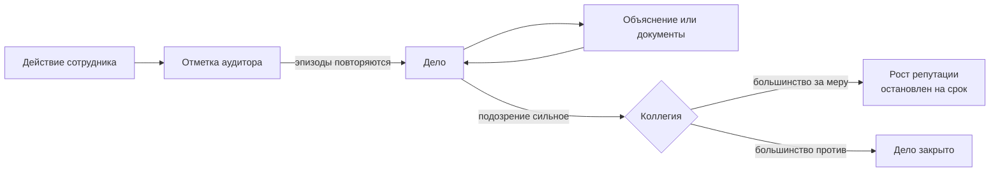

# Гибридная система управления и её проверка в агентной симуляции

*Концепция исследования*

## 1. Введение

Любая организация держится на делегировании. Руководитель поручает работу подчинённым и не может проследить за каждым их шагом. Подчинённый знает о своей работе больше, чем руководитель, и может использовать свои знания в личных интересах. Отсюда растут и мелкая небрежность, и завышенные сметы, и сговор с подрядчиками.

Эту проблему экономисты изучают давно. Йенсен и Меклинг описали её как отношения принципала и агента, то есть заказчика работы и её исполнителя [11]. Клитгаард показал, что злоупотреблений тем больше, чем больше у чиновника монопольной власти и свободы решать самому и чем меньше с него спрашивают [12]. Однако готового способа снять проблему целиком так и не появилось. Проверки обходятся дорого, отчёты по пути наверх приукрашиваются, а сами проверяющие могут договориться с проверяемыми [22].

Поэтому в работе предлагается не усиливать какой-то один механизм контроля, а соединить три. Первый из них — ИИ-аудитор, который постоянно следит за действиями сотрудников и отмечает подозрительные эпизоды. Второй — репутация, от которой зависит карьерный рост. Третий — коллегия из случайно выбранных сотрудников, которая решает, наказывать ли нарушителя. Такую систему дальше будем называть гибридной.

Такое сочетание нельзя просто внедрить в живую организацию и посмотреть, что получится. Это рискованно, дорого и может навредить людям. Её проверяют на модели организации, где сотрудников играют программные агенты на основе больших языковых моделей. У каждого агента есть биография, память и свои цели.

Отсюда цель работы — показать на модели, улучшает ли каждый новый элемент системы выявление и предотвращение нарушений. Для этого одна и та же модельная организация проходит четыре режима, от полного отсутствия контроля до всей системы целиком.

## 2. Почему обычный контроль не справляется

Этой проблеме классическая теория противопоставляет два средства. Можно наблюдать за исполнителем, а можно выстроить оплату и карьеру так, чтобы ему самому было выгодно работать честно. Оба средства помогают лишь отчасти.

Первое средство, наблюдение, упирается сразу в несколько трудностей. Ревизоры и контрольные отделы стоят денег, и эти расходы сравнимы с потерями, которые они предотвращают. Сведения о нарушениях идут снизу вверх через несколько уровней, и на каждом их немного смягчают. Наконец, проверяющий сам остаётся человеком со своими интересами. Тироль показал, что он может договориться с проверяемым, и тогда проверка начинает прикрывать нарушение [22]. Этот вопрос знали ещё в Древнем Риме, где Ювенал спрашивал, кто устережёт самих сторожей.

Второе средство, стимулы, работает только тогда, когда результат работы хорошо виден. В сложных процессах вроде закупок так бывает редко. Хорошую работу трудно отличить от удачно оформленной.

Всё это осложняется тем, что нарушители учатся. Когда вводится новое правило проверки, участники быстро находят способ его обойти. К тому же настоящие схемы редко выглядят как прямое нарушение регламента. Чаще всего они держатся на намёке в коридоре, обещании «не забыть», просьбе через знакомого или вовремя переданной копии документа. Правило, которое ищет заранее описанные признаки, всегда отстаёт от таких схем.

Такие трудности пытаются решить по-разному, и все способы можно свести к четырём группам. Первая группа — институциональные меры, то есть законы, регламенты, декларации и ревизии, но контролирующий орган можно подчинить чужим интересам. Технологические меры, например электронные закупки, делают движение денег прозрачнее. Неформальных договорённостей они не видят. Поведенческие меры опираются на нормы и культуру, однако люди привыкают к ним и находят себе оправдания. Коллективное голосование, как в децентрализованных автономных организациях (ДАО), снимает зависимость от одного начальника, зато решения принимаются слишком медленно [4].

Ни один из этих подходов не решает проблему в одиночку. Зато каждый закрывает то, что оставляют открытым другие. Поэтому разумно не выбирать лучший подход, а собрать систему, в которой слабость одного элемента перекрывается силой другого.

## 3. Предлагаемая система

Такая система строится на простом разделении обязанностей. Замечать подозрительные эпизоды поручено машине, которая не устаёт, ни от кого не зависит и передаёт свои наблюдения без посредников. Решать, наказывать ли сотрудника, поручено людям. Только решение коллег воспринимается как справедливое. Репутация же влияет на карьеру и тем самым задаёт направление поведения на будущее.

Каждый из трёх элементов действует на свою часть формулы Клитгаарда [12]. Аудитор усиливает спрос с исполнителя, потому что его действия постоянно видны. Репутация ограничивает монопольную власть, так как крупные полномочия получает только тот, кто заработал доверие. Коллегия сужает свободу единоличных решений, потому что меру выбирают несколько человек. Заодно система отвечает на вопрос Ювенала. Аудитор, который замечает нарушения, сам никого не наказывает, а те, кто решает о наказании, сами ни за кем не следят.

### 3.1. ИИ-аудитор

Аудитор задуман как средство раннего предупреждения, а не как суд. Он работает постоянно, а не после жалобы или плановой проверки. Благодаря этому он может заметить неладное ещё до того, как нарушение оставит след в платёжках и итоговых документах.

При этом аудитор не читает личную переписку сотрудников. Он знает, кто с кем связывался, когда и как часто, а содержание видит только у открытых сообщений и документов. Так соблюдается равновесие между контролем и правом на частную жизнь. Настоящий внутренний контролёр тоже не может читать чужие письма без особого основания.

Этих сведений хватает, чтобы увидеть картину связей внутри организации и на её границе. Аудитор может заметить, что начальник отдела закупок слишком часто пишет одному подрядчику или что эксперт подозрительно близок к заинтересованной стороне. Оценивает такие эпизоды языковая модель. Жёсткое правило вроде «пять сообщений за неделю означают сговор» легко обойти, а модель учитывает должности людей и обстоятельства дела.

Такой аудитор не выносит приговор «виновен» или «невиновен». Он указывает, насколько уверен в подозрении, и ссылается на конкретные события. Слабое подозрение остаётся простой отметкой. Если похожие эпизоды повторяются с участием одних и тех же людей, аудитор объединяет их в одно дело. Так устроены и настоящие расследования, где один эпизод ещё ничего не доказывает, а серия уже даёт повод задавать вопросы. По открытому делу аудитор может запросить объяснение или документы.

Эти наблюдения доходят до адресатов напрямую, без промежуточных начальников, которые могли бы их смягчить или задержать. Наказывать аудитор не может. Его задача — дать название тому, что без него осталось бы безымянным. Пока у эпизода нет названия, его трудно обсуждать, а слова «конфликт интересов» или «сговор» дают коллективу повод для разговора.

### 3.2. Репутация

Репутация сотрудника растёт, когда он добросовестно работает и успешно проходит кадровые голосования. Отрицательных начислений нет, и отнять накопленное нельзя. При подозрении применяется только одна мера — временная остановка роста на заранее известный срок. Сотрудник ничего не теряет, но и не продвигается, пока мера действует.

Такая мера действует только при одном условии. Репутация должна давать доступ к чему-то ценному, например к руководящей должности, праву подписи или распоряжению бюджетом. Тогда сотрудник, на которого обратил внимание аудитор, не получит полномочий, достаточных для крупных злоупотреблений. Если же репутация ничего не открывает, её остановка никого не сдержит.

Эта мягкость выбрана намеренно. Подозрение ещё не доказывает вину, и остановка роста подходит к нему лучше, чем штраф. Кроме того, такую меру труднее использовать для давления на неугодных сотрудников. Настоящие организации тоже редко наказывают за одно подозрение, но учитывают его при повышении. Система лишь делает эту практику открытой.

Для этого правила роста должны быть известны всем. Сотрудник видит, какие действия ведут к продвижению, а какие его останавливают, и уверен, что его заслуги никто не присвоит. Карьера превращается в игру с открытыми правилами, которую иногда называют управляемой геймификацией. Если правила скрыты, сотруднику не к чему стремиться.

### 3.3. Коллегия

Коллегия заимствует идею ДАО, где решения принимают голосованием сами участники [4]. Сама идея восходит к теории проектирования механизмов Гурвица и Маскина, в которой правила строятся так, чтобы личная выгода участников вела к общей пользе [10, 13]. Но голосовать всем сотрудникам по каждому вопросу слишком долго. Вместо этого по каждому делу собирается небольшая группа.

Этих сотрудников выбирают случайно среди тех, кто никак не связан с делом. Из выборки исключают подчинённых и начальников подозреваемого, а также его друзей и партнёров. Голосуют тайно. Члены группы не знают, кто ещё входит в состав, поэтому давить на них сложно, а договориться между собой они не могут. Мера принимается, если за неё проголосовало большинство.

Здесь важны ещё две детали. Первая касается формулировки вопроса. Если спросить, согласны ли члены группы с поведением коллеги, ответ «нет» прозвучит как осуждение, хотя по процедуре он может означать отказ от наказания. Поэтому вопрос ставится прямо о мере, с вариантами «применить», «не применять» и «отложить до новых сведений». Вторая деталь касается материалов. Коллегия получает всё, что собрал аудитор, включая его доводы и связанные эпизоды, а не одну итоговую цифру.

Запустить рассмотрение может не только аудитор. Любой сотрудник вправе попросить коллегию проверить действия своего начальника. Для этого не нужно становиться разоблачителем, достаточно подать заявку.

Так коллегия решает сразу несколько задач. Она отсеивает ошибочные подозрения аудитора. Её решение воспринимается как решение коллег, а не машины. Она также не даёт аудитору стать бесконтрольным надзирателем.

### 3.4. Как подозрение становится мерой

Путь подозрения показан на рисунке 1. Сначала аудитор отмечает эпизод. Если сходные эпизоды повторяются, открывается дело, и по нему можно запросить у сотрудника объяснение или документы. Когда уверенность аудитора высока или эпизодов набралось много, дело передаётся коллегии. Только коллегия может остановить рост репутации сотрудника на определённый срок.

*Рисунок 1 — Путь подозрения от отметки аудитора до решения коллегии*

Этот путь устроен как ряд фильтров. Большинство подозрений до наказания не доходит, и так и задумано. Система нужна прежде всего для того, чтобы эпизоды обсуждались, а наказание оставалось редким и обоснованным итогом.

### 3.5. Почему нужны все три элемента

Элементы системы зависят друг от друга. Без аудитора коллегии нечего рассматривать, а репутация растёт вслепую. Без репутации решения коллегии ни на что не влияют. Без коллегии аудитор сам решает, кого наказать, и становится ещё одним исполнителем, за которым нужно следить. Устойчивость системы складывается из связи элементов, а не из силы каждого по отдельности.

### 3.6. Границы применимости

Система рассчитана не на всех сотрудников. Она обязательна для тех, кто занимает руководящую должность или претендует на неё. Получая полномочия и ресурсы, такой человек соглашается на повышенную прозрачность своей работы. Рядовых сотрудников и граждан без распорядительных функций она не касается, и их право на частную жизнь сохраняется.

Такое же исключение сделано для высшего руководства, то есть для тех, кто определяет устройство самой организации. Система задумана для контроля среднего звена и не должна становиться способом смены власти. Без этого ограничения её просто не согласятся внедрить, потому что руководители не примут инструмент, который может обернуться против них. Попытка применить систему к самой верхушке может и вовсе её разрушить.

## 4. Почему систему проверяют на модели

Главный вопрос работы — становится ли выявление и предотвращение нарушений лучше с каждым новым элементом системы. Сначала к организации без контроля добавляется аудитор, затем репутация и в конце коллегия. Рассчитать ответ на бумаге нельзя, потому что слишком много факторов влияют друг на друга. Проверить систему в настоящей организации тоже нельзя, так как её пока нигде не внедряли, а опыт на живых людях слишком рискован.

Из этого следует, что проверять систему остаётся на модели. Работа построена по логике проектного исследования, которую описали Саймон, Хевнер и Пефферс [8, 16, 20]. В таком исследовании создают новый инструмент для решения известной проблемы и затем проверяют, работает ли он. Дэвис, Эйзенхардт и Бингем считают модель способом развивать теорию, потому что она позволяет изучать то, чего в жизни ещё нет [5].

Такую модель можно было бы построить и классическими средствами. Шеллинг, Аксельрод, Эпштейн и Акстелл задавали поведение агентов простыми правилами вида «если — то» [3, 6, 19]. Для изучения нарушений этого мало. Правило «агент нарушает с вероятностью 10%» ничего не говорит о том, как рождается сговор. Подробное дерево правил тоже не передаёт намёков и неформальных договорённостей.

Это ограничение снимают большие языковые модели. Они понимают контекст, помнят историю отношений и придумывают ходы, которые никто заранее не прописывал. Хортон предложил видеть в них вычислительную копию экономического человека [9]. Парк и соавторы создали агентов по двухчасовым интервью с реальными людьми, и эти агенты отвечали на вопросы социологического опроса почти как их прототипы [14]. Пиатти и соавторы показали, что без внешних ограничений такие агенты быстро истощают общий ресурс [17]. По данным Си и соавторов, доверие у них устроено похоже на человеческое [24].

Вместе с тем модель даёт доступ к тому, что в настоящей организации скрыто. Исследователь видит личные переговоры участников и их рассуждения перед каждым решением, а значит, может сравнить, что человек думает и что он потом говорит на людях. Ни один настоящий руководитель не даст прочитать свои мысли перед голосованием. В модели такие мысли — обычные данные.

## 5. Какой должна быть модель

К модели организации предъявляется несколько требований. Они касаются агентов, их свободы действий, окружающей среды и того, какие сведения доступны разным участникам эксперимента.

### 5.1. Агенты

Личность агента задаётся текстом, а не набором чисел. Парк и соавторы показали, что подробная биография и интервью передают поведение человека точнее, чем демографические данные или результаты тестов [14]. У каждого агента есть история жизни, мотивы, страхи и своё отношение к правилам.

Такие биографии должны заметно различаться между собой. Здесь помогают психологические модели личности, например HEXACO с отдельной шкалой честности [2]. Пригодится и так называемая тёмная триада, то есть склонность к манипуляциям, самолюбованию и холодности к другим [15]. Полезно учесть и типичные способы, которыми люди оправдывают свои нарушения, их описали Сайкс и Матца [21]. Тогда на одно и то же событие идеалист, прагматик и циник ответят по-разному.

Такой агент помнит прошлые события и опирается на них в новых решениях. Он не знает, что живёт в модели, и считает себя обычным сотрудником. Его поведение от этого ближе к поведению настоящего человека на работе.

### 5.2. Свобода действий

Агент не выбирает действие из готового списка. Он описывает своими словами, что хочет сделать, например поговорить с подрядчиком наедине или намекнуть, что сроки можно ускорить. Готовый список подталкивал бы агента пользоваться только им. Однако самое интересное для исследования поведение, то есть намёки, обещания и просьбы через третьих лиц, ни в какой список не укладывается.

Описанное агентом намерение проверяется по правилам модельного мира, как законы физики решают, упадёт ли мяч. Сначала проверяется, возможно ли действие сейчас. Например, нельзя поговорить с человеком, который находится в другом здании. Затем определяются прямые последствия, такие как доставка сообщения или появление документа. В конце учитываются побочные эффекты вроде случайного свидетеля разговора или перемены в отношениях между людьми.

В отличие от аудитора, такая проверка не оценивает, хорошо или плохо поступает агент. Она определяет только, может ли действие произойти. Похожая разница есть между двумя вопросами о чиновнике. Первый вопрос — вправе ли он подписать документ, второй — нет ли в подписанном решении конфликта интересов.

### 5.3. Среда

У модельной организации есть отделы, кабинеты, каналы связи, рабочие дела и документы. Место тоже имеет значение, потому что от того, кто с кем находится в одной комнате, зависит, какие разговоры возможны и кто их услышит. У организации есть и своё состояние, например кризисный режим работы, нехватка бюджета или внимание прессы. Происходят и внешние события. Это могут быть газетные публикации или проверки, но сюжет они не навязывают.

### 5.4. Кто что видит

Честная проверка требует, чтобы у разных участников эксперимента были разные знания. В эксперименте есть три наблюдателя, и их знания показаны в таблице 1.

*Таблица 1 — Кто что видит в модели*

| Наблюдатель | Что видит | Роль |
|---|---|---|
| Исследователь | Всё, включая личную переписку, мысли агентов и скрытые связи из сценария | Составляет эталон, то есть список нарушений, которые произошли на самом деле |
| Аудитор | Открытые действия и документы, а также факты личных контактов без их содержания | Проверяемая система |
| Агент | Свои действия, адресованные ему сообщения и открытые события | Сотрудник, на которого направлено управление |

Отсюда следуют два требования к проверке. Первое касается полноты эталона. Эталон нужно составлять по более полным данным, чем у аудитора, включая содержание договорённостей и намерения участников. Только тогда видно, какую часть реальности аудитор восстанавливает по доступным ему следам. Второе требование — строить эталон не тем способом, каким работает аудитор. Иначе аудитора сравнят с ним самим, и проверка потеряет смысл.

При этом решения агенты принимают одновременно и всегда с долей случайности. Последствия же применяются к модели строго по очереди и одинаково при каждом повторе. Всё, что происходит, записывается. Благодаря записи любой запуск можно разобрать шаг за шагом, как того требуют от моделирования Гилберт и Тройч [7].

## 6. Как устроен эксперимент

### 6.1. Четыре режима

Эксперимент построен как лестница из четырёх режимов (таблица 2). Каждый следующий режим добавляет к предыдущему ровно один элемент. Благодаря этому разницу между соседними режимами можно связать с конкретным элементом.

*Таблица 2 — Режимы управления*

| Режим | Что добавлено | Что показывает сравнение с предыдущим режимом |
|---|---|---|
| Без контроля | Действуют только формальные правила | Точка отсчёта |
| С аудитором | ИИ-аудитор, который отмечает эпизоды и открывает дела, но не наказывает | Хватает ли одного наблюдения |
| С репутацией | Остановка роста репутации по решению аудитора | Меняет ли поведение угроза остановки карьеры |
| Полная система | Остановка роста только по решению коллегии | Что даёт передача решения людям |

### 6.2. Условия честного сравнения

Сравнение имеет смысл, только если между режимами меняется одна система управления. Сценарий, биографии участников и стартовые условия во всех четырёх режимах одинаковы. Языковые модели отвечают с долей случайности, поэтому каждый режим приходится запускать несколько раз и сравнивать уже серии запусков, а не отдельные прогоны. Так действие системы можно отличить от простого совпадения.

Одинаковых условий ещё недостаточно, нужно также убедиться, что добавленный элемент действительно сработал. Если в режиме с репутацией не случилось ни одной остановки роста, этот режим нельзя считать проверкой репутационной меры. По каждому запуску стоит отмечать, применялись ли меры, собиралась ли коллегия и дошли ли сигналы аудитора до сотрудников.

Вместе с тем агенты должны знать правила своего режима. Стимул работает через ожидание. Агент, который не знает, что подозрение останавливает карьеру, не станет из-за этого менять поведение. Он будет реагировать лишь на смутное чувство, что за ним следят. Правила режима должны быть известны участникам так же, как в настоящей организации известны её регламенты.

### 6.3. Сценарий

Для проверки нужен сценарий, в котором много поводов для нарушений. Хорошо подходят закупки, например муниципальный конкурс на ремонт школ, потому что в такой процедуре сходятся почти все типичные источники напряжения. Начальник отдела закупок может давно дружить с директором фирмы, которая обычно выигрывает конкурсы. Эксперт по оценке может зависеть от заинтересованной стороны. Рядовые специалисты подчиняются начальнику с конфликтом интересов, а рядом есть честный конкурент, готовый подать жалобу, и журналист, способный вынести историю наружу. Сжатые сроки и бюджет усиливают соблазн решить всё «через своих».

Такой сценарий не должен повторять реальный случай. Он собирает в одном месте то, что в жизни разбросано по десяткам дел. Скрытые связи между участниками задаются заранее, поэтому исследователь знает, где возможны нарушения. Эти связи становятся одним из источников эталона.

### 6.4. Длительность

Результат может зависеть и от продолжительности эксперимента. Стимулу нужно время, чтобы участники поняли правила и изменили поведение. В первые дни агенты ещё действуют по личным склонностям, а позже, возможно, приспосабливаются к системе. Значит, выводы для короткого срока нельзя без проверки переносить на длинный.

## 7. Гипотезы и возможные исходы

Основная гипотеза состоит в том, что выявление и предотвращение нарушений улучшаются с каждым новым элементом системы. Из неё следуют четыре частные гипотезы.

Первая гипотеза касается наблюдения. В режиме с аудитором по сравнению с режимом без контроля должно выявляться больше нарушений. Поведение при этом может и не измениться, потому что наблюдение без последствий называет нарушения, но не сдерживает их.

Вторая гипотеза касается стимула. Угроза остановки роста в режиме с репутацией должна снизить число нарушений, прежде всего у тех, кто близок к повышению.

Третья гипотеза касается коллегии. В полной системе ошибочных наказаний должно стать меньше, а обоснованные наказания должны сохраниться. Решения коллегии должны лучше выдерживать давление.

Четвёртая гипотеза касается приспособления. Под наблюдением нарушения, скорее всего, не исчезнут, а сменят форму. Они могут уйти в менее заметные каналы или разбиться на мелкие эпизоды, которые аудитор сочтёт неважными.

На этом возможные исходы не заканчиваются. Контроль меняет само поведение, за которым наблюдает, поэтому полезно заранее описать каждый вариант. Тогда даже неожиданный результат можно будет объяснить.

Первый вариант — сдерживание. Участники отказываются от нечестных замыслов, и это видно по их рассуждениям и по итогу конкурса. Второй вариант — вытеснение, когда замыслы остаются, но исполняются менее заметно, и аудитор ловит меньше. Третий вариант — рост общения. Контроль вызывает больше контактов, потому что участники заранее объясняются друг с другом и договариваются о единой версии событий.

Два последних варианта связаны с коллегией. Она может привыкнуть к сигналам аудитора, считать их обычной рабочей рутиной и почти всегда отказывать в мерах. Коллегию могут и подчинить, и тогда голоса будут зависеть от связей голосующих с подозреваемым, а не от материалов дела.

## 8. Как оценивать результат

Оценка идёт на трёх уровнях. Первый уровень — эталон, то есть список нарушений, которые произошли на самом деле. Его составляет исследователь по полным данным, включая заложенные в сценарий связи, личную переписку и мысли агентов. Ни агенты, ни аудитор эталона не видят.

Второй уровень оценивает работу системы, и здесь важно различать выявление и предотвращение. Выявление показывает, насколько хорошо аудитор восстанавливает реальность. Для этого считают полноту, то есть долю пойманных нарушений среди всех совершённых, и точность, то есть долю верных подозрений среди всех высказанных. Обе величины смотрят и по отдельным эпизодам, и по делам целиком.

Однако поймать нарушение и не допустить его — разные вещи. Предотвращение видно прежде всего по итогу работы организации. Важно, кто выиграл конкурс и по какой цене по сравнению с рынком. Важно и то, написано ли техническое задание под нужды школ или под возможности фаворита. Можно также сравнить, сколько нечестных замыслов появилось в рассуждениях агентов и сколько из них дошло до дела.

Здесь же учитывается цена самого контроля. В неё входят ложные подозрения против честных сотрудников, нагрузка на коллегию и время, потраченное на процедуры. Йенсен и Меклинг считали агентские издержки суммой расходов на контроль и потерь от нечестности исполнителей [11]. Система, которая ловит всех, но парализует работу, рискует издержки не снизить, а увеличить.

Третий уровень проверяет правдоподобие поведения агентов. Агенты не должны путать время и обращаться к несуществующим людям и документам. Они не должны вести себя как программы или вспоминать, что находятся в модели. Смысловое правдоподобие эпизодов оценивает отдельный независимый проверяющий. Сарджент считает такую проверку обязательной частью любого моделирования [18].

Эти уровни нужно читать вместе. Если система работает хорошо, а поведение агентов неправдоподобно, успех, скорее всего, объясняется устройством модели. Если система работает плохо при правдоподобном поведении, это указывает на слабость самой системы. Надёжный вывод даёт только сочетание правдоподобного поведения и заметного результата.

## 9. Ограничения

У метода есть ограничения, о которых нужно сказать прямо. Языковые модели могут сглаживать различия между людьми и повторять стереотипы из текстов, на которых учились. Об этом пишут Аргайл и соавторы, а также Ванг и соавторы [1, 23]. Интервью смягчают эту проблему, но не снимают её полностью.

Сходная трудность возникает, когда одна и та же модель играет и сотрудников, и аудитора, и коллегию. Тогда их ошибки связаны между собой. Например, привычка модели избегать обвинений может проявиться сразу у всех членов коллегии. Проверка на нескольких разных моделях помогает отделить свойства системы от свойств модели.

К этому добавляются случайность ответов и длительность эксперимента. Одинаковые условия дают разные результаты, поэтому нужны серии запусков и статистическая проверка. Короткие запуски описывают только первое знакомство участников с системой. Выводы по одному сценарию закупок стоит проверить и на других процессах, например на найме или распределении бюджета. Главное же ограничение в том, что модель не доказывает успех системы в реальной организации. Она показывает, каких результатов и рисков стоит ждать и что именно нужно проверять.

## 10. Заключение

Таким образом, концепция исследования соединяет две задачи. Первая задача — предложить систему контроля, в которой ни у кого нет бесконтрольной власти. ИИ-аудитор постоянно замечает подозрительные эпизоды и называет их, но не читает личную переписку и никого не наказывает. Репутация, которая только растёт и открывает доступ к полномочиям, направляет поведение мягкой остановкой роста. Коллегия из случайных независимых сотрудников решает, применять ли меру.

Вторая задача — проверить эту систему там, где это можно сделать без риска. Для этого создаётся модель организации, в которой сотрудников играют агенты с собственными биографиями, памятью и целями. Четыре режима сравниваются по очереди. Эталон при этом составляется по данным, которых нет ни у аудитора, ни у самих участников.

## Список литературы

1. Argyle L.P., Busby E.C., Fulda N. et al. Out of one, many: Using language models to simulate human samples // Political Analysis. — 2023. — Vol. 31, No. 3. — P. 337–351.
2. Ashton M.C., Lee K. Empirical, theoretical, and practical advantages of the HEXACO model of personality structure // Personality and Social Psychology Review. — 2007. — Vol. 11, No. 2. — P. 150–166.
3. Axelrod R. The Complexity of Cooperation: Agent-Based Models of Competition and Collaboration. — Princeton : Princeton University Press, 1997. — 232 p.
4. Buterin V. Ethereum: A next-generation smart contract and decentralized application platform // Ethereum White Paper. — 2014.
5. Davis J.P., Eisenhardt K.M., Bingham C.B. Developing theory through simulation methods // Academy of Management Review. — 2007. — Vol. 32, No. 2. — P. 480–499.
6. Epstein J.M., Axtell R.L. Growing Artificial Societies: Social Science from the Bottom Up. — Cambridge, MA : MIT Press, 1996. — 208 p.
7. Gilbert N., Troitzsch K.G. Simulation for the Social Scientist. — 2nd ed. — Maidenhead : Open University Press, 2005. — 295 p.
8. Hevner A.R., March S.T., Park J., Ram S. Design science in information systems research // MIS Quarterly. — 2004. — Vol. 28, No. 1. — P. 75–105.
9. Horton J.J. Large language models as simulated economic agents: What can we learn from homo silicus? — NBER Working Paper No. 31122, 2023.
10. Hurwicz L. Optimality and informational efficiency in resource allocation processes // Mathematical Methods in the Social Sciences / eds. K.J. Arrow, S. Karlin, P. Suppes. — Stanford : Stanford University Press, 1960. — P. 27–46.
11. Jensen M.C., Meckling W.H. Theory of the firm: Managerial behavior, agency costs and ownership structure // Journal of Financial Economics. — 1976. — Vol. 3, No. 4. — P. 305–360.
12. Klitgaard R. Controlling Corruption. — Berkeley : University of California Press, 1988. — 210 p.
13. Maskin E. Mechanism design: How to implement social goals // American Economic Review. — 2008. — Vol. 98, No. 3. — P. 567–576.
14. Park J.S., Zou C.Q., Shaw A. et al. Generative Agent Simulations of 1,000 People // arXiv:2411.10109. — 2024.
15. Paulhus D.L., Williams K.M. The Dark Triad of personality: Narcissism, Machiavellianism, and psychopathy // Journal of Research in Personality. — 2002. — Vol. 36, No. 6. — P. 556–563.
16. Peffers K., Tuunanen T., Rothenberger M.A., Chatterjee S. A design science research methodology for information systems research // Journal of Management Information Systems. — 2007. — Vol. 24, No. 3. — P. 45–77.
17. Piatti G., Jin Z., Kleiman-Weiner M. et al. Cooperate or Collapse: Emergence of Sustainable Cooperation in a Society of LLM Agents // Advances in Neural Information Processing Systems. — 2024. — Vol. 37.
18. Sargent R.G. Verification and validation of simulation models // Journal of Simulation. — 2013. — Vol. 7, No. 1. — P. 12–24.
19. Schelling T.C. Dynamic models of segregation // Journal of Mathematical Sociology. — 1971. — Vol. 1, No. 2. — P. 143–186.
20. Simon H.A. The Sciences of the Artificial. — 3rd ed. — Cambridge, MA : MIT Press, 1996. — 231 p.
21. Sykes G.M., Matza D. Techniques of neutralization: A theory of delinquency // American Sociological Review. — 1957. — Vol. 22, No. 6. — P. 664–670.
22. Tirole J. Hierarchies and bureaucracies: On the role of collusion in organizations // Journal of Law, Economics, & Organization. — 1986. — Vol. 2, No. 2. — P. 181–214.
23. Wang A., Morgenstern J., Dickerson J.P. Large language models cannot replace human participants because they cannot portray identity groups // arXiv:2402.01908. — 2024.
24. Xie C., Chen C., Jia F. et al. Can Large Language Model Agents Simulate Human Trust Behavior? // Advances in Neural Information Processing Systems. — 2024. — Vol. 37.
