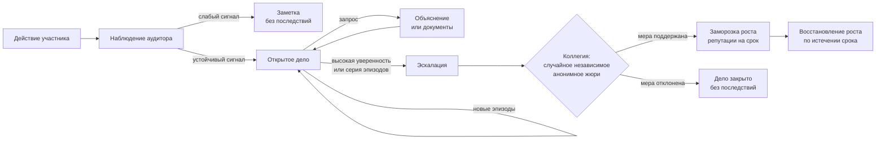
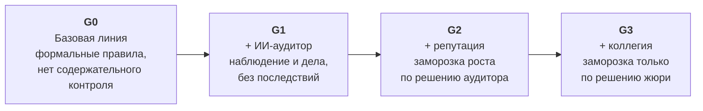

# Гибридная система управления и её проверка в агентной симуляции

*Концепция исследования*

> *Quis custodiet ipsos custodes?* — «Кто устережёт самих сторожей?»
> Ювенал, «Сатиры», VI

---

## Аннотация

Любая организация стоит на делегировании полномочий, а делегирование неизбежно порождает разрыв между тем, что знает исполнитель, и тем, что видит руководитель. В этот разрыв помещается всё: небрежность, завышенные сметы, дружеские договорённости с подрядчиками, тихие схемы. Классические средства контроля закрывают его лишь частично. Контролёры стоят дорого. Отчёты искажаются по пути наверх. Сами проверяющие могут вступить в сговор. Участники же быстро учатся обходить любое фиксированное правило.

Исследование предлагает **гибридную систему управления** из трёх взаимодополняющих механизмов:

- **ИИ-аудитор** непрерывно наблюдает за поведенческими паттернами;
- **накопительная репутация** открывает доступ к полномочиям и ресурсам;
- **коллегиальное рассмотрение** передаёт решение о мере случайной и независимой группе коллег.

Формула системы: *машина замечает, коллегия решает, репутация направляет*.

Внедрить такую систему в реальную организацию ради проверки нельзя, а рассчитать аналитически — невозможно. Поэтому она проверяется в **агентной симуляции**: модельную организацию населяют генеративные агенты на основе больших языковых моделей. У каждого есть собственная биография, память и мотивы. Ступенчатое сравнение четырёх режимов управления (G0–G3) позволяет выделить вклад каждого механизма. Эталон истины при этом строится из позиции, недоступной ни агентам, ни аудитору.

---

## 1. Проблема: почему контроль ломается

### 1.1. Делегирование и асимметрия информации

Йенсен и Меклинг описали фундаментальное противоречие иерархии. Принципал поручает агенту действовать от своего имени, но не может наблюдать его действия полностью. Отсюда два классических следствия:

- **моральный риск**: исполнитель, чьи усилия ненаблюдаемы, склонен экономить на них или перенаправлять ресурсы в свою пользу;
- **неблагоприятный отбор**: принципал не может заранее отличить добросовестного исполнителя от недобросовестного.

Сумма затрат на мониторинг, на стимулирование и остаточных потерь от расхождения интересов называется **агентскими издержками**. Именно их, а не абстрактную «коррупцию», в конечном счёте должна снижать любая система управления.

### 1.2. Три провала контроля

Классический ответ на асимметрию — наблюдать и стимулировать. Но оба инструмента упираются в три системных провала.

1. **Цена наблюдения.** Аудиторские подразделения, ревизионные комиссии и службы внутреннего контроля требуют ресурсов, соизмеримых с потерями, которые они предотвращают.
2. **Фильтрация по пути наверх.** Каждый промежуточный уровень иерархии заинтересован смягчить плохие новости. Чем длиннее цепочка, тем меньше правды доходит до принципала.
3. **Регресс контроля.** Контролёр — такой же агент со своими интересами. Тироль показал, что проверяющий и проверяемый могут вступить в сговор. Тогда контроль не просто перестаёт работать, а начинает легитимировать нарушение. Вопрос Ювенала не риторический: любой надзорный орган сам нуждается в надзоре.

### 1.3. Движущаяся мишень

Оппортунистическое поведение **адаптивно**: участники реагируют на механизмы контроля и изобретают способы их обхода. Оно ещё и **неформально**. Реальные схемы редко выглядят как нарушение пункта регламента. Это намёк в коридоре, обещание «не забыть», давление через третье лицо, вовремя переданная копия документа. Система, реагирующая на заранее описанные паттерны, всегда отстаёт на шаг: правило пишется после того, как схема уже изобретена.

### 1.4. Четыре подхода и их предел

| Подход | Что даёт | Где ломается |
|---|---|---|
| **Институциональный** — регламенты, декларации, ротация, аудит | Формальная рамка | Контролирующий орган можно «захватить»; исполнение зависит от людей |
| **Технологический** — электронные закупки, мониторинг транзакций | Прозрачность потоков | Правила обнаружения жёсткие; неформальные каналы остаются вне поля зрения |
| **Поведенческий** — нормы, культура, восприятие справедливости | Внутренняя мотивация | Участники адаптируются; нормы размываются техниками нейтрализации |
| **Децентрализованный** — ДАО, коллективное голосование | Независимость от единоличных решений | Операционная неэффективность; голосование по рутине парализует организацию |

Главный вывод обзора: **ни один подход не решает проблему в одиночку, но каждый закрывает то, что оставляют открытым другие.** Значит, нужно не усиливать один механизм, а собрать систему, в которой слабость одного компонента компенсируется силой другого.

---

## 2. Концепция гибридной системы

### 2.1. Ключевая идея: разделение труда между машиной и людьми

В основе концепции лежит простое распределение ролей.

- **Замечать** должна машина. Она не устаёт, не имеет личных интересов, не боится начальника и передаёт наблюдения без посредников.
- **Решать** должны люди. Только решение коллег обладает легитимностью, учитывает контекст и не превращает организацию в цифровой паноптикум.
- **Направлять** должны стимулы. Их задача — не карать за прошлое, а задавать траекторию будущего.

Отсюда формула: **машина называет, коллегия решает, репутация направляет.**

### 2.2. Логика через формулу Клитгаарда

Клитгаард свёл условия злоупотреблений к формуле:

> **C = M + D − A**
> *злоупотребление = монополия + свобода усмотрения − подотчётность*

Каждый компонент гибридной системы целится в своё слагаемое:

| Слагаемое | Механизм воздействия | Компонент |
|---|---|---|
| **A** — подотчётность | Непрерывное наблюдение, прямая доставка сигналов без промежуточных звеньев | ИИ-аудитор |
| **M** — монополия | Доступ к распорядительным полномочиям только при достижении репутационного порога | Репутационный механизм |
| **D** — свобода усмотрения | Спорные решения о мерах выносятся не единолично, а коллегией | Коллегиальное рассмотрение |
| **Регресс контроля** | Контролёр (аудитор) не наказывает сам; наказание требует согласия независимой группы | Связка аудитор ↔ коллегия |

### 2.3. Компонент первый: ИИ-аудитор — наблюдатель, который называет

Аудитор — это **инструмент раннего предупреждения**, а не суд. Его концептуальные свойства таковы.

**Непрерывность.** Классический контроль работает по запросу: после жалобы, проверки или публикации. Аудитор работает постоянно и смотрит на процесс, пока нарушение ещё не оставило формальных следов в финансовых потоках и итоговых документах.

**Паттерны, а не содержание.** Аудитор видит факты взаимодействий (кто, с кем, когда, как часто) и публичные действия. Содержание приватной переписки ему недоступно. Это сознательный баланс между контролем и правом на приватность. Он соответствует реальному статусу внутреннего контролёра, который не вправе читать чужую переписку без процессуального основания. Такой аудитор похож на следователя в режиме раннего предупреждения: он не предъявляет доказательств, а отмечает подозрительные конфигурации связей.

**Граф связей.** Аудитор строит карту отношений внутри организации и на её границе: повторяющиеся контакты, общее прошлое, совпадения в контрагентах. Внимание получают рёбра с повышенным риском аффилированности.

**Понимание смысла, а не ключевые слова.** Основой аудитора служит языковая модель, способная интерпретировать неструктурированный контекст: текстовые обоснования, последовательность действий, роль участников. Жёсткие правила вида «если N контактов — значит сговор» обходятся за один шаг. Интерпретация контекста — нет.

**Суждение со степенью уверенности.** Аудитор выносит не бинарный вердикт «нарушение / не нарушение», а оценку с явной уверенностью и привязкой к конкретным наблюдаемым событиям. Уверенность определяет реакцию: слабое наблюдение остаётся заметкой, среднее превращается в дело, сильное эскалируется.

**Дело, а не сигнал.** Повторяющиеся эпизоды с участием одних и тех же лиц не порождают поток разрозненных тревог. Они собираются в единое **дело** с накопительной историей. Так устроена реальная практика расследований: единичный эпизод может ничего не значить, серия формирует основание для действий. По мере накопления аудитор может запросить объяснение, затребовать документы или усилить наблюдение.

**Без посредников.** Результаты доводятся до сведения автоматически. Из цепочки исключается звено, способное задержать, смягчить или похоронить отчёт. Этим устраняется второй провал контроля — фильтрация по пути наверх.

**Аудитор не наказывает.** Он *даёт имя* событиям, которые без него остались бы безымянными: «координация», «преференция», «конфликт интересов». Пока у эпизода нет имени, о нём невозможно говорить. Как только имя появилось, у организации возникает язык для разговора о нём.

### 2.4. Компонент второй: репутация — стимул, который направляет

**Только накопление.** Репутация участника растёт за конструктивную деятельность: добросовестное исполнение обязанностей, поддержку коллег в кадровых решениях, успешно завершённые процессы. Отрицательных начислений нет. Накопленное нельзя отнять.

**Заморозка темпа вместо штрафа.** Единственная реакция на подозрительное поведение — временная остановка роста. Участник ничего не теряет, но перестаёт продвигаться. Мера мягкая, но действенная: помеченный аудитором сотрудник не поднимается по иерархии и не получает доступа к ресурсам, достаточным для масштабных злоупотреблений.

**Репутация — это ключ.** Концептуально принципиально, что репутация *что-то открывает*: право подписи, место в комиссии, распоряжение бюджетом, руководящую должность. Репутация, которая ничего не открывает, — декоративный счётчик. Заморозка такого счётчика никого не остановит.

**Почему мягкость — это сила.**

- *Подозрение — не вина.* Замедление, а не наказание, адекватно статусу аудиторского сигнала как предупреждения.
- *Защита от злоупотребления санкциями.* Заморозку роста труднее использовать как дубину против неугодных, чем прямой штраф.
- *Градуализм.* Реальные организации тоже не наказывают за подозрение, но учитывают его в кадровых решениях. Механизм формализует эту практику и делает её прозрачной.

**Управляемая геймификация.** Правила продвижения открыты. Участник видит, какие действия ведут к росту, а какие к остановке, и уверен, что его заслуги не будут присвоены. Стимул работает только тогда, когда правила известны: нельзя стремиться к порогу, о котором не знаешь.

### 2.5. Компонент третий: коллегия — люди, которые решают

**Адаптация ДАО.** Идея децентрализованного голосования берётся в облегчённой форме. Голосуют не все по каждому вопросу, а **малая группа по конкретному делу**. Организация получает устойчивость коллективного суждения без паралича всеобщих голосований.

**Независимость состава.** Члены группы отбираются случайно из числа сотрудников, *не связанных с делом* ни служебно (подчинённость, прямое руководство), ни неформально (дружба, общее прошлое, совместные проекты). Голосуют анонимно и независимо: никто не знает, кто ещё входит в состав. Давить не на кого, договариваться не с кем.

**Решение большинства при кворуме.** Мера применяется, только если за неё высказалось большинство принявших участие.

**Вопрос о мере, а не о морали.** Коллегии предлагается процедурный выбор («применить меру / не применять / отложить до получения сведений»), а не моральная оценка («одобряете ли вы поведение коллеги?»). Голосующий на естественном языке легко вкладывает в «нет» осуждение поступка, тогда как процедура прочитает его как отказ от санкции. Формулировка бюллетеня — часть механизма, а не техническая деталь.

**Полное досье.** Коллегия получает материалы дела: наблюдения аудитора, его обоснование и связанные эпизоды, а не сводную цифру. Без оснований нельзя ни осудить, ни оправдать.

**Право инициативы снизу.** Любой сотрудник может инициировать рассмотрение действий вышестоящего лица. Барьер для сигнализирования снижается: не нужно быть героем-разоблачителем, достаточно запустить процедуру.

**Функции коллегии:**

1. отсеивает ложные срабатывания аудитора;
2. придаёт мере легитимность решения коллег, а не машины;
3. замыкает регресс контроля: аудитор, который сам ничего не решает, не может злоупотребить своей властью.

### 2.6. Жизненный цикл подозрения

Каждая ступень — дополнительный фильтр. Подозрение становится мерой только пройдя всю вертикаль: наблюдение, дело, эскалацию и решение коллег. Система задумана не как вертикаль наказания, а как **вертикаль обсуждения**, в которой санкция — редкий и обоснованный итог.

### 2.7. Взаимодополнительность компонентов

Компоненты не просто складываются: каждый нужен двум другим.

| Если убрать… | …то оставшаяся система |
|---|---|
| **Аудитора** | Коллегии нечего рассматривать; репутация растёт вслепую, без обратной связи о рисках |
| **Репутацию** | Решения коллегии ничего не меняют в траектории участника; у системы нет рычага |
| **Коллегию** | Аудитор становится единоличным контролёром с правом санкции, то есть новым агентом, который сам нуждается в надзоре |

Именно поэтому система называется **гибридной**. Её устойчивость — свойство связки, а не отдельного элемента.

### 2.8. Принципы проектирования

1. **Мягкость санкций.** Остановка роста вместо наказания; нет отрицательных начислений.
2. **Разделение обнаружения и решения.** Тот, кто замечает, не наказывает; тот, кто наказывает, не наблюдает.
3. **Презумпция добросовестности.** Сигнал — повод для внимания, а не обвинение; дело — повод для вопроса, а не приговор.
4. **Прозрачность правил.** Правила продвижения и основания для мер известны всем участникам.
5. **Отсутствие посредников.** Наблюдения аудитора доходят до адресата без фильтрующих звеньев.
6. **Приватность по умолчанию.** Аудитор видит паттерны, а не содержание частной переписки.
7. **Независимость коллегии.** Случайный состав, исключение связанных лиц, анонимность голосования.

### 2.9. Границы применимости

- **Добровольно-обязательное участие.** Система распространяется на тех, кто занимает или хочет занять руководящую должность. Принимая полномочия и ресурсы, человек принимает и обязательство расширенной прозрачности. Это обмен, а не принуждение.
- **Приватность рядовых.** На сотрудников и граждан без распорядительных функций требования не распространяются. Право на приватность остаётся базовым принципом.
- **Иммунитет высшего руководства.** Лица, определяющие саму структуру управления, выведены из-под действия системы. Это прагматичный компромисс: система задумана как инструмент контроля среднего звена, а не как механизм смены власти. Без этого ограничения её внедрение политически невозможно, потому что те, кто принимает решение о внедрении, не согласятся на инструмент, способный обратиться против них. Кроме того, попытка применить систему к вершине иерархии может разрушить её целиком.

---

## 3. Почему проверять в симуляции

### 3.1. Проверка невозможна ни аналитически, ни натурно

Главный вопрос исследования: **даёт ли последовательное наращивание компонентов — от отсутствия контроля к аудитору, от аудитора к аудитору с репутацией, от этого к полной системе с коллегией — монотонное улучшение в выявлении и предотвращении отклонений?**

- *Аналитически* ответить нельзя: слишком много взаимодействующих факторов, адаптивных участников и нелинейных эффектов.
- *Натурно* ответить нельзя: система не внедрена ни в одной организации, а экспериментальное внедрение сопряжено с неприемлемыми рисками и затратами.

Остаётся третий путь — компьютерная симуляция.

### 3.2. Методологическая рамка: проектное исследование

Исследование строится как **проектное исследование** (design science research) в традиции Саймона, Хевнера и Пефферса: создаётся и оценивается артефакт, предназначенный для решения идентифицированной проблемы. Цикл выглядит так: проблема → цели решения → проектирование → демонстрация → оценка → коммуникация.

В терминах Дэвиса, Эйзенхардт и Бингема это **симуляция для развития теории**. Модель конструируется, конфигурация механизмов варьируется, и наблюдается, какие закономерности возникают. Классическое эмпирическое исследование изучает то, что уже существует; проектное позволяет исследовать то, чего ещё нет.

### 3.3. Почему генеративные агенты

Классическое агентное моделирование (Шеллинг, Аксельрод, Эпштейн и Акстелл) задаёт поведение правилами вида «если — то». Для изучения оппортунизма этого недостаточно. Модель вынуждена либо упрощать до абсурда («агент нарушает с вероятностью *p*»), либо строить громоздкие деревья решений, которые всё равно не передают неформальности реальных стратегий.

Большие языковые модели снимают это ограничение. Они интерпретируют контекст, учитывают историю отношений, формируют ожидания и изобретают ходы, которые никто не прописывал. Хортон предложил видеть в них *homo silicus* — вычислительный аналог *homo economicus*. Парк и коллеги показали, что агенты, созданные на основе двухчасовых интервью, воспроизводят ответы реальных людей с нормализованной точностью 0,85. Пиатти и коллеги (GovSim) показали, что без внешних механизмов контроля такие агенты воспроизводят именно то оппортунистическое поведение, которое предсказывает теория.

### 3.4. Уникальная возможность: увидеть закрытое

Симуляция на генеративных агентах открывает то, что в реальной организации принципиально недоступно исследователю:

- **приватные переговоры** — кто с кем и о чём договаривался;
- **внутренние рассуждения** — колебания, перебор аргументов, признание собственного конфликта интересов;
- **разрыв между публичной позицией и внутренним мотивом** — что именно редуцируется при переходе от «думаю» к «говорю».

Ни один реальный руководитель не позволит прочитать свой внутренний монолог перед голосованием. В модельной среде это рядовой источник данных.

---

## 4. Устройство модельного мира

### 4.1. Агент: личность из биографии, а не из чисел

Следуя Парку и коллегам, личность агента задаётся **качественным текстом**, а не числовыми шкалами. Формирование идёт в три этапа:

1. **Затравка** — имя, происхождение, ключевые события биографии, мотивация и этическая позиция, привязанные к сценарию.
2. **Профиль** — шестифакторная модель HEXACO (с ключевым для оппортунизма фактором «честность-смирение»), «тёмная триада» (макиавеллизм, нарциссизм, психопатия) и набор техник нейтрализации по Сайксу и Матце. Профиль служит *авторским слоем* для построения биографии, а не набором параметров, управляющих поведением напрямую.
3. **Нарративное интервью** — тридцать вопросов по восьми доменам: повседневность, работа, финансы, доверие, ценности, давление, власть, идентичность. Интервью дополняется **экспертной рефлексией**: виртуальные психолог и экономист извлекают из ответов неявные закономерности.

В ходе симуляции интервью активируется фрагментарно. Текущая ситуация раскладывается на подвопросы, и из интервью извлекаются релевантные эпизоды жизненного опыта. Когда агент сталкивается с давлением начальника, «вспоминается» его отношение к иерархии. Когда принимает финансовое решение — отношение к деньгам. Поэтому на одно и то же событие идеалист, прагматик и макиавеллист реагируют по-разному.

Агент обладает **памятью** (оперативным буфером и долговременным хранилищем с поиском по давности, смыслу и значимости) и **не знает, что находится в симуляции**. Он воспринимает себя реальным участником организационного процесса.

### 4.2. Свобода действия и арбитр как «физика мира»

Агент не выбирает из меню команд. Он описывает намерение свободно: «переговорить с Петровым наедине в коридоре», «намекнуть подрядчику, что сроки можно ускорить», «положить отчёт директору на стол». Предустановленные команды побуждают пользоваться только ими, а самое интересное для исследования поведение — намёк, обещание, давление через третье лицо — ни в одно меню не укладывается.

Намерение оценивает **арбитр**, играющий роль законов физики. Он определяет три вещи:

1. **Допустимость**: можно ли это сделать в текущем состоянии мира (собеседник рядом, полномочия есть, документ доступен).
2. **Прямые последствия**: что изменилось (сообщение доставлено, документ создан, информация стала известна).
3. **Побочные эффекты**: кто оказался свидетелем, как изменились неформальные отношения, привлекло ли действие внимание.

Арбитр — **не аудитор**. Арбитр отвечает на вопрос «возможно ли это?», как физика отвечает, упадёт ли мяч. Аудитор отвечает на вопрос «нет ли за этим злоупотребления?». Это различие между процессуальной проверкой (может ли чиновник подписать документ) и содержательным контролем (нет ли конфликта интересов в подписанном решении).

### 4.3. Пространство, среда и внешний мир

Мир состоит из агентов, локаций, организаций, каналов связи, рабочих процессов и документов. **Локация — не декорация, а координата**: физическое соприсутствие определяет, кто с кем может встретиться и кто окажется невольным свидетелем.

Поверх оргструктуры живёт **средовой слой**: режимы организаций (штатный, напряжённый, кризисный), ресурсное давление, информационный климат (внимание прессы, общественное недовольство, надзорный интерес). **Генератор мира** создаёт фоновые события — публикации, проверки, изменения бюджета, появление новых участников — и тем самым формирует давление, на которое агенты реагируют, не задавая им сюжет.

### 4.4. Принцип трёх взглядов: асимметрия знания

Самый важный методологический принцип проверки — **строгая иерархия знания** трёх наблюдателей.

| Наблюдатель | Что видит | Роль в исследовании |
|---|---|---|
| **Исследователь** | Всё: действия, содержание приватных переговоров, внутренние рассуждения агентов, скрытые связи, заложенные в сценарий | Строит **эталон истины** |
| **Аудитор** | Публичные действия и документы; факты приватных контактов без их содержания | **Проверяемый механизм** |
| **Агент** | Своё, адресованное ему и публичное | **Объект управления** |

Отсюда два требования к валидной проверке.

1. **Эталон строится из более широкой позиции, чем у аудитора.** Истина о нарушениях опирается на то, чего аудитор принципиально не видит: содержание договорённостей, внутренние намерения, сценарно заложенные связи. Только тогда можно честно спросить, какую долю реальности аудитор восстанавливает по видимой ему тени.
2. **Эталон независим от метода аудитора.** Если истина и детектор построены по одному и тому же правилу, проверка превращается в тавтологию: инструмент измеряется самим собой.

### 4.5. Стохастические решения, детерминированная физика

Агенты принимают решения параллельно и стохастически, как реальные люди в один и тот же рабочий день. Но последствия применяются к миру **последовательно и детерминированно**. Каждое изменение состояния фиксируется в журнале событий, каждое обращение к языковой модели трассируется. Это обеспечивает прозрачность и воспроизводимость, которых Гилберт и Тройч требуют от любого симуляционного исследования.

---

## 5. Экспериментальный дизайн

### 5.1. Лестница режимов управления

| Режим | Аудитор | Репутационная санкция | Коллегия | Что изолирует сравнение с предыдущим |
|---|:---:|:---:|:---:|---|
| **G0** | — | — | — | Базовая линия |
| **G1** | ✓ | — | — | Эффект **наблюдения**: достаточно ли быть замеченным |
| **G2** | ✓ | ✓ автоматически | — | Эффект **стимула**: меняет ли поведение угроза остановки роста |
| **G3** | ✓ | ✓ через коллегию | ✓ | Эффект **коллегиальности**: что даёт передача решения людям |

Каждый следующий режим добавляет ровно один элемент. Поэтому наблюдаемые различия можно отнести к конкретному механизму, а не к их неразличимой совокупности.

### 5.2. Контролируемое сравнение

Между режимами фиксировано всё, кроме управленческого контура:

- **сценарий** — организации, процессы, документы, бюджеты, сроки;
- **личности** — биографии и интервью всех участников задаются до первого прогона и одинаковы во всех режимах;
- **стартовые условия** — среда, связи, давление.

Языковые модели стохастичны, поэтому каждый режим запускается **серией прогонов**. Это позволяет отделить системный эффект механизма от случайной вариации траекторий и оценить статистическую значимость различий.

### 5.3. Проверка воздействия

В контролируемом эксперименте недостаточно *включить* механизм: нужно убедиться, что он *сработал*. Для каждого режима фиксируется, было ли воздействие реально оказано: применены ли санкции, собиралась ли коллегия, дошли ли сигналы до адресатов. Если в режиме G2 не случилось ни одной заморозки, его нельзя интерпретировать как «эффект репутационной санкции».

Второе условие — **информированность агентов о правилах режима**. Стимул работает через ожидание. Агент, не знающий, что за подозрение останавливается рост и что рост открывает полномочия, реагирует не на механизм, а на смутное «за нами наблюдают». Правила режима — часть его институциональной среды и должны быть известны участникам так же, как известны регламенты в реальной организации.

### 5.4. Сценарий как лаборатория

Базовый сценарий — **муниципальный тендер** на капитальный ремонт школ. Закупки выбраны потому, что в одной процедуре сходятся все типовые узлы напряжения:

- **скрытая дружба** начальника отдела закупок с директором подрядчика-фаворита;
- **зависимый эксперт**, рекомендованный заинтересованной стороной;
- **иерархическая зависимость** рядовых специалистов от руководителя с конфликтом интересов;
- **легитимный конкурент**, готовящий жалобу;
- **внешний наблюдатель** — журналист, способный вынести асимметрию наружу;
- **давление сроков и бюджета**, при котором соблазн «сделать через своих» максимален.

Сценарий не воспроизводит конкретный реальный случай. Он собирает в одной среде то, что в реальности распределено по десяткам дел и потому ускользает от единого взгляда. Заложенная в сценарий **скрытая геометрия связей** служит одним из источников эталона истины: исследователь заранее знает, где находится потенциал нарушения.

### 5.5. Горизонт времени

Механизм, опирающийся на стимулы, требует времени, чтобы участники поняли его устройство и перестроили стратегии. Поэтому различаются два режима наблюдения:

- **холодный старт** — агенты впервые сталкиваются с системой и действуют по личным склонностям;
- **устоявшийся режим** — агенты накопили опыт взаимодействия с системой и адаптировались.

Выводы для короткого горизонта не переносятся автоматически на длинный, и наоборот.

---

## 6. Гипотезы

### 6.1. Основная гипотеза

> **H.** Последовательное наращивание компонентов гибридной системы (G0 → G1 → G2 → G3) даёт монотонное улучшение в выявлении и предотвращении отклонений в организационном поведении.

### 6.2. Частные гипотезы

- **H1 — эффект наблюдения (G1 против G0).** Появление аудитора повышает долю выявленных отклонений. Поведенческий эффект может отсутствовать: наблюдение без последствий называет, но не сдерживает.
- **H2 — эффект стимула (G2 против G1).** Угроза остановки роста снижает число оппортунистических действий, прежде всего у участников, близких к репутационному порогу.
- **H3 — эффект коллегиальности (G3 против G2).** Коллегия снижает долю необоснованных санкций, сохраняя обоснованные, и повышает устойчивость системы к давлению и захвату.
- **H4 — эффект адаптации.** Под наблюдением оппортунизм не исчезает, а меняет форму: смещается в менее наблюдаемые каналы и дробится на эпизоды ниже порога внимания.

### 6.3. Интерпретационная рамка: какие исходы возможны

Система прозрачности, помещённая в среду рациональных участников, меняет саму природу наблюдаемого поведения. Это известное следствие законов Кэмпбелла и Гудхарта. Поэтому заранее фиксируется, как в данных выглядел бы каждый из возможных исходов.

| Исход | Суть | След в данных |
|---|---|---|
| **Сдерживание** | Участники отказываются от оппортунистических замыслов | Меньше коррупционных намерений во внутренних рассуждениях; лучше итог процесса |
| **Вытеснение** | Нарушения уходят в менее заметные формы | Намерения сохраняются; меняются каналы и форма реализации; падает доля выявленного |
| **Индуцированная коммуникация** | Контроль провоцирует больше контактов: участники заранее объясняются, согласуют позиции, выстраивают общую версию событий | Растёт число контактов через организационную границу, в том числе под наблюдением |
| **Нормализация** | Коллегия считает сигналы аудитора рутиной и систематически отказывает в мерах | Много эскалаций, мало санкций; во внутренних рассуждениях — «обычная рабочая практика» |
| **Захват коллегии** | Решение определяется лояльностью, а не существом дела | Голоса коррелируют со связями голосующих и субъекта, а не с материалами дела |

Такая рамка превращает любой исход эксперимента, включая отрицательный, в содержательное знание о механизме.

---

## 7. Система оценки

### 7.1. Уровень первый: эталон истины

Эталон строится из позиции исследователя (см. 4.4) и объединяет два источника:

- **заложенное сценарием** — скрытые связи и потенциальные схемы, известные до начала прогона;
- **случившееся** — нарушения, которые исследователь фиксирует по полному журналу: действиям, содержанию приватных переговоров и внутренним рассуждениям агентов.

Эталон недоступен ни агентам, ни аудитору и строится независимо от метода аудитора.

### 7.2. Уровень второй: эффективность управления

Эффективность оценивается по двум осям, потому что выявить нарушение и предотвратить его — разные достижения.

**Ось выявления.** Насколько полно и точно аудитор восстанавливает реальность:

- **полнота** (recall — доля выявленных нарушений среди совершённых);
- **точность** (precision — доля обоснованных сигналов среди всех выданных);
- **F-мера** (гармоническое среднее полноты и точности).

Всё это считается на уровне отдельных эпизодов и на уровне дел, при разной строгости сопоставления: от совпадения участников до совпадения механизма и доказательной базы.

**Ось предотвращения.** Насколько система снижает ущерб для принципала:

- **итог процесса** — кто выиграл тендер, по какой цене относительно рыночной, соответствует ли техническое задание потребности, а не возможностям фаворита;
- **намерения против реализаций** — сколько оппортунистических замыслов возникло во внутренних рассуждениях и сколько из них было доведено до действия;
- **цена контроля** — число ложных срабатываний против добросовестных сотрудников, нагрузка на коллегию, время, потерянное на процедуры.

Вторая ось напрямую возвращает исследование к Йенсену и Меклингу. Агентские издержки — это **сумма** затрат на контроль и остаточных потерь. Система, которая ловит всё, но парализует работу, может увеличить их, а не уменьшить.

### 7.3. Уровень третий: правдоподобие

Эффективность имеет смысл, только если поведение агентов реалистично. Правдоподобие оценивается по нескольким признакам:

- **темпоральная согласованность** — нет анахронизмов;
- **идентичностная согласованность** — агенты ведут себя как люди, а не как программы;
- **пространственная и сущностная дисциплина** — не обращаются к несуществующим людям и документам;
- **бюрократическая осмысленность** — нет бессмысленного дублирования работы;
- **сохранение мета-фрейма** — никто не «вспоминает», что он в симуляции;
- **смысловое правдоподобие** — эпизоды оценивает независимый судья.

### 7.4. Матрица интерпретации

|  | **Правдоподобие высокое** | **Правдоподобие низкое** |
|---|---|---|
| **Эффективность высокая** | Содержательный результат: механизм работает в реалистичной среде | Вероятный артефакт модели: механизм «побеждает» нереалистичных агентов |
| **Эффективность низкая** | Реальное ограничение механизма | Результат неинформативен: нужно улучшать модель среды |

Только сочетание реалистичного поведения и измеримого эффекта даёт основание для выводов о механизме.

---

## 8. Научная новизна и вклад

1. **Концептуальный вклад.** Предложена гибридная система управления, синтезирующая четыре традиции снижения агентских издержек. Непрерывный ИИ-аудит, накопительная репутация с мягкой санкцией и коллегиальное рассмотрение связаны разделением функций обнаружения, решения и стимулирования. Система отвечает на регресс контроля: наблюдатель не наказывает, а наказывающие не наблюдают.
2. **Методологический вклад.** Предложен метод экспериментальной оценки управленческих механизмов в среде адаптивных генеративных агентов. Его основа — ступенчатое сравнение режимов, свобода действия агентов с арбитром-«физикой», личности на основе интервью и принцип асимметрии знания трёх наблюдателей.
3. **Инструментальный вклад.** Создана предметно-независимая модельная среда. Специфика организации задаётся сценарием, поэтому та же платформа применима к закупкам, найму, бюджетированию и расследованиям.
4. **Эмпирический потенциал.** Появляется доступ к слою организационной жизни, закрытому для классических методов: приватным договорённостям, внутренним колебаниям и разрыву между публичной позицией и мотивом. На этом материале можно изучать, в какой момент рутинная координация становится сговором и как профессиональная идентичность определяет голос в коллегиальном органе.

---

## 9. Ограничения

- **Валидность генеративных агентов.** Языковые модели могут сглаживать индивидуальные различия и воспроизводить стереотипы из обучающих данных (Аргайл; Ванг и коллеги). Интервью-личности смягчают, но не устраняют эту проблему.
- **Общий источник искажений.** Если одна модель играет агентов, аудитора и коллегию, их искажения скоррелированы. Например, выученная моделью склонность избегать обвинений может проявиться одновременно у всех голосующих. Проверка на нескольких моделях отделяет свойства механизма от свойств модели.
- **Стохастичность.** Одни и те же условия дают разные траектории, поэтому выводы требуют серий прогонов и статистической оценки.
- **Горизонт.** Эффекты стимулов проявляются во времени; короткие прогоны описывают холодный старт.
- **Перенос.** Результаты на одном сценарии нужно проверять на других организационных процессах.
- **Модель, а не реальность.** Симуляция не доказывает, что система сработает в реальной организации. Она показывает, какие механизмы, эффекты и риски стоит ожидать и проверять.

---

## 10. Концепция в одном абзаце

Организация, делегирующая полномочия, обречена на асимметрию информации, а контроль над ней — на дороговизну, фильтрацию и регресс «кто сторожит сторожей». Предлагаемая гибридная система отвечает на это разделением труда. ИИ-аудитор непрерывно замечает паттерны и даёт им имена, не читая частной переписки и не наказывая. Репутация, которая только накапливается и открывает доступ к полномочиям, направляет поведение мягкой остановкой роста. Коллегия из случайных независимых коллег решает, применять ли меру, и замыкает контур так, что ни один элемент не обладает бесконтрольной властью. Проверить такую систему в реальности нельзя, поэтому она проверяется в модельной организации, населённой генеративными агентами с собственными биографиями и мотивами. Четыре режима управления сравниваются ступенчато, а эталон истины строится из позиции исследователя, видящего то, что скрыто и от аудитора, и от самих участников.

---

## Литература

1. Argyle L.P., Busby E.C., Fulda N. et al. Out of one, many: Using language models to simulate human samples // Political Analysis. — 2023. — Vol. 31, No. 3. — P. 337–351.
2. Ashton M.C., Lee K. Empirical, theoretical, and practical advantages of the HEXACO model of personality structure // Personality and Social Psychology Review. — 2007. — Vol. 11, No. 2. — P. 150–166.
3. Axelrod R. The Complexity of Cooperation: Agent-Based Models of Competition and Collaboration. — Princeton : Princeton University Press, 1997.
4. Davis J.P., Eisenhardt K.M., Bingham C.B. Developing theory through simulation methods // Academy of Management Review. — 2007. — Vol. 32, No. 2. — P. 480–499.
5. Epstein J.M., Axtell R.L. Growing Artificial Societies: Social Science from the Bottom Up. — Cambridge, MA : MIT Press, 1996.
6. Gilbert N., Troitzsch K.G. Simulation for the Social Scientist. — 2nd ed. — Maidenhead : Open University Press, 2005.
7. Hevner A.R., March S.T., Park J., Ram S. Design science in information systems research // MIS Quarterly. — 2004. — Vol. 28, No. 1. — P. 75–105.
8. Horton J.J. Large language models as simulated economic agents: What can we learn from homo silicus? — NBER Working Paper No. 31122, 2023.
9. Hurwicz L. Optimality and informational efficiency in resource allocation processes // Mathematical Methods in the Social Sciences. — Stanford : Stanford University Press, 1960. — P. 27–46.
10. Jensen M.C., Meckling W.H. Theory of the firm: Managerial behavior, agency costs and ownership structure // Journal of Financial Economics. — 1976. — Vol. 3, No. 4. — P. 305–360.
11. Klitgaard R. Controlling Corruption. — Berkeley : University of California Press, 1988.
12. Maskin E. Mechanism design: How to implement social goals // American Economic Review. — 2008. — Vol. 98, No. 3. — P. 567–576.
13. Park J.S., Zou C.Q., Shaw A. et al. Generative Agent Simulations of 1,000 People // arXiv:2411.10109. — 2024.
14. Paulhus D.L., Williams K.M. The Dark Triad of personality: Narcissism, Machiavellianism, and psychopathy // Journal of Research in Personality. — 2002. — Vol. 36, No. 6. — P. 556–563.
15. Peffers K., Tuunanen T., Rothenberger M.A., Chatterjee S. A design science research methodology for information systems research // Journal of Management Information Systems. — 2007. — Vol. 24, No. 3. — P. 45–77.
16. Piatti G., Jin Z., Kleiman-Weiner M. et al. Cooperate or Collapse: Emergence of Sustainable Cooperation in a Society of LLM Agents // Advances in Neural Information Processing Systems. — 2024. — Vol. 37.
17. Sargent R.G. Verification and validation of simulation models // Journal of Simulation. — 2013. — Vol. 7, No. 1. — P. 12–24.
18. Schelling T.C. Dynamic models of segregation // Journal of Mathematical Sociology. — 1971. — Vol. 1, No. 2. — P. 143–186.
19. Simon H.A. The Sciences of the Artificial. — 3rd ed. — Cambridge, MA : MIT Press, 1996.
20. Sykes G.M., Matza D. Techniques of neutralization: A theory of delinquency // American Sociological Review. — 1957. — Vol. 22, No. 6. — P. 664–670.
21. Tirole J. Hierarchies and bureaucracies: On the role of collusion in organizations // Journal of Law, Economics, & Organization. — 1986. — Vol. 2, No. 2. — P. 181–214.
22. Wang A., Morgenstern J., Dickerson J.P. Large language models cannot replace human participants because they cannot portray identity groups // arXiv:2402.01908. — 2024.
23. Xie C., Chen C., Jia F. et al. Can Large Language Model Agents Simulate Human Trust Behavior? // Advances in Neural Information Processing Systems. — 2024. — Vol. 37.
