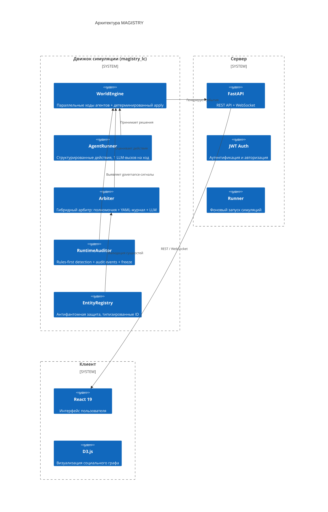

# Обзор системы MAGISTRY

## Назначение и предметная область

MAGISTRY (Multi-Agent Governance and Institutional Simulation for Testing and Research Yield) — платформа для агентной симуляции организационных процессов. Система создана в рамках магистерской диссертации, посвящённой оценке гибридных управленческих систем, сочетающих AI-аудит, репутационный механизм и децентрализованное голосование (модель «AI + DAO»). Основная задача — экспериментальная проверка гипотезы о том, что последовательное наращивание компонентов гибридной системы монотонно улучшает выявление и предотвращение отклонений в организационном поведении.

Когнитивные LLM-агенты моделируют чиновников, предпринимателей, аудиторов и членов экспертных групп, действующих автономно в рамках заданных полномочий. Каждый агент обладает уникальной личностью (текстовая биография + нарративное интервью), потоком памяти с гибридным поиском и способностью к адаптивному поведению — это позволяет наблюдать эмерджентное поведение: сговоры, кумовство, манипуляции, а также их выявление и предотвращение.

Теоретические основания, обзор литературы и обоснование архитектуры — в [chapter_1.md](../chapter_1.md).

## Слои системы

Движок симуляции (`src/magistry_lc/`) содержит всю логику: оркестрацию ходов, агентов, арбитра, модели данных и метрики. Сервер (`web/backend/`) предоставляет REST API для управления прогонами и WebSocket для потоковой передачи событий. Клиент (`web/frontend/`) визуализирует социальный граф, ленту событий и детали агентов.

Помимо `events.jsonl` и `trace.jsonl`, рантайм теперь пишет `truth.jsonl` как deterministic truth-layer и `evaluation.json` как формальную post-hoc сводку точности runtime-аудита.

## Ключевые понятия

Движок оперирует абстракциями, не привязанными к конкретной предметной области.

**Сущность** (`EntityRecord`) — любой объект мира: агент, канал, организация, рабочий элемент. Все сущности регистрируются в `EntityRegistry` с типизированными ID (`agent:off_1`, `chan:public`, `org:admin`, `work:tender_1`). Действия, адресованные несуществующим сущностям, блокируются до обращения к LLM.

**Действие** (`Action`) — структурированная команда агента: `send_message`, `add_work_note`, `submit_work_proposal`, `cast_vote`, `spawn_agent`, `perform` (произвольное). Каждое действие проходит через арбитр, который проверяет полномочия и валидность.

**Полномочие** (`Capability`) — право агента совершать определённый класс действий: `message` (коммуникация), `work` (рабочие записи и предложения), `dao` (голосование), `audit` (audit-related действия, например `modify_reputation` через `perform`), `spawn` (введение новых участников). Один агент может обладать несколькими полномочиями.

**Арбитр** (`Arbiter`) — гибридный механизм: сначала детерминированная проверка полномочий и существования адресатов, затем (для `perform`-действий) LLM-оценка допустимости на основе YAML-журнала мира.

**Runtime-аудитор** (`RuntimeAuditor`) — отдельный governance-компонент, который анализирует уже совершённые события тика, формирует findings (`audit_flagged`, `audit_case_opened`) и может запускать интервенции (`reputation_frozen`). Он не подменяет `Arbiter` и не заменяет post-hoc `ViolationOracle`.

Подробное описание — в [architecture_guide.md](./architecture_guide.md) и [simulation_engine.md](./simulation_engine.md).

## Зависимости

### Движок (Python 3.12+)

| Пакет | Версия | Назначение |
|---|---|---|
| pydantic | 2.0+ | Модели данных, валидация |
| langgraph | 0.2+ | Оркестрация графа состояний |
| langchain-core | 0.2+ | Базовые типы LangChain |
| openai | 1.0+ | LLM-провайдер (OpenAI-совместимый API) |
| rich | 13.7+ | CLI-интерфейс |
| pyyaml | 6.0+ | Конфигурация сценариев |
| rank-bm25 | 0.2.2+ | Лексический поиск в памяти (опционально) |

### Веб-интерфейс

| Пакет | Версия | Назначение |
|---|---|---|
| React | 19.2+ | Пользовательский интерфейс |
| D3.js | 7.9+ | Визуализация графа |
| FastAPI | 0.115+ | REST API + WebSocket |
| aiosqlite | — | Асинхронный доступ к SQLite |
| PyJWT | — | JWT-токены |
| Vite | — | Сборка фронтенда |
