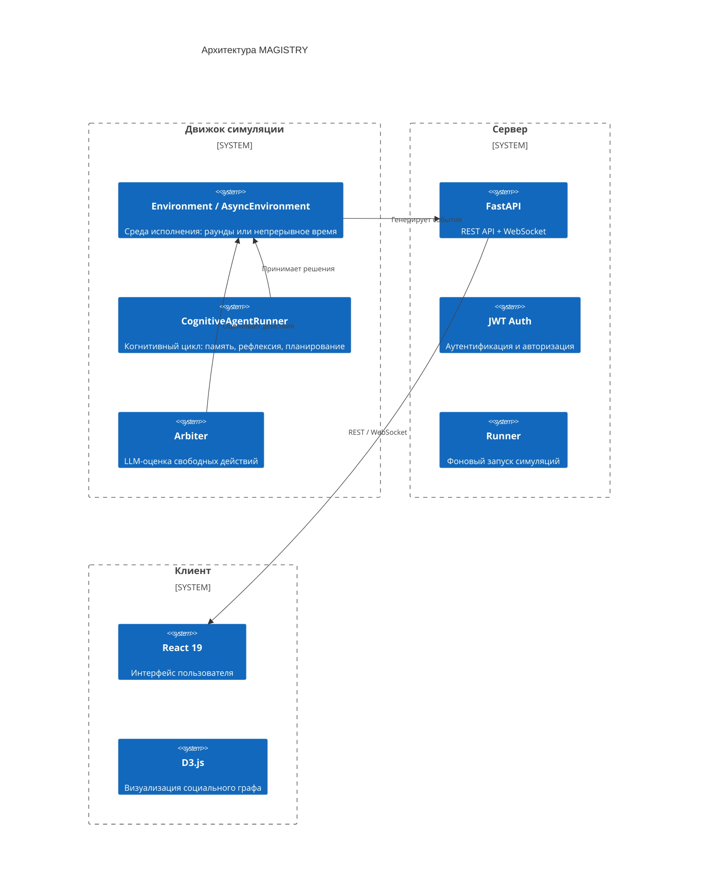

# Обзор системы MAGISTRY

## Назначение и предметная область

MAGISTRY (Multi-Agent Governance and Institutional Simulation for Testing and Research Yield) — мета-двигатель для агентной симуляции организационных процессов. Система создана в рамках магистерской диссертации, посвящённой оценке гибридных управленческих систем, сочетающих AI-аудит и децентрализованное голосование (модель «AI + DAO»). Основная задача — экспериментальная проверка гипотезы о том, что такое сочетание снижает уровень коррупции в организациях эффективнее, чем традиционные механизмы контроля или их полное отсутствие.

Когнитивные LLM-агенты моделируют чиновников, предпринимателей, аудиторов и присяжных, действующих автономно в рамках заданных полномочий и ресурсов. Каждый агент обладает уникальной личностью, потоком памяти и способностью к рефлексии — это позволяет наблюдать эмергентное поведение: сговоры, кумовство, манипуляции, а также их выявление и предотвращение.

Подробная концепция исследования изложена в [CONCEPT.README.md](../CONCEPT.README.md).

## Слои системы

Движок симуляции (`src/magistry_sim/`) содержит всю логику: среду исполнения, когнитивных агентов, модели данных, инструменты и метрики. Сервер (`web/backend/`) предоставляет REST API для управления прогонами и WebSocket для потоковой передачи событий. Клиент (`web/frontend/`) визуализирует социальный граф, ленту событий и детали агентов.

## Ключевые понятия

Движок оперирует четырьмя универсальными абстракциями, не привязанными к конкретной предметной области.

**Дело** (`Case`) — организационный процесс, требующий решения. Закупка оборудования, найм сотрудника, согласование бюджета — всё это дела. Поля `case_type` и `stage` являются произвольными строками, что позволяет агентам создавать процессы любых типов без изменения кода движка. Дело хранит предложения, записи, голоса и итоговое решение.

**Предложение** (`Proposal`) — отклик агента на открытое дело. Ценовая заявка на закупку, резюме кандидата, план расходов — содержание зависит от типа дела и формулируется агентом в свободном тексте. Движок не интерпретирует содержание.

**Полномочие** (`Capability`) — право агента совершать определённое действие. Не роль, а конкретное право: `open_case` (открывать дела), `submit_proposal` (подавать предложения), `resolve_case` (принимать решения), `audit` (проверять), `vote` (голосовать). Один агент может обладать несколькими полномочиями.

**Ресурс** (`ResourcePool`) — количественные ограничения агента: бюджетный лимит (`budget_limit`), штатные единицы (`staffing_slots`), контрактная ёмкость (`contract_capacity`). Полномочие отвечает на вопрос «имеет ли право», ресурс — на вопрос «имеет ли средства».

Подробное описание абстракций — в [ARCHITECTURE.md](../ARCHITECTURE.md), раздел 3.

## Зависимости

### Движок (Python 3.12+)

| Пакет | Версия | Назначение |
|---|---|---|
| pydantic | 2.0+ | Модели данных, валидация |
| networkx | 3.0+ | Социальный граф |
| rich | 13.7+ | CLI-интерфейс |
| openai | 1.0+ | LLM-провайдер |
| python-dotenv | 1.0+ | Переменные окружения |
| rank-bm25 | 0.2.2+ | Лексический поиск (опционально) |
| sentence-transformers | 3.0+ | Локальные эмбеддинги (опционально) |
| scipy | 1.12+ | Статистический анализ (опционально) |

### Веб-интерфейс

| Пакет | Версия | Назначение |
|---|---|---|
| React | 19.2+ | Пользовательский интерфейс |
| D3.js | 7.9+ | Визуализация графа |
| react-markdown | 10.1+ | Отображение Markdown |
| FastAPI | 0.115+ | REST API + WebSocket |
| aiosqlite | — | Асинхронный доступ к SQLite |
| PyJWT | — | JWT-токены |
| Vite | — | Сборка фронтенда |
