# Архитектура подсистемы «Персона = Интервью»

## Обоснование подхода

Модуль генерации персон реализует ключевую идею из работы Park J.S. et al. «Generative Agent Simulations of 1,000 People» (2024): качество воспроизведения индивидуального поведения напрямую зависит от объёма и структуры биографического контекста, доступного агенту. Авторы показали, что генеративные агенты, построенные на основе двухчасовых интервью, достигают нормализованной точности 0,85 в предсказании ответов реальных респондентов (тест GSS). Короткие числовые профили (HEXACO, Big Five) и краткие биографические описания приводят к кластеризации поведения — агенты теряют индивидуальность и демонстрируют однотипные паттерны.

Эта закономерность критична для MAGISTRY, поскольку целью системы является моделирование коррупционных динамик в муниципальных организациях. Разнообразие поведенческих стратегий — от идеалиста, отвергающего любые нарушения, до макиавеллиста, выстраивающего сеть зависимостей — может возникнуть только при достаточной глубине персонализации. Сугубо числовые профили порождают агентов, склонных к усреднённому, «рациональному» поведению, что делает невозможным исследование механизмов постепенной нормализации девиаций (техники нейтрализации по Сайксу и Матце).

Подход MAGISTRY адаптирует модель Park et al. к специфике симуляции: вместо обработки реальных интервью система генерирует синтетические через управляемую цепочку, при которой каждый этап вносит вариативность, а итоговое интервью становится основным хранилищем «личности» агента.

## Цепочка генерации

Генерация персоны состоит из трёх последовательных этапов. Параллелизация выполняется между агентами, а не внутри этапов одного агента, что обеспечивает согласованность цепочки при линейном ускорении по числу потоков.

Первый этап — генерация затравочных данных (seed). Единственный вызов языковой модели на всю группу агентов порождает набор «затравок» (PersonalitySeed): имя, происхождение, ключевые события биографии, мотивацию и этическую позицию. На этом этапе модель получает контекст сценария (описание организации, ролевая структура, конфликты), что обеспечивает привязку к конкретной симуляции. Одна затравка порождается на каждого агента.

Второй этап — генерация профиля личности. Из затравки языковая модель формирует полноценный профиль AgentPersonality: числовые шкалы HEXACO (честность, эмоциональность, экстраверсия, доброжелательность, добросовестность, открытость), трёхкомпонентный профиль «тёмной триады» (макиавеллизм, нарциссизм, психопатия), список доступных техник нейтрализации и развёрнутую биографию. Биография, в отличие от числовых шкал, несёт основную индивидуализирующую нагрузку: она описывает формирующий опыт, мотивы, внутренние конфликты и «красные линии» персонажа.

Третий этап — генерация нарративного интервью. Протокол версии 2 включает 30 вопросов по 8 доменам: «Повседневная жизнь», «Работа и карьера», «Финансы и деньги», «Отношения и доверие», «Ценности и мораль», «Конфликты и давление», «Власть и иерархия», «Нарративная идентичность». Вопросы генерируются блоками по 10, после чего два виртуальных эксперта (психолог и экономист) дают оценки. Каждая пара «вопрос — ответ» становится фрагментом (InterviewFragment), который затем эмбеддится для поддержки фрагментного поиска.

## Фрагментный поиск (fragment-based retrieval)

При формировании когнитивного промпта во время симуляции система выполняет гибридный поиск по индексу фрагментов интервью. Текущая ситуация агента декомпозируется на 2-3 подвопроса (через отдельный вызов языковой модели), по каждому подвопросу выполняется гибридный поиск (BM25 + cosine similarity), результаты дедуплицируются по тексту вопроса и ограничиваются 8 фрагментами. Это обеспечивает контекстно-зависимую активацию релевантных аспектов личности без необходимости включать в промпт полный текст интервью.

## Архитектурная диаграмма

```mermaid
flowchart TD
    subgraph Генерация
        A["ScenarioConfig<br/>(агенты, роли, контекст)"] --> B["generate_seeds()<br/>(1 LLM-вызов на N агентов)"]
        B --> C["PersonalitySeed[]"]
        C --> D["ThreadPoolExecutor<br/>(N потоков)"]
        D --> E["generate_personality_from_seed()<br/>(1 LLM-вызов)"]
        E --> F["AgentPersonality<br/>(HEXACO, Dark Triad,<br/>нейтрализация, биография)"]
        F --> G["generate_interview()<br/>(~5 LLM-вызовов)"]
        G --> H["Interview<br/>(30 Q&A + экспертные оценки)"]
    end

    subgraph Хранилище
        F --> I["data/personalities/<br/>{agent_id}.json"]
        H --> J["data/interviews/<br/>{agent_id}.json"]
    end

    subgraph Симуляция
        J --> K["InterviewFragmentIndex<br/>(BM25 + cosine)"]
        K --> L["retrieve_interview_context()"]
        L --> M["Когнитивный промпт<br/>(AgentRunner)"]
        I --> N["_ensure_personality()"]
        N --> M
    end

    style A fill:#2a2a3e,stroke:#6366f1
    style D fill:#2a2a3e,stroke:#22c55e
    style K fill:#2a2a3e,stroke:#f59e0b
```

## Назначение персистентных личностей

Система поддерживает два режима привязки личности к агенту. В режиме автогенерации (по умолчанию) при запуске симуляции каждому агенту без `personality_archetype` генерируется новая персона через описанную цепочку. В режиме назначения пользователь выбирает готовую личность из библиотеки PersonalitiesView и привязывает её к агенту в ScenariosView. При запуске файлы личности и интервью копируются в директорию прогона, а генерация вызывается только для агентов без назначения. Это позволяет воспроизводить эксперименты с контролируемым составом агентов.

## Параллелизация

Генерация персон параллелизована на уровне агентов через `ThreadPoolExecutor`. Этап генерации затравок (seed) выполняется последовательно (один вызов на всю группу), после чего для каждого агента независимо генерируются профиль и интервью. При 6 агентах и 5 потоках ускорение составляет примерно 4-5 раз относительно последовательного выполнения.

Параллелизация самой симуляции на текущем LC tick-engine управляется через `runtime.parallel_agents` и `runtime.parallel_workers`: генерация решений агентами может идти конкурентно, но применение к миру остаётся последовательным. Поле `parallel_window_seconds` пока хранится как совместимый launcher-параметр и попадает в `ScenarioConfig.runtime`, однако сам tick-engine рассматривает весь тик как один батч.
