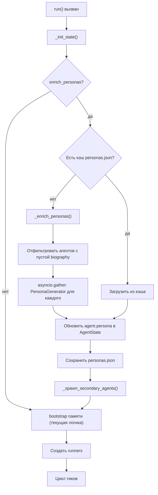
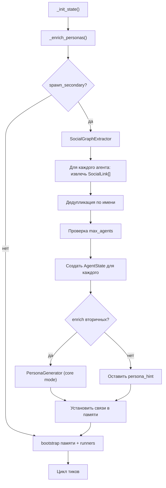

# План: обогащение персон и динамическое создание агентов

Версия: 2.0 | Дата: 2026-03-05

Статус: реализовано в кодовой базе. Документ сохранён как история проектного решения; актуальные контракты и форматы описаны в `docs/simulation_engine.md`, `docs/data_formats.md` и `docs/architecture_guide.md`.

---

## Проблема

Движок MAGISTRY-LC обладает развитым генератором персон (`PersonaGenerator`), способным создавать биографию на 1000-2000 слов и 30 интервью-ответов, однако при запуске симуляции этот генератор не вызывается. Агент получает в промпт только строку `persona` из YAML-сценария (обрезанную до 420 символов, что само по себе неприемлемо), а поля `biography` и `interview` остаются пустыми. Как следствие, долгосрочная память агента стартует практически пустой: единственный `MemoryDoc` типа `persona` с важностью 9.0, содержащий 1-3 предложения. Механизм гибридного поиска по памяти (`retrieve`) становится бесполезным при таком объёме данных.

Вторая проблема — статичность состава агентов. Список участников симуляции задаётся в YAML и не меняется за все тики. Словарь `runners` формируется однократно до цикла, `CreateEntityOp` не поддерживает тип `agent`, действие `request_entity` ограничено видами `org` и `chan`. У каждого агента есть социальное окружение — семья, друзья, бывшие коллеги, — упомянутое в биографии, но отсутствующее в симуляции. Если по сюжету требуется появление нового лица (член семьи, свидетель, конкурирующий подрядчик), текущая архитектура этого не позволяет.

Ключевое наблюдение: обогащение персон и создание вторичных агентов — это связанные процессы. Биография неизбежно порождает социальный граф (жена Волкова, университетский друг Петрова, наставник Новиковой), и этот граф должен материализоваться в виде агентов ещё до первого тика. Отдельно от этого, в ходе симуляции могут возникать событийные персонажи (проверяющий из области, журналист), для чего нужен механизм спавна в рантайме.

---

## Часть А. Обогащение персон при запуске симуляции

### А.1. Суть изменения

При старте `WorldEngine.run()`, перед циклом тиков, для каждого агента с пустой биографией вызывается `PersonaGenerator`, который расширяет `PersonaArtifact` до полной версии (summary + biography + interview). Обогащённая персона записывается обратно в `AgentState.persona` и бутстрапится в долгосрочную память агента по существующей схеме.

Обогащение происходит именно в рантайме, а не при составлении сценария, по двум причинам. Во-первых, YAML-сценарии задумывались как компактные и читаемые для человека — вкладывать в них тысячи слов биографий нецелесообразно. Во-вторых, пользователь может править персону в сценарии между прогонами, и генерация должна каждый раз отражать актуальный `persona_hint`.

### А.2. Удаление усечения персоны в промпте

Текущее ограничение в `agent.py:138` (`_truncate(agent.persona.summary, 420)`) — рудимент. Summary контролируется либо генератором (3-6 предложений), либо автором сценария, который сам решает длину. Искусственная обрезка удаляется: `_render_memory` передаёт `agent.persona.summary` целиком.

Одновременно `_render_memory` получает дополнительную секцию: если `agent.persona.biography` непуста, в промпт добавляется краткий отрывок биографии (первые 600 символов) под заголовком «Биография (начало):». Остальная часть биографии доступна через гибридный поиск по долгосрочной памяти, куда она была загружена при bootstrap.

### А.3. Конфигурация

В `RuntimeConfig` добавляются два новых поля:

```
enrich_personas: bool = False
persona_enrich_mode: Literal["full", "core"] = "full"
```

По умолчанию обогащение выключено — это сохраняет обратную совместимость и не замедляет прогоны, где полная персона не нужна (дымовые тесты, отладка). Включается явно в YAML-сценарии:

```yaml
runtime:
  enrich_personas: true
  persona_enrich_mode: full  # или "core" для экономии
```

Значение `"full"` означает: summary + biography + 30 интервью (3-7 вызовов LLM на агента). Значение `"core"` — только summary + biography (1 вызов), подходит для прототипирования и дешёвых прогонов.

### А.4. Поток выполнения



### А.5. Изменения по файлам

**`config.py`** — добавить `enrich_personas: bool = False` и `persona_enrich_mode: Literal["full", "core"] = "full"` в `RuntimeConfig`.

**`engine.py`** — новый метод `_enrich_personas` (вызов через публичный API `PersonaGenerator.generate(...)`; для режима `core` лучше добавить публичный `generate_core(...)`, а не вызывать приватный `_generate_core` напрямую):

```python
async def _enrich_personas(
    self, *, state: WorldState, llm: LLMCaller
) -> None:
    gen = PersonaGenerator(llm=llm, temperature=self.cfg.llm.temperature)
    mode = self.cfg.runtime.persona_enrich_mode
    to_enrich = [
        (aid, agent)
        for aid, agent in state.agents.items()
        if not agent.persona.biography.strip()
    ]
    if not to_enrich:
        return

    async def _one(aid: str, agent: AgentState) -> None:
        try:
            if mode == "core":
                enriched = await gen._generate_core(
                    agent_id=aid,
                    name=agent.name,
                    internal=agent.internal,
                    persona_hint=agent.persona.summary,
                    scenario_description=self.cfg.description,
                    language=self.cfg.runtime.language,
                )
            else:
                enriched = await gen.generate(
                    agent_id=aid,
                    name=agent.name,
                    internal=agent.internal,
                    persona_hint=agent.persona.summary,
                    scenario_description=self.cfg.description,
                    language=self.cfg.runtime.language,
                )
            agent.persona = enriched
        except Exception as exc:
            logger.warning("Persona enrichment failed for %s: %s", aid, exc)

    await asyncio.gather(*[_one(aid, agent) for aid, agent in to_enrich])
```

Вызов `_enrich_personas` размещается между `_init_state()` и циклом, в котором создаются runners и выполняется bootstrap памяти. Порядок критичен: сначала обогащаем персону, затем бутстрапим её в память — иначе в долгосрочную память попадёт старая, короткая версия.

**`agent.py`** — убрать `_truncate` для summary, добавить отрывок биографии в промпт.

**`persona.py`** — добавить публичный `generate_core(...)` (summary+biography с фолбэками), чтобы `engine.py` не вызывал приватный `_generate_core`.

### А.6. Кэш обогащённых персон

Обогащённая персона расходует 3-7 вызовов к LLM на агента (при `"full"`). При повторных запусках одного сценария эти вызовы будут дублироваться. Для устранения этой проблемы предусматривается файловый кэш.

После успешного обогащения всех агентов движок сохраняет файл `{out_dir}/personas.json`, содержащий:
- `meta` с fingerprint входов;
- `personas` как словарь `agent_id → PersonaArtifact.model_dump()`.

Fingerprint должен включать минимум:
- `seed`;
- `runtime.language`;
- `runtime.persona_enrich_mode`;
- `llm.model` и `llm.base_url`;
- `cfg.description`;
- для каждого агента: `agent_id`, `name`, `internal`, `persona.summary`.

При следующем запуске кэш используется только если fingerprint полностью совпал; иначе кэш игнорируется и перезаписывается.

Кэш решает две задачи: экономит токены и обеспечивает воспроизводимость (при одном seed + одном persona_hint персона идентична между прогонами).

### А.7. Влияние на CLI

В `cli.py` для команды `run` добавляется флаг `--enrich-personas` (переопределяет YAML). Это удобно при работе с чужими сценариями, которые не содержат `enrich_personas: true`.

---

## Часть Б. Генерация вторичных агентов из социального графа

### Б.1. Суть изменения

После обогащения персон (часть А) движок анализирует биографии всех агентов и извлекает из них упоминания значимых людей — членов семьи, близких друзей, бывших коллег, наставников, конкурентов. Каждое такое упоминание потенциально порождает вторичного агента, который участвует в симуляции с первого тика.

Почему именно так, а не через worldgen в ходе симуляции: социальное окружение агента — это не случайное событие, а исходное условие. Жена Волкова, с которой он обсуждает рабочие проблемы за ужином, существует до начала тендера и влияет на его решения с самого старта. Откладывать её появление до тика 5, когда worldgen «решит» её ввести, — значит терять причинно-следственную связность.

### Б.2. Конфигурация

В `RuntimeConfig` добавляются поля:

```
spawn_secondary: bool = False
max_secondary_per_agent: int = 2
max_agents: int = 15
```

`spawn_secondary` включает механизм (по умолчанию выключен). `max_secondary_per_agent` ограничивает число вторичных агентов, извлекаемых из биографии одного первичного. Значение 2 выбрано как компромисс: самые значимые связи (супруг + ближайший коллега/друг) попадают в симуляцию, но не раздувают её. `max_agents` — жёсткий потолок общего числа агентов.

Пример для сценария с 5 первичными агентами: при `max_secondary_per_agent=2` может появиться до 10 вторичных, но `max_agents=15` ограничит итог.

### Б.3. Извлечение социального графа

Новый класс `SocialGraphExtractor` в файле `persona.py` (или отдельном `social.py`). Принимает список обогащённых `PersonaArtifact` и через один структурированный LLM-вызов на агента извлекает массив значимых людей:

```python
@dataclass(slots=True)
class SocialLink:
    name: str              # "Волкова Наталья Ивановна"
    relation: str          # "жена", "однокурсник", "наставник"
    relevance: str         # почему этот человек важен для сюжета (1-2 предл.)
    persona_hint: str      # краткое описание личности (2-4 предл.)
    internal: bool         # входит в организацию (True) или внешний (False)
    capabilities: list[str]  # рекомендуемые возможности
```

Промпт для извлечения:

```
Проанализируй биографию и интервью агента. Выдели до {max_secondary_per_agent}
людей, наиболее значимых для сюжета сценария. Это могут быть:
- члены семьи, влияющие на решения агента;
- давние знакомые/друзья, связанные с текущей ситуацией;
- бывшие коллеги/наставники с релевантным опытом.

Не включай людей, уже присутствующих как агенты: {existing_agent_names}.
Для каждого укажи: кто это, как связан с агентом, почему важен для сюжета,
краткое описание личности (2-4 предложения), внутренний/внешний, возможности.
```

LLM возвращает структурированный JSON. Один вызов на агента, все агенты обрабатываются параллельно через `asyncio.gather`. Контекст сценария (`self.cfg.description`) передаётся в промпт, чтобы LLM выбирал людей, релевантных именно этому сюжету, а не перечислял всех упомянутых.

### Б.4. Дедупликация и фильтрация

Разные агенты могут упоминать одного и того же человека (Волков и Петров оба знают ректора политеха). `SocialGraphExtractor` выполняет дедупликацию по имени (нечёткое сравнение, поскольку LLM может варьировать формулировки). Если один человек упомянут несколькими агентами, это повышает его приоритет — он создаётся в первую очередь.

Фильтрация: вторичные агенты не получают возможность `"audit"` (аудит — привилегия, задаваемая явно в сценарии) и `"spawn"` (вторичные агенты не могут порождать третичных — это предотвращает рекурсивный рост).

### Б.5. Создание вторичных агентов

Для каждого одобренного `SocialLink` движок выполняет те же шаги, что `_init_state` для первичных агентов:

1. Генерация `agent_id` через детерминированный slug-normalizer: базовый формат `agent:sec_{slug}` (например, `agent:sec_volkova_wife`) + суффикс `_2`, `_3` при коллизиях.  
   Примечание: текущий `IdAllocator` не даёт нужный шаблон `sec_*`, поэтому для вторичных агентов нужен отдельный детерминированный конструктор ID.
2. Регистрация в `EntityRegistry`.
3. Создание `AgentState` с `PersonaArtifact(summary=persona_hint)`.
4. Генерация события `entity_created`.
5. Если `enrich_personas=True` и `persona_enrich_mode="full"` — обогащение персоны вторичного агента (biography + interview). Для экономии по умолчанию вторичные обогащаются в режиме `"core"` (только summary + biography).
6. Bootstrap памяти.
7. Создание `AgentRunner`.

Вторичные агенты получают стартовый контекст: в их рабочую память добавляется запись «Связь: {relation} агента {primary_name}», чтобы они знали о своей роли с первого тика.

### Б.6. Связи между агентами

После создания вторичных агентов движок устанавливает двусторонние связи. В рабочую память первичного агента добавляется запись «{relation}: {secondary_name} ({secondary_agent_id})» с важностью 8.5. В рабочую память вторичного — аналогичная запись о первичном. Это гарантирует, что агенты «знают» друг о друге с первого тика, а не случайно «встречаются» через несколько тиков.

### Б.7. Поток выполнения



### Б.8. Пример

Рассмотрим сценарий тендера. После обогащения персон биография Волкова содержит: «Женат на Наталье Ивановне, преподавательнице математики в школе №12 — одной из тех, что подлежат ремонту. Она не знает о его неформальных договорённостях с подрядчиками, но замечает, что муж стал нервничать.»

`SocialGraphExtractor` выделяет:
- Волкова Н.И., жена, преподаватель школы №12. Важна для сюжета: школа, где она работает, входит в тендер — это создаёт дополнительный конфликт интересов.

Аналогично, из биографии Новиковой: «Её научный руководитель на юрфаке, профессор Семёнов, привил ей нетерпимость к коррупции.»

Семёнов — внешний агент (уже не в организации), но может быть советчиком Новиковой через переписку.

Итого: к 5 первичным агентам добавляются 2-4 вторичных, каждый со своей мотивацией, связанной с основным сюжетом.

---

## Часть В. Динамическое создание агентов в ходе симуляции

### В.1. Суть изменения

Помимо предстартовой генерации из социального графа, движок поддерживает появление новых агентов в ходе симуляции. Это событийные персонажи: проверяющий из областной администрации, журналист, новый подрядчик. Их появление обусловлено не биографиями, а развитием сюжета.

Два источника спавна: действие агента (`SpawnAgentAction`) и предложение генератора мира (`spawn_suggestion` в worldgen).

### В.2. Конфигурация

В `RuntimeConfig` добавляется поле:

```
allow_runtime_spawn: bool = False
```

`max_agents` (из части Б) действует и здесь как общий лимит. `allow_runtime_spawn` отделён от `spawn_secondary`: можно включить предстартовую генерацию без рантайм-спавна, и наоборот.

### В.3. Действие `SpawnAgentAction`

В `actions.py` добавляется новый тип действия:

```python
class SpawnAgentAction(_BaseAction):
    type: Literal["spawn_agent"] = "spawn_agent"
    slug: str          # короткий идентификатор, например "inspector"
    name: str          # имя, например "Сидоров П.К."
    internal: bool     # внутренний или внешний агент
    persona_hint: str  # описание личности 2-4 предложения
    capabilities: list[str] = ["message", "work"]
```

Действие доступно только агентам с возможностью `"spawn"` в списке capabilities. Это отдельная возможность, не входящая в стандартный набор, чтобы автор сценария мог точечно разрешить спавн конкретным агентам.

### В.4. Обработка в арбитре

`SpawnAgentAction` обрабатывается детерминированно в `_arbitrate_one()`, поскольку все параметры заданы явно. Арбитр выполняет валидацию:

1. У инициатора есть возможность `"spawn"` в capabilities.
2. `allow_runtime_spawn` включён в конфигурации.
3. Текущее число агентов меньше `max_agents`.
4. `slug` не конфликтует с существующими `agent_id` (после нормализации в `agent:{slug}`).
5. `capabilities` проходит allowlist (например, только `message`, `work`, `dao`) и дополнительно не содержит `"audit"`/`"spawn"`.
6. Не более одного спавна за тик от одного инициатора.

При одобрении арбитр порождает `CreateAgentOp`.

### В.5. Новая операция: `CreateAgentOp`

В `ops.py` добавляется:

```python
@dataclass(slots=True)
class CreateAgentOp:
    entity_id: str
    name: str
    internal: bool
    persona_hint: str
    capabilities: list[str]
    created_by: str | None   # agent_id инициатора или None (системный)
    created_tick: int

    def apply(self, state: WorldState) -> list[Event]:
        ...
```

Метод `apply` выполняет три шага: регистрацию в `EntityRegistry`, создание `AgentState` с `PersonaArtifact(summary=persona_hint)`, генерацию события `entity_created` с `kind="agent"`. Персона минимальна (только summary) — полная генерация произойдёт в следующей фазе.

### В.6. Регистрация новых агентов в цикле тиков

Двухфазный подход: на текущем тике `CreateAgentOp` создаёт сущность в `WorldState`, но `AgentRunner` и bootstrap памяти выполняются после `_apply_actions`. Новый агент получает полноценный ход со следующего тика.

```python
new_agents = self._detect_new_agents(state=state, runners=runners)
if new_agents:
    await self._register_new_agents(
        new_agents=new_agents,
        state=state,
        runners=runners,
        llm=llm,
        embedder=embedder,
        embed_cache=embed_cache,
        event_log=event_log,
    )
```

`_detect_new_agents` сравнивает `state.agents.keys()` и `runners.keys()`, возвращая список новых `agent_id`. `_register_new_agents` для каждого выполняет: обогащение персоны (если включено), bootstrap памяти, создание `AgentRunner`.

### В.7. Worldgen как источник спавна

`WorldGenerator` расширяется: помимо событий `world_event` он может предложить `spawn_suggestion` — объект с полями `slug`, `name`, `internal`, `persona_hint`, `reason`. Движок обрабатывает `spawn_suggestion` аналогично `SpawnAgentAction`, но с `created_by=None` (системный спавн).

Worldgen видит ход событий и может ввести событийных персонажей: «На основании публикаций в канале администрации, журналист местной газеты заинтересовался тендером.» Это дополняет предстартовый спавн из социального графа: социальное окружение — статика, событийные персонажи — динамика.

Реализация: в `worldgen.py` расширяется выходная JSON-схема — к массиву `events` добавляется опциональный массив `spawns`. Движок обрабатывает `spawns` после событий.

Обратная совместимость: поддерживаются оба формата worldgen-ответа на переходный период:
- legacy: `list[world_event]` (текущий формат);
- new: `{ "events": [...], "spawns": [...] }`.

### В.8. Структурные изменения в engine.py

`runners` — локальная переменная в теле `run()`. Её нельзя модифицировать из `_apply_ops`. Решение: обрабатывать новых агентов отдельным шагом после `_apply_actions`, передавая `runners` как аргумент в `_register_new_agents`.

---

## Часть Г. Ограничения и защитные механизмы

### Г.1. Лимиты на обогащение

Генерация полной персоны расходует 3-7 вызовов LLM на агента. Для сценария с 5 агентами это 15-35 дополнительных вызовов до старта симуляции. При использовании дешёвых моделей/провайдеров (Groq) это допустимо, но при дорогих может быть существенным. Файловый кэш (А.6) решает проблему при повторных запусках, но первый запуск остаётся дорогим. Режим `"core"` (1 вызов на агента) — компромисс для прототипирования.

### Г.2. Лимиты на спавн

Защита многоуровневая. Первый уровень — `max_agents` в конфигурации (жёсткий потолок на все типы агентов: первичные + вторичные + рантайм). Второй — `max_secondary_per_agent` ограничивает предстартовый спавн. Третий — возможность `"spawn"` выдаётся только нужным агентам через capabilities в YAML. Четвёртый — вторичные и рантайм-агенты не получают `"spawn"`, что предотвращает рекурсивный рост.

### Г.3. Консистентность seed

Обогащение персон и спавн добавляют недетерминированные LLM-вызовы. Для сохранения воспроизводимости seed влияет только на порядок агентов (`_agent_order`) и на детерминированные операции, но не на содержимое LLM-ответов. Это уже текущее поведение движка (LLM-ответы всегда стохастичны), поэтому новые фичи не нарушают контракт. Файловый кэш персон (А.6) дополнительно стабилизирует результат при повторных запусках.

---

## Часть Д. Порядок реализации

Реализация разбита на четыре этапа, каждый из которых может быть сдан и протестирован независимо.

### Этап 1. Обогащение персон (части А.1-А.7)

Изменяемые файлы: `config.py`, `engine.py`, `agent.py`, `cli.py`.

Объём: 100-140 строк нового кода. Тесты: проверить, что при `enrich_personas=True` агент получает непустую биографию и интервью; проверить, что при `False` поведение не меняется; проверить кэш персон; проверить что summary передаётся без усечения и отрывок биографии попадает в промпт. Для тестов использовать `MockLLMProvider` с заранее подготовленными ответами.

Definition of Done:
- код + тесты зелёные;
- обновлены `docs/simulation_engine.md` и `docs/data_formats.md` (изменение `RuntimeConfig`);
- обновлён `docs/cli_reference.md` (новый флаг `--enrich-personas`).

### Этап 2. Генерация вторичных агентов (части Б.1-Б.8)

Изменяемые файлы: `persona.py` (или новый `social.py`), `engine.py`, `config.py`.

Объём: 180-250 строк. Ядро: `SocialGraphExtractor`, метод `_spawn_secondary_agents` в движке, дедупликация, установка связей в памяти. Тесты: извлечение `SocialLink` из мок-биографии, создание вторичных агентов, проверка лимита `max_agents`, проверка двусторонних связей в памяти.

Definition of Done:
- код + тесты зелёные;
- обновлены `docs/simulation_engine.md` и `docs/data_formats.md` (новые runtime-поля);
- при добавлении нового модуля отражено дерево в `AGENTS.md`.

### Этап 3. Операция создания агента в рантайме (части В.1-В.6)

Изменяемые файлы: `actions.py`, `ops.py`, `arbiter.py`, `engine.py`, `config.py`.

Объём: 150-200 строк. `SpawnAgentAction`, `CreateAgentOp`, валидация в арбитре, `_detect_new_agents`, `_register_new_agents`. Тесты: создание агента через мок-действие, проверка лимитов, проверка что новый агент действует со следующего тика.

Definition of Done:
- код + тесты зелёные;
- обновлены `docs/simulation_engine.md` и `docs/data_formats.md` (новые action/op/runtime-поля).

### Этап 4. Worldgen-спавн и схема действий (части В.7-В.8)

Изменяемые файлы: `agent.py`, `worldgen.py`.

Объём: 60-80 строк. Расширение `WorldGenerator` массивом `spawns`, добавление `spawn_agent` в JSON-схему действий агента. Тесты: worldgen предлагает spawn, движок создаёт агента; агент с `"spawn"` запрашивает создание через JSON-действие; legacy-формат worldgen продолжает работать.

Definition of Done:
- код + тесты зелёные;
- обновлены `docs/simulation_engine.md` и `docs/data_formats.md`;
- если меняется CLI/API контракт, обновлены соответствующие справочники.

---

## Приложение: карта затрагиваемых файлов

| Файл | Этап | Характер изменений |
|---|---|---|
| `config.py` | 1, 2, 3 | Новые поля в `RuntimeConfig` |
| `engine.py` | 1, 2, 3 | `_enrich_personas`, `_spawn_secondary_agents`, `_detect_new_agents`, `_register_new_agents` |
| `agent.py` | 1, 4 | Убрать усечение summary, отрывок биографии, расширение JSON-схемы действий |
| `cli.py` | 1 | Флаг `--enrich-personas` |
| `persona.py` / `social.py` | 2 | `SocialGraphExtractor`, `SocialLink` |
| `actions.py` | 3 | `SpawnAgentAction`, расширение `ActionType` |
| `ops.py` | 3 | `CreateAgentOp` |
| `arbiter.py` | 3 | Обработка `SpawnAgentAction` в `_arbitrate_one` |
| `worldgen.py` | 4 | Массив `spawns` в выходной схеме |
| `state.py` | — | Без изменений |
| `memory.py` | — | Без изменений (bootstrap через существующий `add_doc`) |
