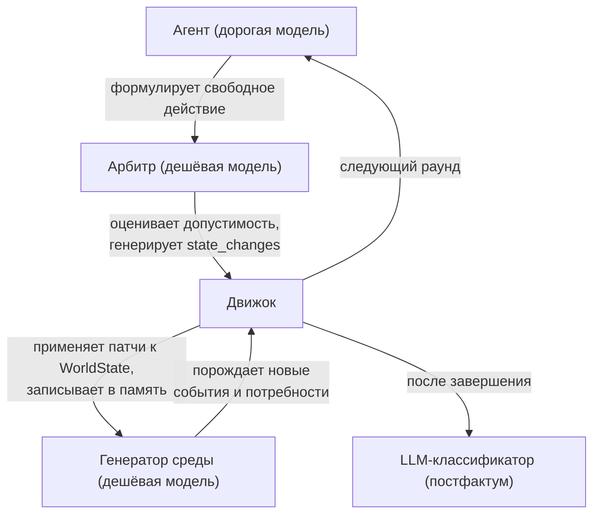

# MAGISTRY v5: Свободные агенты и живой мир

## Контекст и мотивация

Анализ текущей реализации MAGISTRY (v3/v4) выявил структурное противоречие между заявленной целью проекта (моделирование эмерджентного поведения автономных LLM-агентов) и архитектурой движка, которая жёстко детерминирует поведение участников. Потребности организации появляются в фиксированных раундах, бизнес-процессы описаны как строгие конечные автоматы без возможности отклонения, а набор доступных агентам инструментов ограничен восемью типовыми действиями. В результате коррупция сводится к единственному механизму — выбору «своего» победителя на финальной стадии тендера.

Параллельно нереализованным остаётся когнитивный агент (CognitiveAgentRunner), который содержит механики межраундовой памяти, рефлексии и стратегического планирования, но не задействуется в прогонах из-за привязки к локальным моделям sentence-transformers (проблема OOM). Статистическая база ограничена одним прогоном (seed=42) на каждую из 12 конфигураций.

Настоящий документ описывает архитектуру пятой итерации, в которой агенты получают полную свободу действий, мир реагирует на их поведение динамически, а воспроизводимость обеспечивается через temperature=0 и фиксированные seed.

---

## Архитектурный обзор

Новая архитектура строится на разделении четырёх ролей между отдельными LLM-вызовами:



Агент отвечает за стратегическое мышление и выбор действий. Арбитр определяет, реализуемо ли действие в текущем контексте, и если да — как оно меняет состояние мира. Генератор среды порождает новые события органически, реагируя на произошедшее. Классификатор анализирует лог после завершения симуляции и строит метрики.

Все четыре роли работают через единый провайдер OpenRouter, что позволяет гибко выбирать модели: дорогую (GPT-4o, Claude) для агентов, дешёвую (GPT-4o-mini, Haiku) для арбитра и генератора среды. Температура всех вызовов устанавливается в 0, что в сочетании с фиксированным seed обеспечивает детерминированную воспроизводимость прогонов.

---

## Секция 1: Свободные действия агентов

### Отказ от фиксированных инструментов

Текущие восемь инструментов (talk_to, open_case, submit_proposal, add_note, resolve_case, file_report, cast_vote, move_to) заменяются единственным универсальным инструментом `perform_action`. Агент описывает намерение на естественном языке: что он хочет сделать, на кого или на что направлено действие, и почему.

```
perform_action(
    description: str,   # "Хочу отменить тендер D-001, сославшись на процедурные нарушения"
    target: str | None,  # "D-001" или "biz_1" или None
    justification: str   # "Обнаружены нарушения в спецификации"
)
```

Решение об отказе от старых инструментов принято осознанно: сохранение «быстрых путей» для типовых действий создаёт двойственность (агент может и описать действие свободно, и вызвать жёсткий инструмент), что усложняет метрики и размывает эксперимент. В чистой модели все действия проходят через единый канал — арбитр.

### Что становится возможным

Агенты получают возможность совершать действия, которые были заблокированы архитектурой v3/v4:

- Инициировать потребность самостоятельно (фиктивная закупка для вывода бюджета).
- Отменить, заморозить или скрыть тендер.
- Изменить параметры дела на ходу (заточить ТЗ под конкретного подрядчика).
- Подделать или удалить документ.
- Передать средства (взятка как системное действие, а не текстовое обещание).
- Оказать давление на участников (найти через граф и предложить взятку).
- Любое другое действие, которое LLM сочтёт осмысленным в контексте.

---

## Секция 2: LLM-арбитр

### Входные данные

Арбитр получает три компонента на каждый вызов.

Первый — **правила среды** (system prompt). Документ описывает физику и институциональное устройство моделируемого мира: какие должности существуют, какие полномочия дают, какие ресурсы доступны, какие действия физически возможны (включая незаконные). Правила описывают реальность, а не мораль. Арбитр не должен блокировать коррупцию; он оценивает реалистичность действия в данном контексте.

Второй — **сжатое состояние мира**: агенты и их должности, открытые дела и их стадии, социальный граф (связи и их сила), бюджеты и ресурсы, репутация. Не полный WorldState, а релевантная выжимка, достаточная для оценки допустимости.

Третий — **описание действия** от агента.

### Выходная структура

```json
{
  "feasible": true,
  "state_changes": [
    {"op": "create_case", "params": {"type": "procurement", "title": "..."}},
    {"op": "close_case", "case_id": "D-001", "decision": "отменён"},
    {"op": "transfer_funds", "from": "budget", "to": "biz_1", "amount": 500000},
    {"op": "add_evidence", "type": "forged_document", "visible_to": ["off_1"]},
    {"op": "modify_reputation", "agent_id": "off_1", "delta": -2.0},
    {"op": "send_message", "from": "off_1", "to": "biz_1", "content": "...", "private": true},
    {"op": "update_graph", "agent_a": "off_1", "agent_b": "biz_1", "delta": 0.5}
  ],
  "side_effects": [
    {"type": "evidence_trail", "description": "В журнале осталась запись об отмене"},
    {"type": "reputation_risk", "description": "Если аудитор проверит — потеря репутации"}
  ],
  "narrative": "Козлов И.М. отменил тендер D-001, сославшись на процедурные нарушения..."
}
```

Поле `feasible` определяет, может ли действие физически произойти. Если `false`, агенту возвращается объяснение, почему действие невозможно, и ход продолжается (агент может попробовать другое действие).

### Реестр операций (StateOp)

Движок поддерживает конечный набор операций над WorldState. Каждая операция описана pydantic-моделью со строгой валидацией. Арбитр может предложить операцию, которой нет в реестре — она игнорируется, но текстовый след в narrative сохраняется.

Начальный набор операций:

| Операция | Назначение |
|----------|-----------|
| create_case | Создать новое дело |
| close_case | Закрыть/отменить дело |
| modify_case | Изменить параметры дела |
| submit_proposal | Подать предложение |
| transfer_funds | Передать средства |
| add_evidence | Добавить улику/документ |
| remove_evidence | Удалить/подделать документ |
| modify_reputation | Изменить репутацию |
| send_message | Отправить сообщение |
| update_graph | Изменить силу связи |
| freeze_case | Заморозить дело |
| file_complaint | Подать жалобу |
| initiate_tribunal | Инициировать трибунал |
| cast_vote | Проголосовать |
| move_agent | Переместить агента |

Реестр расширяем: новые операции добавляются по мере обнаружения паттернов в поведении агентов, которые не покрываются текущим набором.

### Контроль качества

Выход арбитра проходит валидацию через pydantic-схему. Некорректные операции (несуществующий agent_id, отрицательный amount, ссылка на несуществующее дело) отбрасываются. В лог записывается предупреждение, но симуляция не прерывается.

---

## Секция 3: Память и непрерывность сознания

### Отказ от CrewAI

CrewAIAgentRunner создаёт новый объект Crew на каждый ход агента, теряя межраундовый контекст. Для живой симуляции это неприемлемо. Основным runner-ом становится доработанный CognitiveAgentRunner, уже реализованный в кодовой базе.

### Замена embedding-провайдера

Интерфейс `EmbeddingProvider` абстрагирован в коде. Добавляется реализация `OpenRouterEmbeddingProvider`, использующая embedding-модели через OpenRouter API. Это снимает проблему OOM полностью: никаких локальных моделей, вычисления на стороне провайдера.

### Компоненты когнитивного агента

Все три компонента уже реализованы в коде и требуют минимальной доработки:

**MemoryStream** (memory.py). Поток памяти с гибридным поиском (BM25 + cosine similarity). Каждое действие агента, каждый ответ арбитра, каждое наблюдение о действиях других агентов записывается в поток. При формировании хода агент извлекает релевантные воспоминания через retrieve().

**Рефлексия** (reflection.py). В конце каждого раунда (или при накоплении порога важности) агент анализирует произошедшее, формирует выводы, обновляет убеждения. Включает техники нейтрализации — механизм самооправдания коррупционного поведения.

**Планирование** (planning.py). Стратегические цели (долгосрочные) и тактические шаги (на текущий раунд). Планы сохраняются между раундами.

### Интеграция с perform_action

Когнитивный агент на каждом ходу получает контекст, обогащённый воспоминаниями, текущим планом и результатами рефлексии. На выходе он формулирует свободное действие через perform_action, которое проходит через арбитра.

---

## Секция 4: Динамический мир

### Генератор событий среды

В конце каждого раунда, после ходов всех агентов, запускается LLM-генератор мировых событий (дешёвая модель через OpenRouter). Генератор получает сжатую историю раунда и текущее состояние, и решает, какие новые события происходят в мире.

Примеры порождаемых событий: появление новой потребности (организации нужна закупка, потому что бюджет израсходован на 80%), внешняя проверка (реакция на серию отчётов аудитора), утечка информации (приватные переговоры стали известны третьим лицам), кадровые изменения (болезнь ключевого сотрудника в разгар тендера).

### Реактивные потребности

Потребности больше не привязаны к `appear_round`. Генератор среды анализирует состояние мира и порождает потребности органически. Это устраняет проблему 1.1 из документа ограничений.

### Формат событий среды

Генератор возвращает структурированный ответ, аналогичный арбитру:

```json
{
  "events": [
    {
      "type": "new_need",
      "description": "Отделу требуется закупка канцтоваров",
      "target_agent_id": "off_1",
      "urgency": "средняя",
      "state_changes": [{"op": "create_need", "params": {...}}]
    },
    {
      "type": "external_audit",
      "description": "Внешняя проверка по результатам жалоб",
      "state_changes": [{"op": "add_evidence", ...}]
    }
  ],
  "narrative": "В конце недели стало известно, что..."
}
```

---

## Секция 5: Метрики свободного мира

### LLM-классификатор нарушений

После завершения симуляции отдельный LLM-вызов анализирует полный лог событий и классифицирует каждое закрытое дело: было ли нарушение, какого типа (фаворитизм, взятка, подделка документов, злоупотребление полномочиями, процедурное нарушение), какие улики это подтверждают.

Классификатор работает постфактум и не влияет на ход симуляции. Его выход — структурированная аннотация каждого дела.

### Сохранение эвристических метрик

Автоматическая классификация по графу и приватным сообщениям (текущий classify_case_outcome) сохраняется как базовая линия для сравнения с LLM-классификацией.

### Новые метрики

| Метрика | Назначение |
|---------|-----------|
| action_diversity | Количество уникальных типов действий за симуляцию |
| scheme_depth | Максимальная длина цепочки связанных коррупционных действий |
| arbiter_rejection_rate | Доля действий, отклонённых арбитром |
| graph_evolution | Изменение структуры графа (плотность, кластеры, центральность) |
| memory_utilization | Средняя релевантность извлечённых воспоминаний |
| plan_coherence | Согласованность тактических действий со стратегическим планом |

---

## Секция 6: Воспроизводимость и статистика

### Детерминированность

Все LLM-вызовы (агент, арбитр, генератор среды) выполняются с temperature=0. В сочетании с фиксированным seed для генератора случайных чисел (порядок ходов агентов, стохастические события) это обеспечивает воспроизводимость прогонов при одинаковых входных параметрах.

### Многосидовые прогоны

`run_research.py` расширяется для запуска N прогонов на каждую конфигурацию с различными seed. Рекомендуемый минимум — 10 seed для применимости непараметрических критериев (Манна-Уитни). Результаты агрегируются с медианой, межквартильным размахом и p-значениями.

---

## Секция 7: Наблюдаемость (трассировка)

Каждый LLM-вызов (агент, арбитр, генератор среды) обёртывается в трассировочный span. Трассировка фиксирует: входные данные (промпт, контекст), выходные данные (ответ модели), длительность вызова, стоимость (токены), идентификатор агента и раунда.

Формат хранения — JSONL-файл с трассами, совместимый с инструментами анализа (Langfuse, Phoenix, или собственный парсер). На текущем этапе — файловый бэкенд; интеграция с внешними системами наблюдаемости — на будущее.

---

## Секция 8: Визуализация (будущее)

Визуализация симуляции real-time графом отмечена как направление будущей работы. Архитектура бэкенда проектируется с учётом возможности стриминга событий: каждое изменение WorldState порождает событие, которое может быть отправлено подписчику (WebSocket, SSE). На текущем этапе реализуется только бэкенд; фронтенд визуализации — отдельный этап.

---

## Провайдер: OpenRouter

Все LLM-вызовы проходят через OpenRouter API. Абстракция `LLMProvider` в текущем коде уже поддерживает OpenAI-совместимый интерфейс; OpenRouter предоставляет тот же интерфейс с возможностью выбора модели. Необходима реализация `OpenRouterProvider` (или переиспользование существующего `LLMProvider` с изменённым base_url).

Для embedding-вызовов аналогично: `OpenRouterEmbeddingProvider` с OpenAI-совместимым API.

---

## Затрагиваемые файлы

| Файл | Характер изменений |
|------|-------------------|
| tools/actions.py | Замена 8 инструментов на perform_action |
| tools/communication.py | Удаление (talk_to становится частью perform_action) |
| agents.py | Удаление CrewAIAgentRunner, LLMAgentRunner |
| cognitive_runner.py | Доработка: интеграция с perform_action и арбитром |
| environment.py | Новый цикл: perform_action -> арбитр -> state_changes -> генератор среды |
| state.py | Расширение WorldState: реестр StateOp, применение патчей |
| cases.py | Упрощение: конечные автоматы заменяются свободными переходами через арбитра |
| scenarios.py | Удаление appear_round из Need, упрощение конфигурации |
| context.py | Адаптация build_situation для свободных действий |
| metrics.py | Новые метрики + LLM-классификатор |
| memory.py | Без изменений (уже реализован) |
| reflection.py | Без изменений (уже реализован) |
| planning.py | Без изменений (уже реализован) |
| llm.py | Добавление OpenRouterProvider, OpenRouterEmbeddingProvider |
| run_research.py | Многосидовые прогоны, CognitiveAgentRunner |
| **Новые файлы** | |
| arbiter.py | LLM-арбитр: валидация действий, генерация state_changes |
| world_generator.py | Генератор событий среды |
| state_ops.py | Реестр операций StateOp с pydantic-валидацией |
| classifier.py | LLM-классификатор нарушений (постфактум) |
| tracing.py | Трассировка LLM-вызовов |
| world_rules.py | Правила среды (system prompt для арбитра) |
