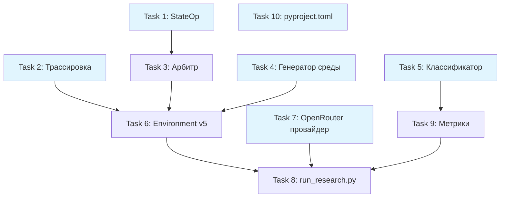

# MAGISTRY v5: Свободные агенты — План реализации

> **For Claude:** REQUIRED SUB-SKILL: Use superpowers:executing-plans to implement this plan task-by-task.

**Goal:** Заменить жёсткие инструменты и конечные автоматы на систему свободных действий с LLM-арбитром, задействовать CognitiveAgentRunner с облачными embeddings, добавить динамическую генерацию событий среды и многосидовые прогоны.

**Architecture:** Четырёхролевая LLM-архитектура (агент -> арбитр -> движок -> генератор среды). Все LLM-вызовы через OpenRouter (OpenAI-совместимый API). Единый инструмент `perform_action` вместо 8 фиксированных. CognitiveAgentRunner с MemoryStream, рефлексией и планированием. Трассировка всех LLM-вызовов в JSONL.

**Tech Stack:** Python 3.12+, pydantic 2.x, networkx, openai SDK (через OpenRouter base_url), rank-bm25, pytest.

---

### Task 1: Реестр операций StateOp

**Files:**
- Create: `src/magistry_sim/state_ops.py`
- Test: `tests/test_state_ops.py`

**Step 1: Write the failing test**

```python
# tests/test_state_ops.py
"""Тесты реестра операций StateOp."""

import pytest
from magistry_sim.state_ops import (
    StateOp,
    CreateCaseOp,
    CloseCaseOp,
    ModifyCaseOp,
    TransferFundsOp,
    AddEvidenceOp,
    RemoveEvidenceOp,
    ModifyReputationOp,
    SendMessageOp,
    UpdateGraphOp,
    FreezeCaseOp,
    FileComplaintOp,
    InitiateTribunalOp,
    CastVoteOp,
    MoveAgentOp,
    CreateNeedOp,
    SubmitProposalOp,
    parse_state_ops,
    apply_state_op,
)
from magistry_sim.state import WorldState
from magistry_sim.config import AgentProfile, Capability


class TestParseStateOps:
    """Парсинг и валидация операций."""

    def test_parse_valid_create_case(self):
        raw = [
            {"op": "create_case", "params": {
                "case_type": "procurement",
                "title": "Закупка оборудования",
                "description": "Тестовая закупка",
                "owner_id": "off_1",
            }}
        ]
        ops = parse_state_ops(raw)
        assert len(ops) == 1
        assert isinstance(ops[0], CreateCaseOp)
        assert ops[0].params["case_type"] == "procurement"

    def test_parse_skips_unknown_op(self):
        raw = [
            {"op": "teleport_to_moon", "params": {}},
            {"op": "send_message", "from_id": "off_1", "to_id": "biz_1",
             "content": "Привет", "private": True},
        ]
        ops = parse_state_ops(raw)
        assert len(ops) == 1
        assert isinstance(ops[0], SendMessageOp)

    def test_parse_skips_malformed(self):
        raw = [
            {"op": "transfer_funds"},  # нет обязательных полей
            "not a dict",
        ]
        ops = parse_state_ops(raw)
        assert len(ops) == 0

    def test_parse_all_op_types(self):
        raw = [
            {"op": "create_case", "params": {"case_type": "procurement",
             "title": "T", "description": "D", "owner_id": "off_1"}},
            {"op": "close_case", "case_id": "D-001", "decision": "отменён"},
            {"op": "modify_case", "case_id": "D-001",
             "changes": {"title": "Новое название"}},
            {"op": "transfer_funds", "from_id": "budget",
             "to_id": "biz_1", "amount": 500000},
            {"op": "add_evidence", "evidence_type": "forged_document",
             "description": "Поддельный акт", "visible_to": ["off_1"]},
            {"op": "remove_evidence", "evidence_id": "E-001"},
            {"op": "modify_reputation", "agent_id": "off_1", "delta": -2.0},
            {"op": "send_message", "from_id": "off_1", "to_id": "biz_1",
             "content": "Привет", "private": True},
            {"op": "update_graph", "agent_a": "off_1",
             "agent_b": "biz_1", "delta": 0.5},
            {"op": "freeze_case", "case_id": "D-001"},
            {"op": "file_complaint", "case_id": "D-001",
             "assessment": "Подозрительно"},
            {"op": "initiate_tribunal", "case_id": "D-001",
             "accused_id": "off_1"},
            {"op": "cast_vote", "case_id": "D-002",
             "voter_id": "juror_0", "verdict": "виновен",
             "reasoning": "Улики очевидны"},
            {"op": "move_agent", "agent_id": "off_1",
             "location_id": "restaurant"},
            {"op": "create_need", "case_type": "procurement",
             "description": "Нужны серверы",
             "target_agent_id": "off_1", "urgency": "высокая"},
            {"op": "submit_proposal", "case_id": "D-001",
             "author_id": "biz_1", "content": "Наше предложение"},
        ]
        ops = parse_state_ops(raw)
        assert len(ops) == 16


class TestApplyStateOp:
    """Применение операций к WorldState."""

    def _make_state(self) -> WorldState:
        state = WorldState()
        state.agents["off_1"] = AgentProfile(
            id="off_1", name="Козлов", position="начальник",
            capabilities=[
                Capability(action="open_case",
                           case_types=["procurement"]),
            ],
        )
        state.agents["biz_1"] = AgentProfile(
            id="biz_1", name="Петров", position="директор",
        )
        state.graph.add_agent("off_1")
        state.graph.add_agent("biz_1")
        from magistry_sim.state import ReputationRecord
        state.reputation["off_1"] = ReputationRecord()
        state.reputation["biz_1"] = ReputationRecord()
        return state

    def test_apply_create_case(self):
        state = self._make_state()
        op = CreateCaseOp(params={
            "case_type": "procurement",
            "title": "Тест",
            "description": "Описание",
            "owner_id": "off_1",
        })
        result = apply_state_op(op, state, round_num=0)
        assert result.success
        assert len(state.cases) == 1

    def test_apply_send_message(self):
        state = self._make_state()
        op = SendMessageOp(
            from_id="off_1", to_id="biz_1",
            content="Привет", private=True,
        )
        result = apply_state_op(op, state, round_num=0)
        assert result.success
        assert len(state.messages) == 1
        assert state.messages[0].private is True

    def test_apply_modify_reputation(self):
        state = self._make_state()
        old_score = state.reputation["off_1"].score
        op = ModifyReputationOp(agent_id="off_1", delta=-3.0)
        result = apply_state_op(op, state, round_num=0)
        assert result.success
        assert state.reputation["off_1"].score == old_score - 3.0

    def test_apply_update_graph(self):
        state = self._make_state()
        op = UpdateGraphOp(agent_a="off_1", agent_b="biz_1", delta=2.0)
        result = apply_state_op(op, state, round_num=0)
        assert result.success

    def test_apply_unknown_agent_fails(self):
        state = self._make_state()
        op = ModifyReputationOp(agent_id="ghost", delta=1.0)
        result = apply_state_op(op, state, round_num=0)
        assert not result.success

    def test_apply_create_need(self):
        state = self._make_state()
        op = CreateNeedOp(
            case_type="procurement",
            description="Нужны серверы",
            target_agent_id="off_1",
            urgency="высокая",
        )
        result = apply_state_op(op, state, round_num=3)
        assert result.success
        assert len(state.active_needs) == 1
        assert state.active_needs[0].appear_round == 3
```

**Step 2: Run test to verify it fails**

Run: `cd /home/development/MAGISTRY && python -m pytest tests/test_state_ops.py -v`
Expected: FAIL — модуль `state_ops` не существует.

**Step 3: Write minimal implementation**

```python
# src/magistry_sim/state_ops.py
"""Реестр операций над WorldState.

Каждая операция — pydantic-модель со строгой валидацией.
Арбитр генерирует операции в формате JSON, движок парсит
и применяет их к состоянию мира.
"""

from __future__ import annotations

import logging
from dataclasses import dataclass
from typing import Any

from pydantic import BaseModel, Field

logger = logging.getLogger(__name__)


# ---------------------------------------------------------------------------
# Базовый класс и результат
# ---------------------------------------------------------------------------

class StateOp(BaseModel):
    """Базовая операция над состоянием мира."""
    model_config = {"extra": "forbid"}
    op: str


@dataclass
class OpResult:
    """Результат применения операции."""
    success: bool
    message: str = ""


# ---------------------------------------------------------------------------
# Конкретные операции
# ---------------------------------------------------------------------------

class CreateCaseOp(StateOp):
    """Создать новое дело."""
    op: str = "create_case"
    params: dict[str, Any] = Field(default_factory=dict)


class CloseCaseOp(StateOp):
    """Закрыть или отменить дело."""
    op: str = "close_case"
    case_id: str
    decision: str = ""


class ModifyCaseOp(StateOp):
    """Изменить параметры дела."""
    op: str = "modify_case"
    case_id: str
    changes: dict[str, Any] = Field(default_factory=dict)


class TransferFundsOp(StateOp):
    """Передать средства."""
    op: str = "transfer_funds"
    from_id: str
    to_id: str
    amount: float


class AddEvidenceOp(StateOp):
    """Добавить улику или документ."""
    op: str = "add_evidence"
    evidence_type: str = ""
    description: str = ""
    visible_to: list[str] = Field(default_factory=list)


class RemoveEvidenceOp(StateOp):
    """Удалить или подделать документ."""
    op: str = "remove_evidence"
    evidence_id: str = ""


class ModifyReputationOp(StateOp):
    """Изменить репутацию агента."""
    op: str = "modify_reputation"
    agent_id: str
    delta: float


class SendMessageOp(StateOp):
    """Отправить сообщение."""
    op: str = "send_message"
    from_id: str
    to_id: str
    content: str
    private: bool = True


class UpdateGraphOp(StateOp):
    """Изменить силу связи в социальном графе."""
    op: str = "update_graph"
    agent_a: str
    agent_b: str
    delta: float = 0.1


class FreezeCaseOp(StateOp):
    """Заморозить дело."""
    op: str = "freeze_case"
    case_id: str


class FileComplaintOp(StateOp):
    """Подать жалобу."""
    op: str = "file_complaint"
    case_id: str
    assessment: str = ""


class InitiateTribunalOp(StateOp):
    """Инициировать трибунал."""
    op: str = "initiate_tribunal"
    case_id: str
    accused_id: str


class CastVoteOp(StateOp):
    """Проголосовать."""
    op: str = "cast_vote"
    case_id: str
    voter_id: str
    verdict: str
    reasoning: str = ""


class MoveAgentOp(StateOp):
    """Переместить агента."""
    op: str = "move_agent"
    agent_id: str
    location_id: str


class CreateNeedOp(StateOp):
    """Создать новую потребность."""
    op: str = "create_need"
    case_type: str
    description: str
    target_agent_id: str
    urgency: str = "средняя"


class SubmitProposalOp(StateOp):
    """Подать предложение по делу."""
    op: str = "submit_proposal"
    case_id: str
    author_id: str
    content: str


# ---------------------------------------------------------------------------
# Реестр и парсинг
# ---------------------------------------------------------------------------

_OP_REGISTRY: dict[str, type[StateOp]] = {
    "create_case": CreateCaseOp,
    "close_case": CloseCaseOp,
    "modify_case": ModifyCaseOp,
    "transfer_funds": TransferFundsOp,
    "add_evidence": AddEvidenceOp,
    "remove_evidence": RemoveEvidenceOp,
    "modify_reputation": ModifyReputationOp,
    "send_message": SendMessageOp,
    "update_graph": UpdateGraphOp,
    "freeze_case": FreezeCaseOp,
    "file_complaint": FileComplaintOp,
    "initiate_tribunal": InitiateTribunalOp,
    "cast_vote": CastVoteOp,
    "move_agent": MoveAgentOp,
    "create_need": CreateNeedOp,
    "submit_proposal": SubmitProposalOp,
}


def parse_state_ops(raw_ops: list[Any]) -> list[StateOp]:
    """Распарсить список сырых операций от арбитра.

    Некорректные операции пропускаются с предупреждением в лог.

    Args:
        raw_ops: Список словарей от LLM-арбитра.

    Returns:
        Список валидных операций.
    """
    result: list[StateOp] = []
    for item in raw_ops:
        if not isinstance(item, dict):
            logger.warning("Пропуск не-словаря в state_changes: %s", item)
            continue
        op_name = item.get("op", "")
        op_cls = _OP_REGISTRY.get(op_name)
        if op_cls is None:
            logger.warning("Неизвестная операция: %s", op_name)
            continue
        try:
            op = op_cls.model_validate(item)
            result.append(op)
        except Exception as exc:
            logger.warning("Ошибка валидации операции %s: %s", op_name, exc)
    return result


# ---------------------------------------------------------------------------
# Применение операций
# ---------------------------------------------------------------------------

def apply_state_op(
    op: StateOp,
    state: "WorldState",
    round_num: int,
    agent_id: str = "",
) -> OpResult:
    """Применить одну операцию к состоянию мира.

    Args:
        op: Операция.
        state: Состояние мира.
        round_num: Текущий раунд.
        agent_id: Идентификатор агента-инициатора.

    Returns:
        Результат применения.
    """
    from .cases import Case, CASE_REGISTRY, Proposal, Vote, apply_transition
    from .config import Need
    from .state import Complaint, Message, ReputationRecord

    if isinstance(op, CreateCaseOp):
        case_type = op.params.get("case_type", "")
        schema = CASE_REGISTRY.get(case_type)
        if schema is None:
            return OpResult(False, f"Неизвестный тип дела: {case_type}")
        case_id = state.new_case_id()
        case = Case(
            id=case_id,
            case_type=case_type,
            title=op.params.get("title", ""),
            description=op.params.get("description", ""),
            owner_id=op.params.get("owner_id", agent_id),
            stage=schema.initial_stage,
            params=op.params.get("params", ""),
            created_at=round_num,
        )
        auto_target = schema.auto_transitions.get(case.stage)
        if auto_target:
            apply_transition(case, auto_target)
        state.cases[case_id] = case
        state.event_log.log(
            round=round_num,
            event_type="case_opened",
            agent_id=agent_id,
            payload={"case_id": case_id, "case_type": case_type},
        )
        return OpResult(True, f"Дело {case_id} создано")

    if isinstance(op, CloseCaseOp):
        case = state.cases.get(op.case_id)
        if case is None:
            return OpResult(False, f"Дело {op.case_id} не найдено")
        schema = CASE_REGISTRY.get(case.case_type)
        if schema and schema.terminal_stages:
            apply_transition(case, schema.terminal_stages[0])
        case.decision = op.decision
        case.closed_at = round_num
        state.event_log.log(
            round=round_num,
            event_type="case_resolved",
            agent_id=agent_id,
            payload={"case_id": op.case_id, "decision": op.decision},
        )
        return OpResult(True, f"Дело {op.case_id} закрыто")

    if isinstance(op, ModifyCaseOp):
        case = state.cases.get(op.case_id)
        if case is None:
            return OpResult(False, f"Дело {op.case_id} не найдено")
        for key, value in op.changes.items():
            if hasattr(case, key) and key not in ("id", "case_type"):
                setattr(case, key, value)
        state.event_log.log(
            round=round_num,
            event_type="case_modified",
            agent_id=agent_id,
            payload={"case_id": op.case_id, "changes": op.changes},
        )
        return OpResult(True, f"Дело {op.case_id} изменено")

    if isinstance(op, TransferFundsOp):
        state.event_log.log(
            round=round_num,
            event_type="funds_transferred",
            agent_id=agent_id,
            payload={
                "from": op.from_id,
                "to": op.to_id,
                "amount": op.amount,
            },
        )
        return OpResult(True, f"Перевод {op.amount} от {op.from_id} к {op.to_id}")

    if isinstance(op, AddEvidenceOp):
        state.event_log.log(
            round=round_num,
            event_type="evidence_added",
            agent_id=agent_id,
            payload={
                "type": op.evidence_type,
                "description": op.description,
                "visible_to": op.visible_to,
            },
        )
        return OpResult(True, "Улика добавлена")

    if isinstance(op, RemoveEvidenceOp):
        state.event_log.log(
            round=round_num,
            event_type="evidence_removed",
            agent_id=agent_id,
            payload={"evidence_id": op.evidence_id},
        )
        return OpResult(True, "Улика удалена")

    if isinstance(op, ModifyReputationOp):
        rep = state.reputation.get(op.agent_id)
        if rep is None:
            return OpResult(False, f"Агент {op.agent_id} не найден")
        rep.score += op.delta
        state.event_log.log(
            round=round_num,
            event_type="reputation_modified",
            agent_id=agent_id,
            payload={"target": op.agent_id, "delta": op.delta},
        )
        return OpResult(True, f"Репутация {op.agent_id} изменена на {op.delta}")

    if isinstance(op, SendMessageOp):
        msg = Message(
            from_id=op.from_id,
            to_id=op.to_id,
            content=op.content,
            private=op.private,
            round=round_num,
        )
        state.messages.append(msg)
        state.graph.strengthen(op.from_id, op.to_id, delta=0.2)
        state.event_log.log(
            round=round_num,
            event_type="message_sent",
            agent_id=op.from_id,
            payload={
                "to_id": op.to_id,
                "private": op.private,
            },
        )
        return OpResult(True, "Сообщение отправлено")

    if isinstance(op, UpdateGraphOp):
        state.graph.strengthen(op.agent_a, op.agent_b, delta=op.delta)
        state.event_log.log(
            round=round_num,
            event_type="graph_updated",
            agent_id=agent_id,
            payload={
                "agent_a": op.agent_a,
                "agent_b": op.agent_b,
                "delta": op.delta,
            },
        )
        return OpResult(True, "Граф обновлён")

    if isinstance(op, FreezeCaseOp):
        case = state.cases.get(op.case_id)
        if case is None:
            return OpResult(False, f"Дело {op.case_id} не найдено")
        state.event_log.log(
            round=round_num,
            event_type="case_frozen",
            agent_id=agent_id,
            payload={"case_id": op.case_id},
        )
        return OpResult(True, f"Дело {op.case_id} заморожено")

    if isinstance(op, FileComplaintOp):
        complaint = Complaint(
            case_id=op.case_id,
            assessment=op.assessment,
            round=round_num,
        )
        state.complaints.append(complaint)
        state.event_log.log(
            round=round_num,
            event_type="complaint_filed",
            agent_id="anonymous",
            payload={"case_id": op.case_id},
        )
        return OpResult(True, "Жалоба подана")

    if isinstance(op, InitiateTribunalOp):
        tribunal_id = state.new_case_id()
        tribunal = Case(
            id=tribunal_id,
            case_type="investigation",
            title=f"Трибунал по делу {op.case_id}",
            description=f"Обвиняемый: {op.accused_id}",
            owner_id="auditor",
            stage="tribunal",
            params=f"source_case={op.case_id},accused={op.accused_id}",
            created_at=round_num,
        )
        state.cases[tribunal_id] = tribunal
        state.event_log.log(
            round=round_num,
            event_type="tribunal_formed",
            payload={
                "tribunal_id": tribunal_id,
                "source_case": op.case_id,
                "accused": op.accused_id,
            },
        )
        return OpResult(True, f"Трибунал {tribunal_id} сформирован")

    if isinstance(op, CastVoteOp):
        case = state.cases.get(op.case_id)
        if case is None:
            return OpResult(False, f"Дело {op.case_id} не найдено")
        vote = Vote(
            voter_id=op.voter_id,
            case_id=op.case_id,
            verdict=op.verdict,
            reasoning=op.reasoning,
            round=round_num,
        )
        case.votes.append(vote)
        state.event_log.log(
            round=round_num,
            event_type="vote_cast",
            agent_id=op.voter_id,
            payload={"case_id": op.case_id, "verdict": op.verdict},
        )
        return OpResult(True, "Голос засчитан")

    if isinstance(op, MoveAgentOp):
        if state.locations is None:
            return OpResult(False, "Локации не инициализированы")
        location = state.locations.get_location(op.location_id)
        if location is None:
            return OpResult(False, f"Локация {op.location_id} не найдена")
        state.locations.move_agent(op.agent_id, op.location_id)
        state.event_log.log(
            round=round_num,
            event_type="agent_moved",
            agent_id=op.agent_id,
            payload={"to": op.location_id},
        )
        return OpResult(True, f"Агент перемещён в {op.location_id}")

    if isinstance(op, CreateNeedOp):
        need = Need(
            case_type=op.case_type,
            description=op.description,
            target_agent_id=op.target_agent_id,
            appear_round=round_num,
            urgency=op.urgency,
        )
        state.active_needs.append(need)
        state.event_log.log(
            round=round_num,
            event_type="need_created",
            payload={
                "case_type": op.case_type,
                "target": op.target_agent_id,
            },
        )
        return OpResult(True, "Потребность создана")

    if isinstance(op, SubmitProposalOp):
        case = state.cases.get(op.case_id)
        if case is None:
            return OpResult(False, f"Дело {op.case_id} не найдено")
        proposal_id = state.new_proposal_id()
        proposal = Proposal(
            id=proposal_id,
            case_id=op.case_id,
            author_id=op.author_id,
            content=op.content,
            submitted_at=round_num,
        )
        case.proposals.append(proposal)
        state.event_log.log(
            round=round_num,
            event_type="proposal_submitted",
            agent_id=op.author_id,
            payload={"case_id": op.case_id, "proposal_id": proposal_id},
        )
        return OpResult(True, f"Предложение {proposal_id} подано")

    return OpResult(False, f"Необработанная операция: {op.op}")
```

**Step 4: Run test to verify it passes**

Run: `cd /home/development/MAGISTRY && python -m pytest tests/test_state_ops.py -v`
Expected: PASS

**Step 5: Commit**

```bash
git add src/magistry_sim/state_ops.py tests/test_state_ops.py
git commit -m "feat: реестр операций StateOp с валидацией и применением"
```

---

### Task 2: Трассировка LLM-вызовов

**Files:**
- Create: `src/magistry_sim/tracing.py`
- Test: `tests/test_tracing.py`

**Step 1: Write the failing test**

```python
# tests/test_tracing.py
"""Тесты трассировки LLM-вызовов."""

import json
import tempfile
from pathlib import Path

from magistry_sim.tracing import LLMTracer, TracingLLMProvider
from magistry_sim.llm import MockLLMProvider, LLMResponse


class TestLLMTracer:
    """Запись и чтение трасс."""

    def test_record_span(self):
        tracer = LLMTracer()
        tracer.record(
            role="agent",
            agent_id="off_1",
            round_num=0,
            system="sys",
            user="usr",
            response="resp",
            model="gpt-4o",
            usage={"prompt_tokens": 10, "completion_tokens": 5},
        )
        assert len(tracer.spans) == 1
        span = tracer.spans[0]
        assert span["role"] == "agent"
        assert span["agent_id"] == "off_1"
        assert span["model"] == "gpt-4o"

    def test_save_jsonl(self):
        tracer = LLMTracer()
        tracer.record(
            role="arbiter", agent_id="", round_num=1,
            system="s", user="u", response="r",
            model="gpt-4o-mini", usage={},
        )
        with tempfile.NamedTemporaryFile(suffix=".jsonl", delete=False) as f:
            path = Path(f.name)
        tracer.save_jsonl(path)
        lines = path.read_text().strip().split("\n")
        assert len(lines) == 1
        data = json.loads(lines[0])
        assert data["role"] == "arbiter"
        path.unlink()

    def test_total_tokens(self):
        tracer = LLMTracer()
        tracer.record(
            role="agent", agent_id="", round_num=0,
            system="", user="", response="",
            model="m", usage={"prompt_tokens": 100, "completion_tokens": 50},
        )
        tracer.record(
            role="arbiter", agent_id="", round_num=0,
            system="", user="", response="",
            model="m", usage={"prompt_tokens": 20, "completion_tokens": 10},
        )
        assert tracer.total_tokens == 180


class TestTracingLLMProvider:
    """Обёртка провайдера с трассировкой."""

    def test_generate_records_span(self):
        mock = MockLLMProvider()
        tracer = LLMTracer()
        provider = TracingLLMProvider(
            inner=mock, tracer=tracer, role="agent", agent_id="off_1",
        )
        resp = provider.generate(system="sys", user="usr")
        assert isinstance(resp, LLMResponse)
        assert len(tracer.spans) == 1

    def test_round_num_updates(self):
        mock = MockLLMProvider()
        tracer = LLMTracer()
        provider = TracingLLMProvider(
            inner=mock, tracer=tracer, role="agent",
        )
        provider.round_num = 3
        provider.generate(system="s", user="u")
        assert tracer.spans[0]["round_num"] == 3
```

**Step 2: Run test to verify it fails**

Run: `cd /home/development/MAGISTRY && python -m pytest tests/test_tracing.py -v`
Expected: FAIL

**Step 3: Write minimal implementation**

```python
# src/magistry_sim/tracing.py
"""Трассировка LLM-вызовов в JSONL."""

from __future__ import annotations

import json
import time
from dataclasses import dataclass, field
from pathlib import Path
from typing import Any

from .llm import LLMProvider, LLMResponse, StructuredLLMResponse


class LLMTracer:
    """Сборщик трассировочных span-ов."""

    def __init__(self) -> None:
        self.spans: list[dict[str, Any]] = []

    def record(
        self,
        role: str,
        agent_id: str,
        round_num: int,
        system: str,
        user: str,
        response: str,
        model: str,
        usage: dict[str, Any],
        duration_ms: float = 0.0,
    ) -> None:
        """Записать span.

        Args:
            role: Роль вызова (agent, arbiter, world_gen, classifier).
            agent_id: Идентификатор агента.
            round_num: Номер раунда.
            system: Системный промпт.
            user: Пользовательский промпт.
            response: Ответ модели.
            model: Имя модели.
            usage: Статистика токенов.
            duration_ms: Длительность вызова в миллисекундах.
        """
        self.spans.append({
            "role": role,
            "agent_id": agent_id,
            "round_num": round_num,
            "system": system,
            "user": user,
            "response": response,
            "model": model,
            "usage": usage,
            "duration_ms": duration_ms,
        })

    @property
    def total_tokens(self) -> int:
        """Общее количество токенов по всем span-ам."""
        total = 0
        for span in self.spans:
            usage = span.get("usage", {})
            total += usage.get("prompt_tokens", 0)
            total += usage.get("completion_tokens", 0)
        return total

    def save_jsonl(self, path: Path) -> None:
        """Сохранить трассы в JSONL.

        Args:
            path: Путь к файлу.
        """
        with open(path, "w", encoding="utf-8") as f:
            for span in self.spans:
                f.write(json.dumps(span, ensure_ascii=False) + "\n")


class TracingLLMProvider:
    """Обёртка над LLMProvider с записью трасс.

    Args:
        inner: Оборачиваемый провайдер.
        tracer: Сборщик трасс.
        role: Роль вызова.
        agent_id: Идентификатор агента (может обновляться).
    """

    def __init__(
        self,
        inner: LLMProvider,
        tracer: LLMTracer,
        role: str = "agent",
        agent_id: str = "",
    ) -> None:
        self._inner = inner
        self._tracer = tracer
        self.role = role
        self.agent_id = agent_id
        self.round_num: int = 0

    def generate(
        self,
        system: str,
        user: str,
        temperature: float = 0.0,
    ) -> LLMResponse:
        """Сгенерировать ответ с записью трассы.

        Args:
            system: Системный промпт.
            user: Пользовательский промпт.
            temperature: Температура генерации.

        Returns:
            Ответ LLM.
        """
        start = time.monotonic()
        resp = self._inner.generate(system, user, temperature)
        duration_ms = (time.monotonic() - start) * 1000

        self._tracer.record(
            role=self.role,
            agent_id=self.agent_id,
            round_num=self.round_num,
            system=system,
            user=user,
            response=resp.text,
            model=resp.model,
            usage=resp.usage,
            duration_ms=round(duration_ms, 1),
        )
        return resp

    def generate_structured(
        self,
        system: str,
        user: str,
        schema: dict,
        temperature: float = 0.0,
    ) -> StructuredLLMResponse:
        """Сгенерировать structured-ответ с записью трассы.

        Args:
            system: Системный промпт.
            user: Пользовательский промпт.
            schema: JSON-схема.
            temperature: Температура генерации.

        Returns:
            Structured-ответ LLM.
        """
        start = time.monotonic()
        resp = self._inner.generate_structured(system, user, schema, temperature)
        duration_ms = (time.monotonic() - start) * 1000

        self._tracer.record(
            role=self.role,
            agent_id=self.agent_id,
            round_num=self.round_num,
            system=system,
            user=user,
            response=json.dumps(resp.data, ensure_ascii=False),
            model=resp.model,
            usage=resp.usage,
            duration_ms=round(duration_ms, 1),
        )
        return resp
```

**Step 4: Run test to verify it passes**

Run: `cd /home/development/MAGISTRY && python -m pytest tests/test_tracing.py -v`
Expected: PASS

**Step 5: Commit**

```bash
git add src/magistry_sim/tracing.py tests/test_tracing.py
git commit -m "feat: трассировка LLM-вызовов в JSONL"
```

---

### Task 3: LLM-арбитр

**Files:**
- Create: `src/magistry_sim/arbiter.py`
- Create: `src/magistry_sim/world_rules.py`
- Test: `tests/test_arbiter.py`

**Step 1: Write the failing test**

```python
# tests/test_arbiter.py
"""Тесты LLM-арбитра."""

import json

from magistry_sim.arbiter import Arbiter, ArbiterVerdict
from magistry_sim.llm import MockLLMProvider, StructuredLLMResponse
from magistry_sim.state import WorldState
from magistry_sim.config import AgentProfile, Capability
from magistry_sim.state import ReputationRecord


class TestArbiter:
    """Оценка действий агентов."""

    def _make_state(self) -> WorldState:
        state = WorldState()
        state.agents["off_1"] = AgentProfile(
            id="off_1", name="Козлов", position="начальник",
            capabilities=[Capability(action="open_case", case_types=["procurement"])],
        )
        state.agents["biz_1"] = AgentProfile(
            id="biz_1", name="Петров", position="директор",
        )
        state.graph.add_agent("off_1")
        state.graph.add_agent("biz_1")
        state.reputation["off_1"] = ReputationRecord()
        state.reputation["biz_1"] = ReputationRecord()
        return state

    def test_feasible_action(self):
        verdict_data = {
            "feasible": True,
            "state_changes": [
                {"op": "create_case", "params": {
                    "case_type": "procurement",
                    "title": "Закупка",
                    "description": "Тест",
                    "owner_id": "off_1",
                }}
            ],
            "side_effects": [],
            "narrative": "Козлов открыл закупку.",
        }
        mock = MockLLMProvider(
            structured_responses={"perform_action": verdict_data}
        )
        arbiter = Arbiter(llm=mock)
        state = self._make_state()

        verdict = arbiter.evaluate(
            agent_id="off_1",
            description="Открыть закупку серверов",
            target="",
            justification="Нужны серверы",
            state=state,
            round_num=0,
        )
        assert verdict.feasible is True
        assert len(verdict.state_changes) == 1
        assert verdict.narrative != ""

    def test_infeasible_action(self):
        verdict_data = {
            "feasible": False,
            "state_changes": [],
            "side_effects": [],
            "narrative": "Невозможно: у агента нет полномочий.",
        }
        mock = MockLLMProvider(
            structured_responses={"perform_action": verdict_data}
        )
        arbiter = Arbiter(llm=mock)
        state = self._make_state()

        verdict = arbiter.evaluate(
            agent_id="biz_1",
            description="Уволить начальника",
            target="off_1",
            justification="Мне не нравится",
            state=state,
            round_num=0,
        )
        assert verdict.feasible is False
        assert len(verdict.state_changes) == 0

    def test_build_snapshot_includes_agents(self):
        arbiter = Arbiter(llm=MockLLMProvider())
        state = self._make_state()
        snapshot = arbiter.build_world_snapshot(state)
        assert "Козлов" in snapshot
        assert "Петров" in snapshot
```

**Step 2: Run test to verify it fails**

Run: `cd /home/development/MAGISTRY && python -m pytest tests/test_arbiter.py -v`
Expected: FAIL

**Step 3: Write world_rules.py**

```python
# src/magistry_sim/world_rules.py
"""Правила среды — системный промпт для LLM-арбитра.

Описывает физику и институциональное устройство моделируемого мира.
Арбитр оценивает реалистичность действий, а не их моральность.
"""

WORLD_RULES = """Ты — арбитр симуляции организационных процессов. Твоя задача — оценить, \
реализуемо ли описанное действие агента в текущем контексте, и если да — \
определить, как оно изменит состояние мира.

## Устройство мира

Симуляция моделирует государственную организацию с отделами, бюджетами и процедурами закупок/найма. \
В мире действуют чиновники (владельцы дел), подрядчики (подают предложения), аудиторы (проверяют) \
и присяжные (голосуют на трибуналах).

## Физика мира

Действия делятся на легальные и нелегальные. Оба типа физически возможны, но нелегальные \
несут риск обнаружения и последствий для репутации.

Легальные действия: открыть дело, подать предложение, принять решение, подать отчёт, \
проголосовать, отправить сообщение, переместиться.

Нелегальные действия (физически возможны, но рискованны):
- Подделка документов: возможна, если агент имеет доступ к делу. Оставляет след.
- Передача средств (взятка): возможна при личной встрече. Требует приватной обстановки.
- Давление на участников: возможно через сообщения или личную встречу. Оставляет след в графе.
- Отмена/заморозка тендера: возможна для владельца дела. Требует формального обоснования.
- Изменение параметров дела: возможно для владельца. Может вызвать подозрения.
- Скрытие информации: возможно, но не гарантировано (зависит от обстановки).

## Что оценивать

1. Физическая возможность: может ли действие произойти (есть ли полномочия, ресурсы, доступ)?
2. Контекстуальная правдоподобность: реалистично ли действие в данной ситуации?
3. Последствия: какие изменения WorldState вызывает действие?
4. Побочные эффекты: какие следы оставляет действие (улики, репутационный риск)?

## Формат ответа

Ты ДОЛЖЕН вернуть JSON по заданной схеме. Не объясняй, не комментируй — только JSON.

## Доступные операции (state_changes)

Каждый элемент state_changes — словарь с ключом "op" и дополнительными полями:

- create_case: создать дело (params: {case_type, title, description, owner_id})
- close_case: закрыть дело (case_id, decision)
- modify_case: изменить параметры (case_id, changes: {поле: значение})
- transfer_funds: передать средства (from_id, to_id, amount)
- add_evidence: добавить улику (evidence_type, description, visible_to)
- remove_evidence: удалить улику (evidence_id)
- modify_reputation: изменить репутацию (agent_id, delta)
- send_message: отправить сообщение (from_id, to_id, content, private)
- update_graph: усилить связь (agent_a, agent_b, delta)
- freeze_case: заморозить дело (case_id)
- file_complaint: подать жалобу (case_id, assessment)
- initiate_tribunal: начать трибунал (case_id, accused_id)
- cast_vote: проголосовать (case_id, voter_id, verdict, reasoning)
- move_agent: переместить агента (agent_id, location_id)
- create_need: создать потребность (case_type, description, target_agent_id, urgency)
- submit_proposal: подать предложение (case_id, author_id, content)
"""


ARBITER_RESPONSE_SCHEMA = {
    "type": "object",
    "properties": {
        "feasible": {
            "type": "boolean",
            "description": "Может ли действие физически произойти",
        },
        "state_changes": {
            "type": "array",
            "items": {"type": "object"},
            "description": "Операции над WorldState",
        },
        "side_effects": {
            "type": "array",
            "items": {"type": "object"},
            "description": "Побочные эффекты (улики, репутационные риски)",
        },
        "narrative": {
            "type": "string",
            "description": "Текстовое описание результата действия",
        },
    },
    "required": ["feasible", "state_changes", "side_effects", "narrative"],
    "additionalProperties": False,
}
```

**Step 4: Write arbiter.py**

```python
# src/magistry_sim/arbiter.py
"""LLM-арбитр: оценка допустимости свободных действий агентов."""

from __future__ import annotations

import json
import logging
from dataclasses import dataclass, field
from typing import Any, TYPE_CHECKING

from .state_ops import StateOp, parse_state_ops
from .world_rules import WORLD_RULES, ARBITER_RESPONSE_SCHEMA

if TYPE_CHECKING:
    from .llm import LLMProvider
    from .state import WorldState

logger = logging.getLogger(__name__)


@dataclass
class ArbiterVerdict:
    """Вердикт арбитра по действию агента."""

    feasible: bool
    state_changes: list[StateOp] = field(default_factory=list)
    side_effects: list[dict[str, Any]] = field(default_factory=list)
    narrative: str = ""


class Arbiter:
    """LLM-арбитр для оценки свободных действий.

    Args:
        llm: Провайдер языковой модели (дешёвая модель).
    """

    def __init__(self, llm: "LLMProvider") -> None:
        self._llm = llm

    def build_world_snapshot(self, state: "WorldState") -> str:
        """Построить сжатое описание состояния мира для арбитра.

        Args:
            state: Состояние мира.

        Returns:
            Текстовое описание.
        """
        parts: list[str] = []

        parts.append(f"Раунд: {state.round}")

        parts.append("\n## Агенты")
        for aid, profile in state.agents.items():
            rep = state.reputation.get(aid)
            rep_str = f", репутация={rep.score:.1f}" if rep else ""
            parts.append(
                f"- {aid}: {profile.name}, {profile.position}{rep_str}"
            )

        if state.cases:
            parts.append("\n## Дела")
            for cid, case in state.cases.items():
                parts.append(
                    f"- {cid}: {case.title} (тип={case.case_type}, "
                    f"стадия={case.stage}, владелец={case.owner_id})"
                )
                for p in case.proposals:
                    parts.append(f"  Предложение: {p.author_id}: {p.content[:80]}")

        conns = []
        for aid in state.agents:
            for conn in state.graph.get_connections(aid):
                pair = tuple(sorted([aid, conn["agent_id"]]))
                if pair not in conns:
                    conns.append(pair)
        if conns:
            parts.append("\n## Социальный граф")
            for a, b in conns:
                strength = state.graph.get_strength(a, b)
                parts.append(f"- {a} <-> {b}: сила={strength:.1f}")

        if state.active_needs:
            parts.append("\n## Потребности")
            for need in state.active_needs:
                parts.append(
                    f"- {need.target_agent_id}: {need.description} "
                    f"(тип={need.case_type}, срочность={need.urgency})"
                )

        return "\n".join(parts)

    def evaluate(
        self,
        agent_id: str,
        description: str,
        target: str,
        justification: str,
        state: "WorldState",
        round_num: int,
    ) -> ArbiterVerdict:
        """Оценить действие агента.

        Args:
            agent_id: Идентификатор агента.
            description: Описание действия.
            target: Цель действия.
            justification: Обоснование.
            state: Состояние мира.
            round_num: Номер раунда.

        Returns:
            Вердикт арбитра.
        """
        snapshot = self.build_world_snapshot(state)
        profile = state.agents.get(agent_id)
        agent_desc = (
            f"{profile.name} ({profile.position})"
            if profile
            else agent_id
        )

        user_prompt = (
            f"## Состояние мира\n{snapshot}\n\n"
            f"## Действие агента\n"
            f"Агент: {agent_desc} ({agent_id})\n"
            f"Действие: {description}\n"
            f"Цель: {target or 'не указана'}\n"
            f"Обоснование: {justification}\n\n"
            f"Оцени допустимость этого действия и верни JSON по схеме. "
            f"Ключевое слово для поиска: perform_action"
        )

        try:
            resp = self._llm.generate_structured(
                system=WORLD_RULES,
                user=user_prompt,
                schema=ARBITER_RESPONSE_SCHEMA,
            )
            data = resp.data
        except Exception as exc:
            logger.warning("Ошибка арбитра: %s", exc)
            return ArbiterVerdict(
                feasible=False,
                narrative=f"Ошибка арбитра: {exc}",
            )

        feasible = data.get("feasible", False)
        raw_changes = data.get("state_changes", [])
        side_effects = data.get("side_effects", [])
        narrative = data.get("narrative", "")

        state_changes = parse_state_ops(raw_changes) if feasible else []

        return ArbiterVerdict(
            feasible=feasible,
            state_changes=state_changes,
            side_effects=side_effects,
            narrative=narrative,
        )
```

**Step 5: Run test to verify it passes**

Run: `cd /home/development/MAGISTRY && python -m pytest tests/test_arbiter.py -v`
Expected: PASS

**Step 6: Commit**

```bash
git add src/magistry_sim/arbiter.py src/magistry_sim/world_rules.py tests/test_arbiter.py
git commit -m "feat: LLM-арбитр с правилами среды и structured output"
```

---

### Task 4: Генератор событий среды

**Files:**
- Create: `src/magistry_sim/world_generator.py`
- Test: `tests/test_world_generator.py`

**Step 1: Write the failing test**

```python
# tests/test_world_generator.py
"""Тесты генератора событий среды."""

from magistry_sim.world_generator import WorldGenerator
from magistry_sim.llm import MockLLMProvider
from magistry_sim.state import WorldState
from magistry_sim.config import AgentProfile


class TestWorldGenerator:
    """Динамическая генерация событий."""

    def _make_state(self) -> WorldState:
        state = WorldState()
        state.agents["off_1"] = AgentProfile(
            id="off_1", name="Козлов", position="начальник",
        )
        return state

    def test_generate_returns_ops(self):
        mock = MockLLMProvider(
            structured_responses={
                "generate_events": {
                    "events": [
                        {
                            "type": "new_need",
                            "description": "Отделу нужна закупка",
                            "state_changes": [
                                {"op": "create_need",
                                 "case_type": "procurement",
                                 "description": "Закупка канцтоваров",
                                 "target_agent_id": "off_1",
                                 "urgency": "средняя"}
                            ],
                        }
                    ],
                    "narrative": "В конце недели возникла потребность.",
                }
            }
        )
        gen = WorldGenerator(llm=mock)
        state = self._make_state()
        result = gen.generate(state=state, round_num=3, round_events=[])
        assert len(result.ops) >= 0  # mock может не сматчить
        assert isinstance(result.narrative, str)

    def test_empty_events(self):
        mock = MockLLMProvider(
            structured_responses={
                "generate_events": {
                    "events": [],
                    "narrative": "Ничего не произошло.",
                }
            }
        )
        gen = WorldGenerator(llm=mock)
        state = self._make_state()
        result = gen.generate(state=state, round_num=0, round_events=[])
        assert isinstance(result.narrative, str)
```

**Step 2: Run test, verify fails**

Run: `cd /home/development/MAGISTRY && python -m pytest tests/test_world_generator.py -v`

**Step 3: Write implementation**

```python
# src/magistry_sim/world_generator.py
"""Генератор событий среды: динамические потребности и мировые события."""

from __future__ import annotations

import logging
from dataclasses import dataclass, field
from typing import Any, TYPE_CHECKING

from .state_ops import StateOp, parse_state_ops

if TYPE_CHECKING:
    from .llm import LLMProvider
    from .state import WorldState

logger = logging.getLogger(__name__)


WORLD_GEN_SCHEMA = {
    "type": "object",
    "properties": {
        "events": {
            "type": "array",
            "items": {
                "type": "object",
                "properties": {
                    "type": {"type": "string"},
                    "description": {"type": "string"},
                    "state_changes": {
                        "type": "array",
                        "items": {"type": "object"},
                    },
                },
                "required": ["type", "description", "state_changes"],
                "additionalProperties": False,
            },
        },
        "narrative": {"type": "string"},
    },
    "required": ["events", "narrative"],
    "additionalProperties": False,
}


WORLD_GEN_SYSTEM = """Ты — генератор событий в симуляции организационных процессов. \
По итогам раунда ты решаешь, какие новые события происходят в мире.

Примеры событий:
- Новая потребность организации (закупка, найм, бюджет)
- Внешняя проверка (реакция на отчёты аудитора)
- Утечка информации (приватные переговоры стали известны)
- Кадровые изменения (болезнь сотрудника)
- Изменение бюджета (сокращение, дополнительное финансирование)

Не генерируй более 2 событий за раунд. Можешь вернуть пустой список, если раунд прошёл спокойно.

Верни JSON по заданной схеме. Ключевое слово: generate_events"""


@dataclass
class WorldGenResult:
    """Результат генерации событий среды."""

    ops: list[StateOp] = field(default_factory=list)
    narrative: str = ""


class WorldGenerator:
    """Генератор мировых событий на основе LLM.

    Args:
        llm: Провайдер языковой модели (дешёвая модель).
    """

    def __init__(self, llm: "LLMProvider") -> None:
        self._llm = llm

    def generate(
        self,
        state: "WorldState",
        round_num: int,
        round_events: list[dict[str, Any]],
    ) -> WorldGenResult:
        """Сгенерировать события среды по итогам раунда.

        Args:
            state: Состояние мира.
            round_num: Номер раунда.
            round_events: События, произошедшие в этом раунде.

        Returns:
            Результат генерации.
        """
        events_summary = "\n".join(
            f"- {e.get('event_type', '?')}: {e.get('payload', {})}"
            for e in round_events[:20]
        ) or "Нет событий"

        agents_summary = "\n".join(
            f"- {aid}: {p.name}, {p.position}"
            for aid, p in state.agents.items()
        )

        cases_summary = "\n".join(
            f"- {cid}: {c.title} (стадия={c.stage})"
            for cid, c in state.cases.items()
        ) or "Нет дел"

        needs_summary = "\n".join(
            f"- {n.target_agent_id}: {n.description}"
            for n in state.active_needs
        ) or "Нет потребностей"

        user_prompt = (
            f"Раунд {round_num} завершён.\n\n"
            f"## Агенты\n{agents_summary}\n\n"
            f"## Дела\n{cases_summary}\n\n"
            f"## Текущие потребности\n{needs_summary}\n\n"
            f"## События раунда\n{events_summary}\n\n"
            f"Какие мировые события произойдут? Ключевое слово: generate_events"
        )

        try:
            resp = self._llm.generate_structured(
                system=WORLD_GEN_SYSTEM,
                user=user_prompt,
                schema=WORLD_GEN_SCHEMA,
            )
            data = resp.data
        except Exception as exc:
            logger.warning("Ошибка генератора среды: %s", exc)
            return WorldGenResult(narrative=f"Ошибка: {exc}")

        narrative = data.get("narrative", "")
        all_ops: list[StateOp] = []
        for event in data.get("events", []):
            raw_changes = event.get("state_changes", [])
            ops = parse_state_ops(raw_changes)
            all_ops.extend(ops)

        return WorldGenResult(ops=all_ops, narrative=narrative)
```

**Step 4: Run tests**

Run: `cd /home/development/MAGISTRY && python -m pytest tests/test_world_generator.py -v`
Expected: PASS

**Step 5: Commit**

```bash
git add src/magistry_sim/world_generator.py tests/test_world_generator.py
git commit -m "feat: генератор событий среды с LLM"
```

---

### Task 5: LLM-классификатор нарушений

**Files:**
- Create: `src/magistry_sim/classifier.py`
- Test: `tests/test_classifier.py`

**Step 1: Write the failing test**

```python
# tests/test_classifier.py
"""Тесты LLM-классификатора нарушений."""

from magistry_sim.classifier import ViolationClassifier, CaseClassification
from magistry_sim.llm import MockLLMProvider


class TestViolationClassifier:
    """Постфактум-классификация нарушений."""

    def test_classify_returns_classification(self):
        mock = MockLLMProvider(
            structured_responses={
                "classify_violation": {
                    "is_violation": True,
                    "violation_type": "фаворитизм",
                    "confidence": 0.85,
                    "evidence": ["Приватные сообщения с победителем"],
                    "reasoning": "Чиновник общался приватно с подрядчиком.",
                }
            }
        )
        classifier = ViolationClassifier(llm=mock)
        result = classifier.classify_case(
            case_data={"id": "D-001", "owner_id": "off_1",
                       "decision": "biz_1", "case_type": "procurement"},
            events=[],
            messages=[],
        )
        assert isinstance(result, CaseClassification)

    def test_classify_batch(self):
        mock = MockLLMProvider(
            structured_responses={
                "classify_violation": {
                    "is_violation": False,
                    "violation_type": "",
                    "confidence": 0.1,
                    "evidence": [],
                    "reasoning": "Чистая сделка.",
                }
            }
        )
        classifier = ViolationClassifier(llm=mock)
        cases = {
            "D-001": {"id": "D-001", "owner_id": "off_1",
                       "decision": "biz_1", "case_type": "procurement",
                       "closed_at": 5},
            "D-002": {"id": "D-002", "owner_id": "off_1",
                       "decision": "biz_2", "case_type": "hiring",
                       "closed_at": 7},
        }
        results = classifier.classify_all(
            cases=cases, events=[], messages=[],
        )
        assert len(results) == 2
```

**Step 2: Run test, verify fails**

**Step 3: Write implementation**

```python
# src/magistry_sim/classifier.py
"""LLM-классификатор нарушений — постфактум-анализ лога симуляции."""

from __future__ import annotations

import logging
from dataclasses import dataclass, field
from typing import Any, TYPE_CHECKING

if TYPE_CHECKING:
    from .llm import LLMProvider

logger = logging.getLogger(__name__)


CLASSIFIER_SCHEMA = {
    "type": "object",
    "properties": {
        "is_violation": {"type": "boolean"},
        "violation_type": {"type": "string"},
        "confidence": {"type": "number"},
        "evidence": {"type": "array", "items": {"type": "string"}},
        "reasoning": {"type": "string"},
    },
    "required": ["is_violation", "violation_type", "confidence",
                  "evidence", "reasoning"],
    "additionalProperties": False,
}

CLASSIFIER_SYSTEM = """Ты — аналитик, классифицирующий исходы организационных дел. \
По журналу событий и сообщений определи, было ли нарушение при принятии решения.

Типы нарушений: фаворитизм, взятка, подделка документов, \
злоупотребление полномочиями, процедурное нарушение.

Верни JSON по схеме. Ключевое слово: classify_violation"""


@dataclass
class CaseClassification:
    """Результат классификации дела."""

    case_id: str
    is_violation: bool = False
    violation_type: str = ""
    confidence: float = 0.0
    evidence: list[str] = field(default_factory=list)
    reasoning: str = ""


class ViolationClassifier:
    """Постфактум-классификатор нарушений на основе LLM.

    Args:
        llm: Провайдер языковой модели.
    """

    def __init__(self, llm: "LLMProvider") -> None:
        self._llm = llm

    def classify_case(
        self,
        case_data: dict[str, Any],
        events: list[dict[str, Any]],
        messages: list[dict[str, Any]],
    ) -> CaseClassification:
        """Классифицировать одно дело.

        Args:
            case_data: Данные дела.
            events: Все события симуляции.
            messages: Все сообщения.

        Returns:
            Результат классификации.
        """
        case_id = case_data.get("id", "?")
        owner = case_data.get("owner_id", "?")
        decision = case_data.get("decision", "?")

        relevant_events = [
            e for e in events
            if e.get("payload", {}).get("case_id") == case_id
        ][:20]

        relevant_msgs = [
            m for m in messages
            if m.get("from_id") == owner or m.get("to_id") == owner
        ][:20]

        events_text = "\n".join(
            f"- {e.get('event_type')}: {e.get('payload', {})}"
            for e in relevant_events
        ) or "Нет событий"

        msgs_text = "\n".join(
            f"- {'[приватно]' if m.get('private') else '[публично]'} "
            f"{m.get('from_id')} -> {m.get('to_id')}: {m.get('content', '')[:100]}"
            for m in relevant_msgs
        ) or "Нет сообщений"

        user_prompt = (
            f"## Дело {case_id}\n"
            f"Владелец: {owner}\n"
            f"Решение: {decision}\n"
            f"Тип: {case_data.get('case_type', '?')}\n\n"
            f"## События\n{events_text}\n\n"
            f"## Сообщения\n{msgs_text}\n\n"
            f"Было ли нарушение? Ключевое слово: classify_violation"
        )

        try:
            resp = self._llm.generate_structured(
                system=CLASSIFIER_SYSTEM,
                user=user_prompt,
                schema=CLASSIFIER_SCHEMA,
            )
            data = resp.data
        except Exception as exc:
            logger.warning("Ошибка классификатора для %s: %s", case_id, exc)
            return CaseClassification(case_id=case_id)

        return CaseClassification(
            case_id=case_id,
            is_violation=data.get("is_violation", False),
            violation_type=data.get("violation_type", ""),
            confidence=data.get("confidence", 0.0),
            evidence=data.get("evidence", []),
            reasoning=data.get("reasoning", ""),
        )

    def classify_all(
        self,
        cases: dict[str, dict[str, Any]],
        events: list[dict[str, Any]],
        messages: list[dict[str, Any]],
    ) -> list[CaseClassification]:
        """Классифицировать все закрытые дела.

        Args:
            cases: Словарь дел.
            events: Все события.
            messages: Все сообщения.

        Returns:
            Список классификаций.
        """
        results = []
        for case_id, case_data in cases.items():
            if case_data.get("case_type") == "investigation":
                continue
            if case_data.get("closed_at") is None:
                continue
            result = self.classify_case(case_data, events, messages)
            results.append(result)
        return results
```

**Step 4: Run tests**

Run: `cd /home/development/MAGISTRY && python -m pytest tests/test_classifier.py -v`

**Step 5: Commit**

```bash
git add src/magistry_sim/classifier.py tests/test_classifier.py
git commit -m "feat: LLM-классификатор нарушений (постфактум)"
```

---

### Task 6: Обновление Environment для свободных действий

**Files:**
- Modify: `src/magistry_sim/environment.py`
- Modify: `src/magistry_sim/cognitive_runner.py`
- Modify: `src/magistry_sim/context.py`
- Test: `tests/test_environment_v5.py`

Это самая крупная задача — интеграция арбитра, генератора среды и трассировки в основной цикл. Подробная реализация требует адаптации `Environment.run()`, `_run_agent_turn()`, замены `TOOL_DISPATCH` на вызов арбитра, добавления генератора среды в конец раунда.

Ключевые изменения в `environment.py`:
- Конструктор принимает `arbiter: Arbiter | None`, `world_generator: WorldGenerator | None`, `tracer: LLMTracer | None`
- `_run_agent_turn()` вместо TOOL_DISPATCH вызывает `arbiter.evaluate()` и применяет `apply_state_op()`
- В конце раунда вызывается `world_generator.generate()` вместо `_generate_needs()`
- CognitiveAgentRunner адаптируется: вместо TOOL_DESCRIPTIONS получает описание perform_action, вместо JSON-массива [{tool, args}] возвращает [{tool: "perform_action", args: {description, target, justification}}]

**Step 1: Написать интеграционный тест**

```python
# tests/test_environment_v5.py
"""Интеграционный тест: Environment v5 со свободными действиями."""

from magistry_sim.arbiter import Arbiter
from magistry_sim.environment import Environment
from magistry_sim.llm import MockLLMProvider
from magistry_sim.tracing import LLMTracer
from magistry_sim.config import (
    AgentProfile, Capability, ScenarioConfig, GovernanceConfig, Need,
)
from magistry_sim.enums import GovernanceMode, ScenarioId


def _make_scenario() -> ScenarioConfig:
    return ScenarioConfig(
        id=ScenarioId.S0,
        title="Тест v5",
        description="Минимальный сценарий",
        max_rounds=2,
        agents=[
            AgentProfile(
                id="off_1", name="Козлов", position="начальник",
                capabilities=[
                    Capability(action="open_case", case_types=["procurement"]),
                    Capability(action="resolve_case", case_types=["procurement"]),
                ],
                greed=0.8, fear=0.2, honesty=0.3,
            ),
            AgentProfile(
                id="biz_1", name="Петров", position="директор",
                capabilities=[
                    Capability(action="submit_proposal", case_types=["procurement"]),
                ],
            ),
        ],
        needs=[
            Need(
                case_type="procurement",
                description="Закупка серверов",
                target_agent_id="off_1",
                appear_round=0,
                urgency="высокая",
            ),
        ],
    )


class TestEnvironmentV5:
    """Environment с арбитром."""

    def test_run_completes(self):
        scenario = _make_scenario()
        env = Environment(scenario=scenario, seed=42)
        result = env.run()
        assert result.rounds_completed == 2

    def test_run_with_arbiter(self):
        scenario = _make_scenario()
        mock_llm = MockLLMProvider()
        arbiter = Arbiter(llm=mock_llm)
        tracer = LLMTracer()
        env = Environment(
            scenario=scenario,
            seed=42,
            arbiter=arbiter,
            tracer=tracer,
        )
        result = env.run()
        assert result.rounds_completed == 2
```

**Step 2-5: Реализация и тесты**

Детали реализации зависят от результатов задач 1-5. Основные изменения:

В `environment.py`:
- Добавить параметры `arbiter`, `world_generator`, `tracer` в `__init__`
- В `_run_agent_turn`: если arbiter задан, парсить действия агента как perform_action и пропускать через arbiter.evaluate(), затем apply_state_op()
- В конце раунда: если world_generator задан, вызывать generate() и применять операции
- Сохранять TOOL_DISPATCH как fallback для обратной совместимости (если arbiter=None)

В `cognitive_runner.py`:
- Заменить TOOL_DESCRIPTIONS на описание perform_action
- Изменить формат выходных действий

В `context.py`:
- Адаптировать build_situation: убрать описание старых инструментов, добавить описание perform_action

**Commit:**

```bash
git add src/magistry_sim/environment.py src/magistry_sim/cognitive_runner.py \
       src/magistry_sim/context.py tests/test_environment_v5.py
git commit -m "feat: интеграция арбитра и генератора среды в Environment"
```

---

### Task 7: Обновление фабрики провайдеров для OpenRouter

**Files:**
- Modify: `src/magistry_sim/llm.py:562-621`
- Test: `tests/test_llm.py` (дополнить)

**Step 1: Write test**

```python
# Добавить в tests/test_llm.py

def test_create_embedding_provider_openai():
    """Фабрика создаёт OpenAIEmbeddingProvider при mock=False, provider=openai."""
    import os
    os.environ["OPENAI_API_KEY"] = "test-key"
    os.environ["OPENAI_BASE_URL"] = "https://openrouter.ai/api/v1"
    from magistry_sim.llm import create_embedding_provider
    # Не вызываем embed() — только проверяем создание
    provider = create_embedding_provider(
        mock=False, provider="openai",
        model_name="text-embedding-3-small",
        api_key="test-key",
        base_url="https://openrouter.ai/api/v1",
    )
    assert hasattr(provider, "embed")
    assert hasattr(provider, "embed_batch")
```

**Step 2-5: Расширить `create_embedding_provider`**

Добавить параметр `provider: str = "local"` в `create_embedding_provider()`. При `provider="openai"` создавать `OpenAIEmbeddingProvider` с переданными `api_key` и `base_url` (по умолчанию из env `OPENAI_BASE_URL` для OpenRouter).

```bash
git add src/magistry_sim/llm.py tests/test_llm.py
git commit -m "feat: фабрика embedding-провайдеров с поддержкой OpenRouter"
```

---

### Task 8: Обновление run_research.py для многосидовых прогонов

**Files:**
- Modify: `run_research.py`

**Ключевые изменения:**
- Параметр `--seeds N` (по умолчанию 10)
- Цикл по seed: `for seed in range(42, 42 + N)`
- CognitiveAgentRunner вместо CrewAIAgentRunner
- Передача arbiter, world_generator, tracer в Environment
- Агрегация результатов: медиана, IQR, p-значения (Манна-Уитни)
- Сохранение трасс в `results/{scenario}_{governance}_seed{N}_trace.jsonl`

```bash
git add run_research.py
git commit -m "feat: многосидовые прогоны с CognitiveAgentRunner и арбитром"
```

---

### Task 9: Новые метрики свободного мира

**Files:**
- Modify: `src/magistry_sim/metrics.py`
- Test: `tests/test_metrics.py` (дополнить)

**Новые функции:**
- `action_diversity(result)` — количество уникальных типов event_type
- `scheme_depth(result)` — максимальная длина цепочки связанных коррупционных событий
- `arbiter_rejection_rate(result)` — доля infeasible вердиктов
- `graph_evolution(result)` — уже реализована, расширить кластеры и центральность

```bash
git add src/magistry_sim/metrics.py tests/test_metrics.py
git commit -m "feat: метрики свободного мира (diversity, scheme_depth, rejection_rate)"
```

---

### Task 10: Обновление pyproject.toml

**Files:**
- Modify: `pyproject.toml`

**Изменения:**
- version: `"0.3.0"`
- Убрать `crew` из optional-dependencies (CrewAI больше не используется)
- Добавить openai в основные зависимости (для OpenRouter)

```bash
git add pyproject.toml
git commit -m "chore: версия 0.3.0, зависимости для OpenRouter"
```

---

## Порядок выполнения и зависимости



Задачи 1, 2, 4, 5, 7, 10 — независимы, могут выполняться параллельно.
Task 3 зависит от Task 1.
Task 6 зависит от Tasks 2, 3, 4.
Task 8 зависит от Tasks 6, 7, 9.
Task 9 зависит от Task 5.
