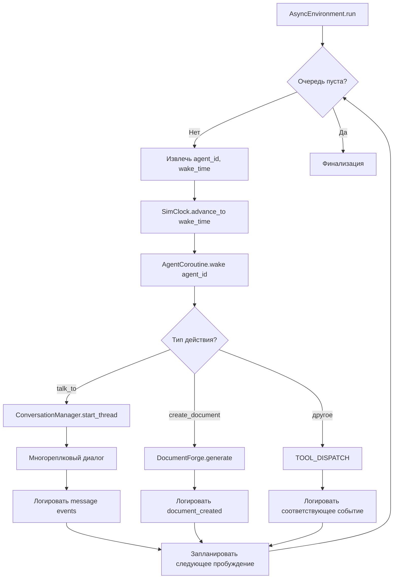

# Живой мир: асинхронная симуляция с непрерывным временем

Дата: 2026-02-24

## Контекст и мотивация

Текущая система генерации событий (`generate_rich_run.py`) представляет собой скрипт на 1000+ строк, вручную формирующий каждое событие как словарь. Результат — фиксированный сценарий без вариативности, где агенты не принимают собственных решений, переписки сведены к паре «сообщение + ответ» в одном событии, а документы (ТЗ, протоколы, статьи) лишь упоминаются без содержания.

Проблема не в отсутствии движка — проект уже содержит полноценную когнитивную систему (Park et al., 2023) с памятью, рефлексией, иерархическим планированием и арбитром. Проблема в том, что для демо использовался ручной скрипт вместо реального запуска.

Цель — превратить симуляцию в живой мир, где наблюдатель видит всё: многореплковые переписки, полные тексты документов, приватные встречи, внутренние размышления агентов. Агенты существуют в непрерывном времени, а не в дискретных раундах.

## Принципиальные решения

### Источник содержания — LLM

Каждый агент вызывает языковую модель для генерации реплик, документов и решений. Стоимость токенов не является ограничением. Приоритет — естественность и непредсказуемость текстов.

### Полностью асинхронная архитектура

Каждый агент — корутина с собственным таймером. Агенты действуют параллельно, конфликты разрешаются через блокировки. Требуется полный пересмотр `environment.py` на базе `asyncio`.

### Наблюдатель видит всё

Флаг `private` сохраняется для внутренней логики аудитора (он может не знать о приватных встречах), но в ленте событий наблюдатель видит абсолютно всё — приватные переписки, закулисные встречи, внутренние мысли.

## 1. Модель времени

Вместо дискретных раундов — непрерывная временная шкала с приоритетной очередью (`heapq`).

Компонент `SimClock` хранит текущее время симуляции. Каждый агент имеет поле `next_action_time`. Глобальные часы продвигаются к ближайшему событию в очереди. Когда агент завершает действие, он получает следующий тайм-слот: `current_time + action_duration + think_time`.

Продолжительность действий зависит от типа:

| Действие | Длительность |
|----------|-------------|
| Сообщение в мессенджере | 1-3 минуты |
| Телефонный разговор | 5-20 минут |
| Составление документа | 30-120 минут |
| Личная встреча | 15-60 минут |
| Перемещение между локациями | 10-40 минут |

Событие теряет поле `round` и сохраняет только `timestamp` (ISO 8601). Фронтенд группирует по дням и часам. Обратная совместимость: старые JSONL-файлы с полем `round` продолжают работать — фронтенд определяет формат по первому событию.

## 2. Система коммуникации

Полный пересмотр `talk_to`. Вместо синхронного request-response — многореплковые треды.

### Каналы связи

Каждое сообщение привязано к каналу, определяющему формат, задержку и условия:

- `telegram` — короткие сообщения, мгновенная доставка, сохраняются
- `phone` — устный разговор, можно «подслушать» только при совпадении локации
- `face_to_face` — личная встреча, требует совпадения локации обоих участников
- `email` — формальные письма, задержка 5-30 минут
- `official_doc` — служебные записки через канцелярию

### Треды

Каждый разговор получает уникальный `thread_id`. Реплики — отдельные события типа `message`. Диалог продолжается, пока один из участников не решит завершить (LLM решает, есть ли что добавить). Лимит — 15 реплик на тред.

Формат события:
```json
{
  "timestamp": "2026-02-16T11:34:00+03:00",
  "event_type": "message",
  "agent_id": "off_1",
  "payload": {
    "thread_id": "T-0042",
    "to_id": "biz_1",
    "channel": "telegram",
    "content": "Сергей, привет. Открыли закупку на серверы...",
    "private": true
  }
}
```

Ответ — отдельное событие с тем же `thread_id`:
```json
{
  "timestamp": "2026-02-16T11:36:00+03:00",
  "event_type": "message",
  "agent_id": "biz_1",
  "payload": {
    "thread_id": "T-0042",
    "to_id": "off_1",
    "channel": "telegram",
    "content": "Игорь, спасибо. А какой бюджет? Когда дедлайн?",
    "private": true
  }
}
```

## 3. Артефакты (документы)

Новый тип события `document_created`. Когда агент составляет документ, LLM генерирует полный текст с реквизитами по соответствующему ГОСТ.

### Требования к оформлению

Документы генерируются по ГОСТ:
- Организационные документы: ГОСТ Р 7.0.97-2016 (реквизиты, структура, оформление)
- ТЗ на автоматизированные системы: ГОСТ 34.602
- Краткие требования к оформлению включены в системный промпт агента

### Формат события

```json
{
  "timestamp": "2026-02-17T10:00:00+03:00",
  "event_type": "document_created",
  "agent_id": "off_secretary",
  "payload": {
    "doc_id": "DOC-003",
    "doc_type": "technical_specification",
    "title": "Техническое задание на закупку серверного оборудования",
    "case_id": "D-001",
    "content": "УТВЕРЖДАЮ\nНачальник отдела обеспечения\nКозлов И.М.\n...",
    "visibility": "public"
  }
}
```

### Типы документов

`memo`, `technical_specification`, `protocol`, `commercial_proposal`, `audit_report`, `newspaper_article`, `telegram_post`, `complaint`, `court_filing`

Полный текст документа хранится в payload события и дублируется в `artifacts/{doc_id}.md`.

## 4. Архитектура асинхронного движка

### Новые компоненты

**`SimClock`** — глобальные часы. Стартовое время из конфигурации. Продвигаются к ближайшему событию.

**`AgentCoroutine`** — обёртка над `CognitiveAgentRunner`. Каждый агент — корутина:
1. Просыпается в своё время
2. Получает текущую ситуацию
3. Решает действие через LLM
4. Выполняет действие (может инициировать диалог — блокирует собеседника)
5. Планирует следующее пробуждение

**`ConversationManager`** — управление тредами:
1. Создаёт тред с `thread_id`
2. Генерирует первую реплику (LLM)
3. Будит собеседника для ответа
4. Собеседник генерирует ответ (LLM)
5. Инициатор решает — продолжить или завершить
6. Цикл до завершения или лимита (15 реплик)

**`DocumentForge`** — генерация документов по ГОСТ. Принимает тип, контекст, автора. Формирует промпт с требованиями к оформлению и вызывает LLM.

**`AsyncEnvironment`** — новый главный цикл:
```python
async def run(self):
    while self.clock.now < self.end_time:
        agent_id, wake_time = self.scheduler.next()
        self.clock.advance_to(wake_time)
        await self._run_agent_action(agent_id)
```

Asyncio используется для модели «пробуждений» и «ожиданий». Реальный параллелизм — через `asyncio.gather` для независимых агентов, если нужна скорость.

### Диаграмма потока



## 5. Изменения фронтенда

### ActivityFeed

- Группировка по дням/часам вместо раундов
- Новый рендерер для `message` — группировка по `thread_id` в треды мессенджера (аватарка, имя, время, текст; чередование сторон)
- Визуальная индикация канала: иконка телефона, Telegram, конверта, рукопожатия
- Новый рендерер для `document_created` — сворачиваемый блок с заголовком и полным текстом
- Все события видимы; приватные помечены иконкой замка, но не скрыты

### Временная шкала

Замена `RoundScrubber` на timeline с засечками по дням. Навигация по времени вместо раундов.

### Бэкенд

- WebSocket: обновлённый граф отправляется после каждого значимого события, а не по раундам
- REST: эндпоинт `/api/artifacts/{doc_id}` для получения документа

## 6. Ограничения и защита

- Жёсткий лимит 15 реплик на тред (защита от бесконечных диалогов)
- Seed фиксирует порядок пробуждений и случайные задержки (воспроизводимость с точностью до LLM temperature=0)
- Обратная совместимость со старым JSONL-форматом

## 7. Затрагиваемые файлы

### Движок (создание / полный пересмотр)
- `src/magistry_sim/async_environment.py` — новый асинхронный цикл
- `src/magistry_sim/sim_clock.py` — глобальные часы
- `src/magistry_sim/conversation.py` — ConversationManager
- `src/magistry_sim/document_forge.py` — генерация документов по ГОСТ

### Движок (модификация)
- `src/magistry_sim/events.py` — новые типы событий, убрать обязательность round
- `src/magistry_sim/tools/communication.py` — переделка talk_to на многореплковые треды
- `src/magistry_sim/cognitive_runner.py` — адаптация под async, каналы связи
- `src/magistry_sim/state.py` — thread-aware хранение сообщений
- `src/magistry_sim/context.py` — ситуационные сводки с учётом тредов

### Фронтенд
- `web/frontend/src/components/ActivityFeed.tsx` — треды, документы, временная группировка
- `web/frontend/src/components/RoundScrubber.tsx` → `Timeline.tsx`
- `web/frontend/src/types.ts` — новые типы событий
- `web/frontend/src/hooks/useSimulation.ts` — адаптация под новый формат

### Бэкенд
- `web/backend/main.py` — граф по событиям, эндпоинт артефактов
