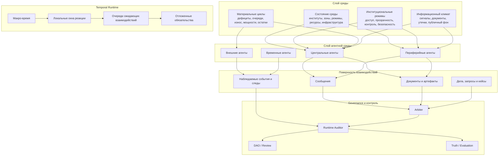

# Архитектурный дизайн усиленной среды MAGISTRY

## Цель документа

Документ развивает план усиления среды и фиксирует целевую архитектуру усиленной среды для MAGISTRY.

Это не документ про конкретные алгоритмы, эвристики или сигнатуры методов. Его задача — зафиксировать:

- какие архитектурные слои должна получить среда;
- как они соотносятся с уже существующим движком;
- в каком направлении должен эволюционировать runtime;
- какие инварианты нужно сохранить при росте плотности агентной среды.

Документ исходит из следующих уже принятых рамок:

- среда должна усиливаться не за счёт жёстко зашитых суррогатов, а за счёт более плотной и насыщенной агентной среды;
- наличие дешёвых моделей делает допустимым большое количество мелких параллельных агентов;
- дальнейший рост правдоподобия среды требует менее грубого и менее полностью синхронного temporal/runtime-контура.

## Текущий статус внедрения

На текущий момент в кодовой базе уже реализованы следующие элементы целевой архитектуры:

- `world.environment` в конфигурации сценария;
- `EnvironmentState` в `WorldState`;
- typed-id для `zone:*` и `res:*`;
- materialization environment-сущностей при инициализации мира;
- safe environment snapshot для worldgen;
- отражение среды в YAML-журнале мира;
- `environment_updates` от worldgen с детерминированным apply;
- привязка агента к `org_id` / `zone_id`;
- релевантный environment-brief в агентном prompt;
- environment-aware активация периферийных агентов.
- локальные reaction windows внутри того же тика для быстрых follow-up реакций.
- first-class документарный слой `art:*` со статическими и runtime-обновляемыми артефактами.
- first-class слой неформальных связей (`informal_links`) и их детерминированное усиление по interaction traces.
- worldgen-spawn с привязкой новых агентов к `org_id` / `zone_id`.
- `population_blueprints` для bootstrap- и environment-change-наращивания периферийной agent ecology.
- first-class очередь локальных ожидающих follow-up (`pending_interactions`) с `pending_interaction_due` / `completed` / `expired`.
- first-class material queues (`operational_queues`) и детерминированная queue-alert materialization при resource pressure.
- детерминированный complaint/publication цикл поверх queue-layer с публичными `world_event` и service-degradation signals в `information_climate`.
- per-tick degradation/recovery loop operational queues, зависящий от фактической `work`-активности релевантных агентов.
- deterministic runtime-spawn внешних complainant/reporter акторов из service-degradation контуров.
- seeded follow-up / `shared_issue` linkage для queue-spawned акторов, позволяющие им запускать собственные action chains.
- deterministic bridge от действий queue-spawned акторов к internal response obligations и documentarized complaint/media surface.
- deterministic bridge от queue-driven internal response obligations к runtime-auditor / governance escalation.
- deterministic truth/evaluation bridge для queue-driven governance signals.
- environment-sidecar observability (`environment_summary.json`, `environment_timeline.jsonl`) и graph-state environment slice для визуализации усиленной среды.

Следовательно, документ больше не описывает только далёкую цель: часть первого и второго слоя уже материализована в движке.

## Проблема текущей архитектуры

Текущий движок уже обладает сильным внутренним слоем агента:

- persona + interview + reflection;
- working/long-term memory;
- pre-tick worldgen с `agent_daily_context`, `scene_hooks`, `story_state`;
- runtime-аудитор как отдельный governance-layer;
- deterministic apply поверх конкурентного propose.

Эта архитектура хорошо усиливает индивидуальную мотивацию, но пока слабее в другой плоскости: сама среда ещё недостаточно автономна как источник причинности.

Практически это проявляется так:

- средовое давление в основном приходит через prompt-layer, а не через самостоятельные состояния мира;
- окружающая агентная среда ограничена и активируется слишком дискретно;
- крупный глобальный тик остаётся главным ритмом мира;
- материальные, институциональные и информационные ограничения среды представлены слабее, чем личностный слой агентов;
- периферийная насыщенность мира уступает насыщенности центральных акторов.

Итог: симуляция уже умеет давать психологически правдоподобных агентов, но миру ещё не хватает собственной плотности, инерции и сопротивления.

## Целевые свойства усиленной среды

Целевая среда MAGISTRY должна обладать следующими свойствами:

1. Мир имеет собственное состояние, а не только историю событий.
2. Мир меняется не только после решений core-акторов, но и за счёт активности периферии.
3. Институциональные режимы существуют как часть мира, а не как неявная настройка сценария.
4. Материальные ограничения и ресурсные циклы способны менять поведение акторов.
5. Информационная среда влияет на решения не меньше, чем прямые сообщения.
6. Временная динамика воспринимается как непрерывная и локально-реактивная, а не только как серия глобальных батчей.
7. Увеличение числа акторов не разрушает анализируемость и исследовательскую воспроизводимость.

## Архитектурные принципы

### 1. Среда — самостоятельный слой симуляции

Среда не должна оставаться только фоном, который worldgen каждый тик кратко описывает агенту. Она должна жить как отдельный слой состояния, меняющийся и наблюдаемый независимо от конкретного prompt.

### 2. Мелкая агентность предпочтительнее агрегатов

Если окружающий субъект может быть смоделирован как отдельный актор, его следует моделировать именно так. Проект не должен уходить в суррогатные когорты как стандартное средство масштабирования.

### 3. Временная неодновременность — свойство мира, а не ошибка

Не все процессы среды должны обновляться строго в одну и ту же точку глобального тика. Напротив, локальная неодновременность и разная скорость процессов — важная часть усиленной среды.

### 4. Институциональная механика должна быть наблюдаемой

Режимы доступа, контроля, прозрачности, безопасности и захвата должны существовать как наблюдаемые параметры среды, а не как скрытая логика движка.

### 5. Рост живости не должен ломать исследовательский режим

Даже при усиленной среде система остаётся экспериментальной платформой. Поэтому богатство среды должно сочетаться с возможностью post-hoc анализа, трассировки и сравнений между режимами.

## Целевая многослойная архитектура

## Слой состояния среды

### Назначение

Этот слой отвечает за всё, что не сводится к списку агентов и их памяти.

Он должен стать носителем:

- институциональной структуры;
- территориальной структуры;
- режимов среды;
- материальных ограничений;
- эксплуатационных последствий;
- информационного климата.

### Что принципиально меняется

Сегодня мир в основном хранит:

- агентов;
- work items;
- votes;
- audit cases;
- event history.

Целевая архитектура требует, чтобы мир также хранил самостоятельные состояния среды, которые:

- переживают отдельные тики и локальные реакции;
- способны меняться без прямого действия core-агента;
- становятся источником дальнейших ограничений и возможностей.

### Какие классы сущностей здесь должны появиться концептуально

- институциональные единицы;
- зоны и территории;
- инфраструктурные объекты;
- ресурсные контуры;
- рыночные контуры;
- режимы доступа и контроля;
- средовые риски и возможности;
- информационные артефакты среды.

Документ не фиксирует их будущие модели данных, но фиксирует архитектурный факт: состояние среды должно существовать как отдельный слой симуляции.

## Слой агентной среды

### Общая идея

В усиленной среде население мира не исчерпывается несколькими ключевыми фигурами сценария.

Нужны:

- центральные агенты;
- периферийные внутренние агенты;
- внешние агенты;
- временные и локально активируемые агенты.

### Категории агентной среды

#### Core-агенты

Главные фигуры сценария, на которых завязан основной governance-эксперимент.

#### Peripheral-агенты

Мелкие и средние акторы, связанные с core-структурой:

- подчинённые;
- сотрудники соседних отделов;
- технический персонал;
- второстепенные чиновники;
- контрактные исполнители;
- посредники;
- локальные заявители.

#### External-агенты

Акторы, не встроенные в ядро организации, но влияющие на неё:

- жители;
- журналисты;
- подрядчики;
- конкурирующие структуры;
- общественные посредники;
- смежные ведомства.

#### Ephemeral-агенты

Краткоживущие акторы, появляющиеся под конкретную ситуацию:

- временный проверяющий;
- случайный посредник;
- заявитель;
- свидетель;
- источник утечки;
- новый участник локального конфликта.

### Архитектурный вывод

Экология мира должна расширяться не только через более богатые prompt-layer contexts, но и через существенный рост числа реальных акторов.

## Temporal/runtime-контур

### Почему именно runtime требует отдельной переработки

Если просто увеличить число агентов при текущем ритме, система станет тяжелее, но не обязательно живее. Поэтому усиление среды должно сопровождаться переосмыслением temporal-контура.

### Целевая картина времени

Время мира должно иметь несколько контуров:

- макро-контур наблюдаемости и исследовательских контрольных срезов;
- локальный контур реакций и коротких цепочек взаимодействий;
- контур отложенных обязательств;
- контур средовых изменений, не обязанных ждать полного глобального батча.

### Что это меняет на архитектурном уровне

- глобальный тик перестаёт быть единственной значимой единицей движения мира;
- разные участки среды могут обновляться с разной интенсивностью;
- локальные цепочки причин и последствий могут разворачиваться без обязательного ожидания полной синхронизации всей агентной среды;
- среда начинает выглядеть менее пошаговой и более непрерывной.

Частично это уже материализовано через два механизма:

- локальные reaction windows внутри того же тика;
- queue layer локальных `pending_interactions`, которые переживают тик и могут реактивировать периферию позже.

### Что здесь важно сохранить

Несмотря на большую живость runtime, проект должен сохранить:

- экспериментальную интерпретируемость;
- воспроизводимость основных режимов;
- возможность собирать корректный truth-layer;
- отслеживаемость причин изменений.

## Институциональные режимы

### Назначение

Организации и территории должны иметь не только “описание” и набор агентов, но и собственный операционный режим.

### Примеры архитектурно значимых режимов

- режим прозрачности;
- режим допуска к информации;
- режим контроля;
- режим реагирования;
- режим безопасности;
- режим кадровой жёсткости;
- режим чрезвычайного положения;
- режим фактического захвата.

### Почему это важно

Такие режимы превращают среду в экспериментальное пространство, где исследуются не только различия между личностями агентов, но и различия между институциональными устройствами мира.

Именно здесь техническая настройка среды становится политическим фактом симуляции.

## Материальные контуры

### Проблема

Если среда не имеет собственной материальной инерции, коррупция и плохое управление остаются в основном морально-нарративными, а не операционными явлениями.

### Что должна дать более насыщенная материальная среда

Среда должна уметь накапливать последствия:

- дефицит;
- очереди;
- перегрузку;
- задержки;
- износ;
- недофинансирование;
- логистический сбой;
- локальное улучшение за счёт серого shortcut;
- отложенный институциональный ущерб.

### Архитектурный эффект

Агентские решения получают цену, распределённую во времени и по среде, а не только мгновенную реакцию в журнале событий.

## Информационная среда

### Назначение

Информационная среда должна быть отдельным слоем, а не лишь суммой прямых сообщений между агентами.

### Что входит в этот слой

- документы;
- полуформальные записи;
- наблюдаемые следы действий;
- слухи и сигналы;
- публичные реакции;
- локальные утечки;
- институциональная видимость или непрозрачность.

### Почему это критично

В организационной симуляции именно информационная среда определяет:

- кто что знает;
- кто что может скрыть;
- какие сигналы считаются тревожными;
- как формируется подозрение;
- когда запускаются контрольные и коллегиальные механизмы.

## Слой документов и артефактов

### Позиция документа в общей архитектуре

Документы не должны оставаться только текстом внутри `message_sent` или побочным описанием в событии.

Они должны рассматриваться как самостоятельная поверхность мира, через которую проходят:

- распоряжения;
- объяснения;
- заявки;
- отчёты;
- согласования;
- служебные следы;
- основания для аудита;
- основания для скрытия или манипуляции.

### Архитектурный смысл

Документарный слой создаёт между “намерением агента” и “последствием в мире” промежуточную, анализируемую форму.

Именно это резко усиливает:

- governance-тесты;
- более содержательный аудит;
- правдоподобие бюрократической среды;
- post-hoc валидацию.

## Неформальные сети

### Назначение

Формальная оргструктура не должна быть единственным графом мира.

Нужен отдельный слой:

- лояльностей;
- долгов;
- посредничества;
- повторяющихся контактов;
- теневых обязательств;
- личных связей;
- латентных коалиций.

### Архитектурная роль

Этот слой нужен не только для более богатого поведения, но и для того, чтобы среда перестала быть слишком “плоской” и слишком честной по умолчанию.

Он связывает:

- агентный слой;
- информационный слой;
- governance-layer;
- truth/evaluation-контур.

## Место current worldgen в новой архитектуре

### Что сохраняется

Существующий worldgen остаётся полезным как:

- генератор локальных opening contexts;
- источник внешних событий;
- источник сценовых поводов;
- канал появления новых акторов.

### Что меняется

В новой архитектуре worldgen перестаёт быть единственным носителем среды.

Он должен работать поверх более богатого состояния среды, а не вместо него.

Иными словами:

- среда больше не равна worldgen;
- worldgen — это только один из механизмов обновления среды.

## Место runtime-аудитора в новой архитектуре

Усиленная среда не уменьшает значение runtime-аудитора, а наоборот повышает его роль.

При усиленной среде аудит получает:

- больше наблюдаемой поверхности;
- больше латентных паттернов;
- более содержательные evidence chains;
- более правдоподобные институциональные причины для вмешательства.

Но при этом аудит не должен становиться заменой самой среды.

Среда должна сама создавать последствия, а аудитор — только обнаруживать, квалифицировать и маршрутизировать значимые случаи.

## Место truth/evaluation в новой архитектуре

С ростом плотности среды возрастает и риск потерять interpretability.

Поэтому truth/evaluation-контур должен рассматриваться как обязательная часть архитектуры усиленной среды, а не как вторичный побочный контур.

Целевая среда требует:

- более богатого слоя истины;
- лучшей привязки к environment-state;
- более содержательных case-level сопоставлений;
- отделения “мир действительно изменился” от “в prompt было написано, что мир изменился”.

## Влияние на текущие модули

Документ не фиксирует будущие сигнатуры, но фиксирует направления архитектурной нагрузки.

| Область | Архитектурное изменение |
|---|---|
| `state.py` | Мир должен хранить отдельный слой состояния среды, а не только агентные и governance-сущности |
| `config.py` | Конфиг должен описывать режимы усиленной среды и temporal/runtime-параметры среды |
| `engine.py` | Движок должен координировать не только батч агентских ходов, но и более живые контуры средовой динамики |
| `worldgen.py` | Worldgen должен стать одним из обновителей среды, а не главным носителем её реальности |
| `auditor.py` | Аудит должен работать по более богатой поверхности мира, а не по относительно плоскому потоку событий |
| `truth.py` / `evaluation.py` | Truth-layer должен учитывать средовые состояния и их изменения как самостоятельные факты |
| `web` | UI должен уметь показывать не только граф акторов, но и состояние среды, режимов и локальных напряжений |

## Эволюционная траектория

### Фаза 1. Среда как состояние

Главная цель:

- сделать среду отдельным слоем мира.

### Фаза 2. Среда как населённая агентная среда

Главная цель:

- резко увеличить плотность периферийной агентности.

### Фаза 3. Среда как время

Главная цель:

- перестать мыслить весь мир только через крупный синхронный тик.

### Фаза 4. Среда как экспериментальная переменная

Главная цель:

- превратить институциональные и temporal-режимы среды в полноценный объект исследования.

## Открытые архитектурные вопросы

На данном этапе документ сознательно не закрывает следующие вопросы:

- где проходит граница между макро-временем и локальным временем;
- как именно будет обеспечиваться воспроизводимость при более живом runtime;
- какие средовые сущности должны стать самостоятельными объектами раньше остальных;
- как UI должен визуализировать усиленную среду без перегрузки;
- как отделять “шум живой среды” от действительно значимых исследовательских сигналов.

Эти вопросы должны решаться уже на следующем уровне — в документах о поэтапном внедрении.

## Вывод

Для следующего качественного скачка MAGISTRY нужно усиливать не столько психологию отдельных агентов, сколько самостоятельность мира, в котором они действуют.

Целевая архитектура усиленной среды — это:

- мир с собственным состоянием;
- мир с плотной периферийной агентностью;
- мир с менее грубым temporal/runtime-контуром;
- мир, где институты, документы, ресурсы, режимы и информационные следы существуют как реальные элементы симуляции;
- мир, который способен не только принимать решения агентов, но и сопротивляться им, деформироваться под ними и отвечать на них.

Именно такая среда делает governance-эксперименты в MAGISTRY существенно более жёсткими, правдоподобными и исследовательски ценными.
