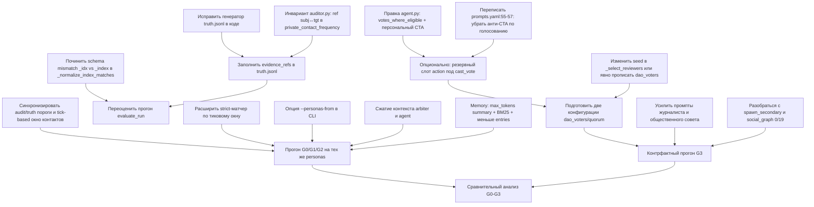

# Результаты ночного прогона G3 и план доработок

## Назначение документа

Документ фиксирует наблюдения по результатам ночного имитационного прогона режима G3 на сценарии муниципального тендера (РемСервис) и описывает конкретный план доработок до следующего прогона. Прогон проводился по плану из `docs/plans/overnight_g0_g3_run_plan.md`. Результаты служат эмпирической базой для главы 3 ВКР, поэтому корректность метрик и содержательная интерпретируемость поведения агентов критичны.

## Условия прогона

Прогон выполнен на сценарии `scenarios/procurement_tender_large.json` (двадцать агентов: внутренние органы муниципалитета, подрядчики, субподрядчики, эксперт, журналист, общественный совет). Режим управления — G3 (runtime-аудитор плюс коллегиальный пересмотр). Длительность — двадцать четыре тика, фактическое время работы — около тридцати двух часов (с двадцать третьего апреля 21:25 по двадцать пятое апреля 02:14). Использовалась модель `nvidia/nemotron-3-super-120b-a12b` через OpenRouter, провайдер DeepInfra, эмбеддинги — `google/gemini-embedding-001` с тайм-аутом тридцать секунд и тремя ретраями экспоненциальной задержки. Стоимость прогона по факту — около шести долларов (план ставил три и двадцать пять центов, переплата примерно в два раза).

Артефакты прогона лежат в `results/overnight_g3/`: `status.json` (state=finished), `summary.json`, `evaluation.json`, `fidelity.json`, `perf_summary.json`, `events.jsonl` (6.5 МБ), `trace.jsonl` (151 МБ), `world_history.md` (215 МБ), `personas.json` (1.1 МБ).

## Повторная валидация

Повторная проверка артефактов и кода подтвердила главный вывод документа: текущий прогон является фактически одиночным G3-прогоном, а не серией G0-G3. В `results/` найден только `results/overnight_g3`; артефактов `overnight_g0_g3_series` или отдельных G0/G1/G2-прогонов нет. Поэтому материал годится для диагностики G3 и демонстрации проблем механизма, но не для сравнительной таблицы режимов.

Пересчёт по `events.jsonl`, `trace.jsonl`, `truth.jsonl`, `evaluation.json` и `perf_summary.json` подтвердил ключевые числа: 9786 событий, 25 тиков (`0..24`), 41 `audit_flagged`, 15 `audit_case_opened`, 11 `audit_escalated`, 11 `vote_opened`, 0 `vote_cast`, 11 закрытий `quorum_not_reached`, 1 truth-запись, `precision=0.0244`, `recall=1.0`, `semantic_precision=0`, `semantic_recall=0`. Все 112 ожидаемых voter-prompt'ов действительно содержали соответствующий `vote_id`, но те же открытые голосования одновременно показывались 768 раз не-voter'ам, что подтверждает проблему не с доставкой события, а с отсутствием персонального сигнала обязанности.

По итогам повторной проверки внесены два важных уточнения. Во-первых, правило runtime-аудитора `private_contact_frequency` в текущем коде не требует заранее существующей `informal_link`; оно считает частые приватные `message_sent` и личные контакты между внутренним и внешним агентом. Неформальные связи важны для отбора reviewer'ов в `_select_reviewers`, но не являются условием самого audit-флага. Во-вторых, заявленное окно `private_contact_window_ticks=5` фактически ограничено ещё и `lookback_events=300`: при плотном логе оно не всегда покрывает полные пять тиков истории. Поэтому расхождение audit/truth нужно анализировать как комбинацию трёх факторов: audit-порог `>=3`, truth-порог `>=4`, event-count окно `lookback_events=300`.

## Главное наблюдение: G3 как механизм фактически не сработал

Все одиннадцать коллегиальных голосований (`vote_closed`, `review_case_closed`) закрылись со статусом `result=failed, reason=quorum_not_reached`. Ни одно дело не дошло до коллегиального вердикта. С точки зрения наблюдаемого поведения это означает, что в данном прогоне режим G3 выродился до G1: единственным активным механизмом контроля остался runtime-аудитор. Прямое сравнение метрик G3 с метриками G0, G1 и G2, как было задумано в плане, на этих данных некорректно — мы сравнивали бы аудитор-only режим с самим собой.

Центральный технический сигнал — за весь прогон зарегистрировано ноль событий `vote_cast`. Голосование не просто не достигло кворума: ни один из назначенных voter'ов ни разу не отдал голос. Это важно для интерпретации, потому что фактическая конфигурация жюри отличается от того, как она читается из настроек на первый взгляд. В пуле dao-capable агентов одиннадцать (мэр, заместитель по экономике, начальники профильных управлений, начальник тендерного секретариата, главный бухгалтер, начальник контрольного управления, два юриста и два специалиста по закупкам), однако параметр `review_jury_size=3` (`src/sphere_lc/auditor.py`, метод `_select_reviewers`, и `src/sphere_lc/config.py:446`) ограничивает каждое отдельное голосование тремя случайно выбранными reviewer'ами. Дополнительная фильтрация `_has_conflicting_informal_link` исключает кандидатов с сильной (`strength≥0.55`) или открытой неформальной связью с субъектом, и в двух кейсах пул оставил всего одного voter'а (`agent:mayor` в одном кейсе, `agent:head_legal` в другом). Реальное распределение audience по одиннадцати голосованиям: восемь по три voter'а, одно — по два, два — по одному. При `quorum=0.5` это требует ≥2 голосов в восьми случаях, ≥1 в двух одиночных и одном парном — но реально нет ни одного голоса вообще.

Прямая проверка по `trace.jsonl` сужает диагноз и снимает изначальный многогипотезный анализ. Для голосования `vote:review_audit_case_a796f7f4ec45` (открыто на тике два; voter'ы — chief_accountant, deputy_econ, mayor) `vote_id` присутствует в `user`-части prompt'а у всех трёх voter'ов на тиках три, четыре, пять и шесть — двенадцать промптов из двенадцати, в блоках «Голосования в ходу» и «Какие процедуры уже открыты», с явным указанием типа `audit_review` и subject. Ни в одном из двенадцати ответов voter'ы голосование не упоминают и `cast_vote` не вызывают. Это снимает гипотезу о недоставке события `vote_opened` и гипотезу о слишком коротком окне: фактическое окно открытие→закрытие составляет четыре тика. Важно: длительность окна определяется не `vote_duration_ticks=3` (как можно было бы подумать), а параметром `freeze_duration_ticks=4` через формулу `closes_tick = current_tick + freeze_duration_ticks` в [auditor.py:642](src/sphere_lc/auditor.py:642). Это смешение двух разных параметров — длительности голосования и длительности заморозки репутации — на одном расчёте; для `audit_review`-голосования фактически используется второй. Каждый voter получает по четыре агентских хода в этом окне. Единственный за весь прогон вызов `cast_vote` приходится на тик двадцать два от агента spec_2 по голосованию, в котором сам spec_2 является subject — отклонён системой как `target_self_vote_disabled`. Иными словами, LLM в принципе понимает синтаксис cast_vote, но не воспринимает голосование как обязанность, когда сам находится в списке voter'ов.

Корень проблемы — в prompt-инжиниринге `agent.user`. В [agent.py:676](src/sphere_lc/agent.py:676) `open_votes = [vid for vid, v in state.votes.items() if v.status == "open"]` собирается без фильтра по принадлежности агента к `vote.voters`. В результате один и тот же блок «Голосования в ходу: …» рендерится для всех двадцати агентов одинаково, и voter не отличает «я могу понаблюдать» от «я обязан проголосовать до закрытия». Действие `cast_vote` присутствует в action-схеме арбитра ([arbiter.py:449](src/sphere_lc/arbiter.py:449)) и косвенно подсвечено в proposal-блоке `good_dao` ([prompts.yaml:162](src/sphere_lc/prompts.yaml:162)), но без персонального CTA для конкретного voter'а. Содержательная гипотеза о культуре формальной вежливости, подавляющей голосование против коллег, пока не опровергнута, но она вторична: пока voter prompt не сообщает агенту персональную обязанность, мы измеряем не культуру, а отсутствие сигнала.

К отсутствию сигнала добавляется явная негативная инструкция в самом шаблоне `agent.user`. В [prompts.yaml:55](src/sphere_lc/prompts.yaml:55) среди общих правил поведения присутствует фраза «если ты не открываешь и не ведёшь голосования по своей роли, не обещай этого; исключение только одно: если текущая процедура адресована тебе, можешь явно дать согласие или отказ». Это не просто отсутствие CTA, это анти-CTA: общее правило прямо запрещает агенту обещать участие в голосовании, делая исключение только для случая, когда агент является subject процедуры. Это объясняет, почему **единственный** за весь прогон вызов `cast_vote` приходит от spec_2 — единственного агента, формально подпадающего под исключение «процедура адресована тебе» (subject в `vote:review_audit_case_5d1a3bc3f5a5`). Шаблон системно стимулирует subject голосовать (что отвергается `target_self_vote_disabled`) и системно блокирует voter'ов. Любая правка `_build_user`, добавляющая персональный CTA для voter'а, без одновременного изменения строк 55–57 `prompts.yaml` создаёт LLM конфликтующие инструкции и почти гарантированно не даст эффекта.

## Поведение runtime-аудитора и природа сорока ложных срабатываний

Runtime-аудитор за прогон выписал сорок одно нарушение типа `conflict_of_interest` (события `audit_flagged`). Из них одно совпадает с заложенной в сценарий истиной (recall=1.00), сорок — ложные (precision=0.0244). Это не случайный шум, а следствие архитектурного устройства правила обнаружения.

Применяемое правило — `private_contact_frequency`: если суммарное число приватных контактов (`message_sent` с приватной адресацией или `narrative_action` вида `in_person_contact`) между внутренним и внешним агентом в окне достигает трёх или более, runtime-аудитор фиксирует флаг. Важно: текущая реализация не проверяет наличие заранее существующей `informal_link` между парой. Уверенность (`confidence`) во всех сорока одном случаях фиксированная — 0.75, без градации по интенсивности контактов, силе связи, типу связи или институциональному контексту контакта. Поэтому правило не отличает легитимный рабочий коммуникационный хаб от устойчивого конфликта интересов.

Распределение по целям показательно. Все сорок ложных срабатываний (как и единственное истинное) направлены на внешних участников: десять на `agent:public_council`, семь на `agent:sub_1`, семь на `agent:expert`, шесть на `agent:contractor_3`, пять на `agent:contractor_1`, по три на `agent:contractor_2` и `agent:journalist`. На внутренних субъектах флагов нет вовсе. По субъектам — пятьдесят шесть процентов всех флагов (двадцать три из сорока одного) завязаны на `agent:chief_accountant`, главного бухгалтера. Это типовой паттерн «коммуникационного хаба»: агент, у которого по сценарию много легитимных контактов с внешними сторонами, автоматически набирает три и более приватных контакта за фактическое окно анализа с разными внешними партнёрами, и runtime-аудитор каждый раз выписывает флаг.

Для главы ВКР это одновременно содержательный и технический результат. Содержательно runtime-аудитор демонстрирует трейд-офф recall × precision, характерный для жёсткого порогового детектора. Технически текущая реализация слишком груба: она не использует контекст `informal_link`, не различает силу и тип связи, не нормирует контакты по должностной функции и не отделяет публично значимые коммуникации от рутинных рабочих уточнений. Поэтому результат можно описывать как свойство базового порогового механизма, но перед следующим прогоном правило нужно довести до более честного контракта.

## Расхождение метрик: семантическая precision и recall равны нулю при runtime-recall=1.00

Главная причина нулевых семантических и case-метрик — **schema/key mismatch в коде матчера**, а не пустые `evidence_refs` truth, как предполагалось изначально. LLM-судья в `trace.jsonl` (запись с `role=evaluation`, `name=semantic_match`) на самом деле успешно предложил 10 семантических матчей и 10 case-матчей по паре `chief_accountant → public_council` через механизм `private_contact_frequency`. Однако судья вернул ключи `truth_idx` / `signal_idx` (и аналогично `truth_case_idx` / `signal_case_idx`), тогда как функция `_normalize_index_matches` в [evaluation.py:219–232](src/sphere_lc/evaluation.py:219) ждёт ключи `truth_index` / `signal_index` (и `truth_case_index` / `signal_case_index`). Несовпадение имён приводит к тому, что `_normalize_index_matches` молча отбрасывает все десять матчей, и наружу выходят `semantic_tp=0`, `semantic_fp=41`, `semantic_fn=1`, `case_tp=0`, `case_fp=41`, `case_fn=1`. Это контрактный баг между промптом семантического судьи и нормализатором ответа, а не содержательный отказ судьи или fundamental mismatch evidence trail. Минимальная починка — либо переименовать ключи в `_evaluation_semantic_schema` и пользовательском промпте `evaluation.semantic_match.user`, чтобы судья возвращал `_index`, либо принимать в `_normalize_index_matches` оба варианта (`_idx` как алиас `_index`). Без этой правки любые улучшения evidence_refs не повлияют на метрики, потому что десятки матчей будут продолжать отбрасываться нормализатором.

После починки schema mismatch остаются вторичные причины расхождения, о которых стоит знать. Истина в `truth.jsonl` записана в state-based форме: `subject_agent_id=agent:chief_accountant`, `target_agent_id=agent:public_council`, `violation_type=conflict_of_interest`, `mechanism=private_contact_frequency`, `evidence_refs=[]` (поле пустое), `tick=18`. Strict-матчер runtime-метрики (`src/sphere_lc/evaluation.py`, функция `_strict_match_score` на строках 511–534) возвращает оценку 0.6 именно для нашего случая — когда у truth массив refs пуст, а у signal он непуст (строка 533–534, ветвь `if not truth_relaxed`). Это отличается от ветви 0.7 (строка 529–530, обе стороны без refs) и 1.0 (строка 525–526, точное совпадение exact). 0.6 достаточно для засчитывания как true positive, но совпадение тика — обязательное условие (строка 512: при несовпадении возвращается 0). Флаги `chief_accountant → public_council` за прогон выписаны на десяти разных тиках (2, 5, 6, 7, 8, 10, 12, 13, 18, 24), и только тик 18 совпадает с истиной. Greedy 1:1 матчинг (строки 491–508) выбирает один матч для единственной truth-записи, остальные девять кандидатов с той же парой и типом остаются false positive. Поэтому runtime-метрика даёт recall=1.00 и precision=0.0244 — формально корректные, но скрывающие, что сама пара (subject, target, type) уже найдена аудитором в десяти случаях из сорока одного.

Заполнение `truth.evidence_refs` и инвариант покрытия пары (subject, target) у `audit_flagged` остаются полезными независимыми правками — они укрепляют семантический контракт и дают судье более устойчивый сигнал на сравнение. Но это не главный источник нулевых метрик, и без исправления schema mismatch они не сдвинут показатели.

У тридцати одного из сорока одного флага (около семидесяти шести процентов) хотя бы один evidence_ref не покрывает одновременно пару (субъект, цель) флага: типичный случай — флаг на пару `chief_accountant → journalist` сопровождается ссылкой `pending_interaction_due` от `chief_accountant` к `head_education` или `head_procurement` в той же серии тиков. В единственном случае (один флаг из сорока одного) ни один evidence_ref пары не покрывает. Это указывает на широкое окно агрегации (`private_contact_window_ticks=5` плюс event-count `lookback_events=300`), захватывающее параллельные контакты субъекта с другими внешними сторонами.

Высокий runtime-recall=1.00 при единственной truth-записи стоит интерпретировать с осторожностью: статистическая дисперсия одной точки экстремальна. Если бы детектор истины сработал на тике, отличном от тика любого из flagged-кандидатов, recall был бы ноль. Для содержательной оценки G3 в ВКР целесообразно либо эмитить TruthRecord не однократно при пересечении порога, а на каждом тике, где условие удерживается (получая несколько truth-записей по той же паре subject-target), либо явно оговаривать в тексте, что метрика на n=1 не информативна сама по себе и используется только в комбинации с precision и семантическим сигналом.

Повторный пересчёт показал дополнительную причину расхождения: аудит и truth используют разные пороги и один и тот же event-count lookback. Runtime-аудитор флагает пары при трёх приватных контактах, truth-layer записывает `private_contact_frequency` при четырёх. Если воспроизвести фактическую механику с `lookback_events=300`, получается 48 потенциальных audit-сигналов; 7 из них приходятся на тики с `audit_runtime_error` (4, 14, 23), поэтому в логе осталось 41. Truth-запись возникает ровно одна — `chief_accountant → public_council` на тике 18. Следовательно, низкая precision является не только свойством поведения агентов, но и следствием рассинхрона audit/truth-порогов.

## Воронка эскалации в G3

За прогон зафиксирована следующая последовательность переходов между стадиями работы аудитора и коллегии. Сорок один `audit_flagged` агрегируется в пятнадцать `audit_case_opened` (тридцать дополнительных флагов попадают в существующие кейсы через `audit_case_updated` — двадцать семь таких событий). Из пятнадцати кейсов одиннадцать переходят в стадию `audit_escalated` и параллельно `review_case_opened` плюс `vote_opened` с `vote_type=audit_review`. Четыре кейса не эскалируются, оставаясь на стадии `flagged` без коллегиального пересмотра — вероятная причина в логике follow-up или в том, что повторные флаги пары (subject, target) уже привязаны к другому кейсу и счётчик повтора не достигает порога эскалации. Все одиннадцать открытых голосований получают ноль `vote_cast` за окно из четырёх тиков (закрываются на `closes_tick = open_tick + freeze_duration_ticks=4`, см. [auditor.py:642](src/sphere_lc/auditor.py:642)) и закрываются как `vote_closed` / `review_case_closed` со статусом `failed: quorum_not_reached`. Соответствующие одиннадцать `audit_case_closed` фиксируют исход. Ни одной заморозки репутации (`reputation_frozen` от audit_review) не произошло.

Дополнительно за прогон: 451 `arbiter_approved` и 43 `arbiter_rejected`, что даёт rejection rate ≈ 8.7%, ниже планового ориентира 15-20%. План ожидал 100-200 успешных perform'ов за двадцать пять тиков; реальные 451 в 2.25 раза больше, что объясняет часть перерасхода токенов arbiter (53% всего бюджета) и стоимости.

## Производительность и стоимость

Суммарное время работы LLM по фазам — 287931 секунд, реальное время симуляции — 115883 секунд, коэффициент перекрытия (`overlap_ratio`) равен 2.485. Это означает, что в среднем одновременно выполнялось два с половиной параллельных вызова. Для сценария с двадцатью агентами это нормальный, но не предельный параллелизм; теоретический потолок — три-четыре параллельных вызова при условии, что блокирующие фазы вроде memory-запроса в начале каждого тика будут оптимизированы.

Распределение нагрузки сильно неравномерное. По времени лидируют memory (тридцать процентов wall-clock, 86593 секунды), arbiter (двадцать семь процентов, 78328 секунд) и persona_interview (девятнадцать процентов, 55862 секунды). По токенам картина другая: arbiter поглощает пятьдесят три процента всех токенов (20.65 миллионов из 39.15 миллионов), agent — тридцать два процента (12.45 миллионов), memory — девять процентов (3.42 миллиона). Важное уточнение после повторной проверки: memory медленный не только из-за эмбеддингов. В trace найдено сорок memory-вызовов с completion ≥16k токенов, один summary-вызов дошёл до 106431 completion-токена. Значит, для memory нужен не только BM25/pre-filter, но и жёсткий `max_tokens`/контракт краткой суммаризации.

Самые длинные отдельные вызовы — memory.max=2209 секунд, persona.max=951 секунда, persona.p95=828 секунд — превышают `SPHERE_LLM_CALL_DEADLINE_S=180`. Это не нарушение лимита: deadline относится к одному HTTP-запросу, а измеренная длительность включает retry-цепочку (`SPHERE_LLM_MAX_RETRIES=3`, `REQUEST_TIMEOUT_S=120`, итого до 360 секунд только на сами запросы плюс задержки). Параметры `timeout_count` и `retries_used_total` равны нулю, то есть формально все вызовы успевали уложиться, но провайдер LLM деградировал на пиках одновременной нагрузки. Разрыв между p50 памяти (194 секунды) и max (2209 секунд) указывает на сочетание provider-side latency и слишком свободного memory-summary ответа. Это важно для оценки эффекта Block 2: переход на BM25 ускорит локальную retrieval-часть, но без лимита на completion и сжатия prompt-контракта не уберёт самые дорогие memory-хвосты.

Отдельно стоит отметить расхождение между `error_count=26` и `retries_used_total=0` в `perf_summary.overall`. При нулевых ретраях двадцать шесть зафиксированных ошибок не были транзиентными HTTP-сбоями, обработанными retry-механизмом. Повторная классификация trace показывает: 6 ошибок persona, 6 arbiter, 5 agent, 4 memory, 3 auditor, 1 social_graph, 1 worldgen; основная форма — `structured_json_schema failed` / JSON parse error. Эти ошибки не привели к падению симуляции (значит, отрабатывал soft-degradation путь), но они указывают на необходимость сжатия prompt-контекста и ужесточения JSON/summary-контрактов.

Реалистичная оценка стоимости следующих прогонов после оптимизаций: четыре с половиной — пять долларов на режим. До трёх долларов прогон уложить можно только при агрессивном сокращении контекста arbiter и agent плюс полном переиспользовании personas между режимами; шесть долларов — текущая база без изменений.

## Нарративная фактура

Автоматические метрики fidelity показывают ноль нарушений по всем категориям (temporal, identity, phantom, bureaucratic_loop, narrating_leakage, semantic_realism). Выборочное чтение `world_history.md` подтверждает, что симуляция не страдает мета-протечками («я модель», «тик», «система») и держит формальную русскую деловую речь.

Архитектура мира выглядит достоверно: трёхуровневая иерархия мэр — заместитель — начальник отдела закупок, разделение на юридический отдел, бухгалтерию, контрольное управление и тендерный секретариат, корректная отсылка к 44-ФЗ, технической спецификации (`work:SPEC-001`), смете (`work:PRICE-001`), акту осмотра (`art:inspection_report`). Реплики персонажей различимы по тону: главный бухгалтер требует подтверждающих расчётов и упоминает отклонения от сметных норм, мэр пишет директивно и кратко, подрядчик использует наводящие вежливые формулировки.

Слабые стороны нарратива касаются драматургии, а не корректности. Финал (тик двадцать четыре) выглядит не как развязка коррупционного сюжета, а как процедурное замирание: длинный список согласований документов без ответа на вопрос, кто выиграл тендер и был ли разоблачён конфликт интересов. Сценарные потенциальные носители конфликта — Петров (предполагаемый коррупционер), Савельев (отчаявшийся конкурент), Рябов (эксперт под давлением) — почти не вступают в открытое противостояние; все говорят формально-вежливо. Уточнение после пересчёта: журналист и общественный совет не были буквально немыми (`journalist` отправил 44 сообщения, `public_council` — 35), но почти вся их активность была приватной. Во всём прогоне найдено только одно публичное `message_sent`, и оно не от журналиста или общественного совета. Поэтому проблема не в полном отсутствии ходов, а в отсутствии публичного давления и открытой институциональной сцены.

Это наблюдение стыкуется с гипотезой о причине провала кворума, но не доказывает её. Пока voter prompt не сообщает агенту персональную обязанность проголосовать, техническая причина сильнее культурной: агенты могли избегать голосования просто потому, что видели его как общий фон, а не как свою процедуру. После починки vote-flow можно будет отдельно проверять, сохраняется ли формальная вежливость как содержательный фактор отказа.

Замеченные технические дефекты не ломают прогон, но их нельзя считать полностью единичными: встречаются пустые или плохо распарсенные LLM-ответы, 26 зафиксированных LLM-ошибок по trace и длинная серия отказов эмбеддинг-провайдера `No embedding data received` в `overnight_g3.log`. Симуляция не упала, но следующий прогон должен идти уже с более жёсткими контрактами ответов и мониторингом, который корректно считает ошибки в JSONL.

## План доработок

План разбит на три блока по приоритету. Первый блок — те правки, которые нужно сделать обязательно до запуска любого следующего прогона. Второй — оптимизации перформанса и стоимости. Третий — расширение эмпирической базы для главы 3 ВКР.

### Блок 1. Обязательные правки до следующих прогонов

Правка voter prompt'а — первоочередная задача, так как без её решения любые правки порога кворума, размера жюри и состава `dao_voters` бесполезны. Изначально запланированный диагностический мини-прогон не нужен: проверка существующего `trace.jsonl` (см. раздел «Главное наблюдение») уже показала, что voter'ы видят `vote_opened` и `vote_id` во всех четырёх тиках окна голосования, но не упоминают голосование в ответах. Корень — в [agent.py:676](src/sphere_lc/agent.py:676), где `open_votes` собирается без фильтра по `vote.voters`, в шаблоне [prompts.yaml:120](src/sphere_lc/prompts.yaml:120) (`vote_audit_review`), который не указывает eligible voter'у на персональную обязанность, и в [prompts.yaml:55–57](src/sphere_lc/prompts.yaml:55) — общем правиле поведения, явно запрещающем агенту обещать участие в голосовании, кроме случая «процедура адресована тебе» (то есть когда агент сам subject). Правка должна быть синхронной по обоим местам, иначе LLM получит конфликтующие сигналы и эффекта не будет.

Минимальная правка состоит из двух частей. Первая — в `_build_user` агент-prompt'а ввести разделение на `votes_where_eligible` (vid, в которых `agent.agent_id in vote.voters` и агент ещё не голосовал) и `other_open_votes`; для первых рендерить отдельный блок с явным CTA — «Ты являешься избирателем по {{vote_id}}; голосование закрывается на тике {{closes_tick}}; до закрытия выбери `cast_vote` с choice ∈ {yes, no, abstain}». Вторая — переписать строки 55–57 `prompts.yaml` так, чтобы общее правило перестало конфликтовать с CTA: вместо запрета «не обещай участия в голосовании» — формулировка «открывать новое голосование можешь только если по своей роли ведёшь такие процедуры; голосовать в уже открытом голосовании можешь и обязан, если ты в списке voter'ов; если ты subject процедуры, можешь дать согласие или отказ». Опциональный, более сильный вариант — гарантировать, что один из слотов `max_actions_per_turn` voter'а резервируется под `cast_vote`, пока у него есть открытое голосование, в котором он состоит, и он ещё не проголосовал. Это устранит остаточную неопределённость между техническим и культурным факторами.

Восстановление семантической метрики начинается с правки schema/key mismatch в `_normalize_index_matches`. Это самая дешёвая и самая результативная правка: LLM-судья уже предложил 10 семантических и 10 case-матчей по нашему прогону, но они отбрасываются нормализатором из-за несовпадения имён ключей. Минимально достаточно либо переименовать ключи в JSON-схеме `_evaluation_semantic_schema()` и в шаблоне `evaluation.semantic_match.user` так, чтобы судья возвращал `truth_index`/`signal_index` и `truth_case_index`/`signal_case_index`; либо принимать в [evaluation.py:219–232](src/sphere_lc/evaluation.py:219) оба варианта (`_idx` как алиас `_index`). После этой правки переоценка прогона командой `python -m sphere_lc.cli evaluate --run results/overnight_g3` сразу даст ненулевые semantic/case-метрики на существующем `trace.jsonl` (если кешируется ответ судьи) или после нового вызова судьи. Это правка одного файла, её эффект максимален и не требует пересимуляции.

Параллельно полезно укрепить контракт ground truth, хотя без правки выше эти улучшения не сдвигают метрики. В `results/overnight_g3/truth.jsonl` поле `evidence_refs` стоит заполнить ссылками на реальные события `message_sent` между `chief_accountant` и `public_council` из тиков с четырнадцатого по восемнадцатый включительно (события достаются через `jq` из `events.jsonl`). Параллельно поправить генератор `truth.jsonl` в `src/sphere_lc/truth.py`, чтобы он автоматически прикладывал evidence_refs для state-based нарушений типа `private_contact_frequency` — извлекая последние n приватных сообщений между парой субъект-цель в окне обнаружения. Это делает контракт truth ↔ signal формально проверяемым и снимает остаточную неопределённость в ветви strict-матчера 0.6.

Симметричный инвариант на стороне аудитора — гарантировать, что хотя бы один evidence_ref в `audit_flagged` для правила `private_contact_frequency` действительно покрывает пару (subject, target) флага. Полный пересчёт показал: у 31 из 41 флага хотя бы один evidence_ref не покрывает одновременно subject-target, у 1 из 41 ни один evidence_ref не покрывает пару. Имеет смысл добавить такую проверку в построитель finding'а в `src/sphere_lc/auditor.py` и unit-тест: при сборке `audit_flagged` минимум один ref должен быть `message_sent` или `pending_interaction_*` именно между указанными subject и target. Это снимает остаточную неопределённость в семантическом матче и заодно делает контракт правила формально проверяемым.

Отдельная обязательная правка audit/truth-контракта — синхронизировать пороги и окна `private_contact_frequency`. Сейчас auditor флагает при `count >= 3`, truth пишет запись при `count >= 4`, а оба слоя получают историю через `lookback_events=300`, что при плотном event-log может быть короче пяти тиков. Нужно явно решить, что считается ground truth: либо повысить audit-порог до четырёх, либо добавить в truth state-based записи для трёх контактов с меньшей severity/confidence, либо разделить `signal` и `violation` как разные уровни одного механизма. Также стоит заменить event-count lookback для contact-pattern правил на tick-based буфер, чтобы `private_contact_window_ticks=5` означал именно пять тиков, а не «до 300 последних событий».

Расширение strict-матчера по тиковому окну — самостоятельная правка с независимым эффектом. В текущей реализации (`_strict_match_score`, строка 512 в `src/sphere_lc/evaluation.py`) совпадение тика обязательно, и единственная истина даёт TP=1, хотя десять флагов с правильной парой и типом существуют в окне ±шесть тиков от истины. Имеет смысл ввести параметр `strict_tick_window` (например, ±3 тика), внутри которого допускается совпадение с пониженной оценкой (например, 0.5 вместо 0.6 без evidence). Это не «починит» прогон ретроактивно, но в следующих прогонах даст более информативную precision/recall, не размывая семантику матча.

Диагностика кворума коллегии — отдельная правка после устранения проблемы с `vote_cast` (см. правку voter prompt'а выше). Когда голосование начнёт реально происходить, текущая конфигурация (`review_jury_size=3`, `quorum=0.5`) станет проверяемой. На уровне кода логика лежит в `src/sphere_lc/dao.py` (методы `_compute_review_result`, `eligible_voters`) и `src/sphere_lc/auditor.py` (метод `_select_reviewers`, строки 668–694). Для следующего прогона имеет смысл подготовить два варианта конфигурации: первый — с явно прописанным `dao_voters` из четырёх-пяти агентов (исключающий случаи jury_size=1 и фиксирующий состав между прогонами), второй — со сниженным порогом до `quorum=0.34` (одного голоса из трёх). Сравнение двух вариантов после починки vote-flow позволит отделить «технический недосбор» от «культурного отказа», как и было задумано.

Здесь критично учесть особенность отбора: shuffle reviewers в `_select_reviewers` (строка 691) использует детерминированный seed `random.Random(int(sha1(case_id), 16))`. Это означает, что при контрфактном прогоне на том же сценарии и с той же логикой генерации `case_id` (хеш от subject и тика) состав reviewers воспроизведётся точь-в-точь. Если в текущем прогоне для конкретного кейса попался «культурно тихий» набор voter'ов — пониженный порог его не разбудит, потому что состав не изменится. Поэтому контрфактный прогон должен либо явно прописывать `dao_voters` (тогда seeded случайность исключается полностью), либо менять seed (например, добавить run_id в seed-материал), либо комбинировать оба варианта. Без этого пониженный порог проверяет порог, а не культурный фактор, и можно получить тот же ноль голосов и аналогичный вывод.

Дополнительно необходимо исправить расхождение между регулярным выражением watchdog (`scripts/sphere_watchdog.sh` в домашнем `.claude`) и форматом записи событий: текущий шаблон ищет `"event_type":"agent_llm_error"` без пробела, а `sphere_lc` пишет `"event_type": "agent_llm_error"` с пробелом, поэтому уведомления об ошибках в Telegram не приходили в течение всего прогона. Правка тривиальная — добавить `\s*` после двоеточия.

### Блок 2. Оптимизации производительности и стоимости

Переиспользование `personas.json` между режимами G0, G1, G2, G3 даёт наибольший эффект. Личностные профили генерируются на этапе инициализации и не должны меняться между режимами управления (поскольку режим определяется логикой контроля, а не свойствами агентов). Реализовать опцию `--personas-from <path>` для CLI, чтобы передавать готовый файл из предыдущего прогона. Экономия на одном последующем прогоне — около пятидесяти пяти тысяч секунд (фаза `persona_interview`) и около миллиона токенов на нумерации фаз `persona` и `persona_interview` суммарно.

Сжатие контекста arbiter и agent — следующий по эффективности шаг. Arbiter вызывается 1123 раза с в среднем 18391 токенами на вызов. Заменить полную историю предыдущих решений на последние пять-семь решений плюс краткое summary, что даёт оценочную экономию в девять миллионов токенов (около двадцати трёх процентов от арбитра). Agent при пятистах вызовах и 24895 токенах на вызов — кандидат на переход с полного контекста к выборочному (последние три-четыре события плюс ключевые артефакты), оценочная экономия — шесть с половиной миллионов токенов.

Оптимизация memory затрагивает фазу с тридцатью процентами wall-clock. Работы здесь две, и первая обязательнее второй: ограничить `memory.summarize` по `max_tokens` и ужесточить prompt-контракт до действительно кратких 8-15 пунктов, потому что текущий прогон дал сорок memory-completion'ов ≥16k токенов. После этого снижать `working_max_entries` с пятидесяти до тридцати-тридцати пяти и использовать BM25 для предварительной фильтрации (с эмбеддингом только финального ранжирования). Это техническая работа в `src/sphere_lc/memory.py` (плюс `src/sphere_lc/bm25.py`, который уже присутствует в репозитории и может быть переиспользован).

После всех трёх оптимизаций осторожная оценка стоимости одного прогона — четыре с половиной — пять долларов, длительность — двадцать-двадцать пять часов вместо тридцати двух. Оценка три с половиной — четыре доллара достижима только при более агрессивном сокращении arbiter/agent контекста и полном переиспользовании personas между режимами.

### Блок 3. Расширение эмпирической базы

После выполнения Блоков 1 и 2 запустить прогоны G0, G1, G2 на том же сценарии и тех же `personas.json` для прямого сравнения. Запустить также повторный прогон G3 с исправленной конфигурацией кворума (один вариант — явный `dao_voters`, второй — сниженный порог). При осторожном бюджете около пяти долларов на прогон полный цикл из четырёх режимов плюс контрфактный G3 укладывается примерно в двадцать пять-тридцать долларов и три-четыре дня реального времени.

Для усиления нарративной составляющей следует пересмотреть формулировки промптов журналиста и общественного совета: сейчас они действуют, но почти не создают публичного давления. Журналист отправил 44 сообщения, общественный совет — 35, но из общего корпуса в 1123 `message_sent` за прогон только одно — публичное (и оно не от них). В персонажные карточки и/или scenario environment добавить более явные триггеры на открытые запросы, публичные публикации в существующие `chan:*` (особенно `chan:press`, `chan:public`), обращения к общественному совету и институциональный follow-up при подозрительных событиях. Это не изменит измерения G0-G2 напрямую, но даст для G3 более информативный нарратив, снизит перекос в приватные контакты и создаст материал для коллегиального голосования, который сейчас приходит только через `audit_flagged`-эскалацию.

Дополнительно нужно разобраться с двумя неработающими механизмами расширения мира. Первый — `spawn_secondary=true` в конфигурации не привёл к появлению вторичных агентов за весь прогон, хотя по плану ожидалось 5–15 спавнов. Второй — фаза `social_graph` дала 20 вызовов, из которых 19 вернули ноль связей и один завершился ошибкой (см. классификацию ошибок в разделе «Производительность и стоимость»). Оба эффекта снижают вариативность мира и дают перекос на статичный начальный персонаж-ростер. Перед серией G0-G3 нужно разобраться, почему spawn-условия не срабатывают (триггер ли, конфигурация ли, или фактически нет повода), и почему social_graph молчит — это либо некорректный prompt-контракт фазы, либо излишне строгие условия выдачи новых связей.

Граф зависимостей по доработкам:

## Открытые вопросы

Часть наблюдений требует подтверждения дополнительными измерениями.

Где именно прерывается цепочка коллегиального голосования — закрыто пост-фактум по существующему `trace.jsonl`. Voter'ы получают `vote_opened` в prompt'е во все четыре тика окна и не реагируют на него; `cast_vote` присутствует в action-схеме арбитра. Цепочка прерывается на этапе LLM-решения, и непосредственная причина — отсутствие персонального CTA в prompt'е voter'а плюс анти-CTA в общем правиле шаблона (см. Block 1, правка agent.py и prompts.yaml:55–57). Дополнительный мини-прогон не требуется.

Действительно ли провал кворума объясняется культурой формальной вежливости, или это техническая особенность расчёта порога — этот вопрос осмысленно ставить только после устранения нулевого `vote_cast`. После починки vote-flow ответ дадут два контрфактных прогона G3 (с пониженным порогом и с явным списком голосующих).

Воспроизводится ли паттерн «runtime-аудитор флагает только внешних» на других сценариях, или он специфичен для конструкции муниципального тендера, где chief_accountant действительно является коммуникационным хабом — этот вопрос требует второго сценария с другой структурой социальных ролей.

Сохранится ли стоимость в районе пяти долларов после оптимизаций, или поведение модели и провайдера деградирует с уменьшением контекста (потенциально вырастут retry-циклы) — этот вопрос проверяется первым прогоном после Блока 2.

Стоит ли разводить параметры длительности `audit_review`-голосования и заморозки репутации, или оставить их совмещёнными. Сейчас `closes_tick` для `vote_type=audit_review` считается через `freeze_duration_ticks=4` ([auditor.py:642](src/sphere_lc/auditor.py:642)), а параметр `vote_duration_ticks=3` для этого типа голосований вообще не применяется. Это by-design, а не off-by-one, но смешение двух разных понятий («сколько живёт голосование» и «сколько длится заморозка после положительного исхода») в одном расчёте затрудняет настройку. Стоит либо ввести отдельный параметр `audit_review_vote_window_ticks`, либо явно задокументировать, что для `audit_review` именно `freeze_duration_ticks` определяет окно. Это не блокирует следующий прогон, но влияет на интерпретацию и на возможность независимо менять длительность голосования и длительность заморозки в контрфактных конфигурациях.

Какой вклад в двадцать шесть зафиксированных ошибок (`error_count=26` при `retries_used_total=0`) вносят разные источники — после повторной проверки в целом понятно: 6 ошибок persona, 6 arbiter, 5 agent, 4 memory, 3 auditor, 1 social_graph, 1 worldgen. Основная форма — `structured_json_schema failed` / JSON parse error; memory дополнительно даёт ошибки `generate failed` на суммаризации. Это подтверждает, что Блок 2 должен лечить не только стоимость, но и устойчивость JSON/summary-контрактов.

## Ссылки на артефакты

Сценарий: `scenarios/procurement_tender_large.json`. Результаты прогона: `results/overnight_g3/`. План исходного запуска: `docs/plans/overnight_g0_g3_run_plan.md`. Релевантный код: `src/sphere_lc/evaluation.py` (метрики, strict и semantic-матчеры), `src/sphere_lc/dao.py` (логика кворума и закрытия голосований), `src/sphere_lc/auditor.py` (отбор reviewer'ов и эскалация), `src/sphere_lc/ops.py` (`OpenVoteOp` с настройкой audience), `src/sphere_lc/truth.py` (генератор истины), `src/sphere_lc/memory.py`, `src/sphere_lc/llm/embeddings.py`.
