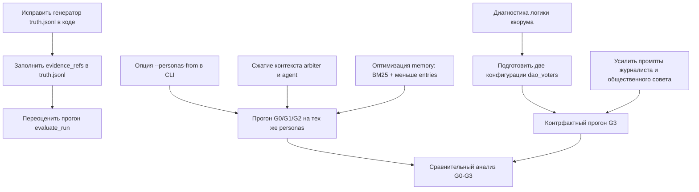

# Результаты ночного прогона G3 и план доработок

## Назначение документа

Документ фиксирует наблюдения по результатам ночного имитационного прогона режима G3 на сценарии муниципального тендера (РемСервис) и описывает конкретный план доработок до следующего прогона. Прогон проводился по плану из `docs/plans/overnight_g0_g3_run_plan.md`. Результаты служат эмпирической базой для главы 3 ВКР, поэтому корректность метрик и содержательная интерпретируемость поведения агентов критичны.

## Условия прогона

Прогон выполнен на сценарии `scenarios/procurement_tender_large.json` (двадцать агентов: внутренние органы муниципалитета, подрядчики, субподрядчики, эксперт, журналист, общественный совет). Режим управления — G3 (runtime-аудитор плюс коллегиальный пересмотр). Длительность — двадцать четыре тика, фактическое время работы — около тридцати двух часов (с двадцать третьего апреля 21:25 по двадцать пятое апреля 02:14). Использовалась модель `nvidia/nemotron-3-super-120b-a12b` через OpenRouter, провайдер DeepInfra, эмбеддинги — `google/gemini-embedding-001` с тайм-аутом тридцать секунд и тремя ретраями экспоненциальной задержки. Стоимость прогона по факту — около шести долларов (план ставил три и двадцать пять центов, переплата примерно в два раза).

Артефакты прогона лежат в `results/overnight_g3/`: `status.json` (state=finished), `summary.json`, `evaluation.json`, `fidelity.json`, `perf_summary.json`, `events.jsonl` (6.5 МБ), `trace.jsonl` (151 МБ), `world_history.md` (215 МБ), `personas.json` (1.1 МБ).

## Главное наблюдение: G3 как механизм фактически не сработал

Все одиннадцать коллегиальных голосований (`vote_closed`, `review_case_closed`) закрылись со статусом `result=failed, reason=quorum_not_reached`. Ни одно дело не дошло до коллегиального вердикта. С точки зрения наблюдаемого поведения это означает, что в данном прогоне режим G3 выродился до G1: единственным активным механизмом контроля остался runtime-аудитор. Прямое сравнение метрик G3 с метриками G0, G1 и G2, как было задумано в плане, на этих данных некорректно — мы сравнивали бы аудитор-only режим с самим собой.

Это наблюдение допускает две интерпретации, и важно их разделить эмпирически. Первая — техническая: текущая фоновая конфигурация коллегии (порог кворума, способ выбора голосующих, окно голосования) не позволяет коллегии собраться независимо от поведения агентов. Вторая — содержательная: моделируемая муниципальная культура (формальная иерархия, норма вежливости, отсутствие открытого конфликта в репликах, что подтверждено анализом нарратива) подавляет коллегиальное «свой против своего», и кворум не собирается потому, что внутренние агенты неохотно голосуют против коллег. Различить эти причины — ключевая задача для следующих прогонов.

## Поведение runtime-аудитора и природа сорока ложных срабатываний

Runtime-аудитор за прогон выписал сорок одно нарушение типа `conflict_of_interest` (события `audit_flagged`). Из них одно совпадает с заложенной в сценарий истиной (recall=1.00), сорок — ложные (precision=0.0244). Это не случайный шум, а следствие архитектурного устройства правила обнаружения.

Применяемое правило — `private_contact_frequency`: при наличии заранее существующей неформальной связи (`informal_link`) между двумя агентами фиксируется флаг, если суммарное число приватных контактов между ними за окно из пяти тиков достигает трёх или более. Уверенность (`confidence`) во всех сорока одном случаях фиксированная — 0.75, без градации по интенсивности контактов или силе связи. Сила неформальной связи у ложных срабатываний колеблется от 0.45 до 1.0, у истинного случая — 1.0; правило не отличает слабые латентные связи от сильных открытых. Видимость (`visibility`) у всех сорока ложных и одного истинного — `latent`, тип связи — преимущественно `private_contact` (тридцать четыре из сорока одного), что также делает признак неинформативным.

Распределение по целям показательно. Девяносто пять процентов ложных срабатываний направлены на внешних участников: десять на `agent:public_council`, семь на `agent:sub_1`, семь на `agent:expert`, шесть на `agent:contractor_3`, пять на `agent:contractor_1`. По субъектам — пятьдесят семь с половиной процентов всех флагов завязаны на `agent:chief_accountant`, главного бухгалтера. Это типовой паттерн «коммуникационного хаба»: агент, у которого по сценарию много легитимных контактов с внешними сторонами, автоматически набирает три и более приватных контакта за пять тиков с любым партнёром, имеющим неформальную связь, и runtime-аудитор каждый раз выписывает флаг.

Для главы ВКР это содержательный, а не технический результат: runtime-аудитор демонстрирует трейд-офф recall × precision, вшитый в само правило. Он гарантированно ловит истинный конфликт интересов (recall=1.00), но платит за это сорока ложными срабатываниями на легитимные рабочие контакты. Это адекватная характеристика «жёсткого порогового детектора без обучения», и описать её в работе следует именно как свойство механизма, а не как ошибку реализации.

## Расхождение метрик: семантическая precision и recall равны нулю при runtime-recall=1.00

Эта аномалия объясняется не поведением агентов, а несовместимостью формата записи истины с требованиями семантического судьи.

Истина в `truth.jsonl` записана в state-based форме: `subject_agent_id=agent:chief_accountant`, `target_agent_id=agent:public_council`, `violation_type=conflict_of_interest`, `mechanism=private_contact_frequency`, `evidence_refs=[]` (поле пустое). Strict-матчер runtime-метрики корректно отрабатывает этот формат: для записи без явных evidence_refs он матчит по полям заголовка (тик, субъект, цель, тип нарушения) и присваивает базовую оценку 0.6, чего достаточно для засчитывания как true positive. Поэтому recall=1.00 — формально верное число.

Семантический матчер устроен иначе: он передаёт LLM-судье полные записи truth и flagged-finding и явно требует «пересекающегося evidence trail» как условия совпадения. У всех сорока одного `audit_flagged` поле `evidence_refs` содержит от двух до пяти реальных событий (ссылки на конкретные `message_sent`, `pending_interaction_*`). У truth — пустой массив. Судья честно отвечает, что пересечения нет, и не засчитывает ни одного матча. Отсюда semantic_precision=0, semantic_recall=0 при наличии единственной истины и сорок одного кандидата.

Дополнительно у пятнадцати из сорока ложных срабатываний (около тридцати семи процентов) обнаружены evidence-элементы, не относящиеся к субъекту или цели обвинения (например, флаг на пару `chief_accountant → journalist` сопровождается ссылками на сообщения, в которых фигурируют `head_education` и `head_procurement`). Это указывает либо на ошибку сборки доказательной базы внутри runtime-аудитора, либо на смешивание паттернов контактов между перекрывающимися окнами наблюдения.

## Производительность и стоимость

Суммарное время работы LLM по фазам — 287931 секунд, реальное время симуляции — 115883 секунд, коэффициент перекрытия (`overlap_ratio`) равен 2.485. Это означает, что в среднем одновременно выполнялось два с половиной параллельных вызова. Для сценария с двадцатью агентами это нормальный, но не предельный параллелизм; теоретический потолок — три-четыре параллельных вызова при условии, что блокирующие фазы вроде memory-запроса в начале каждого тика будут оптимизированы.

Распределение нагрузки сильно неравномерное. По времени лидируют memory (тридцать процентов wall-clock, 86593 секунды), arbiter (двадцать семь процентов, 78328 секунд) и persona_interview (девятнадцать процентов, 55862 секунды). По токенам картина другая: arbiter поглощает пятьдесят три процента всех токенов (20.65 миллионов из 39.15 миллионов), agent — тридцать два процента (12.45 миллионов), memory — лишь девять процентов (3.42 миллиона). Парадокс объясняется тем, что memory медленный из-за встроенных эмбеддинг-запросов, а arbiter токеноёмок из-за длинного контекста, передаваемого на каждое из 1123 решений.

Самые длинные отдельные вызовы — memory.max=2209 секунд, persona.max=951 секунда, persona.p95=828 секунд — превышают `SPHERE_LLM_CALL_DEADLINE_S=180`. Это не нарушение лимита: deadline относится к одному HTTP-запросу, а измеренная длительность включает retry-цепочку (`SPHERE_LLM_MAX_RETRIES=3`, `REQUEST_TIMEOUT_S=120`, итого до 360 секунд только на сами запросы плюс задержки). Параметры `timeout_count` и `retries_used_total` равны нулю, то есть формально все вызовы успевали уложиться, но провайдер LLM деградировал на пиках одновременной нагрузки.

Реалистичная оценка стоимости следующих прогонов после оптимизаций: четыре с половиной — пять долларов на режим. До трёх долларов прогон уложить можно только при агрессивном сокращении контекста arbiter и agent плюс полном переиспользовании personas между режимами; шесть долларов — текущая база без изменений.

## Нарративная фактура

Автоматические метрики fidelity показывают ноль нарушений по всем категориям (temporal, identity, phantom, bureaucratic_loop, narrating_leakage, semantic_realism). Выборочное чтение `world_history.md` подтверждает, что симуляция не страдает мета-протечками («я модель», «тик», «система») и держит формальную русскую деловую речь.

Архитектура мира выглядит достоверно: трёхуровневая иерархия мэр — заместитель — начальник отдела закупок, разделение на юридический отдел, бухгалтерию, контрольное управление и тендерный секретариат, корректная отсылка к 44-ФЗ, технической спецификации (`work:SPEC-001`), смете (`work:PRICE-001`), акту осмотра (`art:inspection_report`). Реплики персонажей различимы по тону: главный бухгалтер требует подтверждающих расчётов и упоминает отклонения от сметных норм, мэр пишет директивно и кратко, подрядчик использует наводящие вежливые формулировки.

Слабые стороны нарратива касаются драматургии, а не корректности. Финал (тик двадцать четыре) выглядит не как развязка коррупционного сюжета, а как процедурное замирание: длинный список согласований документов без ответа на вопрос, кто выиграл тендер и был ли разоблачён конфликт интересов. Сценарные потенциальные носители конфликта — Петров (предполагаемый коррупционер), Савельев (отчаявшийся конкурент), Рябов (эксперт под давлением) — почти не вступают в открытое противостояние; все говорят формально-вежливо. Журналист Коваленко и общественный совет в лице Михайловой за двадцать четыре тика остались почти немыми, что особенно проблематично для оценки G3, где общественный совет должен играть активную роль.

Это наблюдение прямо стыкуется с гипотезой о причине провала кворума. Если нарративно агенты избегают открытого конфликта и поддерживают формальную вежливость, они с высокой вероятностью так же избегают и формальных коллегиальных голосований против коллег. Иными словами, отсутствие развязки в репликах и отсутствие кворума в голосованиях — это два проявления одного и того же: социальной нормы, заложенной в LLM-генерации делового русского текста.

Замеченные технические дефекты единичны: два-три случая пустого `text` в сообщениях от `agent:deputy_econ` (LLM не сгенерировал содержимое); попавшая в финальный лог последовательность отказов эмбеддинг-провайдера на самой концовке прогона (отрабатывали через retry, симуляция не упала).

## План доработок

План разбит на три блока по приоритету. Первый блок — те правки, которые нужно сделать обязательно до запуска любого следующего прогона. Второй — оптимизации перформанса и стоимости. Третий — расширение эмпирической базы для главы 3 ВКР.

### Блок 1. Обязательные правки до следующих прогонов

Восстановление семантической метрики выполняется правкой одного файла и не требует пересимуляции. В `results/overnight_g3/truth.jsonl` поле `evidence_refs` нужно заполнить ссылками на реальные события `message_sent` между `chief_accountant` и `public_council` из тиков с четырнадцатого по восемнадцатый включительно. Эти события достаются через `jq` из `events.jsonl`. После заполнения переоценка прогона делается командой `python -m sphere_lc.cli evaluate --run results/overnight_g3` (или соответствующий вызов через `evaluate_run` в `src/sphere_lc/eval/`). Параллельно следует поправить генератор `truth.jsonl` в коде, чтобы он автоматически прикладывал evidence_refs для state-based нарушений типа `private_contact_frequency` — извлекая последние n приватных сообщений между парой субъект-цель в окне обнаружения.

Диагностика и фикс кворума коллегии — вторая обязательная правка. Нужно установить, какова текущая логика расчёта кворума: фиксированный порог по числу голосующих, доля от общего числа `dao`-агентов, отдельный параметр в конфигурации сценария. Источник — `src/sphere_lc/governance/` (модули `dao.py`, `review.py` или аналогичные). По итогам диагностики надо подготовить два варианта конфигурации для следующего прогона: вариант с явно прописанным `dao_voters` (четыре-пять внутренних агентов с capability=`dao`) и вариант со сниженным порогом кворума. Сравнение двух вариантов позволит отделить «технический недосбор» от «культурного отказа».

Дополнительно необходимо исправить расхождение между регулярным выражением watchdog (`scripts/sphere_watchdog.sh` в домашнем `.claude`) и форматом записи событий: текущий шаблон ищет `"event_type":"agent_llm_error"` без пробела, а `sphere_lc` пишет `"event_type": "agent_llm_error"` с пробелом, поэтому уведомления об ошибках в Telegram не приходили в течение всего прогона. Правка тривиальная — добавить `\s*` после двоеточия.

### Блок 2. Оптимизации производительности и стоимости

Переиспользование `personas.json` между режимами G0, G1, G2, G3 даёт наибольший эффект. Личностные профили генерируются на этапе инициализации и не должны меняться между режимами управления (поскольку режим определяется логикой контроля, а не свойствами агентов). Реализовать опцию `--personas-from <path>` для CLI, чтобы передавать готовый файл из предыдущего прогона. Экономия на одном последующем прогоне — около пятидесяти пяти тысяч секунд (фаза `persona_interview`) и около миллиона токенов на нумерации фаз `persona` и `persona_interview` суммарно.

Сжатие контекста arbiter и agent — следующий по эффективности шаг. Arbiter вызывается 1123 раза с в среднем 18391 токенами на вызов. Заменить полную историю предыдущих решений на последние пять-семь решений плюс краткое summary, что даёт оценочную экономию в девять миллионов токенов (около двадцати трёх процентов от арбитра). Agent при пятистах вызовах и 24895 токенах на вызов — кандидат на переход с полного контекста к выборочному (последние три-четыре события плюс ключевые артефакты), оценочная экономия — шесть с половиной миллионов токенов.

Оптимизация memory затрагивает фазу с тридцатью процентами wall-clock. Снижение `working_max_entries` с пятидесяти до тридцати-тридцати пяти и замена эмбеддинг-запросов на BM25 для предварительной фильтрации (с эмбеддингом только финального ранжирования) даёт оценочную экономию в двадцать пять-тридцать пять тысяч секунд wall-clock. Это техническая работа в `src/sphere_lc/memory/`.

После всех трёх оптимизаций ожидаемая стоимость одного прогона — три с половиной — четыре доллара, длительность — двадцать-двадцать пять часов вместо тридцати двух.

### Блок 3. Расширение эмпирической базы

После выполнения Блоков 1 и 2 запустить прогоны G0, G1, G2 на том же сценарии и тех же `personas.json` для прямого сравнения. Запустить также повторный прогон G3 с исправленной конфигурацией кворума (один вариант — явный `dao_voters`, второй — сниженный порог). При бюджете в четыре доллара на прогон полный цикл из четырёх режимов плюс контрфактный G3 укладывается в двадцать-двадцать пять долларов и три-четыре дня реального времени.

Для усиления нарративной составляющей следует пересмотреть формулировки промптов журналиста и общественного совета: сейчас они почти не подают голос, что обедняет наблюдения по G3. В персонажные карточки добавить более явные триггеры на «привлечение внимания» при подозрительных событиях. Это не изменит измерения G0-G2, но даст для G3 более информативный нарратив.

Граф зависимостей по доработкам:

## Открытые вопросы

Часть наблюдений требует подтверждения дополнительными измерениями.

Действительно ли провал кворума объясняется культурой формальной вежливости, или это техническая особенность расчёта порога — этот вопрос будет закрыт двумя контрфактными прогонами G3 (с пониженным порогом и с явным списком голосующих).

Воспроизводится ли паттерн «runtime-аудитор флагает только внешних» на других сценариях, или он специфичен для конструкции муниципального тендера, где chief_accountant действительно является коммуникационным хабом — этот вопрос требует второго сценария с другой структурой социальных ролей.

Сохранится ли стоимость в районе четырёх долларов после оптимизаций, или поведение модели и провайдера деградирует с уменьшением контекста (потенциально вырастут retry-циклы) — этот вопрос проверяется первым прогоном после Блока 2.

## Ссылки на артефакты

Сценарий: `scenarios/procurement_tender_large.json`. Результаты прогона: `results/overnight_g3/`. План исходного запуска: `docs/plans/overnight_g0_g3_run_plan.md`. Релевантный код: `src/sphere_lc/eval/`, `src/sphere_lc/governance/`, `src/sphere_lc/memory/`, `src/sphere_lc/llm/embeddings.py`.
