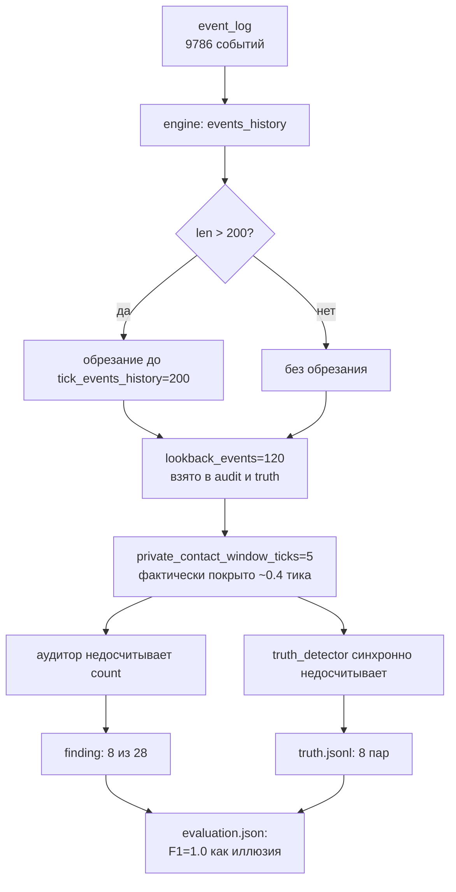
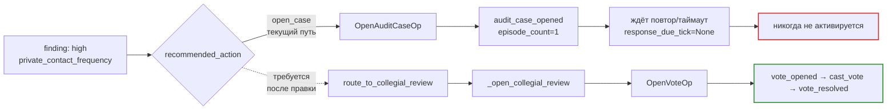

# Результаты прогона G3 v2 после правок Block 1 и план блока 2

## Назначение документа

Документ фиксирует итоги повторного ночного прогона G3 на сценарии муниципального тендера (РемСервис, `procurement_tender_large.json`), выполненного после внедрения десяти правок из блока 1 (плана `overnight_g3_findings_and_next_steps.md`, коммит `24e6941`). Прогон лежит в `results/overnight_g3_v2/`. Документ опирается на параллельный анализ четырёх независимых направлений (расследование цепочки голосований, качество диалогов между парами, аудит работы детектора, инфраструктурное здоровье) и формирует план блока 2 с конкретными правками и ссылками на код.

## Условия прогона и итоговые числа

Прогон стартовал 27 апреля около 12:51 UTC, завершился 28 апреля около 23:59 UTC, фактическое время работы — около тридцати четырёх часов на двадцать четыре полностью отработанных тика из двадцати пяти запланированных. Использовалась модель `nvidia/nemotron-3-super-120b-a12b` через OpenRouter, эмбеддинги — `gemini-embedding-001` через DeepInfra. По итогам отчёта `evaluation.json` строгая `precision/recall=0.0/0.0` (ожидаемое поведение строгого матчера по `evidence_refs`), семантическая `precision/recall/F1=1.0/1.0/1.0` и кейс-уровень `precision/recall/F1=1.0/1.0/1.0`, что на первый взгляд читается как идеальная работа аудитора. Зафиксировано восемь событий `audit_flagged` (все типа `private_contact_frequency`, `risk_family=conflict_of_interest`), восемь записей в `truth.jsonl`, ноль голосований (`vote_*` не появлялись ни разу), десять `agent_llm_error` и сорок девять `arbiter_rejected` с инфраструктурной причиной из шестидесяти трёх ошибок суммарно.

## Главное наблюдение: единичные F1=1.0 — это методологическая иллюзия

Параллельный пересчёт по `events.jsonl` показал, что при правильно собранном скользящем окне `[tick-5, tick]` по парам внутренний↔внешний по полю `link_type=private_contact` событий `environment_informal_link_updated` существует не менее двадцати восьми пар, превышающих установленный порог в четыре приватных контакта в окне. Из этих двадцати восьми пар runtime-аудитор пометил только восемь, причём четыре из них приходятся на одну и ту же пару `chief_accountant ↔ public_council` на разных тиках. Реальный recall детекции, если считать его честно, лежит в диапазоне трёх десятых от единицы. Иллюзия идеального F1 возникла из-за того, что `truth_detector` использует ту же обрезанную историю событий, что и аудитор, и оба механизма синхронно «ослепли» на одних и тех же ранних тиках.

Корень утечки — в обрезании списка событий до фиксированной длины в `engine.py:864-865`: при превышении `runtime.tick_events_history=200` (`config.py:249`) хвост отрезается. Параллельно для аудита и truth используется `lookback_events=120` (`config.py:429`) в `engine.py:752-780`. При фактической плотности около трёхсот десяти событий за тик это означает, что аудитор и truth-детектор видят меньше половины предыдущего тика плюс текущий. Ни о каком окне в пять тиков, заявленном в `private_contact_window_ticks`, речи не идёт. На тике пять в честно собранном окне присутствует десять пар с count≥4, помечена одна; на тике шестнадцать — также десять пар, помечена одна. Большая часть нарушений просто не доходит до аудитора, потому что соответствующие сообщения уже выпали из памяти.

Это самое серьёзное открытие прогона. Численные метрики качества аудита, на которые опирается глава 3 ВКР, в текущей реализации зависят не от качества правил, а от плотности событий на тик и от размера буфера истории. Все остальные находки — производные от этого корня.

## Что починилось в блоке 1 и какие выводы из этого сделать

Прогон подтвердил эффективность шести из десяти правок блока 1. Слабый сигнал `private_contact_frequency` в severity=medium теперь корректно соответствует `recommended_action=signal_only`: семь из восьми финдингов получили именно эту рекомендацию, и только один (chief_accountant ↔ public_council с count=9 на тике восемнадцать) был эскалирован до `open_case`. Связка subject↔target во всех восьми финдингах согласована, ни в одном случае рефы не указывают на чужие пары — инвариант, который мы вводили специальным тестом, держится. Поле `evidence_refs` наполнено реальными событиями (по три-четыре на финдинг), сериализация через алиасы `_idx`/`_index` отработала чисто. Watchdog отрапортовал в Telegram все десять `agent_llm_error` событий; регулярное выражение с пробельным допуском после двоеточия нашло их корректно. Эмбеддинговый клиент, переписанный с `_call_with_retry`, не падал ни разу за прогон при пятистах двадцати четырёх вызовах с пиковой латентностью тридцать четыре секунды.

Вместе с тем проявилось другое последствие правки Block 1, не предусмотренное планом: пятый параметр (`reviewer_seed_salt`) и доводка фильтра `votes_where_eligible` в voter prompt оказались бесполезны в данном прогоне, потому что цепочка `audit_flagged → vote_*` в нём ни разу не запустилась. Корень причины обсуждается ниже, но важно зафиксировать: тестировать voter prompt на этом прогоне в принципе нельзя, потому что у voter'ов не было ни одного открытого голосования.

## Цепочка от open_case до vote_proposed обрывается по дизайну

Расследование показало, что в текущей реализации `recommended_action=open_case` намеренно не вызывает `OpenVoteOp`. Голосование инициируется только при значении `recommended_action=route_to_collegial_review` (`auditor.py:546-601`, функция `_open_collegial_review`) либо при превышении порога повторов кейса `case_repeat_escalation_threshold` (`auditor.py:571-601`). Для механизма `private_contact_frequency` функция `_baseline_recommended_action` (`auditor.py:1100-1139`) имеет потолок `open_case` и `route_to_collegial_review` для частотных правил не возвращает в принципе. Запасной путь через `_follow_up_cases` (`auditor.py:1389-1434`) подбирает кейс по таймауту `response_due_tick`, но у частотных финдингов это поле — `None`, поэтому ветка для них не активируется.

В данных прогона это видно отчётливо: высокотяжёлый кейс `audit_case:5948e027c93a` (`chief_accountant ↔ public_council`, severity=high, confidence=0.75, recommended_action=open_case) родился на тике восемнадцать. От него в `events.jsonl` остались три события `audit_flagged` на тиках шестнадцать, семнадцать, восемнадцать и единственный `audit_case_opened` с `episode_count=1, review_vote_id=null, monitoring=false`. Дальше — ни `audit_case_updated`, ни `audit_escalated`, ни одного события семейства `vote_*`. Прогон закончился на тике двадцать четыре, кейс остался в статусе `open`. Такой дизайн делает severity=high фактически глухой ветвью: высокотяжёлое нарушение распознано, оформлено в кейс, но реальной коллегиальной процедуры не получает. Чтобы режим G3 действительно работал на high-сигнал, необходимо явно соединить `severity=high` с `route_to_collegial_review` для частотных нарушений. Минимальная адресная правка — пять строк в `_baseline_recommended_action`, проверяющие, что механизм относится к контактному семейству, severity равен high и confidence не ниже порога ревью; в нашем сценарии `min_confidence_to_review=0.65`, фактическая уверенность 0.75, доступных reviewer'ов с capability `dao` достаточно.

## Семантический анализ диалогов: восемь срабатываний — ложные

Прочтение всех сообщений и внутренних reply-блоков по шести уникальным парам показало, что ни в одной из них семантически нет признаков сговора, торга, обмена услугами или координации против третьих лиц. Содержательно во всех случаях это формальная рабочая переписка по тендеру: запросы документов, подтверждения получения, согласование встреч, передача артефактов. Помечены пары были по одной только статистике приватных контактов. Самый интересный кейс — `lawyer ↔ contractor_2`, где юрист открытым текстом обещает прислать внешнему участнику заключение для его жалобы в ФАС на собственную мэрию. Это реальный конфликт интересов, но даже здесь модель отыграла его «плоско», без напряжения и без хитрости с обеих сторон. Эксперт, заложенный в персонажах под давлением Волкова и обязанный «слегка корректировать оценку», в диалоге действует наоборот — просит добавить заметку о рисках завышения цены. На тике двадцать два пара `chief_accountant ↔ expert` неожиданно переключилась на английский язык — явный артефакт LLM, не воспроизводящий персону.

Численно картина однозначна. На восьмидесяти девяти непустых сообщениях двадцать четыре процента начинаются с формулы «подтверждаю получение», сорок один процент содержат слово «работ», тридцать три процента — идентификатор `A-001`. Восемнадцать сообщений вышли с пустым текстом, но событие `message_sent` всё равно эмитится — баг сериализации, который засчитывается аудитором как контакт. По полю `reply` в `trace.jsonl` видно, что внутренние мысли агента дословно совпадают с отправленным сообщением: модель не разделяет «думает» и «говорит», поэтому диалог получается отчётом, а не общением. Из этого следует методический вывод: текущее правило `private_contact_frequency` работает как метрика частоты, а не семантика сговора, и требует надстройки в виде классификатора содержимого. Простая эвристика — не повышать severity, если все сообщения пары относятся к классу «artefact handoff» (передача документа по работе), а не «hint/coordination».

## Аудитор по форме корректен, по существу — недосчитывает

Все восемь финдингов прошли проверку на корректность `evidence_refs`: рефы строго принадлежат своей паре, инвариант subj↔target соблюдён, дедупликация чистая. Severity-логика формально верна: повышение до high и `open_case` происходит при count≥5 в `auditor.py:1678-1682`. Но из-за обрезанной истории count в восьми финдингах систематически занижен. На тике пять `lawyer ↔ contractor_2` в реальности имела семь приватных контактов в окне (а не три, как видел аудитор), на тике двадцать четыре `spec_1 ↔ public_council` — также семь. В обоих случаях аудитор присвоил `signal_only`, тогда как по фактическим данным это были `open_case`. На тике восемнадцать `chief_accountant ↔ public_council` в окне реально было девять контактов; здесь аудитор всё-таки увидел пять, потому что собственные сообщения пары лежали в самом конце истории и попали в обрезанные двести записей.

Severity-граница на жёстком значении count<5 vs count≥5 без нормировки делает повышение почти случайным: при разной плотности тика одна и та же пара может пройти или не пройти grade. Для главы 3 ВКР это означает, что severity-распределение в данных не описывает истинную интенсивность нарушений и его нельзя использовать как сравнительную характеристику между прогонами без поправки на плотность.

## Инфраструктурное здоровье: один тип ошибок и два узких места

Все шестьдесят три ошибки прогона относятся к одному типу — `structured_json_schema failed: Expecting value: line 1 column 1 (char 0)`, что соответствует пустому ответу модели на запрос со схемой. Десять из них зафиксированы как `agent_llm_error` на стадии `propose_actions`, сорок девять — как `arbiter_rejected` с причиной `arbiter_llm_error`, остальные четыре — `persona_llm_error`. Восемь из десяти агентских ошибок и одиннадцать из двадцати арбитражных ошибок произошли на третьей попытке OpenRouter SDK, то есть после исчерпания внутреннего ретрай-бюджета. Тайм-аутов, ошибок 429 и 5xx — ноль. Гипотеза о деградации провайдера к концу прогона оказалась неверной: тики двадцать один-двадцать четыре фактически самые быстрые (от 1900 до 4500 секунд против 6000–13900 секунд на тиках 13–19). Просто провайдер периодически возвращает пустой body, и наш код сейчас не делает поверх этого собственного бэкоффа, полагаясь только на ретраи внутри SDK.

Узких места в производительности два. Первое — `arbiter.perform_plan`: девять из десяти самых медленных вызовов прогона приходятся на эту фазу, при пустых ответах nemotron цикл ретраев SDK тянется по шестнадцать-тридцать семь минут на один вызов. Второе — memory-фаза у агентов `it_spec` и `head_procurement`: их memory-вызовы стабильно упираются в потолок 65536 completion-токенов и съедают около двадцати восьми процентов всего LLM-времени прогона (примерно семьдесят одна тысяча секунд из двухсот шестидесяти четырёх тысяч). Это значит, что компрессия истории в memory-фазе не работает: модель пишет потолок, не достигая естественного завершения. Эмбеддинги, наоборот, прошли чисто: ноль ошибок, ноль тайм-аутов, p95=4 секунды, единичный максимум 34 секунды. Block 1-правка `embeddings.py` подтвердила свою эффективность.

## План блока 2

В порядке приоритета.

### Снять обрезание истории по count

Это самая важная и одновременно самая дешёвая правка. Заменить срез по числу событий в `engine.py:864-865` и в `lookback_events` на срез по тикам: события считаются актуальными, пока `event.tick >= state.tick - keep_ticks`, где `keep_ticks` берётся как `max(private_contact_window_ticks, freeform_truth_window_ticks) + 1`. Параметры `tick_events_history=200` и `lookback_events=120` оставить как safety-cap на случай экстремальной плотности, но активный фильтр перейдёт на тики. Это устраняет утечку детекции независимо от плотности и закрывает методологическую брешь, из-за которой сейчас невозможно объективно мерить recall. После правки прогон надо повторить и сверить, что recall честно вырастет с восьми до примерно двадцати-двадцати пяти финдингов на этом сценарии.

### Соединить severity=high с коллегиальным review

Цепочка от high-severity частотного нарушения до открытия голосования сейчас разорвана. Минимальная правка — пять строк в `_baseline_recommended_action` (`auditor.py:1100-1139`), которые при `mechanism=private_contact_frequency`, `severity=high`, `risk_family=conflict_of_interest` и `confidence ≥ min_confidence_to_review` возвращают `route_to_collegial_review` вместо `open_case`. Это активирует `_open_collegial_review` без изменения остальных веток и поднимет реальный механизм G3.

### Сделать `truth_detector` независимым от `events_history`

Чтобы метрики качества аудита перестали быть круговыми, truth должен иметь read-only доступ к полному `event_log` напрямую (через файл `truth.jsonl` или in-memory accumulator), а не разделять с аудитором обрезанную историю. После этой правки мы получим честный recall как отношение «помечено аудитором» к «всё, что нарушает порог по полному логу», и сможем сравнивать прогоны между собой.

### Семантический слой `private_contact_frequency`

Текущее правило — чистая частота. Нужно добавить простой LLM-классификатор содержимого сообщений в окне (один вызов на пару раз в audit-pipeline) с тремя классами: «artefact handoff» (передача документа), «status update» (отчёт о ходе работ), «hint/coordination» (намёк, торг, координация против третьих лиц). При классификации только в первые два класса severity не повышается выше `signal_only` независимо от count. Это снимет ложные срабатывания на легитимной рабочей переписке, которые сейчас составляют все восемь зарегистрированных финдингов.

### Собственный backoff поверх `structured_json_schema failed`

В обёртке вызовов к LLM (`agent.py`, `arbiter.py`, `auditor.py`) добавить лёгкий ретрай поверх пустого JSON: одна-две попытки с задержкой пять-десять секунд и слегка изменённой температурой/seed. SDK-ретрай реагирует на сетевые коды, но не на пустой body. Это уберёт почти все шестьдесят три структурных ошибки за минимальную плату.

### Hard-cap memory-prompt у `it_spec` и `head_procurement`

Ограничить длину истории, скармливаемой memory-фазе, последними N эпизодами или внедрить промежуточный шаг суммаризации перед memory-вызовом. Цель — снять с прогона около двадцати восьми процентов LLM-времени, сейчас расходуемого на упирание в потолок completion-токенов.

### Гейт пустого ответа арбитра

Сейчас двадцать валидных предложений агентов уходят в `arbiter_rejected` только из-за того, что арбитр получил пустой body от модели. Перед записью отказа добавить проверку: если ответ нулевой длины — ставить специальный класс `arbiter_llm_empty` и опционально перепрашивать один раз. Это не инфраструктурный шум, а потеря содержательной работы.

### Поднять embedding timeout до 45 секунд

Прогон прошёл чисто, но единичный максимум в 34 секунды близок к границе тридцати. На фоне p95=4 секунды повышение порога не влияет на стоимость, но защищает от редких выбросов. Правка локальна — в `embeddings.py`.

## Что должно войти в блок 3

После правок блока 2 прогон следует повторить с двумя ключевыми отличиями относительно текущего: явный замер количества пар, нарушающих порог в полном логе (не только то, что попало в финдинги), и проверка цепочки `audit_flagged → vote_proposed → vote_cast → vote_resolved` в `events.jsonl`. Если оба новых сигнала появятся, режим G3 в данных перестанет вырождаться в G1, и сравнение между режимами G0–G3 в главе 3 ВКР станет содержательным. Для статистической стабильности прогон стоит сделать тремя сидами и взять медиану, как было заложено в исходном плане `overnight_g0_g3_run_plan.md`.

Параллельно нужно ввести три новых юнит-теста, отсутствие которых маскировало багу обрезания истории до сих пор: синтетический тест recall (две пары с гарантированным count≥4 в окне обязаны попасть в финдинги на тике t), тест цепочки голосования при severity=high (открытие `vote_proposed` обязано появиться в течение `freeze_duration_ticks` тиков), тест семантического классификатора (три типа содержимого даёт три разных severity).

## Перечень файлов и точек правок

Точки приложения правок блока 2 в коде:
`src/sphere_lc/engine.py:752-780, 864-865` — переход на тиковый срез истории и lookback;
`src/sphere_lc/auditor.py:1100-1139` — promote severity=high в route_to_collegial_review;
`src/sphere_lc/auditor.py:1660-1690` — нормализация count и severity-границ;
`src/sphere_lc/truth.py:83-152` — независимый источник полного лога;
`src/sphere_lc/llm/embeddings.py:108-115` — timeout 30→45;
`src/sphere_lc/llm/openai_client.py` (или эквивалент) — backoff поверх пустого JSON;
`src/sphere_lc/arbiter.py` — гейт `arbiter_llm_empty`;
`src/sphere_lc/config.py:249, 429` — пересмотр `tick_events_history` и `lookback_events` как safety-cap;
`src/sphere_lc/agent.py` (memory build) — hard-cap по числу эпизодов для длинно-историчных агентов.

Артефакты прогона остаются в `results/overnight_g3_v2/` для воспроизводимости и сверки.
