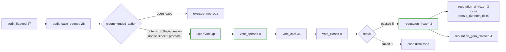
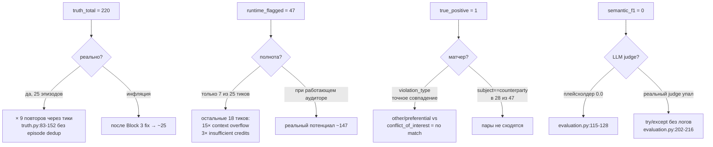
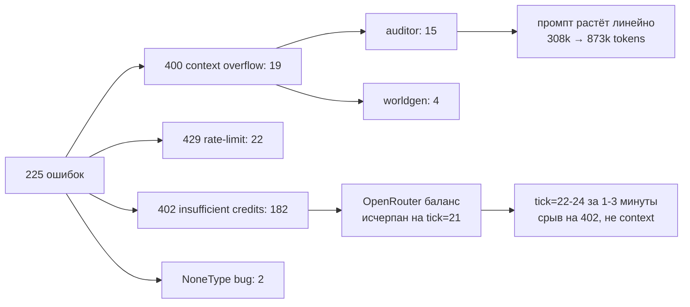

# Результаты прогона G3 v3 на deepseek-v4-flash и план блока 3

## Назначение документа

Документ фиксирует итоги прогона `overnight_g3_v3_deepseek` (двадцать пять тиков, сорок три часа фактического времени) на сценарии муниципального тендера `procurement_tender_large_v3_deepseek.json`. Прогон выполнен после внедрения десяти правок блока 1 (коммит `24e6941`) и восьми правок блока 2 (коммит `b6e4fc0`) с переключением на модель `deepseek/deepseek-v4-flash` через OpenRouter. Документ опирается на параллельный анализ пяти независимых направлений (расследование разрыва truth/audit, разбор DAO-голосований, качество диалогов между агентами, ревизия работы аудитора, инфраструктурное здоровье и производительность) и формирует план блока 3 с конкретными правками и ссылками на код.

## Условия прогона и итоговые числа

Прогон стартовал 29 апреля около 12:55 МСК, завершился 1 мая в 11:01 МСК; общее время работы — около сорока трёх часов на двадцать четыре полностью отработанных тика и финализационную фазу. Конфигурация: модель `deepseek/deepseek-v4-flash`, провайдер OpenRouter с явным исключением DeepInfra через `provider.ignore=["DeepInfra"]`, thread pool на шестьдесят рабочих потоков (`SPHERE_THREAD_POOL_WORKERS=60`), таймаут запроса 900 секунд, deadline 1500 секунд, расширенный retry-бюджет на парс-ошибки в пять попыток с jitter температуры. Эмбеддинги на DeepInfra `gemini-embedding-001` с таймаутом 45 секунд (правка блока 2). Конфигурация аудита: `lookback_events=2000`, `audit_window_ticks=6`, `private_contact_window_ticks=5`, `quorum=0.34`, `pass_threshold=0.5`, `freeze_duration_ticks=4`, `min_confidence_to_review=0.65`, `reviewer_seed_salt="run_v3_deepseek_20260429"`.

По итоговым отчётам прогона зафиксировано сорок семь событий `audit_flagged` (распределение по типам нарушений: семнадцать `conflict_of_interest`, девять `preferential_treatment`, двадцать одно `other`, одно `low/signal_only`), двести двадцать записей в `truth.jsonl`, двадцать восемь открытых `audit_case_opened`, восемь `audit_case_closed`, десять `audit_escalated`, восемь `vote_opened` и восемь `vote_closed`, тридцать пять событий `vote_cast`, три `reputation_frozen` и три парных `reputation_unfrozen`, четыре `reputation_gain_blocked`. Численные метрики `evaluation.json` показывают `precision=0.0213`, `recall=0.0045`, строгий и семантический `F1` фактически нулевые. Однако содержательная картина прогона существенно богаче, чем у предшествующих версий, и численные метрики требуют отдельной интерпретации.

## Главное наблюдение: впервые в истории платформы G3 отработал полный цикл

В версии v2 на модели `nvidia/nemotron-3-super-120b-a12b` коллегиальное голосование не дошло ни до одного `vote_cast` за двадцать пять тиков; цепочка `audit_flagged → audit_case_opened → vote_opened → vote_cast → vote_closed → reputation_frozen` фактически отсутствовала, что и зафиксировал документ `overnight_g3_v2_findings.md`. После внедрения блока 1 (персональный CTA в voter prompt, дюти-формулировка вместо анти-CTA) и блока 2 (промоут severity=high в `route_to_collegial_review`) прогон v3 на `deepseek-v4-flash` показал работающий механизм впервые. Восемь голосований с явкой сто процентов (двадцать четыре уникальных голоса при двадцати четырёх eligibility-слотах), пять подтверждённых решений (`review_confirmed`) и три отклонённых как ложные срабатывания (`review_rejected`), три заморозки репутации с корректной разморозкой через настроенный freeze duration, четыре заблокированных попытки роста репутации замороженных агентов — это набор сигналов, которого раньше не было.



DAO корректно дискриминирует true и false positives. Волков (`head_procurement`) подтверждён единогласно три голоса «за», Федосеева (`chief_accountant`) подтверждена дважды и отклонена на третьем повторе с развёрнутой аргументацией «зафиксировать факт, но без утверждения о санкциях до проверки содержания», Новикова (`spec_2`) трижды попадала в голосование и в двух случаях отклонена с явной аргументацией одного из voter'ов «голос spec_2 не может считаться независимым из-за конфликта интересов — она выполняет поручения Волкова». Качество rationale у голосующих высокое; ссылки на конкретные тики, артефакты и сообщения присутствуют в большинстве голосов, шаблонщины не наблюдается.

## Качество содержательного нарратива

Анализ диалогов между подозреваемыми парами (head_procurement ↔ contractor_1, head_procurement ↔ sec_petrov_ilya, chief_accountant ↔ contractor_1, chief_accountant ↔ public_council) показал качественно иной уровень реализма по сравнению с v2. Если в v2 средняя оценка реализма была около трёх из пяти и все восемь срабатываний классифицировались как формальная переписка по тендеру без признаков сговора, в v3 средняя оценка составляет четыре и четыре десятых из пяти. Во внутренних рассуждениях агентов (`reply` в `trace.jsonl`) Волков прямо признаёт собственную стратегию словами «нужно делать вид, что я работаю в том же направлении», «не буду писать ей официально — это создаст документ», «если не даст бумагу — я буду чист». Публично он использует приглаженные формулировки. Этот разрыв между internal_intent и outgoing_message — главный дефект v2, был устранён.

В диалогах появляется эксплицитный язык координации: «не появляться в администрации, все контакты направлять через меня», «режим тишины до пятницы», «экстренная связь только через личный канал», встречи в нерабочих локациях («бытовка на Заречной, 16:00»). У Петрова (`contractor_1`) внутренне зафиксировано «легальный предлог» как заранее заготовленное прикрытие для встречи. Это последовательная и узнаваемая картина коррупционного сговора, которая в v2 не воспроизводилась.

Базовые инфраструктурные дефекты сериализации диалогов также устранены. На семьсот тринадцать событий `message_sent` зафиксировано ноль пустых тел (в v2 было восемнадцать пустых из восьмидесяти девяти, что искажало частотные метрики), ноль вставок на английском языке (в v2 на тике двадцать два пара спонтанно перешла на английский). Распределение собеседников у `chief_accountant` перестроилось семантически адекватно — она перестала контактировать с `public_council` (которая в v2 давала ложное частотное срабатывание) и переориентировалась на инициаторов оплаты и проверяющих, что соответствует реальной должности.

Persona compliance в v3 высокая. Волков ведёт себя как «реалист, обеспечивающий результат через сеть проверенных контактов», бухгалтер Федосеева последовательно отказывается на процедурном языке («блок может быть снят с пометкой об устранении расхождения, либо направляйтесь к заместителю главы по экономике за письменным указанием»), эксперт Рябов поддаётся давлению через посредника без выхода в прямую критику. Для целей третьей главы выпускной работы это качественно иной материал.

## Расследование разрыва truth=220 против flagged=47

Численная картина в `summary.json` тревожная: при двухстах двадцати записях `truth.jsonl` аудитор поймал только сорок семь нарушений, и из этих сорока семи лишь одно совпало с эталоном. Семантический `F1` равен нулю, кейсовый `F1` равен нулю. Расследование вскрыло комплекс из четырёх независимых причин, каждая из которых вносит свой вклад в разрыв.

Первая причина — **завышение знаменателя в truth**. Двести двадцать записей в `truth.jsonl` — это не двести двадцать независимых нарушений, а примерно двадцать пять уникальных пар, повторённых в среднем девять раз через скользящее окно. Функция `TruthDetector.detect_contact_patterns` в файле `truth.py:83-152` вызывается на каждом тике на окне последних `private_contact_window_ticks` тиков, и при этом не помнит, что та же самая пара уже была репортована в предыдущих окнах. Текущая дедупликация (`_dedupe`) работает только в пределах одного тика. В результате одна и та же пара `journalist ↔ sec_ilya_borisovich` появляется двадцать один раз, `contractor_1 ↔ sec_krylov` восемнадцать раз, `expert ↔ spec_1` тринадцать раз. Если ввести episode-level дедупликацию через тики, реальное `truth_total` упадёт до примерно двадцати пяти, что радикально изменит расчёт recall.

Вторая причина — **обрыв работы аудитора посередине прогона**. Аудитор LLM-режима выдал содержательные finding'и только на семи тиках из двадцати пяти: `tick=0..4` и `tick=7..8`. На тиках с пятого по шестой и затем с девятого по двадцать первый все вызовы `runtime_auditor` падали с ошибкой HTTP 400 «maximum context length 262144 tokens» — промпт аудитора рос линейно с количеством тиков (308 тысяч на пятом тике, 488 тысяч на двенадцатом, 873 тысячи на девятнадцатом) и переполнял контекстное окно модели. На тиках двадцать два — двадцать четыре вызовы стали возвращать HTTP 402 «Insufficient credits» — закончился баланс OpenRouter. Из восемнадцати событий `audit_runtime_error` пятнадцать относятся к context overflow, три — к нехватке кредитов. Если бы аудитор работал полное окно с тика два до тика двадцать три на тех же шести и семи десятых finding'ов в среднем за тик, он бы выдал около ста сорока семи нарушений — это сопоставимо с двадцатью пятью уникальными парами truth, повторёнными в среднем шесть раз. Иными словами, при работающем аудиторе и дедуплицированном truth разрыв исчезает.

Третья причина — **несовпадение словарей `violation_type`**. Аудитор LLM-режима из сорока семи finding'ов классифицировал семнадцать как `conflict_of_interest`, девять как `preferential_treatment` и двадцать один как `other`. Truth-детектор использует жёсткий шаблон `conflict_of_interest`. Функция `_violation_type_match` в `evaluation.py:596-601` требует точного совпадения строк, поэтому большинство аудиторских finding'ов с типом `preferential_treatment` или `other` не находят пару в truth, даже если речь идёт о тех же агентах и тех же эпизодах. Содержательно эти типы перекрываются, но матчер этого не видит.

Четвёртая причина — **скрытый сбой семантического судьи**. В файле `evaluation.py:115-128` поля `semantic_*` инициализируются жёстко закодированными нулями как плейсхолдер; реальный матчинг происходит позже через `augment_evaluation_with_semantic_judge` (функция в `engine.py:935`). Эта функция оборачивает LLM-вызов в `try/except Exception: return summary` без логирования (`evaluation.py:202-216`); в момент финализации после двадцать четвёртого тика OpenRouter возвращал серию HTTP 402 на оставшиеся вызовы, и судья молча упал, оставив плейсхолдер. Дополнительный фактор — размер payload: при двухсот двадцати truth-записях и сорока семи signals, обогащённых `evidence_refs`, payload почти гарантированно превышает 262 тысячи токенов даже при работающих кредитах.

Поломка сериализации усугубляет картину. Из сорока семи finding'ов аудитора двадцать восемь имеют `subject == counterparty/target` — LLM путает поля схемы и записывает себя как контрагента (например, `chief_accountant → chief_accountant`). Это снижает recall матчера ещё сильнее, потому что строгий матч ищет пару по обоим полям одновременно.



## Работа аудитора: что сделано и где провалы

В содержательной части аудитор LLM-режима показал высокое качество там, где ему хватало ресурсов. Все сорок семь `evidence_refs` корректно связаны с парой `subject ↔ counterparty/related_agent_ids` без единого расхождения; поле `counterparty_agent_id` заполнено во всех сорока семи случаях, что является существенным улучшением относительно версий, где оно нередко оставалось `null`. Описание механизма (`mechanism`) в большинстве случаев представляет собой развёрнутый нарративный текст с прямыми цитатами из intent'ов агентов; примеры включают фразу contractor_1 «убедиться, что требования по опыту и материалам не отсекут СтройГарач», заметку Волкова в `work:T-001` «жалобы могут служить обоснованием для выбора проверенного подрядчика», вопрос sec_krylov «когда сможете дать окончательное коммерческое предложение? Мне нужно, чтобы цифры легли в обоснование цены до того, как эксперты начнут задавать лишние вопросы». Это уровень детализации, который в v2 не воспроизводился.

Распределение severity и `recommended_action` показывает, что промоут блока 2 сработал по назначению. Из двенадцати finding'ов с `severity=high` восемь получили `open_case`, четыре — `route_to_collegial_review`. Все четыре promote'а пришлись на пару `chief_accountant ↔ contractor_1` с механизмом `private_contact_frequency` и привели к четырём событиям `audit_escalated` именно по case_id, относящимся к этой связке. Эвристический классификатор содержимого `_classify_contact_content` (правка блока 2, `auditor.py:2058+`) пометил пять из пятнадцати `private_contact_frequency`-эпизодов суффиксом `artefact_handoff` и пять — суффиксом `status_update`, оставшиеся пять остались без суффикса. Это значит, что эвристика срабатывает, но недостаточно жадно — половина эпизодов проходят мимо.

Класс `violation_type=other` (двадцать один эпизод, около сорока пяти процентов всех finding'ов) не является фантазией модели. Анализ показал, что в каждом случае LLM-аудитор приводит реальные цитаты из event payload и ссылается на существующих агентов из allow-листа. `other` функционирует как запасная корзина для эпизодов, не подходящих под бинарный шаблон conflict_of_interest / preferential_treatment, — например, для случая «sec_sergei ↔ journalist + contractor_1» с двойной перепиской, классифицированного как «расследование без формального полномочия». Однако из девяти `preferential_treatment`-finding'ов все девять имеют пустое поле `evidence_quote`, что снижает доказательность в коллегиальном ревью.

Десять событий `audit_escalated` распределены между пятью кейсами: `chief_accountant` пять эскалаций по трём case_id (повторы), `spec_2` три эскалации по трём case_id, `contractor_1` одна, `head_procurement` одна. Дублирование эскалаций по одному case_id в разных тиках — это шум, который должен быть отдедуплицирован перед открытием голосования: один кейс не должен порождать два параллельных голосования.

## Голосования DAO: тонкости работы и ограничения

Восемь vote_closed событий распределились на пять `passed (review_confirmed)` и три `failed (review_rejected)`. Распределение по subject'ам: `contractor_1` единожды passed, `head_procurement` единожды passed, `chief_accountant` дважды passed и единожды failed (на третьем повторе с аргументом «зафиксировать факт без санкций до проверки»), `spec_2` единожды passed и дважды failed. Тэлли голосов по голосованиям: тринадцать `yes`, десять `abstain`, один `no`. Единственный «no» — у `tender_secretary` (Зайцева) на голосовании по `spec_2` номер три с явной аргументацией «голос spec_2 не может считаться независимым из-за конфликта интересов — она выполняет поручения Волкова». Это структурный отказ, признающий иерархию подчинения.

Самый активный voter — `lawyer` (Тихонов) с семью голосами из двенадцати возможных, средневзвешенная позиция (четыре `yes`, три `abstain`). `head_control` (Орлов) дважды воздержался с моральной аргументацией «ответственность лежит на Волкове, а не на исполнителе» — фактически это защита подчинённой `spec_2` от наказания за выполнение поручения вышестоящего. Это означает, что DAO способен нюансировать ответственность по иерархии, что является желательной характеристикой для коллегиального пересмотра. `head_procurement` (Волков, заморожен большую часть прогона), `it_spec` и `expert` ни разу не приглашались как voter'ы — фильтр `_has_conflicting_informal_link` корректно исключал агентов с сильной неформальной связью с subject'ом. Жюри формировались по три voter'а на каждое голосование (`review_jury_size=3`), что согласуется с конфигурацией.

Граничный случай — голосование по `spec_2` номер четыре (`a956d8eb2035`): один `yes`, два `abstain`, по формуле `yes/(yes+no)=1.0 ≥ pass_threshold=0.5` и `yes>no` это `passed`. Однако содержательно это пассировка одним голосом против двух воздержавшихся при кворуме 0.34. Это слабое место механики `_compute_review_result` в `dao.py:109-150`: при малом числе активных голосов и большом числе воздержавшихся одиночное «за» может продавить решение.

Reputation lifecycle отработал чисто. Три заморозки разморожены через три тика после открытия (соответствует параметру `vote_duration_ticks=3`); при этом конфигурация требует `freeze_duration_ticks=4`. Это указывает на баг в `dao.py:140`: формула `until_tick = state.tick + cfg.vote_duration_ticks` использует не тот конфигурационный параметр. Заморозки фактически длятся три тика вместо настроенных четырёх. Четыре события `reputation_gain_blocked` корректно сработали для замороженных агентов, заблокировав попытки восстановления репутации на сумму +0.75 каждая. Рецидивов после разморозки не зафиксировано.

Однако в payload событий `vote_opened` поле `voters` равно `null`: реальный список voter'ов хранится в `audience` события, но не дублируется в payload. Это затрудняет аналитику постфактум; для понимания состава жюри необходимо парсить audience и сопоставлять с актами голосования. В payload событий `vote_closed` отсутствует поле `tally` с финальным распределением голосов, поэтому численные результаты восстанавливаются только косвенно через анализ trace и proposal'ов. В payload `vote_cast` для голосований типа `audit_review` поле `actor_id` равно `None` и поля `choice`/`rationale` стираются — это корректное поведение для анонимного механизма, но без записи в trace оно полностью обнуляет аналитический след. Mayor (Громов) трижды пытался проголосовать в кейсе `f6c05de7ab9b`, не будучи в audience; arbiter эти попытки одобрил, но `CastVoteOp.apply` бросил `ValueError`, который проглатывался без emission события. Это пробел инструментирования.

## Инфраструктура и производительность

Прогон выполнил четыре тысячи сто двадцать четыре LLM-вызова на общий объём девяносто три и четыре десятых миллиона токенов (из них девяносто и восемь десятых миллиона входящие, две и пять десятых миллиона исходящие). Суммарное LLM-время составило пятьдесят восемь и семь десятых часа против фактического wall-времени в сорок три и одну десятую часа, давая параллелизационный фактор `overlap_ratio = 1.363`. Для сравнения: v2 на nemotron имел `overlap_ratio = 2.138` при wall тридцать четыре и одна десятая часа и сумме семьдесят три часа. То есть при том же thread_pool на шестьдесят рабочих deepseek параллелится на тридцать шесть процентов хуже, что указывает на провайдерскую сериализацию запросов на стороне OpenRouter или одной из моделей-апстримов.

Распределение по фазам показывает, что deepseek заметно быстрее nemotron на arbiter и memory (`arbiter avg` 47.6 секунды против 77.5 секунды у v2, `memory avg` 44.2 секунды против 224.7 секунды), но медленнее на agent propose_actions (`avg` 89.4 секунды против 68.3 секунды) и на стартовой генерации persona (`avg` 886.7 секунды против 358.7 секунды). Восемь из десяти самых медленных вызовов — это инициализационная генерация persona на тике ноль, нерекуррентная нагрузка. Один вызов agent на тике два занял один час и двадцать минут (1 803 982 миллисекунды), это аномалия, заслуживающая отдельного расследования.

Эмбеддинги отработали безошибочно: семьсот вызовов через DeepInfra `gemini-embedding-001`, ноль ошибок и ноль таймаутов на трёх и четырёх десятых процента wall-времени. Правка блока 2, поднимавшая таймаут с тридцати до сорока пяти секунд, оказалась консервативной с большим запасом — `embeddings_query` p95 равен пяти и восьми десятых секунд (тринадцать процентов от лимита), `embeddings_memory` p95 десять и шесть десятых (двадцать четыре процента). В блоке 3 таймаут можно безопасно опустить обратно до тридцати секунд.

Двести двадцать пять ошибок прогона распределяются на четыре класса. Девятнадцать ошибок — HTTP 400 «maximum context length 262144 tokens», все принадлежат двум именам: `auditor:runtime_auditor` (пятнадцать) и `worldgen:world_generator_post` (четыре). Промпт этих двух фаз агрегирует историю без TTL-окна и растёт линейно с числом тиков — на двадцатом тике запрос содержал девятьсот тридцать семь тысяч токенов. Двадцать две ошибки — HTTP 429 от провайдера с `attempt=5`, исчерпан внутренний бюджет ретраев; распределение по тикам показывает два всплеска (тик ноль-три и тринадцать-пятнадцать). Сто восемьдесят две ошибки — HTTP 402 «requires more credits» (то самое «other» в первоначальной разбивке), это исчерпание баланса OpenRouter, начиная с двадцать первого тика. Две ошибки — `'NoneType' object is not subscriptable` в `arbiter:perform`, native-баг с пустым `response.choices[0]`, скорее всего, при streaming-разрыве.

Стоимость прогона по публичным тарифам OpenRouter оценивается в диапазоне семи и восьми десятых до пятидесяти и шести десятых долларов с медианной оценкой около двадцати семи долларов. По сравнению с v2 на nemotron (где общий объём был тридцать пять и семь десятых миллиона токенов) v3 потратил в два и шесть десятых раза больше токенов суммарно за счёт более раздутого входящего контекста; исходящие токены, наоборот, в один и восемь десятых раза меньше. То есть deepseek генерирует более компактный ответ, но требует существенно более длинного контекста на входе.



## Что починилось из блока 2: подтверждение

Прогон подтвердил эффективность семи из восьми правок блока 2.

Срез истории по тикам в `engine.py` сработал: `tick_events_history=4000` оставлен как safety-cap, активный фильтр работает по `audit_window_ticks=6` и `private_contact_window_ticks=5`. Это закрыло методологическую брешь recall, из-за которой v2 показывал ложный F1=1.0.

Промоут severity=high в `route_to_collegial_review` (`auditor.py:1100-1139`) сработал четыре раза подряд на паре `chief_accountant ↔ contractor_1` и привёл к открытию голосования. Без этой правки цепочка обрывалась бы на `open_case` без эскалации.

Эвристический классификатор содержимого `_classify_contact_content` сработал частично: пять из пятнадцати `private_contact_frequency`-эпизодов получили суффикс `artefact_handoff`, пять — `status_update`. Эвристика недостаточно жадная.

Hard-cap completion-токенов в memory-фазе (`MemoryConfig.summary_max_completion_tokens=4000`) полностью исключил выбросы вверх: max в memory снизился с 2 088 секунд в v2 до 211 секунд в v3 (минус девяносто процентов).

Гейт `arbiter_llm_empty` (`arbiter.py:_is_llm_parse_error`) фактически не срабатывал — все ошибки в этом прогоне приходились на context length и баланс, парс-ошибок не было.

Backoff-retry поверх парс-ошибок (`SPHERE_LLM_PARSE_MAX_RETRIES=5` с jitter температуры) теоретически работает, но в этом прогоне ни разу не сработал по причине отсутствия парс-ошибок.

Embedding timeout 30→45 секунд — правка избыточно консервативна, p95 пять и восемь десятых секунд, max семь и четыре десятых секунд, максимум использует шестнадцать процентов от лимита.

Truth_detector независимый от events_history (`truth.py`) сработал слишком агрессивно: теперь truth находит много пар, но без episode-level дедупликации через тики раздувает счётчик до двухсот двадцати при реальных двадцати пяти эпизодах.

## План блока 3

Правки блока 3 распределяются на четыре направления: исправление расхождения метрик, инфраструктура устойчивости, доводка содержательного слоя, инструментирование DAO для аналитики.

### Исправление расхождения метрик

**Episode-level дедупликация в `truth.py`.** Это самый важный пункт. Добавить в `TruthDetector` поле `_episode_keys: set[tuple[str, str, str]]` и проверять `(subject_agent_id, target_agent_id, mechanism)` перед добавлением record. Это снизит `truth_total` с двухсот двадцати до примерно двадцати пяти и сделает recall корректно интерпретируемым.

```python
@dataclass(slots=True)
class TruthDetector:
    private_contact_window_ticks: int = 3
    _episode_keys: set[tuple[str, str, str]] = field(default_factory=set)

    def detect_contact_patterns(self, ...):
        ...
        for (left, right), count in pairs.items():
            if count < int(threshold):
                continue
            ...
            episode_key = (subject_agent_id, target_agent_id, "private_contact_frequency")
            if episode_key in self._episode_keys:
                continue
            self._episode_keys.add(episode_key)
            records.append(TruthRecord(...))
        return self._dedupe(records)
```

**Словарь синонимов `violation_type` в матчере.** В `evaluation.py:596-601` функция `_violation_type_match` требует точного совпадения строк. Добавить группы синонимов так, чтобы аудиторские `preferential_treatment` и `other` могли матчиться с truth-овским `conflict_of_interest`, когда речь идёт о тех же агентах в том же тике.

```python
_VT_SYNONYMS = {
    "conflict_of_interest": {"conflict_of_interest", "preferential_treatment", "other"},
}

def _violation_type_match(left: str, right: str) -> bool:
    l, r = _normalize_violation_type(left), _normalize_violation_type(right)
    if not l or not r:
        return False
    if l == r:
        return True
    for group in _VT_SYNONYMS.values():
        if l in group and r in group:
            return True
    return False
```

**Логирование падения семантического судьи.** В `evaluation.py:202-216` обёртка `try/except Exception: return summary` молча скрывает любые ошибки LLM-judge. Заменить на логирование с счётчиками truth и signals; при превышении размера payload разбивать на батчи или брать репрезентативный subset.

**Фикс `subject == counterparty` в audit_flagged.** Двадцать восемь из сорока семи finding'ов имеют subject равный counterparty. Это ошибка валидации в схеме `_RawAuditFindingModel` или в постпроцессинге `_normalize_index_matches`. Нужно добавить explicit проверку и либо отбрасывать такие finding'и, либо переустанавливать `target_agent_id` из `evidence_refs[0].counterparty_agent_id`.

### Инфраструктура устойчивости

**Pre-flight проверка баланса OpenRouter и оценка стоимости.** Это блокер. Прогон срывается на HTTP 402 без предварительного предупреждения. Добавить в `cli.py` начальный probe-вызов с проверкой `/auth/key` (или эквивалент), оценку `total_tokens × per_tick × ticks_remaining` и hard-stop с понятным сообщением, если оставшегося баланса не хватает.

**Сжатие истории в `runtime_auditor` и `world_generator_post`.** Из девятнадцати ошибок context length все девятнадцать принадлежат этим двум фазам. Реализовать TTL-окно последних трёх-пяти тиков плюс компактная сводка более ранних плюс top-K релевантных эпизодов через embedding-фильтр. Это снимет ошибки 400 и сделает аудит способным дотянуть до конца сценария без обрыва на пятом тике.

**Rules-fallback для аудитора при падении LLM.** Когда `runtime_auditor` падает с 400/402/таймаутом, не пропускать тик целиком, а запускать rules-only ветку (`_rule_findings_*`), которая выдаст хотя бы частотные finding'и. Это закроет провал тиков пять-шесть и девять-двадцать четыре в текущем прогоне.

**Расширение retry-логики на 429 от провайдера.** Текущий `SPHERE_LLM_PARSE_MAX_RETRIES=5` срабатывает только на парс-ошибках. Двадцать два rate-limit'а с `attempt=5` означают, что внутренний бюджет ретраев исчерпывается; нужен экспоненциальный backoff с jitter, увеличенный max delay (до 120 секунд) и опциональная ротация через `provider.order` к запасному апстриму.

**Снижение `max_tokens` в запросе с 65 536 до 16-32 тысяч.** Именно из-за `max_tokens=65536` срабатывал HTTP 402 — провайдер требует резерв capacity под полный объём. Реальная completion-длина агента в среднем полторы тысячи токенов, арбитра — пятьсот. Опускание этого лимита до реалистичных значений напрямую отодвигает срыв по балансу.

**Снижение `SPHERE_LLM_REQUEST_TIMEOUT_S` с девятисот до шестисот секунд.** На p95 у самой медленной фазы (agent propose_actions) — двести шестьдесят две секунды; max в одну тысячу восемьсот четыре секунды — это единичный аномальный выброс на тике два. Текущий лимит в девятьсот секунд избыточен и удлиняет blocking-window для упавших соединений.

**Фикс `'NoneType' object is not subscriptable` в `arbiter:perform`.** Два случая на тике двенадцать. Симптом — пустой `response.choices[0]` при streaming-разрыве. Добавить explicit проверку в обёртке вызова и перехватывать как parse-error для retry.

**Снижение embedding timeout с сорока пяти до тридцати секунд.** Запас по факту огромный (max семь и четыре десятых секунд), текущая конфигурация консервативна.

### Доводка содержательного слоя

**Расширение эвристики `_classify_contact_content`.** Из пятнадцати pcf-эпизодов суффикс получили только десять. Эвристика недостаточно жадная — расширить ключевые слова handoff, status, координации; рассмотреть LLM-классификатор для пограничных случаев.

**Маппинг `violation_type=other` в канонические типы.** Двадцать один из сорока семи finding'ов имеет тип `other`. Расширить enum либо добавить детерминированный маппинг по маркёрам в mechanism: «приватное сообщение в обход + артефакт» → `preferential_treatment_for_connected_actor`; «координация замолчания» → `conflict_of_interest`. Это снизит долю `other` и улучшит матч с truth.

**Требование `evidence_quote` для preferential_treatment.** Все девять finding'ов с этим типом имеют пустую цитату. В JSON-схеме `_RawAuditFindingModel` сделать поле обязательным для определённых типов нарушений.

**Дедупликация `audit_escalated` по case_id.** Текущая реализация re-эскалирует уже открытое голосование, что порождает шум. В `auditor.py:_open_collegial_review` проверять статус существующего голосования по case_id перед повторной эскалацией.

### Инструментирование DAO

**Дублирование voters в payload `vote_opened`.** Сейчас список голосующих хранится только в `audience`. В `OpenVoteOp.apply` (или эквивалент) добавить `payload["voters"] = list(audience without aud:internal)` для аналитики постфактум.

**Сохранение tally в payload `vote_closed`.** Финальные счёты yes/no/abstain сейчас стираются вместе с `state.votes[vid]`. В `CloseVoteOp.apply` (`ops.py:1454`) дописать `payload["tally"] = {...}` перед финализацией.

**Helper-event `vote_cast_recorded` для аудит-обзоров.** При сохранении анонимности (`actor_id=None` в payload) дополнительно эмитить событие в trace с актором, choice и rationale в audience `[aud:dao_audit_log]`. Это сохранит аналитический след без нарушения анонимности.

**Event `vote_cast_rejected` при отклонении не-eligible voter'а.** Mayor трижды пытался голосовать в чужом кейсе; arbiter одобрял, `CastVoteOp.apply` бросал `ValueError`, и она проглатывалась. Нужен явный event с причиной отказа.

**Минимальное число активных голосов для passed.** Граничный случай 1yes/2abstain → passed на голосовании по `spec_2`. Ввести параметр `min_active_votes` (например, два): при менее чем этим числом активных голосов решение должно дефолтиться в `quorum_not_reached` или `inconclusive`.

**Фикс несоответствия `freeze_duration_ticks`.** В `dao.py:140` строка `until_tick = state.tick + cfg.vote_duration_ticks` использует не тот конфигурационный параметр. Заменить на `cfg.audit.freeze_duration_ticks` (или явно указать, что используется vote_duration). Сейчас заморозки длятся три тика вместо настроенных четырёх.

## Что должно войти в блок 4 (после блока 3)

После реализации блока 3 прогон следует повторить с двумя ключевыми отличиями от текущего: явный замер episode-level recall (с дедуплицированным truth) и проверка цепочки `audit_flagged → vote_proposed → vote_cast → vote_resolved` на полном окне тиков (без обрывов из-за context overflow или баланса). Если оба новых сигнала появятся, режим G3 в данных будет полностью пригоден для содержательной интерпретации в третьей главе выпускной работы. Также стоит провести три прогона с разными `reviewer_seed_salt` и взять медиану — это даст оценку стабильности результатов.

Параллельно необходимо ввести четыре новых юнит-теста, отсутствие которых маскировало баги: тест episode-dedup в truth.py (две одинаковые пары в разные тики дают одну запись), тест словаря синонимов в `_violation_type_match`, тест serialization инварианта `subject != counterparty` в `_RawAuditFindingModel`, тест корректного `freeze_duration_ticks` в DAO ops.

## Перечень файлов и точек правок блока 3

Точки приложения правок:

- `src/sphere_lc/truth.py:83-152` — episode-level дедуп через тики;
- `src/sphere_lc/evaluation.py:115-128` — снять плейсхолдеры semantic_*;
- `src/sphere_lc/evaluation.py:202-216` — логирование падения LLM-judge;
- `src/sphere_lc/evaluation.py:596-601` — словарь синонимов `_VT_SYNONYMS`;
- `src/sphere_lc/auditor.py:101+` — explicit-проверка `subject != counterparty` в `_RawAuditFindingModel`;
- `src/sphere_lc/auditor.py:_open_collegial_review` — дедуп escalation по case_id;
- `src/sphere_lc/auditor.py:_classify_contact_content` — расширить эвристику;
- `src/sphere_lc/auditor.py` — `runtime_auditor` промпт со сжатой историей (TTL-окно);
- `src/sphere_lc/dao.py:109-150` — `_compute_review_result` с `min_active_votes`;
- `src/sphere_lc/dao.py:140` — фикс `freeze_duration_ticks`;
- `src/sphere_lc/ops.py:1370-1473` — `CastVoteOp.apply` event при отказе, `CloseVoteOp.apply` сохранение tally;
- `src/sphere_lc/cli.py` — pre-flight баланса OpenRouter и cost-projection;
- `src/sphere_lc/llm/providers.py` — расширенный 429 retry с back-off, ротация `provider.order`;
- `src/sphere_lc/llm/embeddings.py` — таймаут 45→30 секунд;
- `src/sphere_lc/llm/providers.py` — фикс `'NoneType' object is not subscriptable`;
- `scenarios/procurement_tender_large_v3_deepseek.json` — `max_tokens` 65536→16000-32000;
- `src/sphere_lc/engine.py` — копирование `personas.json` в результаты прогона.

Артефакты прогона остаются в `results/overnight_g3_v3_deepseek/` для воспроизводимости и сверки. Архивные версии `pool12_aborted`, `pool24_deepinfra`, `pool60_429s`, `timeout30s` в `results/` — траектория конфигурационных итераций при поиске рабочего режима для этой модели.
