# Движок симуляции

Техническая документация движка `magistry_lc`: жизненный цикл, агент, арбитр, память и подсистема LLM.

## Жизненный цикл симуляции

```mermaid
flowchart TD
    CFG[ScenarioConfig YAML/JSON] --> INIT[Инициализация WorldState]
    INIT --> REG[EntityRegistry: регистрация агентов, каналов, организаций, work items]
    REG --> ENRICH{runtime.enrich_personas?}
    ENRICH -->|да| ENRICHRUN[PersonaGenerator: runtime enrichment + personas.json cache]
    ENRICHRUN --> SOCIAL{runtime.spawn_secondary?}
    ENRICH -->|нет| SOCIAL
    SOCIAL -->|да| SG[SocialGraphExtractor + secondary agents]
    SOCIAL -->|нет| BOOT
    SG --> BOOT[Bootstrap persona/interview в долгосрочную память + создание runners]
    BOOT --> TICK[Тик N]

    TICK --> THAW[Снять истёкшие заморозки репутации]
    THAW --> SCRIPT[Scripted events: предопределённые развилки]
    SCRIPT --> PREW{pre-tick worldgen включён?}
    PREW -->|да| PRECTX[WorldGenerator pre: global events + agent_contexts + scene_hooks]
    PREW -->|нет| SHUFFLE
    PRECTX --> SHUFFLE[Перемешать порядок агентов]
    SHUFFLE --> DECIDE[AgentRunner.decide: мотивационный промпт + context-layer → Action JSON]
    DECIDE --> ARBITER[Arbiter: валидация + перевод в StateOp]
    ARBITER --> APPLY[ops.apply: StateOp → Event]
    APPLY --> REGNEW[Регистрация новых runners]

    REGNEW --> DAO{Есть открытые голосования?}
    DAO -->|да| CLOSE[DaoEngine: проверка кворума, закрытие]
    DAO -->|нет| WGEN
    CLOSE --> WGEN

    WGEN{Генератор мира включён?}
    WGEN -->|да| WGEVT[WorldGenerator: события + spawn suggestions]
    WGEN -->|нет| AUDIT

    WGEVT --> TRUTH[TruthDetector: truth.jsonl]
    TRUTH --> AUDIT[RuntimeAuditor: detection + audit events + ops]
    AUDIT --> LOG[EventLog: запись в JSONL]
    LOG --> MEM[Обновление памяти агента]

    MEM --> NEXT{Ещё тики?}
    NEXT -->|да| TICK
    NEXT -->|нет| EVAL[Governance eval + fidelity sidecars]
    EVAL --> RESULT[Финал: WorldState + events.jsonl + truth.jsonl + trace.jsonl + status.json + evaluation.json + fidelity.json + summary.json]
```

Симуляция начинается с конфигурации сценария (`ScenarioConfig`), определяющей агентов, полномочия, каналы, организации, рабочие элементы и параметры управления. `WorldEngine` инициализирует `WorldState`, регистрирует все сущности в `EntityRegistry` и запускает цикл тиков.

## Агент (AgentRunner)

`AgentRunner` реализует модель «один LLM-вызов на ход». На каждом тике агент получает:
- системный промпт с ролью автономного участника организационного процесса, без мета-фрейма «ты в симуляции»;
- пользовательский промпт с текущей ситуацией: текущее время мира (`tick` всегда и каноническая дата/время мира, если задана через `runtime.start_date`), мотивационный блок (`цели/страхи/обязательства/выгоды/угрозы`), личность, должность, полномочия, список известных агентов, каналов, организаций, рабочих элементов, открытых голосований, релевантные воспоминания и последние события.

Помимо списка ID, агент видит краткий shortlist существующих дел (`work_id + title + status`) и блок недавних отклонённых действий/ID. Это уменьшает вероятность phantom-ссылок на несуществующие `work_id` и повторного создания уже существующих задач.

Если включён `runtime.worldgen_pre_tick`, агент дополнительно получает prompt-layer контекст начала дня:
- `agent_daily_context` с личным давлением, социальной пересечкой и `today_hook`;
- `scene_hooks` как необязательные поводы к встречам и разговорам;
- `story_state` — короткую внутреннюю линию агента, которую движок обновляет детерминированно по persona + наблюдаемым событиям.

Агент возвращает JSON-массив `Action[]` (до `max_actions_per_turn` действий за ход). Ответ парсится через Pydantic-модель с дискриминатором по полю `type`.

Этап `propose_actions` может идти как последовательно, так и параллельно. Это задаётся через `runtime.parallel_agents`; при включённом режиме `runtime.parallel_workers` ограничивает число одновременных LLM-вызовов. Применение результатов к `WorldState` всё равно остаётся последовательным и детерминированным.

Если `runtime.ecology_activation_window_ticks > 0`, не-core акторы (secondary/worldgen/runtime-spawned) не ходят автоматически каждый тик. Движок активирует их только если они недавно были затронуты событиями, hook-ами, созданием или прямым взаимодействием. Это уменьшает public-process capture со стороны ecology без отключения самой среды.

Перед первым тиком, если `runtime.enrich_personas=true`, движок выполняет runtime-обогащение персон (`summary + biography`, а в режиме `full` ещё и интервью + expert reflection). Результат сохраняется в `{out_dir}/personas.json` и повторно используется при совпадении fingerprint входов (seed, язык, модель, режим, описание сценария и базовые данные агентов).

Если `runtime.spawn_secondary=true`, после enrichment запускается `SocialGraphExtractor`: он извлекает из биографий и интервью значимых людей, создаёт вторичных агентов до первого тика, обогащает их персоны в том же режиме, что и основной сценарий (`core` или `full`), и связывает первичные/вторичные пары через память. Role-only ссылки и alias-дубли существующих должностей не материализуются в новых агентов.

### Действия (Action)

Двенадцать типов действий определены в `actions.py`:

| Действие | Полномочие | Описание |
|---|---|---|
| `perform` | любое | Свободное действие: описание + опциональная цель. Оценивается LLM-арбитром. |
| `send_message` | `message` | Отправить сообщение агенту (приватное или публичное) |
| `publish` | `message` | Опубликовать сообщение в канале |
| `create_work_item` | `work` | Создать рабочий элемент (дело, проект, задачу) |
| `add_work_note` | `work` | Добавить заметку к рабочему элементу |
| `submit_work_proposal` | `work` | Подать предложение по рабочему элементу |
| `nominate_position_change` | `dao` | Номинировать агента на смену должности |
| `cast_vote` | `dao` | Проголосовать по открытому голосованию |
| `respond_nomination` | — | Ответить на номинацию (принять/отклонить) |
| `request_entity` | — | Запросить создание организации или канала (по умолчанию только для внутренних акторов) |
| `spawn_agent` | `spawn` | Создать нового участника с базовой персоной в ходе симуляции |
| `noop` | — | Пропустить ход |

Каждое действие содержит поле `justification` — обоснование от агента, используемое для анализа мотивов.

`perform` больше не подаётся как строго нежелательный fallback. Промпт прямо разрешает использовать его для неформальных шагов (`намёк`, `давление`, `обходной ход`, `скрытая договорённость`), даже если рядом существует формальный канал.

## Арбитр (Arbiter)

Гибридный арбитр выполняет два класса проверок.

Для структурированных действий (все, кроме `perform`) арбитр работает детерминированно:
1. Проверка существования целей через `EntityRegistry` (антифантомная защита).
2. Проверка полномочий агента (capability match).
3. Проверка на явные бюрократические дубли для `create_work_item` (по сильному сходству заголовка с уже открытым делом).
4. Преобразование `Action` в набор `StateOp[]` — детерминированных операций над состоянием мира.

Для `spawn_agent` дополнительно проверяются `runtime.allow_runtime_spawn`, лимит `runtime.max_agents`, отсутствие конфликта по `agent:{slug}`, temporal-validation по абсолютным датам и безопасный набор capabilities (`message`/`work`). Арбитр также отклоняет self-nomination, self-vote цели голосования и role-based display-name для новых агентов.

Для свободных действий (`perform`) арбитр обращается к LLM:
1. Формируется промпт с YAML-журналом мира (`WorldJournal`) и описанием действия.
2. LLM оценивает допустимость и формирует набор `StateOp[]` как результат.
3. Действия, адресованные несуществующим сущностям, отклоняются до обращения к LLM.

Конвертация `perform -> StateOp[]` выполняется через временный `IdAllocator`, а commit в реальный allocator происходит только после полной валидации всего набора ops. Поэтому отклонённое `perform`-действие не должно расходовать будущие `work:`/`vote:` идентификаторы.

Важно: арбитр не является runtime-аудитором. Он отвечает за допустимость и перевод действий в операции, но не за поиск содержательных нарушений по уже совершённым событиям.

## Runtime-аудитор (RuntimeAuditor)

`RuntimeAuditor` — отдельный governance-компонент, запускаемый в конце тика после применения действий, закрытия DAO-голосований и worldgen. Его задача — выявлять rules-first сигналы риска по уже совершённым событиям и, при необходимости, инициировать управленческие последствия.

В версии v1 аудитор:

1. Анализирует `tick_events` текущего тика и ограниченное окно `recent_events`, учитывая только события, которые реально произошли раньше рассматриваемого события внутри тика.
2. Ищет generic governance-паттерны:
   - self-reputation award;
   - nomination after private contact;
   - support vote after private contact;
   - reputation reward after private contact.
3. Формирует `AuditFinding[]`.
4. Детерминированно преобразует findings в:
   - `audit_flagged`;
   - `audit_case_opened`;
   - `audit_escalated`;
   - `StateOp` для заморозки или штрафа репутации.

Runtime-аудитор не подменяет собой `ViolationOracle` и не создаёт ground truth эксперимента. Его выход — это часть governance-treatment, а не пост-фактум измерение качества режима.

Для кейса `support_vote_after_private_contact` аудитор может переводить finding напрямую в `freeze_and_penalize`, если уверенность превышает `min_confidence_to_freeze`.

## Truth-layer и evaluation

После формирования фактических `tick_events`, но до эмиссии audit-интервенций, движок прогоняет deterministic `TruthDetector`. Он пишет sidecar `truth.jsonl` с каноническими `TruthRecord`, которые не зависят от того, сработал ли runtime-аудитор.

Опционально (`runtime.freeform_truth_enabled=true`) движок дополнительно пишет `truth_freeform.jsonl` через `FreeformTruthRecorder`. Это LLM-based post-hoc слой, который записывает нарушения в свободной форме по схеме (`summary`, `mechanism`, `beneficiary`, `evidence_refs`), не подменяя собой deterministic `truth.jsonl`.

В ходе исполнения движок также поддерживает `status.json`: sidecar с heartbeat-обновлением на каждом тике и финальным состоянием `finished` или `failed`. Web backend использует его для более надёжного обнаружения живых CLI-прогонов.

По завершении прогона движок пишет два независимых sidecar-контура:

- `evaluation.json` — governance-eval: сравнение runtime-аудита и deterministic truth-layer;
- `fidelity.json` — метрики правдоподобия (`temporal consistency`, `identity drift`, `phantom drift`, `bureaucratic loop`, `narrating leakage`, `perform`).

Сводка `summary.json` просто объединяет оба блока, не смешивая governance-treatment и fidelity.

`evaluation.py` сравнивает:

- `audit_flagged` из `events.jsonl`;
- `TruthRecord` из `truth.jsonl`.

Результат сохраняется в `evaluation.json` и содержит:

- `truth_total`;
- `runtime_flagged_total`;
- `true_positive`;
- `false_positive`;
- `false_negative`;
- `precision`;
- `recall`;
- `f1`;
- сводку `by_violation_type`.

## Операции состояния (StateOp → Event)

`ops.py` определяет детерминированные операции: `SendMessageOp`, `CreateEntityOp`, `CreateAgentOp`, `CreateWorkItemOp`, `AddWorkNoteOp`, `SubmitWorkProposalOp`, `CastVoteOp`, `OpenVoteOp`, `ModifyReputationOp`, `SetVoteConsentOp`, `SetReputationFreezeOp`. Каждая операция применяется к `WorldState` и порождает `Event`, записываемый в `EventLog` (JSONL). Последовательное применение гарантирует детерминизм при фиксированном зерне.

`CreateAgentOp` создаёт `AgentState` и `entity_created`, а полноценный `AgentRunner` и bootstrap памяти для нового агента регистрируются отдельным шагом после применения ops. Новый участник начинает ходить со следующего тика.

Для базовых агентов, заданных прямо в `ScenarioConfig.agents`, движок берёт `initial_reputation` из конфига и отражает его в первом `reputation_snapshot`. Это делает стартовые условия наблюдаемыми и для UI, и для post-hoc анализа.

`SetReputationFreezeOp` меняет состояние `AgentState.reputation_frozen` / `reputation_frozen_until_tick` и эмитит `reputation_frozen` или `reputation_unfrozen`. При активной заморозке positive reputation changes блокируются, а DAO не продвигает замороженного агента на новую должность.

Положительная репутация больше не начисляется за каждое `work_proposal_submitted`. Детерминированный reward-cycle привязан только к governance-мильстоунам: согласию цели голосования (`vote_target_consented`) и успешному `vote_closed` с `result="passed"`. Это уменьшает возможность фармить репутацию через бюрократический спам заметок и proposals.

## Память агента (AgentMemory)

Двухслойная архитектура управляет контекстом агента.

### Рабочая память (working buffer)

Хронологический буфер последних `working_max_entries` записей. При переполнении старейшие записи суммаризируются пакетами по `working_summarize_batch` через LLM-вызов, а суммарии помещаются в долгосрочную память.

Важно: batch удаляется из `working` только после успешного ответа суммаризатора. Если LLM-вызов падает, движок пишет `memory_llm_error`, но не теряет исходные записи рабочей памяти.

### Долгосрочная память (hybrid index)

Индекс до `long_term_max_docs` документов с гибридным поиском. Формула ранжирования:

**Score = w_r * Recency + w_v * Vector + w_b * BM25 + w_i * Importance**

- **Давность** (Recency): экспоненциальный спад по `recency_decay`.
- **Векторное сходство** (Vector): косинусная близость эмбеддингов.
- **BM25**: лексическое совпадение через собственную реализацию (`bm25.py`).
- **Важность** (Importance): статическая оценка по типу события (`importance_by_event`).

Веса настраиваются через `MemoryWeights` в конфигурации. Дедупликация: записи с косинусным сходством выше `dedup_cosine_threshold` объединяются.
В обычных прогонах `MemoryConfig.embeddings_mock=false` по умолчанию, поэтому движок использует реальные embeddings через OpenAI-совместимый API. Если ключа нет, векторная часть автоматически отключается, и retrieval остаётся в режиме BM25 + recency + importance. `embeddings_mock=true` оставлен для тестов и дешёвых локальных smoke-прогонов.

Типы записей: `persona`, `interview`, `summary`, `observation`, `result`, `reflection`.

Agent prompt использует не один общий retrieval-блок, а несколько секций: якоря персоны (`persona`), фрагменты интервью (`interview`), экспертную рефлексию (`reflection`) и оперативную память (`observation`/`result`).

Отдельно от `AgentMemory.summary` движок поддерживает короткий `story_state` в `AgentState`. Он не является второй LLM-памятью; это компактный runtime-sidecar для personal ecology, который строится движком из persona, текущей позиции и наблюдаемых событий тика.

## Генератор мира (WorldGenerator)

При включении (`enable_worldgen`) генератор мира работает в одном или двух режимах:

- **post-tick worldgen** — обратносуместимый режим по умолчанию: создаёт внешние `world_event` и `spawns` по итогам уже совершённых действий;
- **pre-tick worldgen** (`runtime.worldgen_pre_tick=true`) — запускается до `propose_actions`, создаёт:
  - `events` как глобальные/организационные сигналы текущего тика;
  - `agent_contexts` как персональные opening contexts;
  - `scene_hooks` как необязательные сценовые поводы.

В обоих фазах worldgen получает только безопасный контекст:
- public/internal события без текста приватных сообщений;
- агрегированные сигналы закрытых private-контактов;
- state snapshot (open work items, открытые votes, вторичные акторы);
- краткие `story_state` агентов;
- temporal contract (`tick`, `tick_granularity`, канонические дата/время).

`worldgen_every_ticks` должен быть строго положительным числом. Нулевое значение теперь считается невалидной конфигурацией и отклоняется на этапе загрузки `ScenarioConfig`, чтобы движок не падал на modulo при проверке расписания worldgen.

Если задана каноническая временная ось (`runtime.start_date`, `runtime.tick_granularity`, `runtime.tick_duration_days`), движок дополнительно передаёт worldgen текущие дату и время симуляции. Для `hour`/`half_day` это даёт worldgen и агенту не только календарную дату, но и внутридневное положение тика.

Движок принимает `spawns` только если `runtime.allow_runtime_spawn=true`. Для совместимости worldgen по-прежнему понимает legacy-формат `list[world_event]` без блока `spawns`. Дополнительно движок требует человеко-читаемый display-name, отсекает role-only ярлыки и не принимает внутренних акторов от worldgen, если `runtime.worldgen_allow_internal_spawns=false`.

Для pre-tick material действует жёсткий negative contract: worldgen не должен утверждать решения существующего агента, закрывать `work item` текстом, раскрывать private-message content или подменять typed ontology строками `agent:*` / `work:*`.

## DAO-голосование (DaoEngine)

Механизм коллегиального принятия решений. При номинации на смену должности (`nominate_position_change`) открывается голосование с участием агентов из списка `dao_voters`. По умолчанию self-nomination запрещена, а цель голосования исключается из списка голосующих и должна отвечать через `respond_nomination`. Для этого ответа capability `dao` не требуется: достаточно быть текущей целью открытого vote. Голосование закрывается, когда:
- достигнут кворум (`quorum`) и порог одобрения (`pass_threshold`); или
- истекла длительность (`vote_duration_ticks`).

При одобрении должность агента меняется через `StateOp`. При необходимости согласия кандидата (`require_consent`) ожидается `respond_nomination`. Событие `vote_closed` теперь содержит не только результат, но и `reason` (`consent_missing`, `reputation_frozen`, `threshold_passed` и т.д.).

Если у цели активна заморозка репутации (`reputation_frozen=true`), голосование не проходит: `DaoEngine` возвращает `canceled`.

## Подсистема LLM

### LLMProvider (протокол)

Два основных метода:
- `generate(system, user)` — текстовый ответ (`LLMResponse`).
- `generate_structured(system, user, schema)` — структурированный ответ (`StructuredLLMResponse`) по JSON Schema.

### Реализации

- **OpenAICompatibleProvider** — провайдер для OpenAI-совместимых API с поддержкой повторных попыток, валидации JSON Schema и `tool_calls`; `provider_order` добавляется только для OpenRouter provider routing.
- **MockLLMProvider** — детерминированный провайдер для тестов. Параметр `structured_responses` задаёт словарь ответов для различных вызовов.

### EmbeddingProvider

- **OpenAIEmbeddingProvider** — через OpenAI-совместимый API.
- **MockEmbeddingProvider** — детерминированные эмбеддинги для тестов.

### LLMCaller

Обёртка над `LLMProvider` + `TraceLog`. Записывает каждый вызов (промпт, ответ, длительность) в JSONL-файл трассировки.

### LLMCache

SQLite-кеш ответов по хешу промпта — для экономии и воспроизводимости.

## Оракул (ViolationOracle)

Пост-фактум анализ нарушений. Читает `events.jsonl`, разбивает на окна по `window_ticks` тиков, отправляет каждый чанк в LLM для обнаружения нарушений. Результат — JSON с описаниями выявленных отклонений.

Рядом с ним теперь может работать `FreeformTruthRecorder`: он также читает `events.jsonl` окнами, но пишет не narrative-report для пользователя, а structured sidecar `truth_freeform.jsonl` с richer truth-записями (`summary`, `mechanism`, `beneficiary`, `evidence_refs`).

Важно: `ViolationOracle` и `evaluation.py` решают разные задачи.

- `ViolationOracle` — narrative / LLM post-hoc analysis.
- `evaluation.py` — формальное сравнение runtime-аудита с deterministic truth-layer.

## Конфигурация сценария (ScenarioConfig)

Корневая Pydantic-модель сценария. Загружается из YAML или JSON через `scenario.py`.

| Блок | Класс | Назначение |
|---|---|---|
| `llm` | `LLMConfig` | Модель, провайдер, температура, трассировка |
| `memory` | `MemoryConfig` | Буфер, индекс, веса, эмбеддинги |
| `runtime` | `RuntimeConfig` | Язык, лимит действий, история тиков, LangGraph |
| `governance` | `GovernanceConfig` | Политика должностей, голосование и настройки runtime-аудита |
| `agents` | `AgentConfig[]` | Агенты: ID, имя, персона, полномочия, стартовая репутация, должность |
| `world` | `WorldConfig` | Каналы, организации, рабочие элементы |
| `scripted_events` | `ScriptedEventConfig[]` | Предопределённые внешние события и развилки сценария |

Ключевые поля `runtime`:
- `start_date`: каноническая календарная дата тика `0`.
- `tick_granularity`: качественный масштаб тика (`hour`, `half_day`, `day`, `week`).
- `tick_duration_days`: множитель для выбранной гранулярности (`day` = дни, `hour` = часы, `half_day` = полудни, `week` = недели).
- `parallel_agents`: выполнять этап генерации решений параллельно или последовательно.
- `parallel_workers`: ограничение на количество одновременных LLM-вызовов при параллельной генерации.
- `parallel_window_seconds`: совместимый launcher-параметр окна батчирования; в текущем tick-engine весь тик обрабатывается одним batch.
- `temporal_past_slack_days`: допустимый лаг для абсолютных дат в структурированных действиях.
- `temporal_future_horizon_days`: допустимый горизонт будущих дат в структурированных действиях.
- `enrich_personas`: включить обогащение персон перед первым тиком.
- `persona_enrich_mode`: `core` (summary+biography) или `full` (summary+biography+interview+reflection).
- `spawn_secondary`: извлечь вторичных агентов из социального графа до первого тика.
- `max_secondary_per_agent`: лимит связей, извлекаемых из одной персоны.
- `max_agents`: общий потолок числа агентов в мире.
- `allow_runtime_spawn`: разрешить `spawn_agent` и worldgen-spawn в ходе симуляции.
- `request_entity_internal_only`: разрешить `request_entity` только внутренним акторам.
- `ecology_activation_window_ticks`: окно активности для не-core ecology-акторов; если `> 0`, они ходят только при недавней релевантности.
- `worldgen_every_ticks`: положительный интервал запуска worldgen; должен быть `> 0`.
- `worldgen_pre_tick`: включить pre-tick worldgen с personal-context layer.
- `worldgen_event_budget_per_tick`: верхняя граница числа worldgen-событий за тик.
- `agent_context_budget_per_tick`: бюджет персональных контекстов на один pre-tick запуск.
- `max_scene_changes_per_tick`: лимит scene hooks / scene changes на тик.
- `max_new_actors_per_window`: лимит предложений новых акторов от worldgen за одно окно.
- `worldgen_context_scope`: `core` или `all`; по умолчанию personal contexts от pre-worldgen строятся прежде всего для core-акторов сценария.
- `worldgen_allow_internal_spawns`: разрешить worldgen создавать внутренних акторов.
- `freeform_truth_enabled`: включить post-hoc `truth_freeform.jsonl`.
- `freeform_truth_window_ticks`: размер окна для `FreeformTruthRecorder`.

`AgentConfig` помимо `agent_id`, `name`, `persona` и `capabilities` теперь хранит `initial_reputation`, чтобы стартовая репутация была частью канонического сценария, а не только web-карточки.

Ключевые поля `governance.audit`:
- `enabled`: включить runtime-аудитор.
- `actor_id`: какой агент-идентификатор использовать как `actor_id` audit-событий.
- `mode`: `rules` (в `RuntimeAuditor` v1 поддерживается только rules-first режим; другие значения отклоняются при валидации).
- `lookback_events`: глубина окна истории для audit detection.
- `private_contact_window_ticks`: окно приватных контактов для conflict-like heuristics.
- `min_confidence_to_flag`: минимальная уверенность для `audit_flagged`.
- `min_confidence_to_freeze`: минимальная уверенность для `reputation_frozen`.
- `freeze_duration_ticks`: длительность заморозки в тиках.
- `reputation_penalty_delta`: опциональный отрицательный штраф к репутации поверх freeze.

Ключевые поля `governance`:
- `require_consent`: требовать явное согласие кандидата.
- `allow_self_nomination`: разрешить или запретить self-nomination.
- `allow_target_self_vote`: разрешить или запретить голос цели за собственную номинацию.
