# Движок симуляции

Техническая документация движка `magistry_lc`: жизненный цикл, агент, арбитр, память и подсистема LLM.

## Жизненный цикл симуляции

```mermaid
flowchart TD
    CFG[ScenarioConfig YAML/JSON] --> INIT[Инициализация WorldState]
    INIT --> REG[EntityRegistry: регистрация агентов, каналов, организаций, work items]
    REG --> ENRICH{runtime.enrich_personas?}
    ENRICH -->|да| ENRICHRUN[PersonaGenerator: runtime enrichment + personas.json cache]
    ENRICHRUN --> SOCIAL{runtime.spawn_secondary?}
    ENRICH -->|нет| SOCIAL
    SOCIAL -->|да| SG[SocialGraphExtractor + secondary agents]
    SOCIAL -->|нет| BOOT
    SG --> BOOT[Bootstrap persona/interview в долгосрочную память + создание runners]
    BOOT --> TICK[Тик N]

    TICK --> THAW[Снять истёкшие заморозки репутации]
    THAW --> SHUFFLE[Перемешать порядок агентов]
    SHUFFLE --> DECIDE[AgentRunner.decide: промпт → Action JSON]
    DECIDE --> ARBITER[Arbiter: валидация + перевод в StateOp]
    ARBITER --> APPLY[ops.apply: StateOp → Event]
    APPLY --> REGNEW[Регистрация новых runners]

    REGNEW --> DAO{Есть открытые голосования?}
    DAO -->|да| CLOSE[DaoEngine: проверка кворума, закрытие]
    DAO -->|нет| WGEN
    CLOSE --> WGEN

    WGEN{Генератор мира включён?}
    WGEN -->|да| WGEVT[WorldGenerator: события + spawn suggestions]
    WGEN -->|нет| AUDIT

    WGEVT --> AUDIT[RuntimeAuditor: detection + audit events + ops]
    AUDIT --> LOG[EventLog: запись в JSONL]
    LOG --> MEM[Обновление памяти агента]

    MEM --> NEXT{Ещё тики?}
    NEXT -->|да| TICK
    NEXT -->|нет| RESULT[Финал: WorldState + events.jsonl + trace.jsonl]
```

Симуляция начинается с конфигурации сценария (`ScenarioConfig`), определяющей агентов, полномочия, каналы, организации, рабочие элементы и параметры управления. `WorldEngine` инициализирует `WorldState`, регистрирует все сущности в `EntityRegistry` и запускает цикл тиков.

## Агент (AgentRunner)

`AgentRunner` реализует модель «один LLM-вызов на ход». На каждом тике агент получает:
- системный промпт с ролью автономного участника симуляции;
- пользовательский промпт с текущей ситуацией: личность, должность, полномочия, список известных агентов, каналов, организаций, рабочих элементов, открытых голосований, релевантные воспоминания и последние события.

Агент возвращает JSON-массив `Action[]` (до `max_actions_per_turn` действий за ход). Ответ парсится через Pydantic-модель с дискриминатором по полю `type`.

Перед первым тиком, если `runtime.enrich_personas=true`, движок выполняет runtime-обогащение персон (`summary + biography`, а в режиме `full` ещё и интервью). Результат сохраняется в `{out_dir}/personas.json` и повторно используется при совпадении fingerprint входов (seed, язык, модель, режим, описание сценария и базовые данные агентов).

Если `runtime.spawn_secondary=true`, после enrichment запускается `SocialGraphExtractor`: он извлекает из биографий и интервью значимых людей, создаёт вторичных агентов до первого тика, обогащает их персоны в `core`-режиме и связывает первичные/вторичные пары через память.

### Действия (Action)

Двенадцать типов действий определены в `actions.py`:

| Действие | Полномочие | Описание |
|---|---|---|
| `perform` | любое | Свободное действие: описание + опциональная цель. Оценивается LLM-арбитром. |
| `send_message` | `message` | Отправить сообщение агенту (приватное или публичное) |
| `publish` | `message` | Опубликовать сообщение в канале |
| `create_work_item` | `work` | Создать рабочий элемент (дело, проект, задачу) |
| `add_work_note` | `work` | Добавить заметку к рабочему элементу |
| `submit_work_proposal` | `work` | Подать предложение по рабочему элементу |
| `nominate_position_change` | `dao` | Номинировать агента на смену должности |
| `cast_vote` | `dao` | Проголосовать по открытому голосованию |
| `respond_nomination` | — | Ответить на номинацию (принять/отклонить) |
| `request_entity` | — | Запросить создание организации или канала |
| `spawn_agent` | `spawn` | Создать нового участника с базовой персоной в ходе симуляции |
| `noop` | — | Пропустить ход |

Каждое действие содержит поле `justification` — обоснование от агента, используемое для анализа мотивов.

## Арбитр (Arbiter)

Гибридный арбитр выполняет два класса проверок.

Для структурированных действий (все, кроме `perform`) арбитр работает детерминированно:
1. Проверка существования целей через `EntityRegistry` (антифантомная защита).
2. Проверка полномочий агента (capability match).
3. Преобразование `Action` в набор `StateOp[]` — детерминированных операций над состоянием мира.

Для `spawn_agent` дополнительно проверяются `runtime.allow_runtime_spawn`, лимит `runtime.max_agents`, отсутствие конфликта по `agent:{slug}` и безопасный набор capabilities (`message`/`work`).

Для свободных действий (`perform`) арбитр обращается к LLM:
1. Формируется промпт с YAML-журналом мира (`WorldJournal`) и описанием действия.
2. LLM оценивает допустимость и формирует набор `StateOp[]` как результат.
3. Действия, адресованные несуществующим сущностям, отклоняются до обращения к LLM.

Важно: арбитр не является runtime-аудитором. Он отвечает за допустимость и перевод действий в операции, но не за поиск содержательных нарушений по уже совершённым событиям.

## Runtime-аудитор (RuntimeAuditor)

`RuntimeAuditor` — отдельный governance-компонент, запускаемый в конце тика после применения действий, закрытия DAO-голосований и worldgen. Его задача — выявлять rules-first сигналы риска по уже совершённым событиям и, при необходимости, инициировать управленческие последствия.

В версии v1 аудитор:

1. Анализирует `tick_events` текущего тика и ограниченное окно `recent_events`.
2. Ищет generic governance-паттерны:
   - self-reputation award;
   - nomination after private contact;
   - support vote after private contact;
   - reputation reward after private contact.
3. Формирует `AuditFinding[]`.
4. Детерминированно преобразует findings в:
   - `audit_flagged`;
   - `audit_case_opened`;
   - `audit_escalated`;
   - `StateOp` для заморозки или штрафа репутации.

Runtime-аудитор не подменяет собой `ViolationOracle` и не создаёт ground truth эксперимента. Его выход — это часть governance-treatment, а не пост-фактум измерение качества режима.

## Операции состояния (StateOp → Event)

`ops.py` определяет детерминированные операции: `SendMessageOp`, `CreateEntityOp`, `CreateAgentOp`, `CreateWorkItemOp`, `AddWorkNoteOp`, `SubmitWorkProposalOp`, `CastVoteOp`, `OpenVoteOp`, `ModifyReputationOp`, `SetVoteConsentOp`, `SetReputationFreezeOp`. Каждая операция применяется к `WorldState` и порождает `Event`, записываемый в `EventLog` (JSONL). Последовательное применение гарантирует детерминизм при фиксированном зерне.

`CreateAgentOp` создаёт `AgentState` и `entity_created`, а полноценный `AgentRunner` и bootstrap памяти для нового агента регистрируются отдельным шагом после применения ops. Новый участник начинает ходить со следующего тика.

`SetReputationFreezeOp` меняет состояние `AgentState.reputation_frozen` / `reputation_frozen_until_tick` и эмитит `reputation_frozen` или `reputation_unfrozen`. При активной заморозке positive reputation changes блокируются, а DAO не продвигает замороженного агента на новую должность.

## Память агента (AgentMemory)

Двухслойная архитектура управляет контекстом агента.

### Рабочая память (working buffer)

Хронологический буфер последних `working_max_entries` записей. При переполнении старейшие записи суммаризируются пакетами по `working_summarize_batch` через LLM-вызов, а суммарии помещаются в долгосрочную память.

### Долгосрочная память (hybrid index)

Индекс до `long_term_max_docs` документов с гибридным поиском. Формула ранжирования:

**Score = w_r * Recency + w_v * Vector + w_b * BM25 + w_i * Importance**

- **Давность** (Recency): экспоненциальный спад по `recency_decay`.
- **Векторное сходство** (Vector): косинусная близость эмбеддингов.
- **BM25**: лексическое совпадение через собственную реализацию (`bm25.py`).
- **Важность** (Importance): статическая оценка по типу события (`importance_by_event`).

Веса настраиваются через `MemoryWeights` в конфигурации. Дедупликация: записи с косинусным сходством выше `dedup_cosine_threshold` объединяются.

Типы записей: `persona`, `interview`, `summary`, `observation`, `result`, `reflection`.

## Генератор мира (WorldGenerator)

При включении (`enable_worldgen`) генератор создаёт внешние события каждые `worldgen_every_ticks` тиков. Он получает нормализованный список public/internal-событий тика, без приватных текстов сообщений. На выходе worldgen может вернуть:
- `events`: обычные `world_event`;
- `spawns`: предложения создать новых событийных персонажей.

Движок принимает `spawns` только если `runtime.allow_runtime_spawn=true`. Для совместимости worldgen по-прежнему понимает legacy-формат `list[world_event]` без блока `spawns`.

## DAO-голосование (DaoEngine)

Механизм коллегиального принятия решений. При номинации на смену должности (`nominate_position_change`) открывается голосование с участием агентов из списка `dao_voters`. Голосование закрывается, когда:
- достигнут кворум (`quorum`) и порог одобрения (`pass_threshold`); или
- истекла длительность (`vote_duration_ticks`).

При одобрении должность агента меняется через `StateOp`. При необходимости согласия кандидата (`require_consent`) ожидается `respond_nomination`.

Если у цели активна заморозка репутации (`reputation_frozen=true`), голосование не проходит: `DaoEngine` возвращает `canceled`.

## Подсистема LLM

### LLMProvider (протокол)

Два основных метода:
- `generate(system, user)` — текстовый ответ (`LLMResponse`).
- `generate_structured(system, user, schema)` — структурированный ответ (`StructuredLLMResponse`) по JSON Schema.

### Реализации

- **OpenAICompatibleProvider** — провайдер для OpenAI-совместимых API с поддержкой повторных попыток, `provider_order` (фоллбэк между провайдерами), валидации JSON Schema и `tool_calls`.
- **MockLLMProvider** — детерминированный провайдер для тестов. Параметр `structured_responses` задаёт словарь ответов для различных вызовов.

### EmbeddingProvider

- **OpenAIEmbeddingProvider** — через OpenAI-совместимый API.
- **MockEmbeddingProvider** — детерминированные эмбеддинги для тестов.

### LLMCaller

Обёртка над `LLMProvider` + `TraceLog`. Записывает каждый вызов (промпт, ответ, длительность) в JSONL-файл трассировки.

### LLMCache

SQLite-кеш ответов по хешу промпта — для экономии и воспроизводимости.

## Оракул (ViolationOracle)

Пост-фактум анализ нарушений. Читает `events.jsonl`, разбивает на окна по `window_ticks` тиков, отправляет каждый чанк в LLM для обнаружения нарушений. Результат — JSON с описаниями выявленных отклонений.

## Конфигурация сценария (ScenarioConfig)

Корневая Pydantic-модель сценария. Загружается из YAML или JSON через `scenario.py`.

| Блок | Класс | Назначение |
|---|---|---|
| `llm` | `LLMConfig` | Модель, провайдер, температура, трассировка |
| `memory` | `MemoryConfig` | Буфер, индекс, веса, эмбеддинги |
| `runtime` | `RuntimeConfig` | Язык, лимит действий, история тиков, LangGraph |
| `governance` | `GovernanceConfig` | Политика должностей, голосование и настройки runtime-аудита |
| `agents` | `AgentConfig[]` | Агенты: ID, имя, персона, полномочия, должность |
| `world` | `WorldConfig` | Каналы, организации, рабочие элементы |

Ключевые поля `runtime`:
- `enrich_personas`: включить обогащение персон перед первым тиком.
- `persona_enrich_mode`: `core` (summary+biography) или `full` (summary+biography+interview).
- `spawn_secondary`: извлечь вторичных агентов из социального графа до первого тика.
- `max_secondary_per_agent`: лимит связей, извлекаемых из одной персоны.
- `max_agents`: общий потолок числа агентов в мире.
- `allow_runtime_spawn`: разрешить `spawn_agent` и worldgen-spawn в ходе симуляции.

Ключевые поля `governance.audit`:
- `enabled`: включить runtime-аудитор.
- `actor_id`: какой агент-идентификатор использовать как `actor_id` audit-событий.
- `mode`: `rules`/`hybrid`/`llm` (в v1 основная логика rules-first).
- `lookback_events`: глубина окна истории для audit detection.
- `private_contact_window_ticks`: окно приватных контактов для conflict-like heuristics.
- `min_confidence_to_flag`: минимальная уверенность для `audit_flagged`.
- `min_confidence_to_freeze`: минимальная уверенность для `reputation_frozen`.
- `freeze_duration_ticks`: длительность заморозки в тиках.
- `reputation_penalty_delta`: опциональный отрицательный штраф к репутации поверх freeze.
