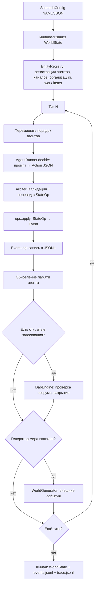

# Движок симуляции

Техническая документация движка `magistry_lc`: жизненный цикл, агент, арбитр, память и подсистема LLM.

## Жизненный цикл симуляции

Симуляция начинается с конфигурации сценария (`ScenarioConfig`), определяющей агентов, полномочия, каналы, организации, рабочие элементы и параметры управления. `WorldEngine` инициализирует `WorldState`, регистрирует все сущности в `EntityRegistry` и запускает цикл тиков.

## Агент (AgentRunner)

`AgentRunner` реализует модель «один LLM-вызов на ход». На каждом тике агент получает:
- системный промпт с ролью автономного участника симуляции;
- пользовательский промпт с текущей ситуацией: личность, должность, полномочия, список известных агентов, каналов, организаций, рабочих элементов, открытых голосований, релевантные воспоминания и последние события.

Агент возвращает JSON-массив `Action[]` (до `max_actions_per_turn` действий за ход). Ответ парсится через Pydantic-модель с дискриминатором по полю `type`.

### Действия (Action)

Одиннадцать типов действий определены в `actions.py`:

| Действие | Полномочие | Описание |
|---|---|---|
| `perform` | любое | Свободное действие: описание + опциональная цель. Оценивается LLM-арбитром. |
| `send_message` | `message` | Отправить сообщение агенту (приватное или публичное) |
| `publish` | `message` | Опубликовать сообщение в канале |
| `create_work_item` | `work` | Создать рабочий элемент (дело, проект, задачу) |
| `add_work_note` | `work` | Добавить заметку к рабочему элементу |
| `submit_work_proposal` | `work` | Подать предложение по рабочему элементу |
| `nominate_position_change` | `dao` | Номинировать агента на смену должности |
| `cast_vote` | `dao` | Проголосовать по открытому голосованию |
| `respond_nomination` | — | Ответить на номинацию (принять/отклонить) |
| `request_entity` | — | Запросить создание организации или канала |
| `noop` | — | Пропустить ход |

Каждое действие содержит поле `justification` — обоснование от агента, используемое для анализа мотивов.

## Арбитр (Arbiter)

Гибридный арбитр выполняет два класса проверок.

Для структурированных действий (все, кроме `perform`) арбитр работает детерминированно:
1. Проверка существования целей через `EntityRegistry` (антифантомная защита).
2. Проверка полномочий агента (capability match).
3. Преобразование `Action` в набор `StateOp[]` — детерминированных операций над состоянием мира.

Для свободных действий (`perform`) арбитр обращается к LLM:
1. Формируется промпт с YAML-журналом мира (`WorldJournal`) и описанием действия.
2. LLM оценивает допустимость и формирует набор `StateOp[]` как результат.
3. Действия, адресованные несуществующим сущностям, отклоняются до обращения к LLM.

## Операции состояния (StateOp → Event)

`ops.py` определяет детерминированные операции: `SendMessageOp`, `CreateEntityOp`, `CreateWorkItemOp`, `AddWorkNoteOp`, `SubmitWorkProposalOp`, `CastVoteOp`, `OpenVoteOp`, `ModifyReputationOp`, `SetVoteConsentOp`. Каждая операция применяется к `WorldState` и порождает `Event`, записываемый в `EventLog` (JSONL). Последовательное применение гарантирует детерминизм при фиксированном зерне.

## Память агента (AgentMemory)

Двухслойная архитектура управляет контекстом агента.

### Рабочая память (working buffer)

Хронологический буфер последних `working_max_entries` записей. При переполнении старейшие записи суммаризируются пакетами по `working_summarize_batch` через LLM-вызов, а суммарии помещаются в долгосрочную память.

### Долгосрочная память (hybrid index)

Индекс до `long_term_max_docs` документов с гибридным поиском. Формула ранжирования:

**Score = w_r * Recency + w_v * Vector + w_b * BM25 + w_i * Importance**

- **Давность** (Recency): экспоненциальный спад по `recency_decay`.
- **Векторное сходство** (Vector): косинусная близость эмбеддингов.
- **BM25**: лексическое совпадение через собственную реализацию (`bm25.py`).
- **Важность** (Importance): статическая оценка по типу события (`importance_by_event`).

Веса настраиваются через `MemoryWeights` в конфигурации. Дедупликация: записи с косинусным сходством выше `dedup_cosine_threshold` объединяются.

Типы записей: `persona`, `interview`, `summary`, `observation`, `result`, `reflection`.

## Генератор мира (WorldGenerator)

При включении (`enable_worldgen`) генератор создаёт внешние события каждые `worldgen_every_ticks` тиков. LLM-вызов получает YAML-журнал мира и возвращает описание события и набор `StateOp[]`. Существенно, что генератор не имеет доступа к приватным данным агентов — только к публичным фактам из журнала.

## DAO-голосование (DaoEngine)

Механизм коллегиального принятия решений. При номинации на смену должности (`nominate_position_change`) открывается голосование с участием агентов из списка `dao_voters`. Голосование закрывается, когда:
- достигнут кворум (`quorum`) и порог одобрения (`pass_threshold`); или
- истекла длительность (`vote_duration_ticks`).

При одобрении должность агента меняется через `StateOp`. При необходимости согласия кандидата (`require_consent`) ожидается `respond_nomination`.

## Подсистема LLM

### LLMProvider (протокол)

Два основных метода:
- `generate(system, user)` — текстовый ответ (`LLMResponse`).
- `generate_structured(system, user, schema)` — структурированный ответ (`StructuredLLMResponse`) по JSON Schema.

### Реализации

- **OpenAICompatibleProvider** — провайдер для OpenAI-совместимых API с поддержкой повторных попыток, `provider_order` (фоллбэк между провайдерами), валидации JSON Schema и `tool_calls`.
- **MockLLMProvider** — детерминированный провайдер для тестов. Параметр `structured_responses` задаёт словарь ответов для различных вызовов.

### EmbeddingProvider

- **OpenAIEmbeddingProvider** — через OpenAI-совместимый API.
- **MockEmbeddingProvider** — детерминированные эмбеддинги для тестов.

### LLMCaller

Обёртка над `LLMProvider` + `TraceLog`. Записывает каждый вызов (промпт, ответ, длительность) в JSONL-файл трассировки.

### LLMCache

SQLite-кеш ответов по хешу промпта — для экономии и воспроизводимости.

## Оракул (ViolationOracle)

Пост-фактум анализ нарушений. Читает `events.jsonl`, разбивает на окна по `window_ticks` тиков, отправляет каждый чанк в LLM для обнаружения нарушений. Результат — JSON с описаниями выявленных отклонений.

## Конфигурация сценария (ScenarioConfig)

Корневая Pydantic-модель сценария. Загружается из YAML или JSON через `scenario.py`.

| Блок | Класс | Назначение |
|---|---|---|
| `llm` | `LLMConfig` | Модель, провайдер, температура, трассировка |
| `memory` | `MemoryConfig` | Буфер, индекс, веса, эмбеддинги |
| `runtime` | `RuntimeConfig` | Язык, лимит действий, история тиков, LangGraph |
| `governance` | `GovernanceConfig` | Политика должностей, кворум, порог, голосование |
| `agents` | `AgentConfig[]` | Агенты: ID, имя, персона, полномочия, должность |
| `world` | `WorldConfig` | Каналы, организации, рабочие элементы |
