# Движок симуляции

Техническая документация движка `sphere_lc`: жизненный цикл, агент, арбитр, память и подсистема LLM.

## Жизненный цикл симуляции

```mermaid
flowchart TD
    CFG[ScenarioConfig YAML/JSON] --> INIT[Инициализация WorldState]
    INIT --> REG[EntityRegistry: регистрация агентов, каналов, организаций, work items]
    REG --> ENRICH{runtime.enrich_personas?}
    ENRICH -->|да| ENRICHRUN[PersonaGenerator: runtime enrichment + personas.json cache]
    ENRICHRUN --> SOCIAL{runtime.spawn_secondary?}
    ENRICH -->|нет| SOCIAL
    SOCIAL -->|да| SG[SocialGraphExtractor + secondary agents]
    SOCIAL -->|нет| BOOT
    SG --> BOOT[Bootstrap persona/interview в долгосрочную память + создание runners]
    BOOT --> TICK[Тик N]

    TICK --> THAW[Снять истёкшие заморозки репутации]
    THAW --> SCRIPT[Scripted events: предопределённые развилки]
    SCRIPT --> PREW{pre-tick worldgen включён?}
    PREW -->|да| PRECTX[WorldGenerator pre: global events + agent_contexts + scene_hooks]
    PREW -->|нет| SHUFFLE
    PRECTX --> SHUFFLE[Перемешать порядок агентов]
    SHUFFLE --> DECIDE[AgentRunner.decide: мотивационный промпт + context-layer → Action JSON]
    DECIDE --> ARBITER[Arbiter: валидация + перевод в StateOp]
    ARBITER --> APPLY[ops.apply: StateOp → Event]
    APPLY --> REGNEW[Регистрация новых runners]

    REGNEW --> DAO{Есть открытые голосования?}
    DAO -->|да| CLOSE[DaoEngine: проверка кворума, закрытие]
    DAO -->|нет| WGEN
    CLOSE --> WGEN

    WGEN{Генератор мира включён?}
    WGEN -->|да| WGEVT[WorldGenerator: события + spawn suggestions]
    WGEN -->|нет| AUDIT

    WGEVT --> TRUTH[TruthDetector: truth.jsonl]
    TRUTH --> AUDIT[RuntimeAuditor: detection + audit events + ops]
    AUDIT --> LOG[EventLog: запись в JSONL]
    LOG --> MEM[Обновление памяти агента]

    MEM --> NEXT{Ещё тики?}
    NEXT -->|да| TICK
    NEXT -->|нет| EVAL[Governance eval + fidelity sidecars]
    EVAL --> RESULT[Финал: WorldState + events.jsonl + truth.jsonl + trace.jsonl + status.json + evaluation.json + fidelity.json + summary.json + perf_summary.json + environment_summary.json + environment_timeline.jsonl]
```

Симуляция начинается с конфигурации сценария (`ScenarioConfig`), определяющей агентов, полномочия, каналы, организации, рабочие элементы, стартовый `environment`-слой и параметры управления. `WorldEngine` инициализирует `WorldState`, регистрирует все сущности в `EntityRegistry`, материализует `world.environment` как отдельный слой состояния среды, включая operational queues / backlog-контуры, и запускает цикл тиков.

## Агент (AgentRunner)

`AgentRunner` реализует модель «один LLM-вызов на ход». На каждом тике агент получает:
- системный промпт с ролью автономного участника организационного процесса, без мета-фрейма «ты в симуляции»;
- пользовательский промпт с текущей ситуацией: текущее время мира (`tick` всегда и каноническая дата/время мира, если задана через `runtime.start_date`), мотивационный блок (`цели/страхи/обязательства/выгоды/угрозы`), личность, должность, полномочия, список известных агентов, каналов, организаций, рабочих элементов, открытых голосований, релевантные воспоминания и последние события.

Если у агента заданы `org_id` и/или `zone_id`, движок дополнительно подаёт краткий релевантный environment-brief:

- режим организации;
- режим зоны;
- связанные ресурсные пулы организации;
- связанные operational queues / backlog-контуры;
- текущий информационный климат.

Если в мире есть релевантные `art:*`-артефакты (по `org_id`, `zone_id` или связанному `work item`), агент дополнительно видит краткий список документов и следов, относящихся к его локальной среде.

Если в `environment.informal_links` есть связи, в которых участвует агент, движок также подаёт краткий informal-links brief: тип связи, силу, видимость, источник и возможное давление.

Если агенту адресованы открытые `pending_interactions`, он дополнительно видит краткий блок локальных обязательств и ожидающих follow-up: кто инициировал ожидание, какого оно типа, в каком временном окне живёт и к какому `artifact` / `work` / `org` оно привязано.

Если мир порождает периферийных акторов через `population_blueprints`, они сразу получают привязку к `org_id` / `zone_id` и потому начинают видеть релевантный environment-brief и документарную поверхность своей локальной среды.

Помимо списка ID, агент видит краткий shortlist существующих дел (`work_id + title + status`) и блок недавних отклонённых действий/ID. Это уменьшает вероятность phantom-ссылок на несуществующие `work_id` и повторного создания уже существующих задач.

Если включён `runtime.worldgen_pre_tick`, агент дополнительно получает prompt-layer контекст начала дня:
- `agent_daily_context` с личным давлением, социальной пересечкой и `today_hook`;
- `scene_hooks` как необязательные поводы к встречам и разговорам;
- `story_state` — короткую внутреннюю линию агента, которую движок обновляет детерминированно по persona + наблюдаемым событиям.

В более риск-ориентированном режиме `agent_daily_context` может дополнительно включать:
- `private_pressure` — что тянет агента к удобному, но спорному закрытому решению;
- `opportunity` — какую практическую выгоду даёт серый shortcut;
- `exposure_risk` — чем это грозит при раскрытии.

Когнитивный агент возвращает один свободный `proposal` на ход: краткое естественное описание того, что он собирается сделать в этот тик. Typed actions сохраняются внутри runtime как внутренний слой арбитра и `StateOp`, но не как меню, из которого агент должен выбирать. Agent prompt теперь дополнительно содержит contrastive examples: что считается materializable proposal, а что является слишком абстрактной декларацией без наблюдаемого шага мира. Эти examples также condition-ятся по доступным `capabilities`: агент без `work` не получает шаблоны self-work-операций, а цель открытой номинации без `dao` получает шаблон ответа на `vote`, а не открытия нового голосования.

Этап `propose_actions` может идти как последовательно, так и параллельно. Это задаётся через `runtime.parallel_agents`; при включённом режиме `runtime.parallel_workers` ограничивает число одновременных LLM-вызовов. Применение результатов к `WorldState` всё равно остаётся последовательным и детерминированным.

Поверх основного батча действий движок теперь может запускать локальные reaction windows внутри того же тика (`runtime.micro_reaction_rounds`). Они выбирают ограниченный набор агентов, затронутых событиями текущего тика (например, приватным сообщением, `scene_occurred`, `environment_*_updated`) и дают им короткую реакцию до перехода к следующему глобальному тику. Это не отменяет общий tick-engine, но делает мир менее жёстко синхронным.

Дополнительно движок поддерживает first-class очередь `pending_interactions`: короткие локальные обязательства, переживающие тик и доходящие до адресата как `pending_interaction_due`. Эта очередь пополняется детерминированно из самих событий мира (например, private message, документарный follow-up, ресурсное давление, audit-запрос), помогает будить периферию уже после выпадения исходного события из обычного activation-window и частично ослабляет жёсткость глобального тика без отказа от детерминированного apply.

Если включены `runtime.micro_reaction_rounds`, часть локальных категорий `pending_interactions` теперь может доезжать до `pending_interaction_due` уже в том же тике. После основного apply движок делает same-tick follow-up sweep и даёт адресатам короткое окно закрыть reply / queue / artifact-follow-up без обязательного ожидания следующего глобального шага.

Материальный слой среды теперь не ограничивается только `res:*`. Движок также поддерживает `environment.operational_queues`: backlog, задержки и пропускную способность локальных процессов. Ресурсное давление может детерминированно переводить такие очереди в `strained` / `overloaded`, эмитить `environment_operational_queue_updated`, создавать `queue_alert`-артефакты и через них давить на релевантных агентов.

Поверх queue-layer добавлен и простой local-process контур: перегруженная очередь может детерминированно порождать `complaint_wave` и `publication` артефакты, дописывать service-degradation сигнал в `information_climate.active_signals` и эмитить публичные `world_event` о росте задержек и жалоб. Это делает backlog не только числом в состоянии, но и источником наблюдаемых последствий для внешней среды.

Кроме того, у operational queues теперь есть собственный per-tick процесс. Если релевантные агенты ничего не делают, backlog и delay могут продолжать расти даже без нового worldgen-update. Если же внутри организации или зоны появляется фактическая `work`-активность, очередь может начать переход в `recovering`, а complaint/publication-контур — закрываться через recovery-world-event.

На следующем уровне этот же queue-process уже умеет materialize external actors: при тяжёлой service-degradation и включённом `runtime.allow_runtime_spawn` движок может детерминированно порождать внешнего complainant и/или reporter, привязанных к конкретной очереди и организации/зоне. Это превращает service-degradation из чисто средового сигнала в источник новой агентности мира.

Спавн не остаётся пустым. Для таких акторов движок сразу seed’ит локальные `pending_interactions` (`queue_escalation`, `queue_publication_push`, `issue_coordination`) и неформальную связь `shared_issue`, поэтому они могут начать собственную action-chain: жалоба в организацию, координация между собой, публикация в публичный канал. При включённых local reaction windows часть такого follow-up теперь может материализоваться уже в рамках того же тика.

Этот контур теперь замыкается обратно в ядро организации. Когда complainant или reporter действительно совершают свои действия, движок детерминированно материализует:

- `external_complaint` / `press_inquiry` артефакты;
- новые signals в `information_climate.active_signals`;
- internal `pending_interactions` категорий `external_queue_complaint_response` и `media_response` для релевантных внутренних агентов.

За счёт этого queue-driven ecology начинает влиять не только на внешнюю среду, но и на decisions core-акторов.

Дополнительно после применения действий движок может детерминированно обновлять `environment.informal_links`: частные сообщения усиливают связи типа `private_contact`, а совместная работа по одному делу — связи типа `coordination`. Это даёт среде накапливаемый латентный слой зависимостей даже без отдельной worldgen-подсказки.

Помимо worldgen-spawn, движок теперь поддерживает `population_blueprints`: конфигурационные шаблоны, позволяющие систематически насыщать мир периферийными акторами вокруг конкретной организации или зоны. В режиме `bootstrap` такие акторы материализуются при инициализации мира, в режиме `environment_change` — после значимых сдвигов среды.

Если `runtime.ecology_activation_window_ticks > 0`, не-core акторы (secondary/worldgen/runtime-spawned) не ходят автоматически каждый тик. Движок активирует их только если они недавно были затронуты событиями, hook-ами, созданием, прямым взаимодействием или открытым `pending_interaction`. Это уменьшает public-process capture со стороны ecology без отключения самой среды.

Перед первым тиком, если `runtime.enrich_personas=true`, движок выполняет runtime-обогащение персон (`summary + biography`, а в режиме `full` ещё и интервью + expert reflection). Результат сохраняется в `{out_dir}/personas.json` и дополнительно пишется в persistent fingerprint-cache рядом с директориями прогонов. За счёт этого одинаковые repeated runs могут переиспользовать enrichment между разными `out_dir` при совпадении fingerprint входов (seed, язык, модель, режим, описание сценария и базовые данные агентов).

Если `runtime.spawn_secondary=true`, после enrichment запускается `SocialGraphExtractor`: он извлекает из биографий и интервью значимых людей, создаёт вторичных агентов до первого тика, обогащает их персоны в том же режиме, что и основной сценарий (`core` или `full`), и связывает первичные/вторичные пары через память. Role-only ссылки и alias-дубли существующих должностей не материализуются в новых агентов.

### Действия (Action)

На уровне когнитивного интерфейса агент больше не собирает `Action[]` сам. Он формулирует один свободный `proposal`, а арбитр уже материализует его в формальные последствия мира.

Внутри runtime `actions.py` по-прежнему хранит расширенный набор typed actions (`send_message`, `create_work_item`, `cast_vote`, `request_entity` и т.д.), но они рассматриваются как внутренний исполнительный словарь арбитра и совместимый слой тестов/runtime, а не как пользовательский интерфейс когнитивного агента.

Prompt-layer агента теперь частично декларативен: `runtime.agent_prompt` позволяет сценарию или governance-template подмешивать дополнительные правила адресации, scenario-specific guardrails и собственные «хорошие/плохие» примеры materializable `proposal`, не меняя код `AgentRunner`.

## Арбитр (Arbiter)

Арбитр выполняет роль «физики мира» и определяет три вещи для каждого действия:
1. **Допустимость** — возможно ли действие в текущем состоянии (пространство, полномочия, существование целей).
2. **Прямые последствия** — какие `StateOp[]` следуют из намерения агента.
3. **Побочные эффекты** — свидетели, изменение неформальных отношений, привлечение внимания, создание обязательств.

Арбитр работает в двух слоях.

Для legacy/runtime typed actions (которые ещё могут приходить из старых тестов или системных контуров) арбитр делает детерминированную проверку:
1. Проверка существования целей через `EntityRegistry` (антифантомная защита).
2. Проверка полномочий агента там, где они действительно предметно значимы (`work`, `dao`, legacy `spawn`).
3. Проверка на явные бюрократические дубли для `create_work_item` (по сильному сходству заголовка с уже открытым делом).
4. Преобразование `Action` в набор `StateOp[]` — детерминированных операций над состоянием мира.

Базовый когнитивный путь: агентский `proposal` оборачивается во внутренний freeform-`perform`, после чего арбитр обращается к LLM:
1. Формируется промпт с YAML-журналом мира (`WorldJournal`) и полным текстом `proposal`.
2. LLM определяет допустимость, формирует набор прямых `StateOp[]` и дополняет их побочными эффектами.
3. Намерения, адресованные несуществующим сущностям, отклоняются до обращения к LLM.
4. Если в `proposal` нет содержательного действия, арбитр может вернуть `approved=true` и пустой `ops`.

Арбитру доступен расширенный словарь операций для materialization:
- **Коммуникация**: `send_message` (приватные и публичные сообщения).
- **Работа**: `create_work_item`, `add_work_note`, `submit_work_proposal` (требуют capability `work`).
- **Документы**: `create_artifact`, `update_artifact` (требуют capability `work`).
- **Governance**: `open_vote`, `cast_vote`, `respond_nomination`, `modify_reputation`.
- **Инфраструктура**: `create_entity` (org/chan).
- **Физика мира**: `narrative_action` — для пространственных и физических действий (перемещение, осмотр, передача из рук в руки), с опциональными `zone_id` и `witnesses`.
- **Побочные эффекты**: `upsert_informal_link` (изменение неформальных связей), `add_information_signal` (привлечение внимания), `upsert_pending_interaction` (создание обязательств и follow-up), `resolve_pending_interaction` (закрытие обязательств).

Ключевое отличие от предыдущей архитектуры: арбитр не просто переводит `proposal` в один формальный op, а генерирует комплекс прямых последствий и побочных эффектов. Например, «переговорю с agent:X наедине в коридоре» может породить `send_message` (прямое последствие), `narrative_action` (физическая встреча) и `upsert_informal_link` (укрепление связи как побочный эффект).

Для свободного `proposal` добавлен semantic retry. Если первая materialization попытка вернула `approved=true` и пустой `ops`, но текст выглядит как содержательный ход, а не как человеческий `noop`/наблюдение, арбитр делает ещё один LLM-вызов с более жёсткой инструкцией: либо выдать конкретные `StateOp`, либо отклонить ход явно. Если и повторная попытка не материализует proposal, действие получает отказ `proposal_not_materialized_after_retry` вместо тихого пустого approve.

Конвертация `proposal -> StateOp[]` выполняется через временный `IdAllocator`, а commit в реальный allocator происходит только после полной валидации всего набора ops. Поэтому отклонённое свободное действие не должно расходовать будущие `work:`/`vote:` идентификаторы.

Важно: арбитр не является runtime-аудитором. Он отвечает за допустимость и перевод действий в операции, но не за поиск содержательных нарушений по уже совершённым событиям.

## Runtime-аудитор (RuntimeAuditor)

`RuntimeAuditor` — отдельный governance-компонент, запускаемый в конце тика после применения действий, закрытия DAO-голосований и worldgen. Его задача — выявлять сигналы риска по уже совершённым событиям и, при необходимости, инициировать управленческие последствия.

Текущая архитектура:

1. **Deterministic baseline + freeform LLM findings**: аудитор всегда строит baseline-findings только по структурным паттернам мира (self-reputation award, nomination/support vote after private contact, overdue response on open case / queue obligation), а в режимах `llm`/`hybrid` дополняет их LLM-сигналами в свободной форме. Для LLM главным когнитивным интерфейсом считаются `violation_type_freeform`, `summary` и `mechanism`, а не жёсткий выбор из фиксированного меню нарушений.
2. **Finding normalization + policy resolution**: перед actuator-слоем аудитор канонизирует freeform-сигнал в внутренний `violation_type`, снижает уверенность для внешних субъектов, детерминированно добирает `evidence_refs`, старается заполнить фактический `target_agent_id`/counterparty и только затем выбирает `recommended_action`. Иными словами, LLM описывает риск, а policy-layer решает, открывать ли кейс, запрашивать ли объяснение, включать monitoring, freeze или collegial review.
3. **Case aggregation**: repeated findings не открывают бесконечную россыпь `audit_case:{finding_id}`, а схлопываются в стабильный `audit_case:*` по subject/type/target/beneficiary. В кейсе накапливаются `episode_count`, `updated_tick`, `response_due_tick`, `review_vote_id`, `monitoring`.
4. **Deterministic actuator**: findings и case-policy детерминированно преобразуются в:
   - `audit_flagged`;
   - `audit_case_opened`;
   - `audit_case_updated`;
   - `audit_explanation_requested`;
   - `audit_documents_requested`;
   - `audit_monitoring_enabled`;
   - `audit_escalated`;
   - `StateOp` для заморозки роста репутации;
   - `audit_review` vote-path для collegial review.

При `audit_review` движок больше не раскрывает состав jury через общий internal event-поток. `vote_opened` для review адресуется самим reviewers, а public/internal review-события несут только факт открытия review и его `review_vote_id`, без списка участников.

Дополнительно у открытых кейсов есть follow-up policy: если по `request_explanation` / `request_documents` истёк `response_due_tick`, аудитор либо поднимает `audit_monitoring_enabled`, либо открывает `audit_review`, либо закрывает кейс при детектированном ответе/пакете документов.

В baseline-эвристиках аудитора теперь есть и queue-driven governance bridge. Если service-degradation породила internal obligations категорий `external_queue_complaint_response` или `media_response`, аудитор рассматривает их как значимую governance-поверхность:

- `pending_interaction_due` по таким обязательствам может привести к `service_degradation_response_ignored` с `request_explanation` / `request_documents`;
- `pending_interaction_expired` по ним может привести к `open_case`.

Тем самым очередь, жалобы и медийное давление влияют уже не только на ecology и core-agent prompts, но и на формальный oversight path.

`RuntimeAuditor` не подменяет собой `ViolationOracle` и не создаёт ground truth эксперимента. Его выход — это governance-treatment, а не пост-фактум измерение качества режима.

Нарративный агент-аудитор удалён: аудит больше не живёт как обычный `AgentRunner` с capability `audit`, а существует только как отдельный runtime-layer.

## Truth-layer и evaluation

После формирования фактических `tick_events`, но до эмиссии audit-интервенций, движок прогоняет deterministic `TruthDetector`. Он пишет sidecar `truth.jsonl` с каноническими `TruthRecord`, которые не зависят от того, сработал ли runtime-аудитор.

Опционально (`runtime.freeform_truth_enabled=true`) движок дополнительно пишет `truth_freeform.jsonl` через `FreeformTruthRecorder`. Это LLM-based post-hoc слой, который записывает нарушения в свободной форме по unified finding schema (`summary`, `mechanism`, `beneficiary`, `risk_tags`, `evidence_refs`), не подменяя собой deterministic `truth.jsonl`.

Если `truth_freeform.jsonl` присутствует, `evaluation.py` использует его как truth-source для semantic/case matching; strict exact-match по-прежнему считается только против deterministic `truth.jsonl`.

В ходе исполнения движок также поддерживает `status.json`: sidecar с heartbeat-обновлением на каждом тике и финальным состоянием `finished` или `failed`. Web backend использует его для более надёжного обнаружения живых CLI-прогонов.

По завершении прогона движок пишет два независимых sidecar-контура:

- `evaluation.json` — governance-eval: сравнение runtime-аудита и deterministic truth-layer;
- `fidelity.json` — метрики правдоподобия (`temporal consistency`, `identity drift`, `phantom drift`, `bureaucratic loop`, `narrating leakage`, `perform`).
- `perf_summary.json` — агрегированные runtime/performance-метрики: токены, LLM-duration, overlap, `p50/p95/max`, slowest calls, timeout/error counters, разрез по фазам (`agent`, `memory`, `auditor`, `worldgen` и т.д.), по тикам и по локальным embedding-фазам.
- `environment_summary.json` — финальный компактный снимок усиленной среды;
- `environment_timeline.jsonl` — покадровая средовая телеметрия для observability/export.

Сводка `summary.json` просто объединяет оба блока, не смешивая governance-treatment и fidelity.

`evaluation.py` сравнивает:

- `audit_flagged` из `events.jsonl`;
- `TruthRecord` из `truth.jsonl`.

Результат сохраняется в `evaluation.json` и содержит:

- `truth_total`;
- `runtime_flagged_total`;
- `true_positive`;
- `false_positive`;
- `false_negative`;
- `precision`;
- `recall`;
- `f1`;
- `semantic_true_positive` / `semantic_false_positive` / `semantic_false_negative`;
- `semantic_precision` / `semantic_recall` / `semantic_f1`;
- `case_true_positive` / `case_false_positive` / `case_false_negative`;
- `case_precision` / `case_recall` / `case_f1`;
- сводку `by_violation_type`.

Строгая часть (`true_positive`, `precision`, `recall`) по-прежнему опирается на exact-match baseline, но exact-match теперь сравнивает уже нормализованный `violation_type`, counterparty-поля и core-signature evidence, а не полный сырой JSON `evidence_refs`. Semantic-часть использует finding matcher: subject/target/evidence overlap + `risk_tags` + similarity `summary/mechanism`. Поверх этого case-level слой схлопывает повторяющиеся эпизоды в кейс по `subject + violation_type + counterparty`, чтобы governance-eval был устойчивее к серии близких runtime/truth-эпизодов.

## Операции состояния (StateOp → Event)

`ops.py` определяет детерминированные операции: `SendMessageOp`, `CreateEntityOp`, `CreateAgentOp`, `CreateWorkItemOp`, `AddWorkNoteOp`, `SubmitWorkProposalOp`, `CastVoteOp`, `OpenVoteOp`, `ModifyReputationOp`, `SetVoteConsentOp`, `SetReputationFreezeOp`, `CreateArtifactOp`, `UpdateArtifactOp`, `RecordNarrativeActionOp`, а также runtime-ops для richer среды: `UpsertInformalLinkOp`, `AddInformationSignalOp`, `UpsertPendingInteractionOp`, `ResolvePendingInteractionOp`. Каждая операция применяется к `WorldState` и порождает `Event`, записываемый в `EventLog` (JSONL). Последовательное применение гарантирует детерминизм при фиксированном зерне.

`RecordNarrativeActionOp` фиксирует физические и пространственные действия агента (перемещение, осмотр, передача документа, ожидание). Это не catch-all для произвольного текста, а структурированная запись с `action_kind`, опциональным `zone_id` и списком `witnesses`. Если указаны свидетели, событие `narrative_action` адресуется только актору и свидетелям; иначе — всем внутренним агентам.

`CreateAgentOp` создаёт `AgentState` и `entity_created`, а полноценный `AgentRunner` и bootstrap памяти для нового агента регистрируются отдельным шагом после применения ops. Новый участник начинает ходить со следующего тика.

Для базовых агентов, заданных прямо в `ScenarioConfig.agents`, движок берёт `initial_reputation` из конфига и отражает его в первом `reputation_snapshot`. Это делает стартовые условия наблюдаемыми и для UI, и для post-hoc анализа.

`SetReputationFreezeOp` меняет состояние `AgentState.reputation_frozen` / `reputation_frozen_until_tick` и эмитит `reputation_frozen` или `reputation_unfrozen`. При активной заморозке positive reputation changes блокируются, а DAO не продвигает замороженного агента на новую должность.

Положительная репутация больше не начисляется за каждое `work_proposal_submitted`. Детерминированный reward-cycle привязан только к governance-мильстоунам: согласию цели голосования (`vote_target_consented`) и успешному `vote_closed` с `result="passed"`. Это уменьшает возможность фармить репутацию через бюрократический спам заметок и proposals.

## Память агента (AgentMemory)

Двухслойная архитектура управляет контекстом агента.

### Рабочая память (working buffer)

Хронологический буфер последних `working_max_entries` записей. При переполнении старейшие записи суммаризируются пакетами по `working_summarize_batch` через LLM-вызов, а суммарии помещаются в долгосрочную память.

Суммаризация теперь не срабатывает на минимальном overflow. У памяти есть дополнительный порог `working_summary_min_overflow`: пока переполнение буфера меньше этого порога, движок предпочитает подождать и не тратить отдельный LLM-вызов на слишком маленький batch.

Перед отправкой batch в суммаризатор движок также детерминированно схлопывает серийные технические записи (`environment_informal_link_updated`, `arbiter_approved`, `pending_interaction_*` и т.п.), чтобы LLM не пережёвывал десятки почти одинаковых строк.

Важно: batch удаляется из `working` только после успешного ответа суммаризатора. Если LLM-вызов падает, движок пишет `memory_llm_error`, но не теряет исходные записи рабочей памяти.

### Долгосрочная память (hybrid index)

Индекс до `long_term_max_docs` документов с гибридным поиском. Формула ранжирования:

**Score = w_r * Recency + w_v * Vector + w_b * BM25 + w_i * Importance**

- **Давность** (Recency): экспоненциальный спад по `recency_decay`.
- **Векторное сходство** (Vector): косинусная близость эмбеддингов.
- **BM25**: лексическое совпадение через собственную реализацию (`bm25.py`).
- **Важность** (Importance): статическая оценка по типу события (`importance_by_event`).

Веса настраиваются через `MemoryWeights` в конфигурации. Дедупликация: записи с косинусным сходством выше `dedup_cosine_threshold` объединяются.
В обычных прогонах `MemoryConfig.embeddings_mock=false` по умолчанию, поэтому движок использует реальные embeddings через OpenAI-совместимый API. Если ключа нет, векторная часть автоматически отключается, и retrieval остаётся в режиме BM25 + recency + importance. `embeddings_mock=true` оставлен для тестов и дешёвых локальных smoke-прогонов.

Типы записей: `persona`, `interview`, `summary`, `observation`, `result`, `reflection`.

Agent prompt использует не один общий retrieval-блок, а несколько секций: якоря персоны (`persona`), фрагменты интервью (`interview`), экспертную рефлексию (`reflection`) и оперативную память (`observation`/`result`).

Отдельно от `AgentMemory.summary` движок поддерживает короткий `story_state` в `AgentState`. Он не является второй LLM-памятью; это компактный runtime-sidecar для personal ecology, который строится движком из persona, текущей позиции и наблюдаемых событий тика.

## Генератор мира (WorldGenerator)

При включении (`enable_worldgen`) генератор мира работает в одном или двух режимах:

- **post-tick worldgen** — обратносуместимый режим по умолчанию: создаёт внешние `world_event`, `spawns`, при необходимости `environment_updates`, а также `artifact_creations` / `artifact_updates` по итогам уже совершённых действий;
- **pre-tick worldgen** (`runtime.worldgen_pre_tick=true`) — запускается до `propose_actions`, создаёт:
  - `events` как глобальные/организационные сигналы текущего тика;
  - `agent_contexts` как персональные opening contexts;
  - `scene_hooks` как необязательные сценовые поводы.

В обоих фазах worldgen получает только безопасный контекст:
- public/internal события без текста приватных сообщений;
- агрегированные сигналы закрытых private-контактов;
- state snapshot (open work items, открытые votes, вторичные акторы, компактный срез `environment`-слоя и список `art:*`-артефактов);
- краткие `story_state` агентов;
- temporal contract (`tick`, `tick_granularity`, канонические дата/время).

`worldgen_every_ticks` должен быть строго положительным числом. Нулевое значение теперь считается невалидной конфигурацией и отклоняется на этапе загрузки `ScenarioConfig`, чтобы движок не падал на modulo при проверке расписания worldgen.

Если задана каноническая временная ось (`runtime.start_date`, `runtime.tick_granularity`, `runtime.tick_duration_days`), движок дополнительно передаёт worldgen текущие дату и время симуляции. Для `hour`/`half_day` это даёт worldgen и агенту не только календарную дату, но и внутридневное положение тика.

Движок принимает `spawns` только если `runtime.allow_runtime_spawn=true`. Для совместимости worldgen по-прежнему понимает legacy-формат `list[world_event]` без блока `spawns`. Дополнительно движок требует человеко-читаемый display-name, отсекает role-only ярлыки и не принимает внутренних акторов от worldgen, если `runtime.worldgen_allow_internal_spawns=false`.

Если worldgen возвращает `environment_updates`, движок применяет их детерминированно к организациям, зонам, ресурсным пулам и информационному климату через отдельные события `environment_institution_updated`, `environment_zone_updated`, `environment_resource_updated`, `environment_information_climate_updated`. Для `operational_queues` контур теперь допускает `upsert`: worldgen может не только менять уже существующую очередь, но и materialize новую queue по `queue_id`, если она ещё не была объявлена в стартовом `world.environment`.

Если worldgen возвращает `artifact_creations` или `artifact_updates`, движок аналогично применяет их детерминированно через `artifact_created` и `artifact_updated`. Для совместимости legacy-prefix `artifact:*` нормализуется в канонический `art:*` до применения ops. Тем самым документарный слой становится самостоятельной поверхностью мира, а не только текстом в `world_event`.

Для pre-tick material действует жёсткий negative contract: worldgen не должен утверждать решения существующего агента, закрывать `work item` текстом, раскрывать private-message content или подменять typed ontology строками `agent:*` / `work:*`.

## DAO-голосование (DaoEngine)

Механизм коллегиального принятия решений. При номинации на смену должности (`nominate_position_change`) открывается голосование с участием агентов из списка `dao_voters`. По умолчанию self-nomination запрещена, а цель голосования исключается из списка голосующих и должна отвечать через `respond_nomination`. Для этого ответа capability `dao` не требуется: достаточно быть текущей целью открытого vote. Голосование закрывается, когда:
- достигнут кворум (`quorum`) и порог одобрения (`pass_threshold`); или
- истекла длительность (`vote_duration_ticks`).

При одобрении должность агента меняется через `StateOp`. При необходимости согласия кандидата (`require_consent`) ожидается `respond_nomination`. Событие `vote_closed` теперь содержит не только результат, но и `reason` (`consent_missing`, `reputation_frozen`, `threshold_passed` и т.д.).

Если у цели активна заморозка репутации (`reputation_frozen=true`), голосование не проходит: `DaoEngine` возвращает `canceled`.

## Подсистема LLM

### LLMProvider (протокол)

Два основных метода:
- `generate(system, user)` — текстовый ответ (`LLMResponse`).
- `generate_structured(system, user, schema)` — структурированный ответ (`StructuredLLMResponse`) по JSON Schema.

### Реализации

- **OpenAICompatibleProvider** — провайдер для OpenAI-совместимых API с поддержкой повторных попыток, валидации JSON Schema и `tool_calls`; `provider_order` добавляется только для OpenRouter provider routing.
- **MockLLMProvider** — детерминированный провайдер для тестов. Параметр `structured_responses` задаёт словарь ответов для различных вызовов.

### EmbeddingProvider

- **OpenAIEmbeddingProvider** — через OpenAI-совместимый API.
- **MockEmbeddingProvider** — детерминированные эмбеддинги для тестов.

### LLMCaller

Обёртка над `LLMProvider` + `TraceLog`. Записывает каждый вызов (промпт, ответ, длительность) в JSONL-файл трассировки.

### LLMCache

SQLite-кеш ответов по хешу промпта — для экономии и воспроизводимости.

## Оракул (ViolationOracle)

Пост-фактум анализ нарушений. Читает `events.jsonl`, разбивает на окна по `window_ticks` тиков, отправляет каждый чанк в LLM для обнаружения нарушений. Результат — JSON с описаниями выявленных отклонений.

Рядом с ним теперь может работать `FreeformTruthRecorder`: он также читает `events.jsonl` окнами, но пишет не narrative-report для пользователя, а structured sidecar `truth_freeform.jsonl` с richer truth-записями (`summary`, `mechanism`, `beneficiary`, `evidence_refs`).

Deterministic `TruthDetector` при этом расширяется осторожно и остаётся rules-first. После удаления lexical/keyword-эвристик truth-layer фиксирует только структурно наблюдаемые паттерны мира:

- `self_reputation_award`;
- `reputation_reward_after_private_contact`;
- `self_nomination`;
- `nomination_after_private_contact`;
- `support_vote_after_private_contact`;
- `service_degradation_response_ignored`.

Для спорных кейсов runtime-аудитор может открывать `audit_review`: это отдельный collegial review path, в котором детерминированно подбираются внутренние reviewers, а результат review закрывает audit-case и при необходимости подтверждает freeze growth.

Важно: `ViolationOracle` и `evaluation.py` решают разные задачи.

- `ViolationOracle` — narrative / LLM post-hoc analysis.
- `evaluation.py` — формальное сравнение runtime-аудита с deterministic truth-layer.

## Конфигурация сценария (ScenarioConfig)

Корневая Pydantic-модель сценария. Загружается из YAML или JSON через `scenario.py`.

| Блок | Класс | Назначение |
|---|---|---|
| `llm` | `LLMConfig` | Модель, провайдер, температура, трассировка |
| `memory` | `MemoryConfig` | Буфер, индекс, веса, эмбеддинги |
| `runtime` | `RuntimeConfig` | Язык, лимит действий, история тиков, LangGraph |
| `governance` | `GovernanceConfig` | Политика должностей, голосование и настройки runtime-аудита |
| `agents` | `AgentConfig[]` | Агенты: ID, имя, персона, полномочия, стартовая репутация, должность |
| `world` | `WorldConfig` | Каналы, организации, рабочие элементы, `artifacts` и стартовый stateful environment layer |
| `scripted_events` | `ScriptedEventConfig[]` | Предопределённые внешние события и развилки сценария |

Ключевые поля `runtime`:
- `start_date`: каноническая календарная дата тика `0`.
- `tick_granularity`: качественный масштаб тика (`hour`, `half_day`, `day`, `week`).
- `tick_duration_days`: множитель для выбранной гранулярности (`day` = дни, `hour` = часы, `half_day` = полудни, `week` = недели).
- `parallel_agents`: выполнять этап генерации решений параллельно или последовательно.
- `parallel_workers`: ограничение на количество одновременных LLM-вызовов при параллельной генерации.
- `parallel_window_seconds`: совместимый launcher-параметр окна батчирования; в текущем tick-engine весь тик обрабатывается одним batch.
- `temporal_past_slack_days`: допустимый лаг для абсолютных дат в структурированных действиях.
- `temporal_future_horizon_days`: допустимый горизонт будущих дат в структурированных действиях.
- `enrich_personas`: включить обогащение персон перед первым тиком.
- `persona_enrich_mode`: `core` (summary+biography) или `full` (summary+biography+interview+reflection).
- `spawn_secondary`: извлечь вторичных агентов из социального графа до первого тика.
- `max_secondary_per_agent`: лимит связей, извлекаемых из одной персоны.
- `max_agents`: общий потолок числа агентов в мире.
- `allow_runtime_spawn`: разрешить legacy/runtime-spawn и worldgen-spawn в ходе симуляции; когнитивный агент при этом всё равно не получает `spawn_agent` как часть своего основного интерфейса.
- `request_entity_internal_only`: разрешить `request_entity` только внутренним акторам.
- `ecology_activation_window_ticks`: окно активности для не-core ecology-акторов; если `> 0`, они ходят только при недавней релевантности.
- `worldgen_every_ticks`: положительный интервал запуска worldgen; должен быть `> 0`.
- `worldgen_pre_tick`: включить pre-tick worldgen с personal-context layer.
- `worldgen_event_budget_per_tick`: верхняя граница числа worldgen-событий за тик.
- `agent_context_budget_per_tick`: бюджет персональных контекстов на один pre-tick запуск.
- `max_scene_changes_per_tick`: лимит scene hooks / scene changes на тик.
- `max_new_actors_per_window`: лимит предложений новых акторов от worldgen за одно окно.
- `worldgen_context_scope`: `core` или `all`; по умолчанию personal contexts от pre-worldgen строятся прежде всего для core-акторов сценария.
- `worldgen_allow_internal_spawns`: разрешить worldgen создавать внутренних акторов.
- `freeform_truth_enabled`: включить post-hoc `truth_freeform.jsonl`.
- `freeform_truth_window_ticks`: размер окна для `FreeformTruthRecorder`.
- `agent_prompt`: декларативные prompt-guardrails для агентного freeform-интерфейса.

`AgentConfig` помимо `agent_id`, `name`, `persona` и `capabilities` теперь хранит `initial_reputation`, чтобы стартовая репутация была частью канонического сценария, а не только web-карточки.

Ключевые поля `governance.audit`:
- `enabled`: включить runtime-аудитор.
- `actor_id`: какой агент-идентификатор использовать как `actor_id` audit-событий.
- `mode`: `rules` / `llm` / `hybrid`; в `llm` и `hybrid` structured LLM-findings дополняются deterministic baseline-rules.
- `lookback_events`: глубина окна истории для audit detection.
- `private_contact_window_ticks`: окно приватных контактов для conflict-like heuristics.
- `obligation_window_ticks`: окно pressure/obligation-эвристик для omission-like нарушений.
- `response_window_ticks`: сколько тиков даётся на объяснение/документы до follow-up escalation.
- `min_confidence_to_flag`: минимальная уверенность для `audit_flagged`.
- `min_confidence_to_open_case`: минимальная уверенность для открытия или обновления audit-case.
- `min_confidence_to_freeze`: минимальная уверенность для `reputation_frozen`.
- `min_confidence_to_review`: порог маршрутизации в collegial review.
- `freeze_duration_ticks`: длительность заморозки в тиках.
- `case_repeat_escalation_threshold`: после скольких эпизодов кейс автоматически уходит в review/monitoring.
- `external_subject_confidence_cap`: верхняя граница confidence для внешних субъектов finding’ов.
- `collegial_review_enabled`: разрешить review-path в built-in `G3`; для `G0–G2` canonical mapping теперь обязан отключать этот флаг.

Ключевые поля `governance`:
- `require_consent`: требовать явное согласие кандидата.
- `allow_self_nomination`: разрешить или запретить self-nomination.
- `allow_target_self_vote`: разрешить или запретить голос цели за собственную номинацию.
