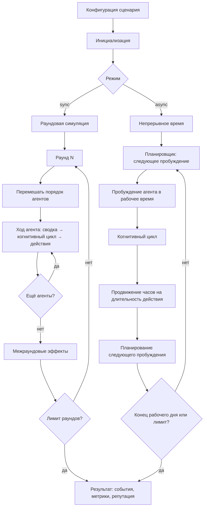

# Движок симуляции

Техническая документация движка MAGISTRY: жизненный цикл, среды исполнения, когнитивный агент, модель личности и подсистема LLM.

## Жизненный цикл симуляции



Симуляция начинается с конфигурации сценария (`ScenarioConfig`), определяющей агентов, полномочия, ресурсы, потребности и режим управления. После инициализации состояния мира (`WorldState`) выполнение передаётся одной из двух сред.

## Синхронная среда (Environment)

`Environment` реализует раундовую модель, унаследованную из ранних версий архитектуры. Раунд — дискретный шаг времени. В каждом раунде все агенты получают ход в случайном порядке (`random.shuffle`).

Восемь инструментов доступны агентам через `TOOL_DISPATCH`:

| Инструмент | Назначение |
|---|---|
| `open_case` | Открыть новое дело |
| `submit_proposal` | Подать предложение по делу |
| `add_note` | Оставить публичную запись в деле |
| `resolve_case` | Принять решение по делу |
| `file_report` | Подать отчёт (аудитор) или жалобу (остальные) |
| `cast_vote` | Проголосовать по делу трибунала |
| `talk_to` | Отправить сообщение другому агенту |
| `move_to` | Переместиться в другую локацию |

Между раундами среда выполняет межраундовые эффекты: пересчёт репутации (рост, замедление, заморозка), применение ресурсного обслуживания, генерацию новых потребностей, обработку отчётов аудитора.

При включении `--parallel-agents` решения нескольких агентов в рамках одного раунда генерируются параллельно через `ThreadPoolExecutor`.

## Асинхронная среда (AsyncEnvironment)

`AsyncEnvironment` реализует модель непрерывного времени, обеспечивающую большую реалистичность.

### SimClock

Монотонные часы симуляции. Хранят текущее время как `datetime`, поддерживают продвижение только вперёд (попытка перевести часы назад вызывает `ValueError`). Формат вывода — ISO 8601.

### Scheduler

Приоритетная очередь пробуждений на основе `heapq`. Каждому агенту планируется `datetime` следующего пробуждения. Метод `next()` извлекает ближайшего; `peek_time()` позволяет узнать время без извлечения. Счётчик монотонности (`_counter`) гарантирует стабильный порядок при одинаковом времени.

### WorkSchedule

Рабочее расписание определяет допустимое время для действий агентов. По умолчанию: понедельник–пятница, 9:00–18:00; список праздников передаётся при создании. `next_work_time(dt)` переносит время на начало ближайшего рабочего дня, если оно приходится на выходные или нерабочие часы.

Обоснование: без рабочего расписания чиновник мог бы принять решение о закупке в два часа ночи, а присяжные проголосовать в выходной — что нереалистично для моделирования организационных процессов.

### Длительности действий

Каждое действие имеет предопределённую длительность в секундах (`ACTION_DURATIONS_SEC`). Открытие дела занимает больше времени, чем добавление заметки; личная встреча длится дольше, чем отправка сообщения в мессенджере. После действия часы продвигаются на длительность, и агенту планируется следующее пробуждение.

### Параллельная обработка

Когда несколько агентов пробуждаются в пределах одного рабочего периода, их LLM-вызовы выполняются параллельно через `ThreadPoolExecutor`. Количество потоков настраивается через `--parallel-workers`.

## Свободная модель дел

В отличие от первоначального проекта с реестром конечных автоматов (`CASE_REGISTRY` / `CaseSchema`), текущая реализация использует свободную модель. Поля `case_type` и `stage` класса `Case` — произвольные строки. Движок не валидирует переходы между стадиями.

```python
class Case(BaseModel):
    id: str
    case_type: str          # "procurement", "hiring", любая строка
    stage: str              # произвольная стадия
    title: str
    description: str
    owner_id: str
    proposals: list[Proposal]
    notes: list[Note]
    votes: list[Vote]
    decision: str | None
    justification: str | None
```

`Proposal` хранит свободный текст отклика, `Note` — публичный комментарий, `Vote` — голос присяжного с вердиктом и обоснованием. Среда проверяет только наличие полномочия у агента и существование дела.

Подробнее — в [ARCHITECTURE.md](../ARCHITECTURE.md), раздел 4.

## Когнитивный агент (CognitiveAgentRunner)

Реализация когнитивного цикла по модели Park et al. (2023) с расширениями из Park et al. (2024).

### Поток памяти (MemoryStream)

Хронологический поток записей (`MemoryRecord`). Каждая запись содержит:
- текстовое описание наблюдения
- временную метку
- числовую важность (1–10, определяемую LLM)
- эмбеддинг для векторного поиска
- тип (наблюдение, рефлексия, план)

Извлечение воспоминаний использует гибридную формулу ранжирования:

**Итоговая оценка = w_r * Recency + w_c * Cosine + w_b * BM25 + w_i * Importance**

- **Давность** (Recency): экспоненциальный спад — более свежие записи ранжируются выше.
- **Косинусное сходство** (Cosine): семантическая близость через эмбеддинги.
- **BM25**: лексическое совпадение через собственную реализацию (`bm25.py`), обеспечивающее точные совпадения терминов.
- **Важность** (Importance): LLM-оценка значимости от 1 до 10.

### Рефлексия

Запускается при накоплении порога важности (`REFLECTION_THRESHOLD = 50.0`). Процесс:
1. Генерация фокусных точек — LLM формулирует 3 ключевых вопроса на основе последних записей.
2. Извлечение воспоминаний — по каждой фокусной точке извлекается до 20 релевантных записей.
3. Синтез — LLM генерирует высокоуровневые обобщения («Козлов регулярно общается с Петровым перед закупочными решениями»).

Рефлексии сохраняются в тот же поток памяти и участвуют в последующих извлечениях. При рефлексии учитываются техники нейтрализации агента (`NeutralizationTechnique`), что влияет на рационализацию наблюдений.

### Планирование

Двухуровневое планирование по модели `AgentPlan`:

**Стратегический план** обновляется каждые 5 раундов (`STRATEGIC_PLAN_INTERVAL`). LLM на основе недавних воспоминаний и рефлексий формулирует долгосрочные цели агента с учётом его личности.

**Тактический план** формируется перед каждым действием. LLM получает текущую ситуацию, стратегические цели и релевантные воспоминания, формулирует конкретные шаги на текущий ход.

### Fragment-based retrieval

По модели Park et al. (2024) реализована система нарративных интервью. `InterviewFragmentIndex` индексирует ответы агента (30 вопросов по 8 доменам) и обеспечивает гибридный поиск. При принятии решений система извлекает релевантные фрагменты интервью и включает их в контекст промпта.

## Модель личности

### HEXACO

Шесть факторов, каждый от 0 до 100:

| Фактор | Описание | Влияние |
|---|---|---|
| H (Honesty-Humility) | Честность-скромность | Низкие значения коррелируют с манипулятивным поведением |
| E (Emotionality) | Эмоциональность | Влияет на реакцию на давление |
| X (eXtraversion) | Экстраверсия | Склонность к коммуникации и инициативе |
| A (Agreeableness) | Доброжелательность | Склонность к компромиссам |
| C (Conscientiousness) | Добросовестность | Следование процедурам |
| O (Openness) | Открытость | Готовность к нестандартным решениям |

HEXACO выбрана вместо Big Five, поскольку фактор Honesty-Humility напрямую связан с предрасположенностью к нечестному поведению — центральной темой исследования.

### Dark Triad

Три фактора (0–100): маккиавеллизм (манипулятивность), нарциссизм (самовозвеличивание), психопатия (отсутствие эмпатии). Высокие значения усиливают склонность к коррупционному поведению.

### Техники нейтрализации

По теории Sykes & Matza (1957) — пять типов самооправданий, каждый с весом 0–100:

| Техника | Пример рационализации |
|---|---|
| Отрицание ответственности | «Система вынуждает так поступать» |
| Отрицание ущерба | «Никто от этого не пострадал» |
| Отрицание жертвы | «Они сами заслужили» |
| Осуждение осуждающих | «Проверяющие сами нечисты» |
| Апелляция к высшим ценностям | «Это ради блага коллектива» |

Техники включаются в контекст рефлексии и влияют на то, как агент рационализирует сомнительные решения.

### Архетипы

Пять архетипов определяют профиль по HEXACO и Dark Triad:

| Архетип | Описание |
|---|---|
| Идеалист (idealist) | Принципиальный, высокая H, низкая Dark Triad |
| Прагматик (pragmatist) | Результат важнее процедуры, средние значения |
| Оппортунист (opportunist) | Ищет выгоду, но осторожен, средне-высокая Dark Triad |
| Инициатор (initiator) | Активен, берёт на себя риски, высокая X |
| Макиавеллист (machiavellist) | Систематический манипулятор, высокая Dark Triad |

`PersonaGenerator` генерирует полные персоны параллельно через LLM на основе архетипа.

## Подсистема LLM

### LLMProvider

Протокол для взаимодействия с языковыми моделями. Два основных метода:
- `generate(system, user)` — текстовый ответ (`LLMResponse`)
- `generate_structured(system, user, schema)` — структурированный ответ (`StructuredLLMResponse`) по JSON Schema

### Реализации

- **OpenAIProvider** — OpenAI-совместимый провайдер с поддержкой повторных попыток, потокового вывода и валидации JSON Schema.
- **MockLLMProvider** — детерминированный провайдер для тестов.
- **SQLite-кеш** — кеширование ответов LLM по хешу промпта для экономии и воспроизводимости.

### EmbeddingProvider

Протокол для генерации эмбеддингов. Две реализации:
- **OpenAIEmbeddingProvider** — через OpenAI API (`text-embedding-3-small`).
- **LocalEmbeddingProvider** — через `sentence-transformers` (локальная модель, `EMBEDDING_PROVIDER=local`).

### LLMTracer

Журнал всех LLM-вызовов в JSONL-формате: промпт, ответ, длительность, стоимость. Используется для отладки и анализа расхода токенов.

Подробности — в [ARCHITECTURE.md](../ARCHITECTURE.md), разделы 13–14.
